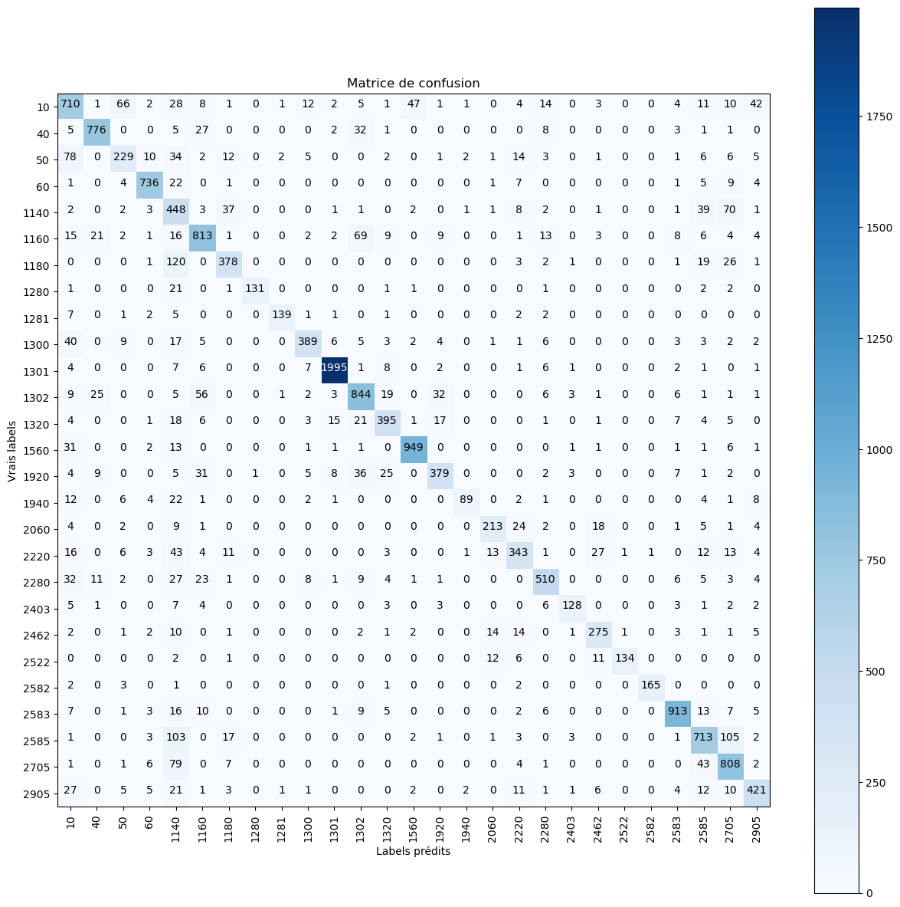
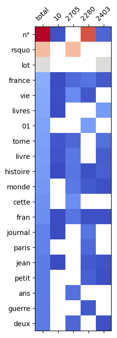
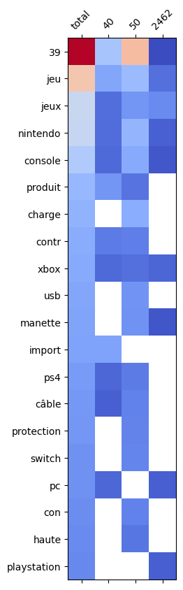
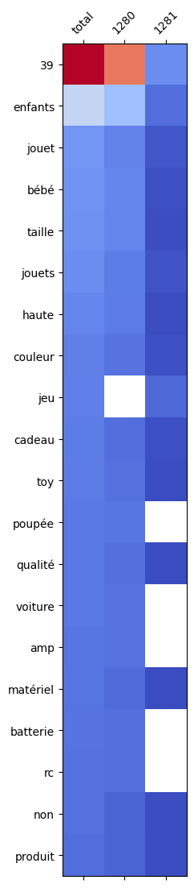
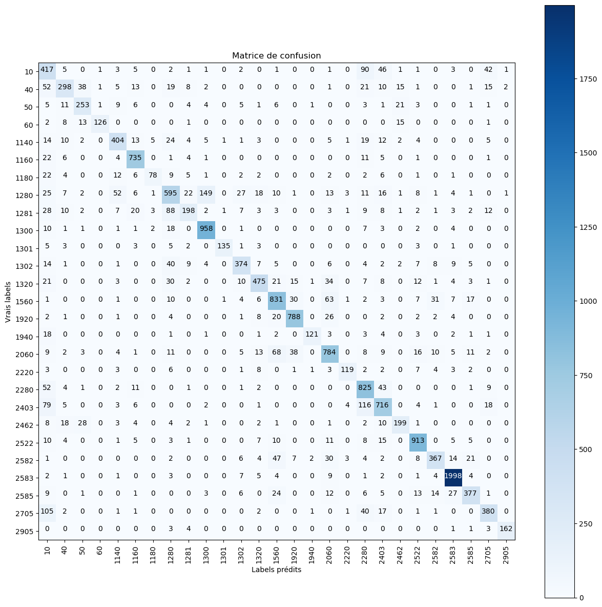
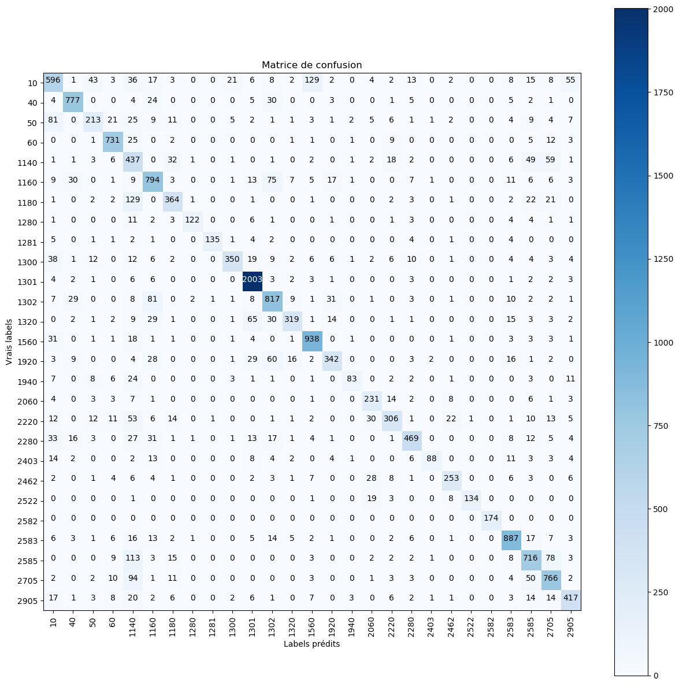
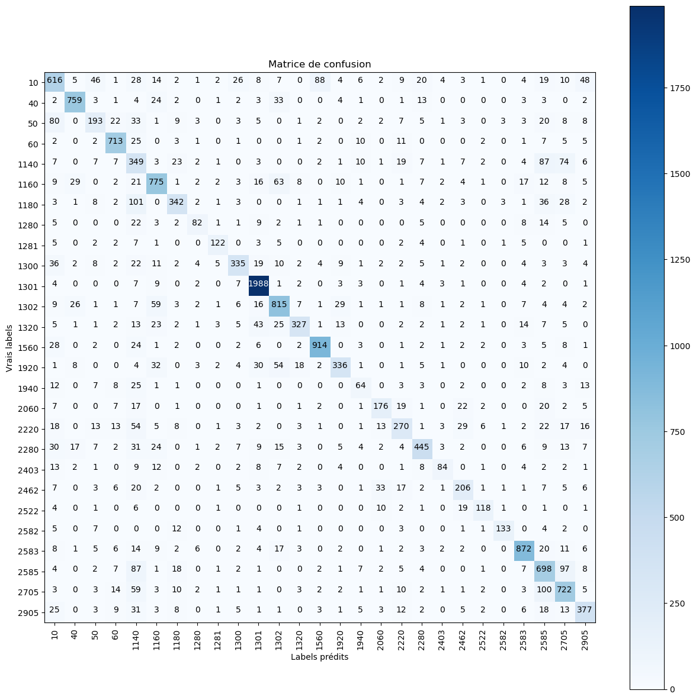
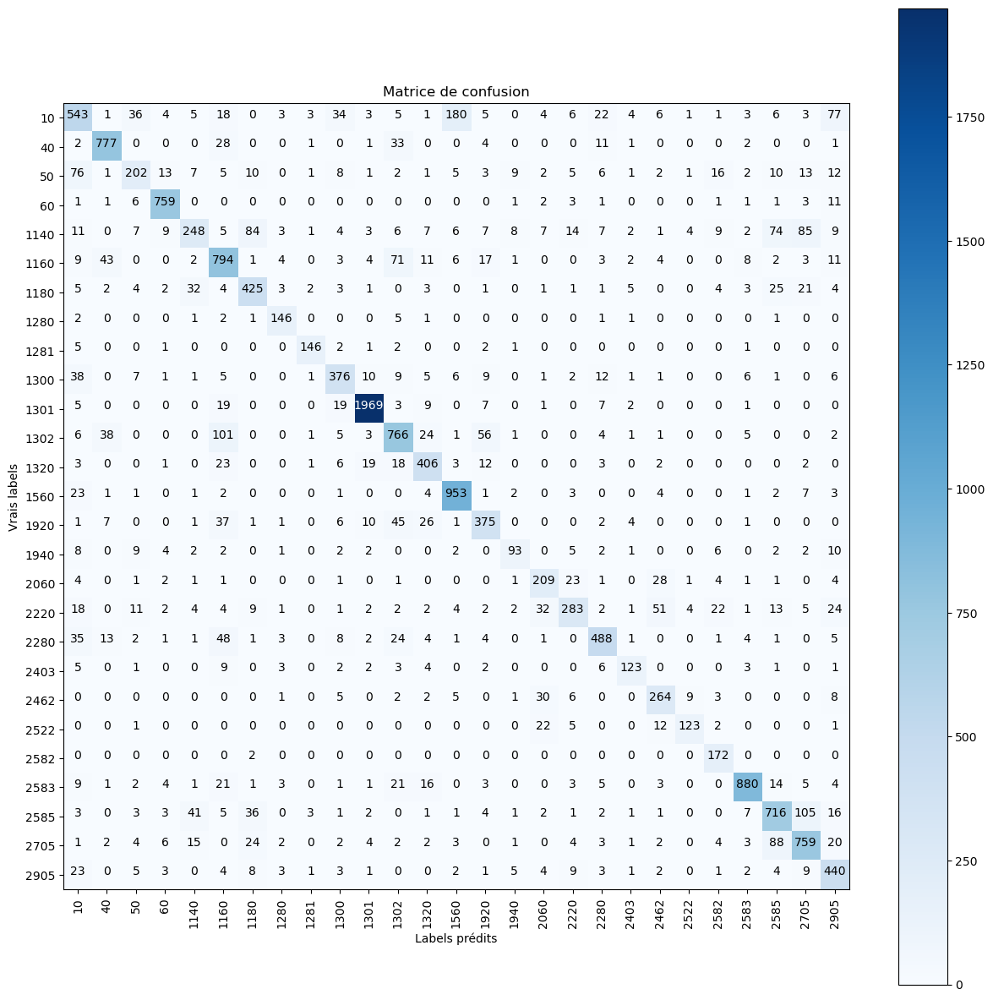
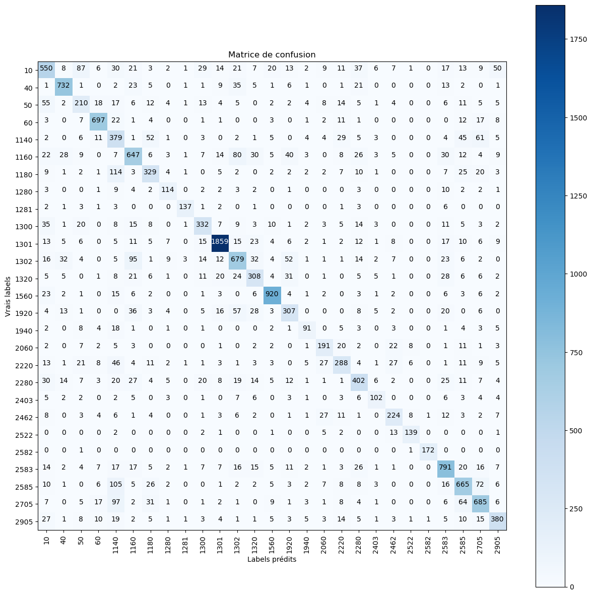
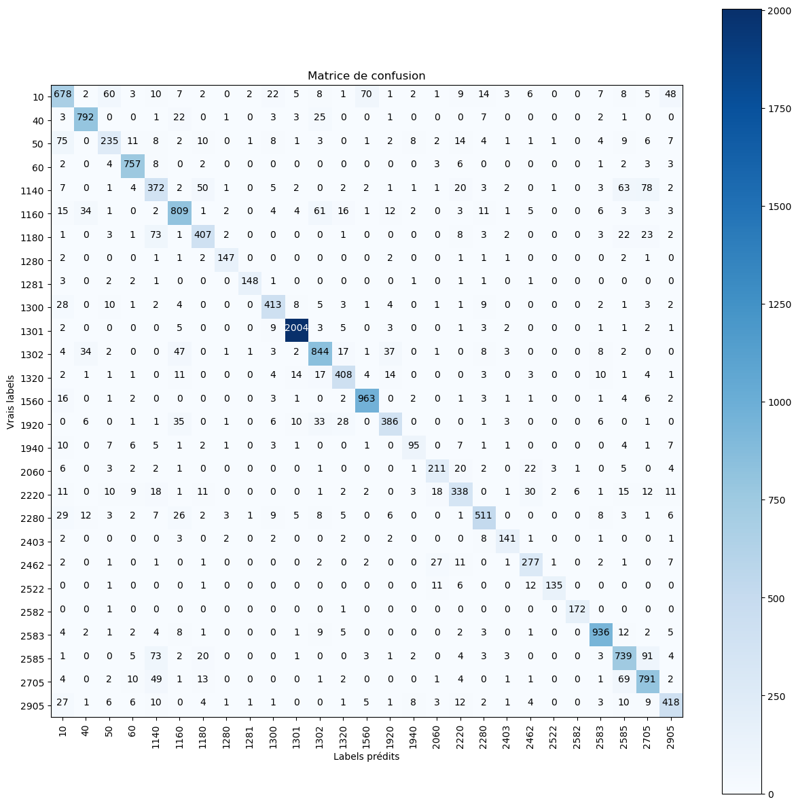

# Rakuten_Text_Classification_ML
```python
import pandas as pd
import numpy as np
import matplotlib.pyplot as plt
from collections import Counter
%matplotlib inline


    
```


```python
"""
Logistic Regression (LogisticRegression)  +++++
Random Forest Classifier (RandomForestClassifier)  ++++
Gradient Boosting Classifier (GradientBoostingClassifier) +++++
Decision Trees (DecisionTreeClassifier) +++++
k-Nearest Neighbors (KNeighborsClassifier)
Multinomial Naive Bayes (MultinomialNB) ++++
Gaussian Naive Bayes (GaussianNB)
Support Vector Classification (SVC), mais cela nécessite le paramètre probability=True lors de l'initialisation du modèle. ++++
AdaBoost Classifier (AdaBoostClassifier)
Extra Trees Classifier (ExtraTreesClassifier)
XGBoost Classifier (bien que ce ne soit pas de scikit-learn, XGBoost a une méthode predict_proba) ++++
"""
```


```python
import Bibli_DataScience_3 as ds
import ML_DataScience as ml
import imp
imp.reload(ds)
imp.reload(ml)
```

    section :  ['DOSSIER', 'FICHIER']
    


    <module 'ML_DataScience' from 'E:\\Manuel\\PROJET\\ML_DataScience.py'>


# SVC


```python
svc = ml.ML_SVC("Mon_Modele_SVC")
df_feat = svc.get_df_feats()
df = svc.get_DF()
#dir(test)
```

    [nltk_data] Downloading package punkt to
    [nltk_data]     C:\Users\shaky\AppData\Roaming\nltk_data...
    [nltk_data]   Package punkt is already up-to-date!
    

    preprocessing ...
    


```python
df.head()
```


<div>
<style scoped>
    .dataframe tbody tr th:only-of-type {
        vertical-align: middle;
    }

    .dataframe tbody tr th {
        vertical-align: top;
    }

    .dataframe thead th {
        text-align: right;
    }
</style>
<table border="1" class="dataframe">
  <thead>
    <tr style="text-align: right;">
      <th></th>
      <th>Id</th>
      <th>designation</th>
      <th>description</th>
      <th>productid</th>
      <th>imageid</th>
      <th>PAYS_LANGUE</th>
      <th>RATIO_LANGUE</th>
      <th>ORIGINE_LANGUE</th>
      <th>pays_design</th>
      <th>Ratio_design</th>
      <th>pays_descr</th>
      <th>Ratio_descr</th>
      <th>descr_NaN</th>
      <th>prdtypecode</th>
      <th>nom_image</th>
      <th>filepath</th>
      <th>phrases</th>
    </tr>
  </thead>
  <tbody>
    <tr>
      <th>0</th>
      <td>0</td>
      <td>Olivia: Personalisiertes Notizbuch / 150 Seite...</td>
      <td>NaN</td>
      <td>3804725264</td>
      <td>1263597046</td>
      <td>de</td>
      <td>0.99</td>
      <td>Designation</td>
      <td>de</td>
      <td>0.99</td>
      <td>NaN</td>
      <td>NaN</td>
      <td>True</td>
      <td>10</td>
      <td>image_1263597046_product_3804725264.jpg</td>
      <td>E:\\Manuel\\PROJET\\images\\image_train\image_...</td>
      <td>[olivia, personalisiertes, notizbuch, 150, sei...</td>
    </tr>
    <tr>
      <th>1</th>
      <td>1</td>
      <td>Journal Des Arts (Le) N° 133 Du 28/09/2001 - L...</td>
      <td>NaN</td>
      <td>436067568</td>
      <td>1008141237</td>
      <td>fr</td>
      <td>0.99</td>
      <td>Designation</td>
      <td>fr</td>
      <td>0.99</td>
      <td>NaN</td>
      <td>NaN</td>
      <td>True</td>
      <td>2280</td>
      <td>image_1008141237_product_436067568.jpg</td>
      <td>E:\\Manuel\\PROJET\\images\\image_train\image_...</td>
      <td>[journal, arts, n°, 133, 28, 09, 2001, art, ma...</td>
    </tr>
    <tr>
      <th>2</th>
      <td>2</td>
      <td>Grand Stylet Ergonomique Bleu Gamepad Nintendo...</td>
      <td>PILOT STYLE Touch Pen de marque Speedlink est ...</td>
      <td>201115110</td>
      <td>938777978</td>
      <td>fr</td>
      <td>0.99</td>
      <td>Description</td>
      <td>nl</td>
      <td>0.47</td>
      <td>fr</td>
      <td>0.99</td>
      <td>False</td>
      <td>50</td>
      <td>image_938777978_product_201115110.jpg</td>
      <td>E:\\Manuel\\PROJET\\images\\image_train\image_...</td>
      <td>[grand, stylet, ergonomique, bleu, gamepad, ni...</td>
    </tr>
    <tr>
      <th>3</th>
      <td>3</td>
      <td>Peluche Donald - Europe - Disneyland 2000 (Mar...</td>
      <td>NaN</td>
      <td>50418756</td>
      <td>457047496</td>
      <td>de</td>
      <td>0.71</td>
      <td>Designation</td>
      <td>de</td>
      <td>0.71</td>
      <td>NaN</td>
      <td>NaN</td>
      <td>True</td>
      <td>1280</td>
      <td>image_457047496_product_50418756.jpg</td>
      <td>E:\\Manuel\\PROJET\\images\\image_train\image_...</td>
      <td>[peluche, donald, europe, disneyland, 2000, ma...</td>
    </tr>
    <tr>
      <th>4</th>
      <td>4</td>
      <td>La Guerre Des Tuques</td>
      <td>Luc a des id&amp;eacute;es de grandeur. Il veut or...</td>
      <td>278535884</td>
      <td>1077757786</td>
      <td>ca</td>
      <td>0.99</td>
      <td>Designation</td>
      <td>ca</td>
      <td>0.99</td>
      <td>fr</td>
      <td>0.99</td>
      <td>False</td>
      <td>2705</td>
      <td>image_1077757786_product_278535884.jpg</td>
      <td>E:\\Manuel\\PROJET\\images\\image_train\image_...</td>
      <td>[guerre, tuques, luc, id, grandeur, veut, orga...</td>
    </tr>
  </tbody>
</table>
</div>


```python
svc_mod=svc.load_modele()

```

    load_modele
    25449    fille enfants crochet tricoté lace boot manche...
    66854    star wars obi wan kenobi jedi pit droid bliste...
    67970    tifon1 100 espa pompe piscine tension monophas...
    57392    combat n° 2945 22 1953 farce versailles contin...
    26805       angèle laeken rare fans presse belge clippings
    Name: phrases, dtype: object
    F1 Score:  0.8294178505558132
    Accuracy:  0.8256594441827603
    


```python
X_test = ds.load_ndarray("X_test")
y_test = ds.load_ndarray("y_test")
```


```python
X_test[:5]
```


    25449    fille enfants crochet tricoté lace boot manche...
    66854    star wars obi wan kenobi jedi pit droid bliste...
    67970    tifon1 100 espa pompe piscine tension monophas...
    57392    combat n° 2945 22 1953 farce versailles contin...
    26805       angèle laeken rare fans presse belge clippings
    Name: phrases, dtype: object


```python
type(X_test)
```


    pandas.core.series.Series


```python
#svc.fit_modele(savefics=True,Train="Save")
```

    L'heure au début de l'entraînement était :  2023-10-23 18:42:21.817251
    


```python
df_cross = svc.get_df_cross()
df_pred = svc.get_df_pred()
df_pred.head(30)
```


<div>
<style scoped>
    .dataframe tbody tr th:only-of-type {
        vertical-align: middle;
    }

    .dataframe tbody tr th {
        vertical-align: top;
    }

    .dataframe thead th {
        text-align: right;
    }
</style>
<table border="1" class="dataframe">
  <thead>
    <tr style="text-align: right;">
      <th></th>
      <th>Categorie</th>
      <th>predict</th>
      <th>pourc</th>
      <th>predict2</th>
      <th>pourc2</th>
      <th>predict3</th>
      <th>pourc3</th>
    </tr>
  </thead>
  <tbody>
    <tr>
      <th>0</th>
      <td>10</td>
      <td>10</td>
      <td>0.719101</td>
      <td>2280</td>
      <td>0.112360</td>
      <td>2403</td>
      <td>0.062600</td>
    </tr>
    <tr>
      <th>1</th>
      <td>40</td>
      <td>40</td>
      <td>0.683267</td>
      <td>10</td>
      <td>0.085657</td>
      <td>50</td>
      <td>0.053785</td>
    </tr>
    <tr>
      <th>2</th>
      <td>50</td>
      <td>50</td>
      <td>0.818452</td>
      <td>2462</td>
      <td>0.041667</td>
      <td>40</td>
      <td>0.041667</td>
    </tr>
    <tr>
      <th>3</th>
      <td>60</td>
      <td>60</td>
      <td>0.807229</td>
      <td>2462</td>
      <td>0.072289</td>
      <td>50</td>
      <td>0.066265</td>
    </tr>
    <tr>
      <th>4</th>
      <td>1140</td>
      <td>1140</td>
      <td>0.788390</td>
      <td>1280</td>
      <td>0.050562</td>
      <td>10</td>
      <td>0.039326</td>
    </tr>
    <tr>
      <th>5</th>
      <td>1160</td>
      <td>1160</td>
      <td>0.930468</td>
      <td>10</td>
      <td>0.027813</td>
      <td>2280</td>
      <td>0.011378</td>
    </tr>
    <tr>
      <th>6</th>
      <td>1180</td>
      <td>1180</td>
      <td>0.581699</td>
      <td>10</td>
      <td>0.143791</td>
      <td>1280</td>
      <td>0.078431</td>
    </tr>
    <tr>
      <th>7</th>
      <td>1280</td>
      <td>1280</td>
      <td>0.728953</td>
      <td>1281</td>
      <td>0.067762</td>
      <td>1300</td>
      <td>0.048255</td>
    </tr>
    <tr>
      <th>8</th>
      <td>1281</td>
      <td>1281</td>
      <td>0.553140</td>
      <td>1280</td>
      <td>0.188406</td>
      <td>10</td>
      <td>0.082126</td>
    </tr>
    <tr>
      <th>9</th>
      <td>1300</td>
      <td>1300</td>
      <td>0.940535</td>
      <td>1280</td>
      <td>0.030723</td>
      <td>10</td>
      <td>0.012884</td>
    </tr>
    <tr>
      <th>10</th>
      <td>1301</td>
      <td>1301</td>
      <td>0.863354</td>
      <td>1280</td>
      <td>0.043478</td>
      <td>10</td>
      <td>0.031056</td>
    </tr>
    <tr>
      <th>11</th>
      <td>1302</td>
      <td>1302</td>
      <td>0.781124</td>
      <td>1280</td>
      <td>0.080321</td>
      <td>10</td>
      <td>0.034137</td>
    </tr>
    <tr>
      <th>12</th>
      <td>1320</td>
      <td>1320</td>
      <td>0.787037</td>
      <td>1280</td>
      <td>0.049383</td>
      <td>10</td>
      <td>0.041667</td>
    </tr>
    <tr>
      <th>13</th>
      <td>1560</td>
      <td>1560</td>
      <td>0.831527</td>
      <td>2060</td>
      <td>0.055172</td>
      <td>2582</td>
      <td>0.031527</td>
    </tr>
    <tr>
      <th>14</th>
      <td>1920</td>
      <td>1920</td>
      <td>0.901278</td>
      <td>1560</td>
      <td>0.037166</td>
      <td>2060</td>
      <td>0.031359</td>
    </tr>
    <tr>
      <th>15</th>
      <td>1940</td>
      <td>1940</td>
      <td>0.813665</td>
      <td>10</td>
      <td>0.130435</td>
      <td>2403</td>
      <td>0.012422</td>
    </tr>
    <tr>
      <th>16</th>
      <td>2060</td>
      <td>2060</td>
      <td>0.813814</td>
      <td>1560</td>
      <td>0.069069</td>
      <td>1920</td>
      <td>0.021021</td>
    </tr>
    <tr>
      <th>17</th>
      <td>2220</td>
      <td>2220</td>
      <td>0.775758</td>
      <td>10</td>
      <td>0.042424</td>
      <td>1320</td>
      <td>0.036364</td>
    </tr>
    <tr>
      <th>18</th>
      <td>2280</td>
      <td>2280</td>
      <td>0.848739</td>
      <td>10</td>
      <td>0.082983</td>
      <td>2403</td>
      <td>0.045168</td>
    </tr>
    <tr>
      <th>19</th>
      <td>2403</td>
      <td>2403</td>
      <td>0.746597</td>
      <td>2280</td>
      <td>0.109948</td>
      <td>10</td>
      <td>0.107853</td>
    </tr>
    <tr>
      <th>20</th>
      <td>2462</td>
      <td>2462</td>
      <td>0.750000</td>
      <td>40</td>
      <td>0.084507</td>
      <td>50</td>
      <td>0.063380</td>
    </tr>
    <tr>
      <th>21</th>
      <td>2522</td>
      <td>2522</td>
      <td>0.914830</td>
      <td>10</td>
      <td>0.016032</td>
      <td>2403</td>
      <td>0.013026</td>
    </tr>
    <tr>
      <th>22</th>
      <td>2582</td>
      <td>2582</td>
      <td>0.731660</td>
      <td>1560</td>
      <td>0.069498</td>
      <td>2060</td>
      <td>0.059846</td>
    </tr>
    <tr>
      <th>23</th>
      <td>2583</td>
      <td>2583</td>
      <td>0.976983</td>
      <td>2585</td>
      <td>0.003918</td>
      <td>10</td>
      <td>0.003428</td>
    </tr>
    <tr>
      <th>24</th>
      <td>2585</td>
      <td>2585</td>
      <td>0.791583</td>
      <td>1560</td>
      <td>0.042084</td>
      <td>10</td>
      <td>0.036072</td>
    </tr>
    <tr>
      <th>25</th>
      <td>2705</td>
      <td>2705</td>
      <td>0.684783</td>
      <td>10</td>
      <td>0.217391</td>
      <td>2280</td>
      <td>0.047101</td>
    </tr>
    <tr>
      <th>26</th>
      <td>2905</td>
      <td>2905</td>
      <td>0.948276</td>
      <td>1281</td>
      <td>0.017241</td>
      <td>1280</td>
      <td>0.011494</td>
    </tr>
  </tbody>
</table>
</div>


```python
X_test = ds.load_ndarray("X_test")
y_test = ds.load_ndarray("y_test")
```


```python
df_prob = svc.get_df_prob()
df_prob.head()
```


<div>
<style scoped>
    .dataframe tbody tr th:only-of-type {
        vertical-align: middle;
    }

    .dataframe tbody tr th {
        vertical-align: top;
    }

    .dataframe thead th {
        text-align: right;
    }
</style>
<table border="1" class="dataframe">
  <thead>
    <tr style="text-align: right;">
      <th></th>
      <th>predicted_class</th>
      <th>ProbMax</th>
    </tr>
  </thead>
  <tbody>
    <tr>
      <th>0</th>
      <td>1301</td>
      <td>0.999767</td>
    </tr>
    <tr>
      <th>1</th>
      <td>1140</td>
      <td>0.571363</td>
    </tr>
    <tr>
      <th>2</th>
      <td>2583</td>
      <td>0.999994</td>
    </tr>
    <tr>
      <th>3</th>
      <td>2280</td>
      <td>0.680111</td>
    </tr>
    <tr>
      <th>4</th>
      <td>2403</td>
      <td>0.943566</td>
    </tr>
  </tbody>
</table>
</div>


```python
y_orig = svc.get_y_orig()
y_pred = svc.get_y_pred()
_,_ = ds.get_classification_report(y_orig, y_pred)
```

    Précision de la prédiction: 82.56594441827603 %
    Evaluation détaillée de la Classification par RDF :
     
                   precision    recall  f1-score   support
    
              10       0.41      0.72      0.52       623
              40       0.76      0.68      0.72       502
              50       0.79      0.82      0.80       336
              60       0.99      0.81      0.89       166
            1140       0.81      0.79      0.80       534
            1160       0.94      0.93      0.93       791
            1180       0.93      0.58      0.71       153
            1280       0.70      0.73      0.71       974
            1281       0.67      0.55      0.61       414
            1300       0.94      0.94      0.94      1009
            1301       0.97      0.86      0.91       161
            1302       0.89      0.78      0.83       498
            1320       0.86      0.79      0.82       648
            1560       0.82      0.83      0.82      1015
            1920       0.92      0.90      0.91       861
            1940       0.99      0.81      0.89       161
            2060       0.81      0.81      0.81       999
            2220       0.90      0.78      0.83       165
            2280       0.74      0.85      0.79       952
            2403       0.78      0.75      0.77       955
            2462       0.83      0.75      0.79       284
            2522       0.94      0.91      0.93       998
            2582       0.84      0.73      0.78       518
            2583       0.98      0.98      0.98      2042
            2585       0.82      0.79      0.81       499
            2705       0.80      0.68      0.74       552
            2905       0.99      0.95      0.97       174
    
        accuracy                           0.83     16984
       macro avg       0.84      0.80      0.82     16984
    weighted avg       0.84      0.83      0.83     16984
    
    


```python
ds.show_confusion_matrix(y_orig, y_pred)
```


    

    


```python
Lcat=svc.get_cat()
catdict = svc.get_catdict()
ds.Afficher_repartition(df_cross,Lcat,catdict)
```

    10    ------    livres
      : 10,  : 71.91 % , livres
      : 2280,  : 11.24 % , magazines
      : 2403,  : 6.26 % , livres et bds
      : 2705,  : 5.94 % , bds et livres
      : 40,  : 1.28 % , jeux video pour pc et consoles
    40    ------    jeux video pour pc et consoles
      : 40,  : 68.33 % , jeux video pour pc et consoles
      : 10,  : 8.57 % , livres
      : 50,  : 5.38 % ,  accesoires jeux video
      : 1280,  : 3.19 % , jouets, peluches, puppets
      : 2462,  : 2.59 % , consoles de jeux video et jeux videos
    50    ------     accesoires jeux video
      : 50,  : 81.85 % ,  accesoires jeux video
      : 2462,  : 4.17 % , consoles de jeux video et jeux videos
      : 40,  : 4.17 % , jeux video pour pc et consoles
      : 10,  : 2.98 % , livres
      : 1140,  : 1.49 % , produits derives “geeks” et figurines
    60    ------    consoles de jeux video
      : 60,  : 80.72 % , consoles de jeux video
      : 2462,  : 7.23 % , consoles de jeux video et jeux videos
      : 50,  : 6.63 % ,  accesoires jeux video
      : 40,  : 3.61 % , jeux video pour pc et consoles
      : 10,  : 1.2 % , livres
    1140    ------    produits derives “geeks” et figurines
      : 1140,  : 78.84 % , produits derives “geeks” et figurines
      : 1280,  : 5.06 % , jouets, peluches, puppets
      : 10,  : 3.93 % , livres
      : 2403,  : 2.25 % , livres et bds
      : 40,  : 2.06 % , jeux video pour pc et consoles
    1160    ------    cartes collectionables
      : 1160,  : 93.05 % , cartes collectionables
      : 10,  : 2.78 % , livres
      : 2280,  : 1.14 % , magazines
      : 40,  : 0.88 % , jeux video pour pc et consoles
      : 2403,  : 0.63 % , livres et bds
    1180    ------    figurines collectionables pour jeux de societe
      : 1180,  : 58.17 % , figurines collectionables pour jeux de societe
      : 10,  : 14.38 % , livres
      : 1280,  : 7.84 % , jouets, peluches, puppets
      : 1140,  : 5.23 % , produits derives “geeks” et figurines
      : 1281,  : 3.92 % , jeux de societe/cartes
    1280    ------    jouets, peluches, puppets
      : 1280,  : 72.9 % , jouets, peluches, puppets
      : 1281,  : 6.78 % , jeux de societe/cartes
      : 1300,  : 4.83 % , Petites voitures (jouets) et maquettes
      : 1140,  : 4.31 % , produits derives “geeks” et figurines
      : 10,  : 2.87 % , livres
    1281    ------    jeux de societe/cartes
      : 1281,  : 55.31 % , jeux de societe/cartes
      : 1280,  : 18.84 % , jouets, peluches, puppets
      : 10,  : 8.21 % , livres
      : 40,  : 3.38 % , jeux video pour pc et consoles
      : 2705,  : 2.9 % , bds et livres
    1300    ------    Petites voitures (jouets) et maquettes
      : 1300,  : 94.05 % , Petites voitures (jouets) et maquettes
      : 1280,  : 3.07 % , jouets, peluches, puppets
      : 10,  : 1.29 % , livres
      : 2280,  : 0.59 % , magazines
      : 1160,  : 0.2 % , cartes collectionables
    1301    ------    accesoires pour petis enfants/bebes et mobilier de jeu (flechettes, billard, babyfoot)
      : 1301,  : 86.34 % , accesoires pour petis enfants/bebes et mobilier de jeu (flechettes, billard, babyfoot)
      : 1280,  : 4.35 % , jouets, peluches, puppets
      : 10,  : 3.11 % , livres
      : 40,  : 1.24 % , jeux video pour pc et consoles
      : 1320,  : 1.24 % , sacs pour femmes et accesore petite enfance
    1302    ------    jeux d'exterieur
      : 1302,  : 78.11 % , jeux d'exterieur
      : 1280,  : 8.03 % , jouets, peluches, puppets
      : 10,  : 3.41 % , livres
      : 1281,  : 1.81 % , jeux de societe/cartes
      : 2583,  : 1.2 % , accesoires de piscine
    1320    ------    sacs pour femmes et accesore petite enfance
      : 1320,  : 78.7 % , sacs pour femmes et accesore petite enfance
      : 1280,  : 4.94 % , jouets, peluches, puppets
      : 10,  : 4.17 % , livres
      : 2060,  : 3.55 % , lampes et accesoires decoration pour maison
      : 1920,  : 1.7 % , linge de maison (cousins, rideaux, serviettes, nappes, draps)
    1560    ------    Mobilier et produits decoration/rangement pour la maison
      : 1560,  : 83.15 % , Mobilier et produits decoration/rangement pour la maison
      : 2060,  : 5.52 % , lampes et accesoires decoration pour maison
      : 2582,  : 3.15 % , mobilier d'exterieur et accesoires (parasols,pots,tentes,etc)
      : 1920,  : 2.46 % , linge de maison (cousins, rideaux, serviettes, nappes, draps)
      : 2585,  : 1.87 % , outillage et accesoires pour jardinage
    1920    ------    linge de maison (cousins, rideaux, serviettes, nappes, draps)
      : 1920,  : 90.13 % , linge de maison (cousins, rideaux, serviettes, nappes, draps)
      : 1560,  : 3.72 % , Mobilier et produits decoration/rangement pour la maison
      : 2060,  : 3.14 % , lampes et accesoires decoration pour maison
      : 1320,  : 0.93 % , sacs pour femmes et accesore petite enfance
      : 1280,  : 0.58 % , jouets, peluches, puppets
    1940    ------    nouriture (cafes,infusions,conserves, epices,etc)
      : 1940,  : 81.37 % , nouriture (cafes,infusions,conserves, epices,etc)
      : 10,  : 13.04 % , livres
      : 2403,  : 1.24 % , livres et bds
      : 2280,  : 1.24 % , magazines
      : 2705,  : 0.62 % , bds et livres
    2060    ------    lampes et accesoires decoration pour maison
      : 2060,  : 81.38 % , lampes et accesoires decoration pour maison
      : 1560,  : 6.91 % , Mobilier et produits decoration/rangement pour la maison
      : 1920,  : 2.1 % , linge de maison (cousins, rideaux, serviettes, nappes, draps)
      : 10,  : 1.6 % , livres
      : 1280,  : 1.5 % , jouets, peluches, puppets
    2220    ------    accesoires mascots/pets
      : 2220,  : 77.58 % , accesoires mascots/pets
      : 10,  : 4.24 % , livres
      : 1320,  : 3.64 % , sacs pour femmes et accesore petite enfance
      : 1280,  : 3.03 % , jouets, peluches, puppets
      : 2060,  : 2.42 % , lampes et accesoires decoration pour maison
    2280    ------    magazines
      : 2280,  : 84.87 % , magazines
      : 10,  : 8.3 % , livres
      : 2403,  : 4.52 % , livres et bds
      : 2705,  : 0.74 % , bds et livres
      : 1160,  : 0.63 % , cartes collectionables
    2403    ------    livres et bds
      : 2403,  : 74.66 % , livres et bds
      : 2280,  : 10.99 % , magazines
      : 10,  : 10.79 % , livres
      : 2705,  : 1.78 % , bds et livres
      : 1160,  : 0.31 % , cartes collectionables
    2462    ------    consoles de jeux video et jeux videos
      : 2462,  : 75.0 % , consoles de jeux video et jeux videos
      : 40,  : 8.45 % , jeux video pour pc et consoles
      : 50,  : 6.34 % ,  accesoires jeux video
      : 10,  : 3.17 % , livres
      : 2403,  : 1.76 % , livres et bds
    2522    ------    produits de papeterie et rangement bureau
      : 2522,  : 91.48 % , produits de papeterie et rangement bureau
      : 10,  : 1.6 % , livres
      : 2403,  : 1.3 % , livres et bds
      : 2060,  : 1.0 % , lampes et accesoires decoration pour maison
      : 1560,  : 0.9 % , Mobilier et produits decoration/rangement pour la maison
    2582    ------    mobilier d'exterieur et accesoires (parasols,pots,tentes,etc)
      : 2582,  : 73.17 % , mobilier d'exterieur et accesoires (parasols,pots,tentes,etc)
      : 1560,  : 6.95 % , Mobilier et produits decoration/rangement pour la maison
      : 2060,  : 5.98 % , lampes et accesoires decoration pour maison
      : 2585,  : 4.83 % , outillage et accesoires pour jardinage
      : 1920,  : 1.74 % , linge de maison (cousins, rideaux, serviettes, nappes, draps)
    2583    ------    accesoires de piscine
      : 2583,  : 97.7 % , accesoires de piscine
      : 2585,  : 0.39 % , outillage et accesoires pour jardinage
      : 10,  : 0.34 % , livres
      : 1302,  : 0.34 % , jeux d'exterieur
      : 1320,  : 0.29 % , sacs pour femmes et accesore petite enfance
    2585    ------    outillage et accesoires pour jardinage
      : 2585,  : 79.16 % , outillage et accesoires pour jardinage
      : 1560,  : 4.21 % , Mobilier et produits decoration/rangement pour la maison
      : 10,  : 3.61 % , livres
      : 2582,  : 3.41 % , mobilier d'exterieur et accesoires (parasols,pots,tentes,etc)
      : 2583,  : 3.01 % , accesoires de piscine
    2705    ------    bds et livres
      : 2705,  : 68.48 % , bds et livres
      : 10,  : 21.74 % , livres
      : 2280,  : 4.71 % , magazines
      : 2403,  : 3.44 % , livres et bds
      : 40,  : 0.54 % , jeux video pour pc et consoles
    2905    ------    Jeu En téléchargement
      : 2905,  : 94.83 % , Jeu En téléchargement
      : 1281,  : 1.72 % , jeux de societe/cartes
      : 1280,  : 1.15 % , jouets, peluches, puppets
      : 40,  : 1.15 % , jeux video pour pc et consoles
      : 2585,  : 0.57 % , outillage et accesoires pour jardinage
    

    E:\Manuel\PROJET\Bibli_DataScience_3.py:134: FutureWarning: iteritems is deprecated and will be removed in a future version. Use .items instead.
      for index, value in s.iteritems():
    


```python
X_test = ds.load_ndarray("X_test")
y_test = ds.load_ndarray("y_test")
df_test = pd.concat([X_test,y_test],axis=1)
```


```python

from collections import Counter

# Créez un DataFrame df_test ici. Dans votre cas, vous avez déjà ce DataFrame.

# Groupement des données par 'prdtypecode'
grouped = df_test.groupby('prdtypecode')

# Dictionnaire pour stocker les mots les plus fréquents par 'prdtypecode'
most_common_words_by_code = {}

for name, group in grouped:
    # Combinez toutes les phrases en une seule chaîne de texte
    all_text = ' '.join(group['phrases'])
    
    # Séparez la chaîne en mots
    words = all_text.split()
    
    # Comptez les occurrences de chaque mot
    word_count = Counter(words)
    
    # Obtenez les 40 mots les plus communs
    most_common_words = word_count.most_common(40)
    
    # Stockez le résultat dans le dictionnaire
    most_common_words_by_code[name] = most_common_words

# Affichez les résultats
for code, words in most_common_words_by_code.items():
    print(f"Pour le prdtypecode {code}, les 40 mots les plus fréquents sont :")
    print(words)
    print("---")


```

    Pour le prdtypecode 10, les 40 mots les plus fréquents sont :
    [('edition', 35), ('tome', 29), ('livre', 27), ('guide', 25), ('n°', 23), ('occasion', 19), ('prix', 19), ('gt', 19), ('ammareal', 18), ('organisations', 18), ('caritatives', 18), ('vendons', 18), ('partenaires', 18), ('lt', 18), ('donnons', 18), ('book', 17), ('vie', 16), ('etat', 16), ('life', 14), ('france', 13), ('chez', 13), ('collection', 12), ('histoire', 12), ('édition', 12), ('15', 12), ('science', 11), ('associations', 11), ('039', 11), ('livres', 11), ('jean', 10), ('reverse', 10), ('titre', 10), ('année', 10), ('jusqu', 10), ('39', 9), ('fran', 9), ('revue', 9), ('art', 9), ('journal', 9), ('auteur', 9)]
    ---
    Pour le prdtypecode 40, les 40 mots les plus fréquents sont :
    [('39', 259), ('jeu', 179), ('import', 170), ('produit', 144), ('titres', 111), ('contr', 93), ('comprend', 69), ('jeux', 69), ('cas', 68), ('description', 67), ('nintendo', 66), ('cette', 65), ('fiche', 61), ('magideal', 60), ('xbox', 60), ('console', 60), ('forfait', 59), ('langue', 59), ('fran', 58), ('attention', 57), ('informations', 57), ('pc', 57), ('ps4', 57), ('grande', 56), ('ais', 56), ('apparaissent', 55), ('langues', 54), ('éditeur', 54), ('fournies', 54), ('néanmoins', 54), ('majorité', 54), ('existe', 54), ('imports', 54), ('taille', 50), ('allemand', 47), ('couleur', 47), ('pièces', 45), ('mm', 43), ('spécification', 42), ('câble', 42)]
    ---
    Pour le prdtypecode 50, les 40 mots les plus fréquents sont :
    [('39', 508), ('jeu', 231), ('nintendo', 215), ('charge', 194), ('console', 188), ('jeux', 144), ('usb', 142), ('manette', 137), ('switch', 112), ('protection', 107), ('con', 105), ('câble', 104), ('contr', 100), ('ps4', 94), ('support', 85), ('haute', 84), ('joy', 83), ('commutateur', 82), ('compatible', 81), ('produit', 79), ('batterie', 78), ('facile', 78), ('silicone', 76), ('poignée', 74), ('xbox', 73), ('type', 68), ('taille', 66), ('portable', 65), ('fil', 63), ('bluetooth', 63), ('noir', 62), ('boutons', 62), ('chargeur', 62), ('1x', 59), ('temps', 57), ('courant', 57), ('coque', 56), ('heures', 55), ('34', 54), ('mini', 54)]
    ---
    Pour le prdtypecode 60, les 40 mots les plus fréquents sont :
    [('console', 251), ('jeu', 248), ('oui', 217), ('game', 150), ('couleur', 138), ('portable', 127), ('34', 125), ('jeux', 122), ('nom', 122), ('marque', 121), ('39', 120), ('modèle', 120), ('affichage', 117), ('paquet', 116), ('tactile', 112), ('ecran', 111), ('numéro', 110), ('taille', 106), ('usb', 106), ('écran', 105), ('communication', 105), ('vidéo', 100), ('rétro', 83), ('mini', 75), ('pouces', 64), ('lecteur', 56), ('tv', 56), ('function', 51), ('intégré', 49), ('poche', 49), ('handheld', 48), ('support', 43), ('games', 42), ('retro', 40), ('bits', 35), ('classique', 34), ('feature', 32), ('video', 31), ('noenname', 31), ('null', 31)]
    ---
    Pour le prdtypecode 1140, les 40 mots les plus fréquents sont :
    [('figurine', 235), ('pop', 82), ('taille', 63), ('star', 54), ('pvc', 52), ('collection', 49), ('nbsp', 47), ('wars', 45), ('39', 45), ('funko', 42), ('shirt', 42), ('env', 33), ('haute', 30), ('officielle', 30), ('marvel', 30), ('licence', 29), ('statuette', 28), ('porte', 28), ('figure', 27), ('dragon', 26), ('emballage', 26), ('figurines', 26), ('amp', 26), ('bo', 25), ('qualité', 25), ('socle', 24), ('modèle', 23), ('mug', 23), ('100', 23), ('disney', 21), ('série', 21), ('plastique', 21), ('gundam', 20), ('super', 19), ('japan', 18), ('import', 18), ('34', 18), ('span', 18), ('vinyl', 18), ('ball', 18)]
    ---
    Pour le prdtypecode 1160, les 40 mots les plus fréquents sont :
    [('carte', 300), ('yu', 158), ('oh', 158), ('gi', 157), ('rare', 97), ('vf', 90), ('mtg', 74), ('magic', 71), ('fr', 70), ('commune', 68), ('pokémon', 61), ('pokemon', 58), ('neuf', 52), ('monstre', 49), ('dragon', 46), ('reverse', 43), ('ball', 37), ('pv', 37), ('cette', 37), ('foil', 32), ('vo', 31), ('panini', 31), ('adrenalyn', 29), ('cartes', 28), ('n°', 27), ('card', 26), ('xy', 23), ('super', 22), ('pouvez', 22), ('edition', 20), ('force', 20), ('ex', 18), ('43', 18), ('xl', 18), ('topps', 17), ('34', 17), ('adversaire', 17), ('holo', 16), ('tour', 16), ('crados', 16)]
    ---
    Pour le prdtypecode 1180, les 40 mots les plus fréquents sont :
    [('39', 83), ('masque', 57), ('halloween', 43), ('warhammer', 29), ('visage', 21), ('figurine', 19), ('latex', 18), ('costume', 17), ('magic', 16), ('heroclix', 15), ('jeu', 15), ('différence', 13), ('effrayant', 13), ('horreur', 12), ('led', 12), ('40000', 11), ('danse', 11), ('lumière', 11), ('non', 11), ('couleur', 10), ('cheval', 10), ('taille', 10), ('mask', 9), ('cosplay', 9), ('plastique', 8), ('age', 8), ('40k', 7), ('space', 7), ('miniatures', 7), ('rave', 7), ('party', 7), ('due', 7), ('pot', 7), ('17ml', 7), ('prince', 7), ('august', 7), ('chariot', 7), ('race', 7), ('sanglant', 6), ('matériel', 6)]
    ---
    Pour le prdtypecode 1280, les 40 mots les plus fréquents sont :
    [('39', 2256), ('enfants', 883), ('bébé', 429), ('taille', 421), ('jouet', 412), ('jouets', 373), ('haute', 357), ('poupée', 324), ('voiture', 311), ('couleur', 309), ('amp', 307), ('toy', 295), ('batterie', 289), ('rc', 285), ('qualité', 285), ('cadeau', 281), ('matériel', 250), ('main', 218), ('non', 217), ('produit', 212), ('doll', 203), ('temps', 196), ('100', 193), ('peluche', 189), ('ans', 188), ('contr', 181), ('nbsp', 180), ('caractéristiques', 176), ('bois', 172), ('emballage', 171), ('contenu', 163), ('enfant', 161), ('modèle', 161), ('stress', 158), ('comprend', 157), ('distance', 150), ('description', 150), ('facile', 150), ('paquet', 150), ('plastique', 150)]
    ---
    Pour le prdtypecode 1281, les 40 mots les plus fréquents sont :
    [('39', 476), ('enfants', 280), ('jeu', 240), ('game', 125), ('jouet', 125), ('jouets', 106), ('cartes', 91), ('cadeau', 89), ('bébé', 89), ('couleur', 86), ('taille', 81), ('non', 77), ('card', 74), ('haute', 69), ('toy', 69), ('boue', 67), ('cards', 67), ('qualité', 65), ('bois', 65), ('jouer', 64), ('matériel', 63), ('produit', 62), ('slime', 57), ('ans', 56), ('main', 55), ('play', 54), ('peluche', 54), ('stress', 52), ('caractéristiques', 50), ('grand', 48), ('contenu', 47), ('100', 46), ('enfant', 40), ('faire', 40), ('plastique', 39), ('games', 39), ('petits', 38), ('fun', 38), ('animaux', 38), ('paquet', 37)]
    ---
    Pour le prdtypecode 1300, les 40 mots les plus fréquents sont :
    [('39', 2709), ('rc', 1137), ('drone', 1093), ('batterie', 885), ('dji', 782), ('générique', 779), ('haute', 556), ('mavic', 552), ('vol', 521), ('quadcopter', 501), ('contr', 477), ('temps', 464), ('caméra', 436), ('voiture', 421), ('qualité', 390), ('taille', 388), ('mode', 386), ('43', 383), ('distance', 377), ('wifi', 353), ('moteur', 349), ('charge', 347), ('poids', 337), ('fpv', 321), ('protection', 320), ('caractéristiques', 319), ('facile', 313), ('couleur', 308), ('100', 289), ('télécommande', 285), ('amp', 284), ('paquet', 282), ('pro', 273), ('fonction', 263), ('usb', 255), ('sac', 253), ('air', 248), ('vitesse', 243), ('produit', 230), ('4g', 222)]
    ---
    Pour le prdtypecode 1301, les 40 mots les plus fréquents sont :
    [('bébé', 421), ('39', 315), ('chaussettes', 310), ('taille', 243), ('filles', 152), ('longueur', 149), ('gar', 140), ('34', 129), ('qualité', 120), ('ons', 120), ('haute', 117), ('coton', 116), ('enfants', 112), ('matériaux', 95), ('cartoon', 83), ('anti', 82), ('belle', 82), ('auucne', 81), ('100', 79), ('pieds', 73), ('chaud', 64), ('nouveau', 64), ('paire', 63), ('né', 62), ('neuf', 60), ('contenu', 58), ('main', 58), ('cadeau', 58), ('slip', 57), ('caractéristiques', 56), ('doux', 52), ('mois', 52), ('sexe', 50), ('produit', 49), ('grand', 47), ('couleur', 46), ('bébés', 46), ('jeu', 46), ('fléchettes', 45), ('peau', 45)]
    ---
    Pour le prdtypecode 1302, les 40 mots les plus fréquents sont :
    [('39', 1258), ('che', 312), ('enfants', 246), ('taille', 241), ('stress', 225), ('haute', 205), ('lampe', 172), ('bracelet', 169), ('super', 169), ('couleur', 167), ('jouets', 163), ('matériel', 161), ('stream', 157), ('qualité', 155), ('facile', 148), ('eau', 139), ('trampoline', 137), ('led', 133), ('caractéristiques', 128), ('doux', 126), ('acier', 123), ('longueur', 118), ('jouet', 115), ('poids', 112), ('protection', 107), ('leurres', 105), ('poche', 103), ('batterie', 103), ('plastique', 101), ('toy', 100), ('montre', 99), ('100', 98), ('1pc', 98), ('appât', 98), ('ans', 96), ('air', 96), ('non', 93), ('lente', 89), ('couleurs', 87), ('inoxydable', 86)]
    ---
    Pour le prdtypecode 1320, les 40 mots les plus fréquents sont :
    [('39', 1274), ('sac', 457), ('bébé', 398), ('poussette', 262), ('roues', 220), ('couleur', 186), ('sécurité', 186), ('taille', 180), ('mode', 179), ('réglable', 174), ('siège', 171), ('kg', 164), ('dimensions', 148), ('enfants', 141), ('style', 138), ('100', 137), ('châssis', 133), ('auto', 132), ('voyage', 132), ('main', 131), ('poids', 128), ('enfant', 126), ('eau', 123), ('34', 120), ('air', 119), ('nacelle', 119), ('canne', 119), ('facile', 112), ('lit', 111), ('coton', 106), ('type', 105), ('matériel', 101), ('produit', 98), ('nouveau', 95), ('utiliser', 93), ('qualité', 91), ('face', 91), ('bandoulière', 90), ('haute', 89), ('hauteur', 87)]
    ---
    Pour le prdtypecode 1560, les 40 mots les plus fréquents sont :
    [('39', 3394), ('couleur', 594), ('span', 590), ('matelas', 576), ('haute', 529), ('hauteur', 513), ('bois', 499), ('qualité', 477), ('table', 465), ('dimensions', 446), ('mousse', 409), ('43', 400), ('100', 393), ('tissu', 392), ('design', 376), ('taille', 373), ('style', 364), ('facile', 347), ('matériel', 327), ('assise', 326), ('confort', 292), ('kg', 277), ('blanc', 275), ('acier', 273), ('anti', 272), ('pieds', 255), ('salle', 254), ('cuisine', 251), ('lit', 243), ('polyester', 237), ('chaise', 236), ('cette', 231), ('eau', 231), ('forme', 229), ('rangement', 228), ('meuble', 211), ('métal', 208), ('structure', 206), ('dossier', 203), ('produit', 200)]
    ---
    Pour le prdtypecode 1920, les 40 mots les plus fréquents sont :
    [('39', 3410), ('oreiller', 1972), ('taie', 1627), ('coussin', 1495), ('couleur', 990), ('taille', 976), ('canapé', 805), ('pla', 717), ('matériel', 550), ('décoration', 546), ('coton', 533), ('100', 498), ('lin', 495), ('mesure', 486), ('home', 462), ('style', 460), ('qualité', 432), ('couverture', 430), ('haute', 422), ('45', 408), ('polyester', 402), ('housse', 388), ('eau', 384), ('lit', 383), ('permettre', 373), ('raison', 367), ('forfait', 367), ('neuf', 353), ('45cm', 340), ('maison', 339), ('décor', 337), ('comprend', 324), ('forme', 323), ('différent', 310), ('throw', 302), ('différence', 294), ('légère', 287), ('pillow', 284), ('type', 274), ('produit', 272)]
    ---
    Pour le prdtypecode 1940, les 40 mots les plus fréquents sont :
    [('39', 163), ('bio', 79), ('sucre', 53), ('cannelle', 47), ('sachet', 44), ('produit', 42), ('café', 41), ('marque', 36), ('type', 35), ('lot', 30), ('250', 30), ('poudre', 28), ('huile', 28), ('lait', 27), ('thé', 26), ('vin', 26), ('chocolat', 24), ('ar', 24), ('dragées', 24), ('capsules', 23), ('sel', 22), ('france', 22), ('gr', 21), ('jambon', 21), ('verre', 20), ('ingrédients', 20), ('conditionnement', 20), ('100', 19), ('vert', 19), ('saveur', 19), ('eric', 19), ('bur', 19), ('bonbons', 18), ('couleur', 18), ('blanc', 18), ('16', 18), ('pâte', 18), ('tassimo', 17), ('rouge', 17), ('plats', 17)]
    ---
    Pour le prdtypecode 2060, les 40 mots les plus fréquents sont :
    [('39', 4593), ('couleur', 1057), ('diamant', 947), ('taille', 874), ('peinture', 825), ('décoration', 805), ('led', 766), ('lumière', 734), ('qualité', 522), ('pla', 511), ('haute', 495), ('bricolage', 493), ('matériel', 487), ('34', 485), ('1pc', 452), ('produit', 447), ('maison', 439), ('toile', 427), ('lampe', 396), ('facile', 395), ('chambre', 394), ('résine', 367), ('type', 335), ('mur', 327), ('100', 323), ('cadre', 323), ('décor', 318), ('emballage', 316), ('caractéristiques', 296), ('salle', 295), ('non', 294), ('comprend', 293), ('surface', 288), ('eau', 288), ('contenu', 288), ('raison', 285), ('image', 284), ('besoin', 279), ('diamants', 276), ('forfait', 266)]
    ---
    Pour le prdtypecode 2220, les 40 mots les plus fréquents sont :
    [('39', 597), ('chien', 234), ('34', 197), ('taille', 186), ('pet', 143), ('animaux', 116), ('chat', 97), ('collier', 94), ('animal', 90), ('compagnie', 89), ('couleur', 88), ('tements', 73), ('matériel', 71), ('confortable', 65), ('dog', 64), ('mode', 64), ('pouces', 63), ('longueur', 58), ('chiens', 57), ('qualité', 54), ('100', 54), ('amp', 52), ('chiot', 47), ('cou', 47), ('facile', 46), ('chaud', 45), ('haute', 45), ('nbsp', 45), ('comprend', 43), ('jouet', 42), ('poitrine', 41), ('réglable', 41), ('pla', 40), ('jouets', 40), ('hiver', 39), ('cat', 38), ('forfait', 37), ('eau', 37), ('description', 36), ('raison', 36)]
    ---
    Pour le prdtypecode 2280, les 40 mots les plus fréquents sont :
    [('n°', 704), ('01', 161), ('journal', 83), ('france', 83), ('03', 63), ('paris', 62), ('02', 61), ('08', 58), ('09', 57), ('06', 55), ('magazine', 53), ('05', 52), ('07', 52), ('revue', 47), ('petit', 47), ('04', 42), ('jean', 37), ('monde', 36), ('guerre', 34), ('vie', 32), ('13', 27), ('16', 25), ('18', 25), ('15', 25), ('politique', 25), ('14', 24), ('presse', 24), ('20', 23), ('art', 23), ('contre', 22), ('25', 22), ('27', 22), ('fran', 21), ('19', 21), ('mode', 21), ('histoire', 20), ('29', 20), ('francaise', 19), ('match', 19), ('saint', 19)]
    ---
    Pour le prdtypecode 2403, les 40 mots les plus fréquents sont :
    [('lot', 397), ('livres', 156), ('tomes', 79), ('tome', 73), ('volumes', 69), ('collection', 58), ('n°', 57), ('partitions', 47), ('histoire', 43), ('livre', 42), ('revues', 41), ('39', 41), ('vol', 40), ('france', 39), ('34', 34), ('revue', 33), ('numéros', 32), ('année', 31), ('bd', 30), ('romans', 23), ('jean', 23), ('interview', 23), ('amp', 22), ('edition', 22), ('fran', 20), ('ditions', 20), ('deux', 19), ('monde', 19), ('intégrale', 19), ('pages', 19), ('marvel', 19), ('comics', 19), ('complet', 19), ('editions', 18), ('dition', 18), ('poche', 18), ('petit', 17), ('volume', 17), ('série', 17), ('piano', 17)]
    ---
    Pour le prdtypecode 2462, les 40 mots les plus fréquents sont :
    [('jeux', 124), ('jeu', 71), ('lot', 66), ('xbox', 55), ('wii', 47), ('nintendo', 46), ('pc', 41), ('playstation', 41), ('360', 40), ('manettes', 36), ('ps3', 34), ('43', 32), ('console', 29), ('manette', 28), ('neuf', 23), ('voir', 21), ('photos', 21), ('slim', 19), ('collection', 19), ('ds', 18), ('noire', 16), ('go', 16), ('kinect', 15), ('ensemble', 14), ('fifa', 13), ('edition', 13), ('ps2', 12), ('ps1', 11), ('video', 11), ('one', 10), ('boite', 10), ('box', 9), ('noir', 9), ('lément', 8), ('jaquette', 8), ('accessoires', 8), ('game', 8), ('boy', 8), ('39', 8), ('super', 8)]
    ---
    Pour le prdtypecode 2522, les 40 mots les plus fréquents sont :
    [('39', 631), ('papier', 377), ('mm', 373), ('notes', 329), ('a5', 272), ('taille', 261), ('format', 261), ('pages', 238), ('haute', 216), ('lot', 211), ('couverture', 205), ('td', 202), ('carnet', 195), ('journal', 182), ('bloc', 180), ('a4', 175), ('21', 173), ('couleur', 169), ('stylo', 169), ('design', 167), ('jaune', 163), ('facilement', 161), ('100', 159), ('solide', 158), ('excellente', 157), ('96', 156), ('cahier', 150), ('texture', 149), ('encre', 148), ('recto', 145), ('verso', 145), ('144', 143), ('pale', 143), ('noir', 131), ('qualité', 128), ('classique', 126), ('feuilles', 123), ('blanc', 115), ('style', 112), ('bleu', 111)]
    ---
    Pour le prdtypecode 2582, les 40 mots les plus fréquents sont :
    [('39', 1563), ('jardin', 375), ('dimensions', 284), ('couleur', 218), ('aluminium', 199), ('table', 199), ('facile', 193), ('100', 191), ('hauteur', 190), ('mm', 181), ('acier', 181), ('extérieur', 155), ('bois', 154), ('polyester', 146), ('gris', 145), ('43', 139), ('non', 137), ('blanc', 136), ('matériau', 135), ('uv', 133), ('livraison', 132), ('parasol', 132), ('résistant', 128), ('structure', 124), ('tente', 123), ('verre', 121), ('design', 120), ('eau', 119), ('toile', 113), ('tissu', 113), ('material', 113), ('pvc', 110), ('haute', 103), ('qualité', 103), ('steel', 103), ('porte', 103), ('cette', 101), ('34', 101), ('toit', 99), ('noir', 99)]
    ---
    Pour le prdtypecode 2583, les 40 mots les plus fréquents sont :
    [('39', 5704), ('piscine', 4517), ('eau', 2135), ('pompe', 1391), ('dimensions', 1385), ('filtration', 1326), ('acier', 1114), ('sol', 972), ('sable', 838), ('kg', 831), ('mm', 793), ('m3', 791), ('kit', 774), ('filtre', 770), ('bois', 676), ('spa', 660), ('bâche', 655), ('liner', 616), ('piscines', 563), ('ans', 512), ('cette', 511), ('volume', 509), ('100', 506), ('bleu', 499), ('intex', 491), ('50', 486), ('couleur', 475), ('pvc', 474), ('espace', 470), ('structure', 462), ('ronde', 462), ('cv', 456), ('sécurité', 437), ('extérieures', 435), ('hauteur', 412), ('nécessaire', 410), ('15', 403), ('inclus', 399), ('système', 397), ('intérieures', 395)]
    ---
    Pour le prdtypecode 2585, les 40 mots les plus fréquents sont :
    [('39', 2031), ('bâche', 285), ('haute', 272), ('aspirateur', 262), ('qualité', 257), ('34', 243), ('mm', 227), ('taille', 222), ('eau', 206), ('couleur', 195), ('film', 167), ('facile', 160), ('caractéristiques', 141), ('largeur', 134), ('plastique', 134), ('accessoires', 130), ('microns', 130), ('gris', 128), ('outil', 124), ('acier', 123), ('produit', 121), ('matériel', 118), ('longueur', 116), ('coupe', 115), ('fil', 113), ('sac', 111), ('non', 108), ('utiliser', 108), ('diamètre', 108), ('100', 107), ('anti', 106), ('jardin', 105), ('système', 104), ('filtre', 101), ('appareils', 98), ('utilisation', 98), ('ans', 98), ('arrosage', 97), ('surface', 96), ('vert', 96)]
    ---
    Pour le prdtypecode 2705, les 40 mots les plus fréquents sont :
    [('rsquo', 515), ('cette', 132), ('vie', 127), ('monde', 93), ('livre', 90), ('histoire', 85), ('fran', 82), ('ans', 78), ('bien', 75), ('homme', 74), ('entre', 74), ('cet', 72), ('ouvrage', 70), ('faire', 67), ('dont', 66), ('france', 63), ('deux', 58), ('tome', 58), ('nbsp', 58), ('leurs', 55), ('temps', 54), ('laquo', 50), ('raquo', 49), ('autres', 48), ('grand', 48), ('quot', 48), ('pays', 47), ('jamais', 47), ('auteur', 46), ('politique', 46), ('va', 46), ('après', 45), ('ainsi', 45), ('jusqu', 45), ('ccedil', 44), ('roman', 44), ('toutes', 43), ('amour', 42), ('ais', 41), ('toujours', 41)]
    ---
    Pour le prdtypecode 2905, les 40 mots les plus fréquents sont :
    [('39', 1691), ('jeu', 539), ('windows', 368), ('carte', 251), ('directx', 217), ('gb', 211), ('go', 211), ('ram', 195), ('disque', 194), ('système', 191), ('mémoire', 189), ('ghz', 184), ('processeur', 183), ('requise', 180), ('téléchargement', 173), ('amd', 172), ('intel', 168), ('geforce', 163), ('core', 163), ('espace', 156), ('internet', 151), ('nvidia', 150), ('64', 132), ('configuration', 131), ('connexion', 128), ('dur', 116), ('radeon', 116), ('compatible', 114), ('utiliser', 113), ('vidéo', 111), ('os', 110), ('note', 109), ('propos', 109), ('compte', 108), ('monde', 105), ('steam', 99), ('mode', 92), ('gtx', 90), ('mo', 90), ('hd', 87)]
    ---
    

## Catégorie 10, 2705, 2280, 2403


```python
selected_categories = [10, 2705, 2280, 2403]
filtered_df = df_test[df_test['prdtypecode'].isin(selected_categories)]

all_text = ' '.join(filtered_df['phrases'])


word_count = Counter(all_text.split())
occurrences_triees = sorted(word_count.items(), key=lambda x: x[1], reverse=True)[:40]

Dic_words={}
for item in occurrences_triees:
    #print(item[0], ":", item[1])
    Dic_words[item[0]]=item[1]
#print(Dic_words)   
df_words=pd.DataFrame.from_dict(Dic_words, orient='index',columns=['Total'])
print(df_words.head(10))
print(df_words.tail())

```

              Total
    n°          785
    rsquo       515
    lot         398
    france      198
    vie         190
    livres      183
    01          171
    tome        169
    livre       162
    histoire    160
              Total
    magazine     70
    02           69
    03           69
    temps        68
    edition      66
    


```python
df_total_livres=df_words
for c in [10,2705,2280,2403]:
    filtered_df = df_test[df_test['prdtypecode']==c]
    all_text = ' '.join(filtered_df['phrases'])
  
    word_count = Counter(all_text.split())
    occurrences_triees = sorted(word_count.items(), key=lambda x: x[1], reverse=True)[:40]
    Dic_words={}
    for item in occurrences_triees:
        Dic_words[item[0]]=item[1]
    df_words_X=pd.DataFrame.from_dict(Dic_words, orient='index',columns=[str(c)])    
    df_total_livres=df_total_livres.join(df_words_X)
df_total_livres.head(20)
```


<div>
<style scoped>
    .dataframe tbody tr th:only-of-type {
        vertical-align: middle;
    }

    .dataframe tbody tr th {
        vertical-align: top;
    }

    .dataframe thead th {
        text-align: right;
    }
</style>
<table border="1" class="dataframe">
  <thead>
    <tr style="text-align: right;">
      <th></th>
      <th>Total</th>
      <th>10</th>
      <th>2705</th>
      <th>2280</th>
      <th>2403</th>
    </tr>
  </thead>
  <tbody>
    <tr>
      <th>n°</th>
      <td>785</td>
      <td>23.0</td>
      <td>NaN</td>
      <td>704.0</td>
      <td>57.0</td>
    </tr>
    <tr>
      <th>rsquo</th>
      <td>515</td>
      <td>NaN</td>
      <td>515.0</td>
      <td>NaN</td>
      <td>NaN</td>
    </tr>
    <tr>
      <th>lot</th>
      <td>398</td>
      <td>NaN</td>
      <td>NaN</td>
      <td>NaN</td>
      <td>397.0</td>
    </tr>
    <tr>
      <th>france</th>
      <td>198</td>
      <td>13.0</td>
      <td>63.0</td>
      <td>83.0</td>
      <td>39.0</td>
    </tr>
    <tr>
      <th>vie</th>
      <td>190</td>
      <td>16.0</td>
      <td>127.0</td>
      <td>32.0</td>
      <td>NaN</td>
    </tr>
    <tr>
      <th>livres</th>
      <td>183</td>
      <td>11.0</td>
      <td>NaN</td>
      <td>NaN</td>
      <td>156.0</td>
    </tr>
    <tr>
      <th>01</th>
      <td>171</td>
      <td>NaN</td>
      <td>NaN</td>
      <td>161.0</td>
      <td>NaN</td>
    </tr>
    <tr>
      <th>tome</th>
      <td>169</td>
      <td>29.0</td>
      <td>58.0</td>
      <td>NaN</td>
      <td>73.0</td>
    </tr>
    <tr>
      <th>livre</th>
      <td>162</td>
      <td>27.0</td>
      <td>90.0</td>
      <td>NaN</td>
      <td>42.0</td>
    </tr>
    <tr>
      <th>histoire</th>
      <td>160</td>
      <td>12.0</td>
      <td>85.0</td>
      <td>20.0</td>
      <td>43.0</td>
    </tr>
    <tr>
      <th>monde</th>
      <td>150</td>
      <td>NaN</td>
      <td>93.0</td>
      <td>36.0</td>
      <td>19.0</td>
    </tr>
    <tr>
      <th>cette</th>
      <td>136</td>
      <td>NaN</td>
      <td>132.0</td>
      <td>NaN</td>
      <td>NaN</td>
    </tr>
    <tr>
      <th>fran</th>
      <td>132</td>
      <td>9.0</td>
      <td>82.0</td>
      <td>21.0</td>
      <td>20.0</td>
    </tr>
    <tr>
      <th>journal</th>
      <td>109</td>
      <td>9.0</td>
      <td>NaN</td>
      <td>83.0</td>
      <td>NaN</td>
    </tr>
    <tr>
      <th>paris</th>
      <td>106</td>
      <td>NaN</td>
      <td>NaN</td>
      <td>62.0</td>
      <td>NaN</td>
    </tr>
    <tr>
      <th>jean</th>
      <td>98</td>
      <td>10.0</td>
      <td>NaN</td>
      <td>37.0</td>
      <td>23.0</td>
    </tr>
    <tr>
      <th>petit</th>
      <td>98</td>
      <td>NaN</td>
      <td>NaN</td>
      <td>47.0</td>
      <td>17.0</td>
    </tr>
    <tr>
      <th>ans</th>
      <td>97</td>
      <td>NaN</td>
      <td>78.0</td>
      <td>NaN</td>
      <td>NaN</td>
    </tr>
    <tr>
      <th>guerre</th>
      <td>95</td>
      <td>NaN</td>
      <td>NaN</td>
      <td>34.0</td>
      <td>NaN</td>
    </tr>
    <tr>
      <th>deux</th>
      <td>94</td>
      <td>NaN</td>
      <td>58.0</td>
      <td>NaN</td>
      <td>19.0</td>
    </tr>
  </tbody>
</table>
</div>


```python
fig, ax = plt.subplots(figsize=(2,20))
cax = ax.matshow(df_total_livres.iloc[0:20], cmap = 'coolwarm')
plt.xticks(range(5),('total','10','2705','2280','2403'),rotation=45)
plt.yticks(range(20),df_total_livres.iloc[0:20].index,rotation=0)
plt.show()
```


    

    


## Catégorie 40,50,2462


```python
selected_categories = [40,50,2462]
filtered_df = df_test[df_test['prdtypecode'].isin(selected_categories)]

all_text = ' '.join(filtered_df['phrases'])


word_count = Counter(all_text.split())
occurrences_triees = sorted(word_count.items(), key=lambda x: x[1], reverse=True)[:40]

Dic_words={}
for item in occurrences_triees:
    #print(item[0], ":", item[1])
    Dic_words[item[0]]=item[1]
#print(Dic_words)   
df_words=pd.DataFrame.from_dict(Dic_words, orient='index',columns=['Total'])
print(df_words.head(10))
print(df_words.tail())
```

              Total
    39          775
    jeu         481
    jeux        337
    nintendo    327
    console     277
    produit     223
    charge      211
    contr       193
    xbox        188
    usb         180
                 Total
    description     93
    batterie        93
    fil             92
    poignée         92
    manettes        89
    


```python
df_total_livres=df_words
for c in [40,50,2462]:
    filtered_df = df_test[df_test['prdtypecode']==c]
    all_text = ' '.join(filtered_df['phrases'])
  
    word_count = Counter(all_text.split())
    occurrences_triees = sorted(word_count.items(), key=lambda x: x[1], reverse=True)[:40]
    Dic_words={}
    for item in occurrences_triees:
        Dic_words[item[0]]=item[1]
    df_words_X=pd.DataFrame.from_dict(Dic_words, orient='index',columns=[str(c)])    
    df_total_livres=df_total_livres.join(df_words_X)
df_total_livres.head(20)
```


<div>
<style scoped>
    .dataframe tbody tr th:only-of-type {
        vertical-align: middle;
    }

    .dataframe tbody tr th {
        vertical-align: top;
    }

    .dataframe thead th {
        text-align: right;
    }
</style>
<table border="1" class="dataframe">
  <thead>
    <tr style="text-align: right;">
      <th></th>
      <th>Total</th>
      <th>40</th>
      <th>50</th>
      <th>2462</th>
    </tr>
  </thead>
  <tbody>
    <tr>
      <th>39</th>
      <td>775</td>
      <td>259.0</td>
      <td>508.0</td>
      <td>8.0</td>
    </tr>
    <tr>
      <th>jeu</th>
      <td>481</td>
      <td>179.0</td>
      <td>231.0</td>
      <td>71.0</td>
    </tr>
    <tr>
      <th>jeux</th>
      <td>337</td>
      <td>69.0</td>
      <td>144.0</td>
      <td>124.0</td>
    </tr>
    <tr>
      <th>nintendo</th>
      <td>327</td>
      <td>66.0</td>
      <td>215.0</td>
      <td>46.0</td>
    </tr>
    <tr>
      <th>console</th>
      <td>277</td>
      <td>60.0</td>
      <td>188.0</td>
      <td>29.0</td>
    </tr>
    <tr>
      <th>produit</th>
      <td>223</td>
      <td>144.0</td>
      <td>79.0</td>
      <td>NaN</td>
    </tr>
    <tr>
      <th>charge</th>
      <td>211</td>
      <td>NaN</td>
      <td>194.0</td>
      <td>NaN</td>
    </tr>
    <tr>
      <th>contr</th>
      <td>193</td>
      <td>93.0</td>
      <td>100.0</td>
      <td>NaN</td>
    </tr>
    <tr>
      <th>xbox</th>
      <td>188</td>
      <td>60.0</td>
      <td>73.0</td>
      <td>55.0</td>
    </tr>
    <tr>
      <th>usb</th>
      <td>180</td>
      <td>NaN</td>
      <td>142.0</td>
      <td>NaN</td>
    </tr>
    <tr>
      <th>manette</th>
      <td>175</td>
      <td>NaN</td>
      <td>137.0</td>
      <td>28.0</td>
    </tr>
    <tr>
      <th>import</th>
      <td>172</td>
      <td>170.0</td>
      <td>NaN</td>
      <td>NaN</td>
    </tr>
    <tr>
      <th>ps4</th>
      <td>157</td>
      <td>57.0</td>
      <td>94.0</td>
      <td>NaN</td>
    </tr>
    <tr>
      <th>câble</th>
      <td>150</td>
      <td>42.0</td>
      <td>104.0</td>
      <td>NaN</td>
    </tr>
    <tr>
      <th>protection</th>
      <td>147</td>
      <td>NaN</td>
      <td>107.0</td>
      <td>NaN</td>
    </tr>
    <tr>
      <th>switch</th>
      <td>136</td>
      <td>NaN</td>
      <td>112.0</td>
      <td>NaN</td>
    </tr>
    <tr>
      <th>pc</th>
      <td>135</td>
      <td>57.0</td>
      <td>NaN</td>
      <td>41.0</td>
    </tr>
    <tr>
      <th>con</th>
      <td>127</td>
      <td>NaN</td>
      <td>105.0</td>
      <td>NaN</td>
    </tr>
    <tr>
      <th>haute</th>
      <td>122</td>
      <td>NaN</td>
      <td>84.0</td>
      <td>NaN</td>
    </tr>
    <tr>
      <th>playstation</th>
      <td>117</td>
      <td>NaN</td>
      <td>NaN</td>
      <td>41.0</td>
    </tr>
  </tbody>
</table>
</div>


```python
fig, ax = plt.subplots(figsize=(2,20))
cax = ax.matshow(df_total_livres.iloc[0:20], cmap = 'coolwarm')
plt.xticks(range(4),('total','40','50','2462'),rotation=45)
plt.yticks(range(20),df_total_livres.iloc[0:20].index,rotation=0)
plt.show()
```


    

    


## Catégorie 1280,1281


```python
selected_categories = [1280,1281]
filtered_df = df_test[df_test['prdtypecode'].isin(selected_categories)]

all_text = ' '.join(filtered_df['phrases'])


word_count = Counter(all_text.split())
occurrences_triees = sorted(word_count.items(), key=lambda x: x[1], reverse=True)[:40]

Dic_words={}
for item in occurrences_triees:
    #print(item[0], ":", item[1])
    Dic_words[item[0]]=item[1]
#print(Dic_words)   
df_words=pd.DataFrame.from_dict(Dic_words, orient='index',columns=['Total'])
print(df_words.head(10))
print(df_words.tail())
```

             Total
    39        2732
    enfants   1163
    jouet      537
    bébé       518
    taille     502
    jouets     479
    haute      426
    couleur    395
    jeu        385
    cadeau     370
               Total
    nbsp         190
    plastique    189
    paquet       187
    modèle       186
    puzzle       185
    


```python
df_total_livres=df_words
for c in [1280,1281]:
    filtered_df = df_test[df_test['prdtypecode']==c]
    all_text = ' '.join(filtered_df['phrases'])
  
    word_count = Counter(all_text.split())
    occurrences_triees = sorted(word_count.items(), key=lambda x: x[1], reverse=True)[:40]
    Dic_words={}
    for item in occurrences_triees:
        Dic_words[item[0]]=item[1]
    df_words_X=pd.DataFrame.from_dict(Dic_words, orient='index',columns=[str(c)])    
    df_total_livres=df_total_livres.join(df_words_X)
df_total_livres.head(20)
```


<div>
<style scoped>
    .dataframe tbody tr th:only-of-type {
        vertical-align: middle;
    }

    .dataframe tbody tr th {
        vertical-align: top;
    }

    .dataframe thead th {
        text-align: right;
    }
</style>
<table border="1" class="dataframe">
  <thead>
    <tr style="text-align: right;">
      <th></th>
      <th>Total</th>
      <th>1280</th>
      <th>1281</th>
    </tr>
  </thead>
  <tbody>
    <tr>
      <th>39</th>
      <td>2732</td>
      <td>2256.0</td>
      <td>476.0</td>
    </tr>
    <tr>
      <th>enfants</th>
      <td>1163</td>
      <td>883.0</td>
      <td>280.0</td>
    </tr>
    <tr>
      <th>jouet</th>
      <td>537</td>
      <td>412.0</td>
      <td>125.0</td>
    </tr>
    <tr>
      <th>bébé</th>
      <td>518</td>
      <td>429.0</td>
      <td>89.0</td>
    </tr>
    <tr>
      <th>taille</th>
      <td>502</td>
      <td>421.0</td>
      <td>81.0</td>
    </tr>
    <tr>
      <th>jouets</th>
      <td>479</td>
      <td>373.0</td>
      <td>106.0</td>
    </tr>
    <tr>
      <th>haute</th>
      <td>426</td>
      <td>357.0</td>
      <td>69.0</td>
    </tr>
    <tr>
      <th>couleur</th>
      <td>395</td>
      <td>309.0</td>
      <td>86.0</td>
    </tr>
    <tr>
      <th>jeu</th>
      <td>385</td>
      <td>NaN</td>
      <td>240.0</td>
    </tr>
    <tr>
      <th>cadeau</th>
      <td>370</td>
      <td>281.0</td>
      <td>89.0</td>
    </tr>
    <tr>
      <th>toy</th>
      <td>364</td>
      <td>295.0</td>
      <td>69.0</td>
    </tr>
    <tr>
      <th>poupée</th>
      <td>352</td>
      <td>324.0</td>
      <td>NaN</td>
    </tr>
    <tr>
      <th>qualité</th>
      <td>350</td>
      <td>285.0</td>
      <td>65.0</td>
    </tr>
    <tr>
      <th>voiture</th>
      <td>346</td>
      <td>311.0</td>
      <td>NaN</td>
    </tr>
    <tr>
      <th>amp</th>
      <td>325</td>
      <td>307.0</td>
      <td>NaN</td>
    </tr>
    <tr>
      <th>matériel</th>
      <td>313</td>
      <td>250.0</td>
      <td>63.0</td>
    </tr>
    <tr>
      <th>batterie</th>
      <td>309</td>
      <td>289.0</td>
      <td>NaN</td>
    </tr>
    <tr>
      <th>rc</th>
      <td>297</td>
      <td>285.0</td>
      <td>NaN</td>
    </tr>
    <tr>
      <th>non</th>
      <td>294</td>
      <td>217.0</td>
      <td>77.0</td>
    </tr>
    <tr>
      <th>produit</th>
      <td>274</td>
      <td>212.0</td>
      <td>62.0</td>
    </tr>
  </tbody>
</table>
</div>


```python
fig, ax = plt.subplots(figsize=(2,20))
cax = ax.matshow(df_total_livres.iloc[0:20], cmap = 'coolwarm')
plt.xticks(range(3),('total','1280','1281'),rotation=45)
plt.yticks(range(20),df_total_livres.iloc[0:20].index,rotation=0)
plt.show()
```


    

    


```python
ds.ajout_REPORT_40_PRED(y_orig, y_pred,svc.get_REPORT_MODELE(),svc.get_REPORT_LIBELLE(),svc.get_REPORT_ID())
print(svc.get_REPORT_ID())
print(svc.get_REPORT_LIBELLE())
```

    SVM1
    SVM AVEC TDIDF
    


```python
# RECUPERATION
"""
train_acc,val_acc,tloss,tvalloss = test.restore_fit_arrays()
y_orig,y_pred = test.restore_predict_arrays()
df_pred = test.restore_predict_dataframe()

"""


```

# LogisticRegression


```python
import Bibli_DataScience_3 as ds
import ML_DataScience as ml
import imp
imp.reload(ds)
imp.reload(ml)
```


    <module 'ML_DataScience' from 'E:\\Manuel\\PROJET\\ML_DataScience.py'>


```python
lr = ml.ML_LogisticRegression("LogisticRegression")
```

    [nltk_data] Downloading package punkt to
    [nltk_data]     C:\Users\shaky\AppData\Roaming\nltk_data...
    [nltk_data]   Package punkt is already up-to-date!
    


```python
lr.fit_modele(savefics=True,Train="Save")
```

    F1 Score:  0.8018564958168756
    Accuracy:  0.8022845030617052
    


```python
df_cross = lr.get_df_cross()
df_pred = lr.get_df_pred()
df_pred.head()
```


<div>
<style scoped>
    .dataframe tbody tr th:only-of-type {
        vertical-align: middle;
    }

    .dataframe tbody tr th {
        vertical-align: top;
    }

    .dataframe thead th {
        text-align: right;
    }
</style>
<table border="1" class="dataframe">
  <thead>
    <tr style="text-align: right;">
      <th></th>
      <th>Categorie</th>
      <th>predict</th>
      <th>pourc</th>
      <th>predict2</th>
      <th>pourc2</th>
      <th>predict3</th>
      <th>pourc3</th>
    </tr>
  </thead>
  <tbody>
    <tr>
      <th>0</th>
      <td>10</td>
      <td>10</td>
      <td>0.669342</td>
      <td>2280</td>
      <td>0.144462</td>
      <td>2403</td>
      <td>0.073836</td>
    </tr>
    <tr>
      <th>1</th>
      <td>40</td>
      <td>40</td>
      <td>0.593625</td>
      <td>10</td>
      <td>0.103586</td>
      <td>50</td>
      <td>0.075697</td>
    </tr>
    <tr>
      <th>2</th>
      <td>50</td>
      <td>50</td>
      <td>0.752976</td>
      <td>2462</td>
      <td>0.062500</td>
      <td>40</td>
      <td>0.032738</td>
    </tr>
    <tr>
      <th>3</th>
      <td>60</td>
      <td>60</td>
      <td>0.759036</td>
      <td>2462</td>
      <td>0.090361</td>
      <td>50</td>
      <td>0.078313</td>
    </tr>
    <tr>
      <th>4</th>
      <td>1140</td>
      <td>1140</td>
      <td>0.756554</td>
      <td>1280</td>
      <td>0.044944</td>
      <td>2280</td>
      <td>0.035581</td>
    </tr>
  </tbody>
</table>
</div>


```python
df_prob = lr.get_df_prob()
df_prob.head()
```


<div>
<style scoped>
    .dataframe tbody tr th:only-of-type {
        vertical-align: middle;
    }

    .dataframe tbody tr th {
        vertical-align: top;
    }

    .dataframe thead th {
        text-align: right;
    }
</style>
<table border="1" class="dataframe">
  <thead>
    <tr style="text-align: right;">
      <th></th>
      <th>predicted_class</th>
      <th>ProbMax</th>
    </tr>
  </thead>
  <tbody>
    <tr>
      <th>0</th>
      <td>1301</td>
      <td>0.265662</td>
    </tr>
    <tr>
      <th>1</th>
      <td>1140</td>
      <td>0.303566</td>
    </tr>
    <tr>
      <th>2</th>
      <td>2583</td>
      <td>0.939505</td>
    </tr>
    <tr>
      <th>3</th>
      <td>2280</td>
      <td>0.378499</td>
    </tr>
    <tr>
      <th>4</th>
      <td>2403</td>
      <td>0.367644</td>
    </tr>
  </tbody>
</table>
</div>


```python
y_orig = lr.get_y_orig()
y_pred = lr.get_y_pred()
_,_ = ds.get_classification_report(y_orig, y_pred)
```

    Précision de la prédiction: 80.22845030617052 %
    Evaluation détaillée de la Classification par RDF :
     
                   precision    recall  f1-score   support
    
              10       0.45      0.67      0.53       623
              40       0.74      0.59      0.66       502
              50       0.74      0.75      0.74       336
              60       0.98      0.76      0.85       166
            1140       0.78      0.76      0.77       534
            1160       0.88      0.93      0.90       791
            1180       0.88      0.51      0.64       153
            1280       0.68      0.61      0.64       974
            1281       0.74      0.48      0.58       414
            1300       0.84      0.95      0.89      1009
            1301       0.98      0.84      0.90       161
            1302       0.81      0.75      0.78       498
            1320       0.83      0.73      0.78       648
            1560       0.79      0.82      0.80      1015
            1920       0.90      0.92      0.91       861
            1940       0.95      0.75      0.84       161
            2060       0.78      0.78      0.78       999
            2220       0.89      0.72      0.80       165
            2280       0.69      0.87      0.77       952
            2403       0.76      0.75      0.75       955
            2462       0.77      0.70      0.74       284
            2522       0.89      0.91      0.90       998
            2582       0.82      0.71      0.76       518
            2583       0.95      0.98      0.97      2042
            2585       0.83      0.76      0.79       499
            2705       0.77      0.69      0.73       552
            2905       0.98      0.93      0.95       174
    
        accuracy                           0.80     16984
       macro avg       0.82      0.76      0.78     16984
    weighted avg       0.81      0.80      0.80     16984
    
    


```python
df_cross
```


<div>
<style scoped>
    .dataframe tbody tr th:only-of-type {
        vertical-align: middle;
    }

    .dataframe tbody tr th {
        vertical-align: top;
    }

    .dataframe thead th {
        text-align: right;
    }
</style>
<table border="1" class="dataframe">
  <thead>
    <tr style="text-align: right;">
      <th>predict</th>
      <th>10</th>
      <th>40</th>
      <th>50</th>
      <th>60</th>
      <th>1140</th>
      <th>1160</th>
      <th>1180</th>
      <th>1280</th>
      <th>1281</th>
      <th>1300</th>
      <th>...</th>
      <th>2220</th>
      <th>2280</th>
      <th>2403</th>
      <th>2462</th>
      <th>2522</th>
      <th>2582</th>
      <th>2583</th>
      <th>2585</th>
      <th>2705</th>
      <th>2905</th>
    </tr>
    <tr>
      <th>prdtypecode</th>
      <th></th>
      <th></th>
      <th></th>
      <th></th>
      <th></th>
      <th></th>
      <th></th>
      <th></th>
      <th></th>
      <th></th>
      <th></th>
      <th></th>
      <th></th>
      <th></th>
      <th></th>
      <th></th>
      <th></th>
      <th></th>
      <th></th>
      <th></th>
      <th></th>
    </tr>
  </thead>
  <tbody>
    <tr>
      <th>10</th>
      <td>0.669342</td>
      <td>0.008026</td>
      <td>0.000000</td>
      <td>0.001605</td>
      <td>0.004815</td>
      <td>0.008026</td>
      <td>0.000000</td>
      <td>0.003210</td>
      <td>0.001605</td>
      <td>0.001605</td>
      <td>...</td>
      <td>0.000000</td>
      <td>0.144462</td>
      <td>0.073836</td>
      <td>0.001605</td>
      <td>0.001605</td>
      <td>0.000000</td>
      <td>0.004815</td>
      <td>0.000000</td>
      <td>0.067416</td>
      <td>0.001605</td>
    </tr>
    <tr>
      <th>40</th>
      <td>0.103586</td>
      <td>0.593625</td>
      <td>0.075697</td>
      <td>0.001992</td>
      <td>0.009960</td>
      <td>0.025896</td>
      <td>0.000000</td>
      <td>0.037849</td>
      <td>0.015936</td>
      <td>0.003984</td>
      <td>...</td>
      <td>0.000000</td>
      <td>0.041833</td>
      <td>0.019920</td>
      <td>0.029880</td>
      <td>0.001992</td>
      <td>0.000000</td>
      <td>0.000000</td>
      <td>0.001992</td>
      <td>0.029880</td>
      <td>0.003984</td>
    </tr>
    <tr>
      <th>50</th>
      <td>0.014881</td>
      <td>0.032738</td>
      <td>0.752976</td>
      <td>0.002976</td>
      <td>0.026786</td>
      <td>0.017857</td>
      <td>0.000000</td>
      <td>0.000000</td>
      <td>0.011905</td>
      <td>0.011905</td>
      <td>...</td>
      <td>0.000000</td>
      <td>0.008929</td>
      <td>0.002976</td>
      <td>0.062500</td>
      <td>0.008929</td>
      <td>0.000000</td>
      <td>0.000000</td>
      <td>0.002976</td>
      <td>0.002976</td>
      <td>0.000000</td>
    </tr>
    <tr>
      <th>60</th>
      <td>0.012048</td>
      <td>0.048193</td>
      <td>0.078313</td>
      <td>0.759036</td>
      <td>0.000000</td>
      <td>0.000000</td>
      <td>0.000000</td>
      <td>0.000000</td>
      <td>0.006024</td>
      <td>0.000000</td>
      <td>...</td>
      <td>0.000000</td>
      <td>0.000000</td>
      <td>0.000000</td>
      <td>0.090361</td>
      <td>0.000000</td>
      <td>0.000000</td>
      <td>0.000000</td>
      <td>0.000000</td>
      <td>0.006024</td>
      <td>0.000000</td>
    </tr>
    <tr>
      <th>1140</th>
      <td>0.026217</td>
      <td>0.018727</td>
      <td>0.003745</td>
      <td>0.000000</td>
      <td>0.756554</td>
      <td>0.024345</td>
      <td>0.009363</td>
      <td>0.044944</td>
      <td>0.007491</td>
      <td>0.009363</td>
      <td>...</td>
      <td>0.001873</td>
      <td>0.035581</td>
      <td>0.022472</td>
      <td>0.003745</td>
      <td>0.007491</td>
      <td>0.000000</td>
      <td>0.000000</td>
      <td>0.000000</td>
      <td>0.009363</td>
      <td>0.000000</td>
    </tr>
    <tr>
      <th>1160</th>
      <td>0.027813</td>
      <td>0.007585</td>
      <td>0.000000</td>
      <td>0.000000</td>
      <td>0.005057</td>
      <td>0.929204</td>
      <td>0.000000</td>
      <td>0.001264</td>
      <td>0.005057</td>
      <td>0.001264</td>
      <td>...</td>
      <td>0.000000</td>
      <td>0.013906</td>
      <td>0.006321</td>
      <td>0.000000</td>
      <td>0.001264</td>
      <td>0.000000</td>
      <td>0.000000</td>
      <td>0.000000</td>
      <td>0.001264</td>
      <td>0.000000</td>
    </tr>
    <tr>
      <th>1180</th>
      <td>0.143791</td>
      <td>0.026144</td>
      <td>0.000000</td>
      <td>0.000000</td>
      <td>0.078431</td>
      <td>0.039216</td>
      <td>0.509804</td>
      <td>0.058824</td>
      <td>0.032680</td>
      <td>0.006536</td>
      <td>...</td>
      <td>0.000000</td>
      <td>0.013072</td>
      <td>0.039216</td>
      <td>0.000000</td>
      <td>0.006536</td>
      <td>0.000000</td>
      <td>0.006536</td>
      <td>0.000000</td>
      <td>0.000000</td>
      <td>0.000000</td>
    </tr>
    <tr>
      <th>1280</th>
      <td>0.025667</td>
      <td>0.007187</td>
      <td>0.002053</td>
      <td>0.000000</td>
      <td>0.053388</td>
      <td>0.006160</td>
      <td>0.001027</td>
      <td>0.610883</td>
      <td>0.022587</td>
      <td>0.152977</td>
      <td>...</td>
      <td>0.003080</td>
      <td>0.011294</td>
      <td>0.016427</td>
      <td>0.001027</td>
      <td>0.008214</td>
      <td>0.001027</td>
      <td>0.004107</td>
      <td>0.001027</td>
      <td>0.000000</td>
      <td>0.001027</td>
    </tr>
    <tr>
      <th>1281</th>
      <td>0.067633</td>
      <td>0.024155</td>
      <td>0.004831</td>
      <td>0.000000</td>
      <td>0.016908</td>
      <td>0.048309</td>
      <td>0.007246</td>
      <td>0.212560</td>
      <td>0.478261</td>
      <td>0.004831</td>
      <td>...</td>
      <td>0.002415</td>
      <td>0.021739</td>
      <td>0.019324</td>
      <td>0.002415</td>
      <td>0.004831</td>
      <td>0.002415</td>
      <td>0.007246</td>
      <td>0.004831</td>
      <td>0.028986</td>
      <td>0.000000</td>
    </tr>
    <tr>
      <th>1300</th>
      <td>0.009911</td>
      <td>0.000991</td>
      <td>0.000991</td>
      <td>0.000000</td>
      <td>0.000991</td>
      <td>0.000991</td>
      <td>0.001982</td>
      <td>0.017839</td>
      <td>0.000000</td>
      <td>0.949455</td>
      <td>...</td>
      <td>0.000000</td>
      <td>0.006938</td>
      <td>0.002973</td>
      <td>0.000000</td>
      <td>0.001982</td>
      <td>0.000000</td>
      <td>0.003964</td>
      <td>0.000000</td>
      <td>0.000000</td>
      <td>0.000000</td>
    </tr>
    <tr>
      <th>1301</th>
      <td>0.031056</td>
      <td>0.018634</td>
      <td>0.000000</td>
      <td>0.000000</td>
      <td>0.000000</td>
      <td>0.018634</td>
      <td>0.000000</td>
      <td>0.031056</td>
      <td>0.012422</td>
      <td>0.000000</td>
      <td>...</td>
      <td>0.000000</td>
      <td>0.000000</td>
      <td>0.000000</td>
      <td>0.000000</td>
      <td>0.018634</td>
      <td>0.000000</td>
      <td>0.006211</td>
      <td>0.000000</td>
      <td>0.000000</td>
      <td>0.000000</td>
    </tr>
    <tr>
      <th>1302</th>
      <td>0.028112</td>
      <td>0.002008</td>
      <td>0.000000</td>
      <td>0.000000</td>
      <td>0.002008</td>
      <td>0.000000</td>
      <td>0.000000</td>
      <td>0.080321</td>
      <td>0.018072</td>
      <td>0.008032</td>
      <td>...</td>
      <td>0.000000</td>
      <td>0.008032</td>
      <td>0.004016</td>
      <td>0.004016</td>
      <td>0.014056</td>
      <td>0.016064</td>
      <td>0.018072</td>
      <td>0.010040</td>
      <td>0.000000</td>
      <td>0.000000</td>
    </tr>
    <tr>
      <th>1320</th>
      <td>0.032407</td>
      <td>0.000000</td>
      <td>0.000000</td>
      <td>0.000000</td>
      <td>0.004630</td>
      <td>0.000000</td>
      <td>0.000000</td>
      <td>0.046296</td>
      <td>0.003086</td>
      <td>0.000000</td>
      <td>...</td>
      <td>0.000000</td>
      <td>0.010802</td>
      <td>0.012346</td>
      <td>0.000000</td>
      <td>0.018519</td>
      <td>0.001543</td>
      <td>0.006173</td>
      <td>0.004630</td>
      <td>0.001543</td>
      <td>0.000000</td>
    </tr>
    <tr>
      <th>1560</th>
      <td>0.000985</td>
      <td>0.000000</td>
      <td>0.000000</td>
      <td>0.000000</td>
      <td>0.000985</td>
      <td>0.000000</td>
      <td>0.000000</td>
      <td>0.009852</td>
      <td>0.000000</td>
      <td>0.000000</td>
      <td>...</td>
      <td>0.000985</td>
      <td>0.001970</td>
      <td>0.002956</td>
      <td>0.000000</td>
      <td>0.006897</td>
      <td>0.030542</td>
      <td>0.006897</td>
      <td>0.016749</td>
      <td>0.000000</td>
      <td>0.000000</td>
    </tr>
    <tr>
      <th>1920</th>
      <td>0.002323</td>
      <td>0.001161</td>
      <td>0.000000</td>
      <td>0.000000</td>
      <td>0.001161</td>
      <td>0.000000</td>
      <td>0.000000</td>
      <td>0.004646</td>
      <td>0.000000</td>
      <td>0.000000</td>
      <td>...</td>
      <td>0.000000</td>
      <td>0.000000</td>
      <td>0.002323</td>
      <td>0.000000</td>
      <td>0.002323</td>
      <td>0.002323</td>
      <td>0.004646</td>
      <td>0.000000</td>
      <td>0.000000</td>
      <td>0.000000</td>
    </tr>
    <tr>
      <th>1940</th>
      <td>0.111801</td>
      <td>0.000000</td>
      <td>0.000000</td>
      <td>0.000000</td>
      <td>0.000000</td>
      <td>0.000000</td>
      <td>0.000000</td>
      <td>0.006211</td>
      <td>0.000000</td>
      <td>0.006211</td>
      <td>...</td>
      <td>0.000000</td>
      <td>0.018634</td>
      <td>0.024845</td>
      <td>0.000000</td>
      <td>0.018634</td>
      <td>0.000000</td>
      <td>0.012422</td>
      <td>0.006211</td>
      <td>0.006211</td>
      <td>0.000000</td>
    </tr>
    <tr>
      <th>2060</th>
      <td>0.009009</td>
      <td>0.002002</td>
      <td>0.003003</td>
      <td>0.000000</td>
      <td>0.004004</td>
      <td>0.001001</td>
      <td>0.000000</td>
      <td>0.011011</td>
      <td>0.000000</td>
      <td>0.000000</td>
      <td>...</td>
      <td>0.000000</td>
      <td>0.008008</td>
      <td>0.009009</td>
      <td>0.000000</td>
      <td>0.016016</td>
      <td>0.010010</td>
      <td>0.005005</td>
      <td>0.011011</td>
      <td>0.002002</td>
      <td>0.000000</td>
    </tr>
    <tr>
      <th>2220</th>
      <td>0.018182</td>
      <td>0.000000</td>
      <td>0.000000</td>
      <td>0.000000</td>
      <td>0.018182</td>
      <td>0.000000</td>
      <td>0.000000</td>
      <td>0.036364</td>
      <td>0.000000</td>
      <td>0.000000</td>
      <td>...</td>
      <td>0.721212</td>
      <td>0.012121</td>
      <td>0.012121</td>
      <td>0.000000</td>
      <td>0.042424</td>
      <td>0.024242</td>
      <td>0.018182</td>
      <td>0.012121</td>
      <td>0.000000</td>
      <td>0.000000</td>
    </tr>
    <tr>
      <th>2280</th>
      <td>0.054622</td>
      <td>0.004202</td>
      <td>0.001050</td>
      <td>0.000000</td>
      <td>0.002101</td>
      <td>0.011555</td>
      <td>0.000000</td>
      <td>0.000000</td>
      <td>0.001050</td>
      <td>0.000000</td>
      <td>...</td>
      <td>0.000000</td>
      <td>0.866597</td>
      <td>0.045168</td>
      <td>0.000000</td>
      <td>0.000000</td>
      <td>0.000000</td>
      <td>0.000000</td>
      <td>0.001050</td>
      <td>0.009454</td>
      <td>0.000000</td>
    </tr>
    <tr>
      <th>2403</th>
      <td>0.082723</td>
      <td>0.005236</td>
      <td>0.000000</td>
      <td>0.000000</td>
      <td>0.003141</td>
      <td>0.006283</td>
      <td>0.000000</td>
      <td>0.000000</td>
      <td>0.000000</td>
      <td>0.002094</td>
      <td>...</td>
      <td>0.004188</td>
      <td>0.121466</td>
      <td>0.749738</td>
      <td>0.000000</td>
      <td>0.004188</td>
      <td>0.001047</td>
      <td>0.000000</td>
      <td>0.000000</td>
      <td>0.018848</td>
      <td>0.000000</td>
    </tr>
    <tr>
      <th>2462</th>
      <td>0.028169</td>
      <td>0.063380</td>
      <td>0.098592</td>
      <td>0.000000</td>
      <td>0.010563</td>
      <td>0.014085</td>
      <td>0.000000</td>
      <td>0.014085</td>
      <td>0.007042</td>
      <td>0.003521</td>
      <td>...</td>
      <td>0.000000</td>
      <td>0.007042</td>
      <td>0.035211</td>
      <td>0.700704</td>
      <td>0.003521</td>
      <td>0.000000</td>
      <td>0.000000</td>
      <td>0.000000</td>
      <td>0.000000</td>
      <td>0.000000</td>
    </tr>
    <tr>
      <th>2522</th>
      <td>0.010020</td>
      <td>0.004008</td>
      <td>0.000000</td>
      <td>0.000000</td>
      <td>0.001002</td>
      <td>0.005010</td>
      <td>0.000000</td>
      <td>0.003006</td>
      <td>0.001002</td>
      <td>0.000000</td>
      <td>...</td>
      <td>0.000000</td>
      <td>0.008016</td>
      <td>0.015030</td>
      <td>0.000000</td>
      <td>0.914830</td>
      <td>0.000000</td>
      <td>0.005010</td>
      <td>0.005010</td>
      <td>0.000000</td>
      <td>0.000000</td>
    </tr>
    <tr>
      <th>2582</th>
      <td>0.001931</td>
      <td>0.000000</td>
      <td>0.000000</td>
      <td>0.000000</td>
      <td>0.000000</td>
      <td>0.000000</td>
      <td>0.000000</td>
      <td>0.003861</td>
      <td>0.000000</td>
      <td>0.000000</td>
      <td>...</td>
      <td>0.005792</td>
      <td>0.007722</td>
      <td>0.003861</td>
      <td>0.000000</td>
      <td>0.015444</td>
      <td>0.708494</td>
      <td>0.027027</td>
      <td>0.040541</td>
      <td>0.000000</td>
      <td>0.000000</td>
    </tr>
    <tr>
      <th>2583</th>
      <td>0.000979</td>
      <td>0.000490</td>
      <td>0.000000</td>
      <td>0.000000</td>
      <td>0.000490</td>
      <td>0.000000</td>
      <td>0.000000</td>
      <td>0.001469</td>
      <td>0.000000</td>
      <td>0.000000</td>
      <td>...</td>
      <td>0.000000</td>
      <td>0.000490</td>
      <td>0.000979</td>
      <td>0.000000</td>
      <td>0.000490</td>
      <td>0.001959</td>
      <td>0.978452</td>
      <td>0.001959</td>
      <td>0.000000</td>
      <td>0.000000</td>
    </tr>
    <tr>
      <th>2585</th>
      <td>0.018036</td>
      <td>0.000000</td>
      <td>0.002004</td>
      <td>0.000000</td>
      <td>0.000000</td>
      <td>0.002004</td>
      <td>0.000000</td>
      <td>0.000000</td>
      <td>0.000000</td>
      <td>0.006012</td>
      <td>...</td>
      <td>0.000000</td>
      <td>0.012024</td>
      <td>0.010020</td>
      <td>0.000000</td>
      <td>0.026052</td>
      <td>0.028056</td>
      <td>0.054108</td>
      <td>0.755511</td>
      <td>0.002004</td>
      <td>0.000000</td>
    </tr>
    <tr>
      <th>2705</th>
      <td>0.190217</td>
      <td>0.003623</td>
      <td>0.000000</td>
      <td>0.000000</td>
      <td>0.001812</td>
      <td>0.001812</td>
      <td>0.000000</td>
      <td>0.000000</td>
      <td>0.000000</td>
      <td>0.000000</td>
      <td>...</td>
      <td>0.001812</td>
      <td>0.072464</td>
      <td>0.030797</td>
      <td>0.000000</td>
      <td>0.001812</td>
      <td>0.001812</td>
      <td>0.000000</td>
      <td>0.000000</td>
      <td>0.688406</td>
      <td>0.000000</td>
    </tr>
    <tr>
      <th>2905</th>
      <td>0.000000</td>
      <td>0.000000</td>
      <td>0.000000</td>
      <td>0.000000</td>
      <td>0.000000</td>
      <td>0.000000</td>
      <td>0.000000</td>
      <td>0.017241</td>
      <td>0.022989</td>
      <td>0.000000</td>
      <td>...</td>
      <td>0.000000</td>
      <td>0.000000</td>
      <td>0.000000</td>
      <td>0.000000</td>
      <td>0.000000</td>
      <td>0.000000</td>
      <td>0.005747</td>
      <td>0.005747</td>
      <td>0.017241</td>
      <td>0.931034</td>
    </tr>
  </tbody>
</table>
<p>27 rows × 27 columns</p>
</div>


```python
ds.show_confusion_matrix(y_orig, y_pred)
```


    

    


```python
ds.show_confusion_matrix3(y_orig, y_pred)
```

           y_orig  y_pred
    16926      10      10
    24113      10    2280
    28886      10    2403
    34528      10    2280
    35413      10      10
           y_orig  y_pred
    48252    2905    2905
    57745    2905    2905
    83339    2905    2905
    6093     2905    2905
    22222    2905    2905
    [10, 40, 50, 60, 1140, 1160, 1180, 1280, 1281, 1300, 1301, 1302, 1320, 1560, 1920, 1940, 2060, 2220, 2280, 2403, 2462, 2522, 2582, 2583, 2585, 2705, 2905]
    


    

    


```python
ds.show_confusion_matrix2(y_orig, y_pred)
```


    

    


```python
Lcat=lr.get_cat()
print(Lcat)
catdict = lr.get_catdict()
catdict
```

    [  10   40   50   60 1140 1160 1180 1280 1281 1300 1301 1302 1320 1560
     1920 1940 2060 2220 2280 2403 2462 2522 2582 2583 2585 2705 2905]
    


    {10: 'livres',
     40: 'jeux video pour pc et consoles',
     50: ' accesoires jeux video',
     60: 'consoles de jeux video',
     1140: 'produits derives “geeks” et figurines',
     1160: 'cartes collectionables',
     1180: 'figurines collectionables pour jeux de societe',
     1280: 'jouets, peluches, puppets',
     1281: 'jeux de societe/cartes',
     1300: 'Petites voitures (jouets) et maquettes',
     1301: 'accesoires pour petis enfants/bebes et mobilier de jeu (flechettes, billard, babyfoot)',
     1302: "jeux d'exterieur",
     1320: 'sacs pour femmes et accesore petite enfance',
     1560: 'Mobilier et produits decoration/rangement pour la maison',
     1920: 'linge de maison (cousins, rideaux, serviettes, nappes, draps)',
     1940: 'nouriture (cafes,infusions,conserves, epices,etc)',
     2060: 'lampes et accesoires decoration pour maison',
     2220: 'accesoires mascots/pets',
     2280: 'magazines',
     2403: 'livres et bds',
     2462: 'consoles de jeux video et jeux videos',
     2522: 'produits de papeterie et rangement bureau',
     2582: "mobilier d'exterieur et accesoires (parasols,pots,tentes,etc)",
     2583: 'accesoires de piscine',
     2585: 'outillage et accesoires pour jardinage',
     2705: 'bds et livres',
     2905: 'Jeu En téléchargement'}


```python
ds.Afficher_repartition(df_cross,Lcat,catdict)
```

    10    ------    livres
      : 10,  : 66.93 % , livres
      : 2280,  : 14.45 % , magazines
      : 2403,  : 7.38 % , livres et bds
      : 2705,  : 6.74 % , bds et livres
      : 40,  : 0.8 % , jeux video pour pc et consoles
    40    ------    jeux video pour pc et consoles
      : 40,  : 59.36 % , jeux video pour pc et consoles
      : 10,  : 10.36 % , livres
      : 50,  : 7.57 % ,  accesoires jeux video
      : 2280,  : 4.18 % , magazines
      : 1280,  : 3.78 % , jouets, peluches, puppets
    50    ------     accesoires jeux video
      : 50,  : 75.3 % ,  accesoires jeux video
      : 2462,  : 6.25 % , consoles de jeux video et jeux videos
      : 40,  : 3.27 % , jeux video pour pc et consoles
      : 1140,  : 2.68 % , produits derives “geeks” et figurines
      : 1560,  : 1.79 % , Mobilier et produits decoration/rangement pour la maison
    60    ------    consoles de jeux video
      : 60,  : 75.9 % , consoles de jeux video
      : 2462,  : 9.04 % , consoles de jeux video et jeux videos
      : 50,  : 7.83 % ,  accesoires jeux video
      : 40,  : 4.82 % , jeux video pour pc et consoles
      : 10,  : 1.2 % , livres
    1140    ------    produits derives “geeks” et figurines
      : 1140,  : 75.66 % , produits derives “geeks” et figurines
      : 1280,  : 4.49 % , jouets, peluches, puppets
      : 2280,  : 3.56 % , magazines
      : 10,  : 2.62 % , livres
      : 1160,  : 2.43 % , cartes collectionables
    1160    ------    cartes collectionables
      : 1160,  : 92.92 % , cartes collectionables
      : 10,  : 2.78 % , livres
      : 2280,  : 1.39 % , magazines
      : 40,  : 0.76 % , jeux video pour pc et consoles
      : 2403,  : 0.63 % , livres et bds
    1180    ------    figurines collectionables pour jeux de societe
      : 1180,  : 50.98 % , figurines collectionables pour jeux de societe
      : 10,  : 14.38 % , livres
      : 1140,  : 7.84 % , produits derives “geeks” et figurines
      : 1280,  : 5.88 % , jouets, peluches, puppets
      : 1160,  : 3.92 % , cartes collectionables
    1280    ------    jouets, peluches, puppets
      : 1280,  : 61.09 % , jouets, peluches, puppets
      : 1300,  : 15.3 % , Petites voitures (jouets) et maquettes
      : 1140,  : 5.34 % , produits derives “geeks” et figurines
      : 1302,  : 2.77 % , jeux d'exterieur
      : 10,  : 2.57 % , livres
    1281    ------    jeux de societe/cartes
      : 1281,  : 47.83 % , jeux de societe/cartes
      : 1280,  : 21.26 % , jouets, peluches, puppets
      : 10,  : 6.76 % , livres
      : 1160,  : 4.83 % , cartes collectionables
      : 2705,  : 2.9 % , bds et livres
    1300    ------    Petites voitures (jouets) et maquettes
      : 1300,  : 94.95 % , Petites voitures (jouets) et maquettes
      : 1280,  : 1.78 % , jouets, peluches, puppets
      : 10,  : 0.99 % , livres
      : 2280,  : 0.69 % , magazines
      : 2583,  : 0.4 % , accesoires de piscine
    1301    ------    accesoires pour petis enfants/bebes et mobilier de jeu (flechettes, billard, babyfoot)
      : 1301,  : 83.85 % , accesoires pour petis enfants/bebes et mobilier de jeu (flechettes, billard, babyfoot)
      : 10,  : 3.11 % , livres
      : 1280,  : 3.11 % , jouets, peluches, puppets
      : 40,  : 1.86 % , jeux video pour pc et consoles
      : 1320,  : 1.86 % , sacs pour femmes et accesore petite enfance
    1302    ------    jeux d'exterieur
      : 1302,  : 75.1 % , jeux d'exterieur
      : 1280,  : 8.03 % , jouets, peluches, puppets
      : 10,  : 2.81 % , livres
      : 2583,  : 1.81 % , accesoires de piscine
      : 1281,  : 1.81 % , jeux de societe/cartes
    1320    ------    sacs pour femmes et accesore petite enfance
      : 1320,  : 73.3 % , sacs pour femmes et accesore petite enfance
      : 2060,  : 5.25 % , lampes et accesoires decoration pour maison
      : 1280,  : 4.63 % , jouets, peluches, puppets
      : 10,  : 3.24 % , livres
      : 1560,  : 3.24 % , Mobilier et produits decoration/rangement pour la maison
    1560    ------    Mobilier et produits decoration/rangement pour la maison
      : 1560,  : 81.87 % , Mobilier et produits decoration/rangement pour la maison
      : 2060,  : 6.21 % , lampes et accesoires decoration pour maison
      : 2582,  : 3.05 % , mobilier d'exterieur et accesoires (parasols,pots,tentes,etc)
      : 1920,  : 2.96 % , linge de maison (cousins, rideaux, serviettes, nappes, draps)
      : 2585,  : 1.67 % , outillage et accesoires pour jardinage
    1920    ------    linge de maison (cousins, rideaux, serviettes, nappes, draps)
      : 1920,  : 91.52 % , linge de maison (cousins, rideaux, serviettes, nappes, draps)
      : 2060,  : 3.02 % , lampes et accesoires decoration pour maison
      : 1560,  : 2.32 % , Mobilier et produits decoration/rangement pour la maison
      : 1320,  : 0.93 % , sacs pour femmes et accesore petite enfance
      : 2583,  : 0.46 % , accesoires de piscine
    1940    ------    nouriture (cafes,infusions,conserves, epices,etc)
      : 1940,  : 75.16 % , nouriture (cafes,infusions,conserves, epices,etc)
      : 10,  : 11.18 % , livres
      : 2403,  : 2.48 % , livres et bds
      : 2522,  : 1.86 % , produits de papeterie et rangement bureau
      : 2280,  : 1.86 % , magazines
    2060    ------    lampes et accesoires decoration pour maison
      : 2060,  : 78.48 % , lampes et accesoires decoration pour maison
      : 1560,  : 6.81 % , Mobilier et produits decoration/rangement pour la maison
      : 1920,  : 3.8 % , linge de maison (cousins, rideaux, serviettes, nappes, draps)
      : 2522,  : 1.6 % , produits de papeterie et rangement bureau
      : 1320,  : 1.3 % , sacs pour femmes et accesore petite enfance
    2220    ------    accesoires mascots/pets
      : 2220,  : 72.12 % , accesoires mascots/pets
      : 1320,  : 4.85 % , sacs pour femmes et accesore petite enfance
      : 2522,  : 4.24 % , produits de papeterie et rangement bureau
      : 1280,  : 3.64 % , jouets, peluches, puppets
      : 2582,  : 2.42 % , mobilier d'exterieur et accesoires (parasols,pots,tentes,etc)
    2280    ------    magazines
      : 2280,  : 86.66 % , magazines
      : 10,  : 5.46 % , livres
      : 2403,  : 4.52 % , livres et bds
      : 1160,  : 1.16 % , cartes collectionables
      : 2705,  : 0.95 % , bds et livres
    2403    ------    livres et bds
      : 2403,  : 74.97 % , livres et bds
      : 2280,  : 12.15 % , magazines
      : 10,  : 8.27 % , livres
      : 2705,  : 1.88 % , bds et livres
      : 1160,  : 0.63 % , cartes collectionables
    2462    ------    consoles de jeux video et jeux videos
      : 2462,  : 70.07 % , consoles de jeux video et jeux videos
      : 50,  : 9.86 % ,  accesoires jeux video
      : 40,  : 6.34 % , jeux video pour pc et consoles
      : 2403,  : 3.52 % , livres et bds
      : 10,  : 2.82 % , livres
    2522    ------    produits de papeterie et rangement bureau
      : 2522,  : 91.48 % , produits de papeterie et rangement bureau
      : 2403,  : 1.5 % , livres et bds
      : 2060,  : 1.1 % , lampes et accesoires decoration pour maison
      : 10,  : 1.0 % , livres
      : 1560,  : 1.0 % , Mobilier et produits decoration/rangement pour la maison
    2582    ------    mobilier d'exterieur et accesoires (parasols,pots,tentes,etc)
      : 2582,  : 70.85 % , mobilier d'exterieur et accesoires (parasols,pots,tentes,etc)
      : 1560,  : 9.07 % , Mobilier et produits decoration/rangement pour la maison
      : 2060,  : 5.79 % , lampes et accesoires decoration pour maison
      : 2585,  : 4.05 % , outillage et accesoires pour jardinage
      : 2583,  : 2.7 % , accesoires de piscine
    2583    ------    accesoires de piscine
      : 2583,  : 97.85 % , accesoires de piscine
      : 2060,  : 0.44 % , lampes et accesoires decoration pour maison
      : 1302,  : 0.34 % , jeux d'exterieur
      : 1320,  : 0.24 % , sacs pour femmes et accesore petite enfance
      : 1560,  : 0.2 % , Mobilier et produits decoration/rangement pour la maison
    2585    ------    outillage et accesoires pour jardinage
      : 2585,  : 75.55 % , outillage et accesoires pour jardinage
      : 2583,  : 5.41 % , accesoires de piscine
      : 1560,  : 4.81 % , Mobilier et produits decoration/rangement pour la maison
      : 2582,  : 2.81 % , mobilier d'exterieur et accesoires (parasols,pots,tentes,etc)
      : 2522,  : 2.61 % , produits de papeterie et rangement bureau
    2705    ------    bds et livres
      : 2705,  : 68.84 % , bds et livres
      : 10,  : 19.02 % , livres
      : 2280,  : 7.25 % , magazines
      : 2403,  : 3.08 % , livres et bds
      : 1320,  : 0.36 % , sacs pour femmes et accesore petite enfance
    2905    ------    Jeu En téléchargement
      : 2905,  : 93.1 % , Jeu En téléchargement
      : 1281,  : 2.3 % , jeux de societe/cartes
      : 2705,  : 1.72 % , bds et livres
      : 1280,  : 1.72 % , jouets, peluches, puppets
      : 2585,  : 0.57 % , outillage et accesoires pour jardinage
    

    E:\Manuel\PROJET\Bibli_DataScience_3.py:134: FutureWarning: iteritems is deprecated and will be removed in a future version. Use .items instead.
      for index, value in s.iteritems():
    


```python
X_test = ds.load_ndarray("X_test")
y_test = ds.load_ndarray("y_test")
df_test = pd.concat([X_test,y_test],axis=1)

```


```python
from collections import Counter

# Créez un DataFrame df_test ici. Dans votre cas, vous avez déjà ce DataFrame.

# Groupement des données par 'prdtypecode'
grouped = df_test.groupby('prdtypecode')

# Dictionnaire pour stocker les mots les plus fréquents par 'prdtypecode'
most_common_words_by_code = {}

for name, group in grouped:
    # Combinez toutes les phrases en une seule chaîne de texte
    all_text = ' '.join(group['phrases'])
    
    # Séparez la chaîne en mots
    words = all_text.split()
    
    # Comptez les occurrences de chaque mot
    word_count = Counter(words)
    
    # Obtenez les 40 mots les plus communs
    most_common_words = word_count.most_common(40)
    
    # Stockez le résultat dans le dictionnaire
    most_common_words_by_code[name] = most_common_words

# Affichez les résultats
for code, words in most_common_words_by_code.items():
    print(f"Pour le prdtypecode {code}, les 40 mots les plus fréquents sont :")
    print(words)
    print("---")

```

    Pour le prdtypecode 10, les 40 mots les plus fréquents sont :
    [('edition', 35), ('tome', 29), ('livre', 27), ('guide', 25), ('n°', 23), ('occasion', 19), ('prix', 19), ('gt', 19), ('ammareal', 18), ('organisations', 18), ('caritatives', 18), ('vendons', 18), ('partenaires', 18), ('lt', 18), ('donnons', 18), ('book', 17), ('vie', 16), ('etat', 16), ('life', 14), ('france', 13), ('chez', 13), ('collection', 12), ('histoire', 12), ('édition', 12), ('15', 12), ('science', 11), ('associations', 11), ('039', 11), ('livres', 11), ('jean', 10), ('reverse', 10), ('titre', 10), ('année', 10), ('jusqu', 10), ('39', 9), ('fran', 9), ('revue', 9), ('art', 9), ('journal', 9), ('auteur', 9)]
    ---
    Pour le prdtypecode 40, les 40 mots les plus fréquents sont :
    [('39', 259), ('jeu', 179), ('import', 170), ('produit', 144), ('titres', 111), ('contr', 93), ('comprend', 69), ('jeux', 69), ('cas', 68), ('description', 67), ('nintendo', 66), ('cette', 65), ('fiche', 61), ('magideal', 60), ('xbox', 60), ('console', 60), ('forfait', 59), ('langue', 59), ('fran', 58), ('attention', 57), ('informations', 57), ('pc', 57), ('ps4', 57), ('grande', 56), ('ais', 56), ('apparaissent', 55), ('langues', 54), ('éditeur', 54), ('fournies', 54), ('néanmoins', 54), ('majorité', 54), ('existe', 54), ('imports', 54), ('taille', 50), ('allemand', 47), ('couleur', 47), ('pièces', 45), ('mm', 43), ('spécification', 42), ('câble', 42)]
    ---
    Pour le prdtypecode 50, les 40 mots les plus fréquents sont :
    [('39', 508), ('jeu', 231), ('nintendo', 215), ('charge', 194), ('console', 188), ('jeux', 144), ('usb', 142), ('manette', 137), ('switch', 112), ('protection', 107), ('con', 105), ('câble', 104), ('contr', 100), ('ps4', 94), ('support', 85), ('haute', 84), ('joy', 83), ('commutateur', 82), ('compatible', 81), ('produit', 79), ('batterie', 78), ('facile', 78), ('silicone', 76), ('poignée', 74), ('xbox', 73), ('type', 68), ('taille', 66), ('portable', 65), ('fil', 63), ('bluetooth', 63), ('noir', 62), ('boutons', 62), ('chargeur', 62), ('1x', 59), ('temps', 57), ('courant', 57), ('coque', 56), ('heures', 55), ('34', 54), ('mini', 54)]
    ---
    Pour le prdtypecode 60, les 40 mots les plus fréquents sont :
    [('console', 251), ('jeu', 248), ('oui', 217), ('game', 150), ('couleur', 138), ('portable', 127), ('34', 125), ('jeux', 122), ('nom', 122), ('marque', 121), ('39', 120), ('modèle', 120), ('affichage', 117), ('paquet', 116), ('tactile', 112), ('ecran', 111), ('numéro', 110), ('taille', 106), ('usb', 106), ('écran', 105), ('communication', 105), ('vidéo', 100), ('rétro', 83), ('mini', 75), ('pouces', 64), ('lecteur', 56), ('tv', 56), ('function', 51), ('intégré', 49), ('poche', 49), ('handheld', 48), ('support', 43), ('games', 42), ('retro', 40), ('bits', 35), ('classique', 34), ('feature', 32), ('video', 31), ('noenname', 31), ('null', 31)]
    ---
    Pour le prdtypecode 1140, les 40 mots les plus fréquents sont :
    [('figurine', 235), ('pop', 82), ('taille', 63), ('star', 54), ('pvc', 52), ('collection', 49), ('nbsp', 47), ('wars', 45), ('39', 45), ('funko', 42), ('shirt', 42), ('env', 33), ('haute', 30), ('officielle', 30), ('marvel', 30), ('licence', 29), ('statuette', 28), ('porte', 28), ('figure', 27), ('dragon', 26), ('emballage', 26), ('figurines', 26), ('amp', 26), ('bo', 25), ('qualité', 25), ('socle', 24), ('modèle', 23), ('mug', 23), ('100', 23), ('disney', 21), ('série', 21), ('plastique', 21), ('gundam', 20), ('super', 19), ('japan', 18), ('import', 18), ('34', 18), ('span', 18), ('vinyl', 18), ('ball', 18)]
    ---
    Pour le prdtypecode 1160, les 40 mots les plus fréquents sont :
    [('carte', 300), ('yu', 158), ('oh', 158), ('gi', 157), ('rare', 97), ('vf', 90), ('mtg', 74), ('magic', 71), ('fr', 70), ('commune', 68), ('pokémon', 61), ('pokemon', 58), ('neuf', 52), ('monstre', 49), ('dragon', 46), ('reverse', 43), ('ball', 37), ('pv', 37), ('cette', 37), ('foil', 32), ('vo', 31), ('panini', 31), ('adrenalyn', 29), ('cartes', 28), ('n°', 27), ('card', 26), ('xy', 23), ('super', 22), ('pouvez', 22), ('edition', 20), ('force', 20), ('ex', 18), ('43', 18), ('xl', 18), ('topps', 17), ('34', 17), ('adversaire', 17), ('holo', 16), ('tour', 16), ('crados', 16)]
    ---
    Pour le prdtypecode 1180, les 40 mots les plus fréquents sont :
    [('39', 83), ('masque', 57), ('halloween', 43), ('warhammer', 29), ('visage', 21), ('figurine', 19), ('latex', 18), ('costume', 17), ('magic', 16), ('heroclix', 15), ('jeu', 15), ('différence', 13), ('effrayant', 13), ('horreur', 12), ('led', 12), ('40000', 11), ('danse', 11), ('lumière', 11), ('non', 11), ('couleur', 10), ('cheval', 10), ('taille', 10), ('mask', 9), ('cosplay', 9), ('plastique', 8), ('age', 8), ('40k', 7), ('space', 7), ('miniatures', 7), ('rave', 7), ('party', 7), ('due', 7), ('pot', 7), ('17ml', 7), ('prince', 7), ('august', 7), ('chariot', 7), ('race', 7), ('sanglant', 6), ('matériel', 6)]
    ---
    Pour le prdtypecode 1280, les 40 mots les plus fréquents sont :
    [('39', 2256), ('enfants', 883), ('bébé', 429), ('taille', 421), ('jouet', 412), ('jouets', 373), ('haute', 357), ('poupée', 324), ('voiture', 311), ('couleur', 309), ('amp', 307), ('toy', 295), ('batterie', 289), ('rc', 285), ('qualité', 285), ('cadeau', 281), ('matériel', 250), ('main', 218), ('non', 217), ('produit', 212), ('doll', 203), ('temps', 196), ('100', 193), ('peluche', 189), ('ans', 188), ('contr', 181), ('nbsp', 180), ('caractéristiques', 176), ('bois', 172), ('emballage', 171), ('contenu', 163), ('enfant', 161), ('modèle', 161), ('stress', 158), ('comprend', 157), ('distance', 150), ('description', 150), ('facile', 150), ('paquet', 150), ('plastique', 150)]
    ---
    Pour le prdtypecode 1281, les 40 mots les plus fréquents sont :
    [('39', 476), ('enfants', 280), ('jeu', 240), ('game', 125), ('jouet', 125), ('jouets', 106), ('cartes', 91), ('cadeau', 89), ('bébé', 89), ('couleur', 86), ('taille', 81), ('non', 77), ('card', 74), ('haute', 69), ('toy', 69), ('boue', 67), ('cards', 67), ('qualité', 65), ('bois', 65), ('jouer', 64), ('matériel', 63), ('produit', 62), ('slime', 57), ('ans', 56), ('main', 55), ('play', 54), ('peluche', 54), ('stress', 52), ('caractéristiques', 50), ('grand', 48), ('contenu', 47), ('100', 46), ('enfant', 40), ('faire', 40), ('plastique', 39), ('games', 39), ('petits', 38), ('fun', 38), ('animaux', 38), ('paquet', 37)]
    ---
    Pour le prdtypecode 1300, les 40 mots les plus fréquents sont :
    [('39', 2709), ('rc', 1137), ('drone', 1093), ('batterie', 885), ('dji', 782), ('générique', 779), ('haute', 556), ('mavic', 552), ('vol', 521), ('quadcopter', 501), ('contr', 477), ('temps', 464), ('caméra', 436), ('voiture', 421), ('qualité', 390), ('taille', 388), ('mode', 386), ('43', 383), ('distance', 377), ('wifi', 353), ('moteur', 349), ('charge', 347), ('poids', 337), ('fpv', 321), ('protection', 320), ('caractéristiques', 319), ('facile', 313), ('couleur', 308), ('100', 289), ('télécommande', 285), ('amp', 284), ('paquet', 282), ('pro', 273), ('fonction', 263), ('usb', 255), ('sac', 253), ('air', 248), ('vitesse', 243), ('produit', 230), ('4g', 222)]
    ---
    Pour le prdtypecode 1301, les 40 mots les plus fréquents sont :
    [('bébé', 421), ('39', 315), ('chaussettes', 310), ('taille', 243), ('filles', 152), ('longueur', 149), ('gar', 140), ('34', 129), ('qualité', 120), ('ons', 120), ('haute', 117), ('coton', 116), ('enfants', 112), ('matériaux', 95), ('cartoon', 83), ('anti', 82), ('belle', 82), ('auucne', 81), ('100', 79), ('pieds', 73), ('chaud', 64), ('nouveau', 64), ('paire', 63), ('né', 62), ('neuf', 60), ('contenu', 58), ('main', 58), ('cadeau', 58), ('slip', 57), ('caractéristiques', 56), ('doux', 52), ('mois', 52), ('sexe', 50), ('produit', 49), ('grand', 47), ('couleur', 46), ('bébés', 46), ('jeu', 46), ('fléchettes', 45), ('peau', 45)]
    ---
    Pour le prdtypecode 1302, les 40 mots les plus fréquents sont :
    [('39', 1258), ('che', 312), ('enfants', 246), ('taille', 241), ('stress', 225), ('haute', 205), ('lampe', 172), ('bracelet', 169), ('super', 169), ('couleur', 167), ('jouets', 163), ('matériel', 161), ('stream', 157), ('qualité', 155), ('facile', 148), ('eau', 139), ('trampoline', 137), ('led', 133), ('caractéristiques', 128), ('doux', 126), ('acier', 123), ('longueur', 118), ('jouet', 115), ('poids', 112), ('protection', 107), ('leurres', 105), ('poche', 103), ('batterie', 103), ('plastique', 101), ('toy', 100), ('montre', 99), ('100', 98), ('1pc', 98), ('appât', 98), ('ans', 96), ('air', 96), ('non', 93), ('lente', 89), ('couleurs', 87), ('inoxydable', 86)]
    ---
    Pour le prdtypecode 1320, les 40 mots les plus fréquents sont :
    [('39', 1274), ('sac', 457), ('bébé', 398), ('poussette', 262), ('roues', 220), ('couleur', 186), ('sécurité', 186), ('taille', 180), ('mode', 179), ('réglable', 174), ('siège', 171), ('kg', 164), ('dimensions', 148), ('enfants', 141), ('style', 138), ('100', 137), ('châssis', 133), ('auto', 132), ('voyage', 132), ('main', 131), ('poids', 128), ('enfant', 126), ('eau', 123), ('34', 120), ('air', 119), ('nacelle', 119), ('canne', 119), ('facile', 112), ('lit', 111), ('coton', 106), ('type', 105), ('matériel', 101), ('produit', 98), ('nouveau', 95), ('utiliser', 93), ('qualité', 91), ('face', 91), ('bandoulière', 90), ('haute', 89), ('hauteur', 87)]
    ---
    Pour le prdtypecode 1560, les 40 mots les plus fréquents sont :
    [('39', 3394), ('couleur', 594), ('span', 590), ('matelas', 576), ('haute', 529), ('hauteur', 513), ('bois', 499), ('qualité', 477), ('table', 465), ('dimensions', 446), ('mousse', 409), ('43', 400), ('100', 393), ('tissu', 392), ('design', 376), ('taille', 373), ('style', 364), ('facile', 347), ('matériel', 327), ('assise', 326), ('confort', 292), ('kg', 277), ('blanc', 275), ('acier', 273), ('anti', 272), ('pieds', 255), ('salle', 254), ('cuisine', 251), ('lit', 243), ('polyester', 237), ('chaise', 236), ('cette', 231), ('eau', 231), ('forme', 229), ('rangement', 228), ('meuble', 211), ('métal', 208), ('structure', 206), ('dossier', 203), ('produit', 200)]
    ---
    Pour le prdtypecode 1920, les 40 mots les plus fréquents sont :
    [('39', 3410), ('oreiller', 1972), ('taie', 1627), ('coussin', 1495), ('couleur', 990), ('taille', 976), ('canapé', 805), ('pla', 717), ('matériel', 550), ('décoration', 546), ('coton', 533), ('100', 498), ('lin', 495), ('mesure', 486), ('home', 462), ('style', 460), ('qualité', 432), ('couverture', 430), ('haute', 422), ('45', 408), ('polyester', 402), ('housse', 388), ('eau', 384), ('lit', 383), ('permettre', 373), ('raison', 367), ('forfait', 367), ('neuf', 353), ('45cm', 340), ('maison', 339), ('décor', 337), ('comprend', 324), ('forme', 323), ('différent', 310), ('throw', 302), ('différence', 294), ('légère', 287), ('pillow', 284), ('type', 274), ('produit', 272)]
    ---
    Pour le prdtypecode 1940, les 40 mots les plus fréquents sont :
    [('39', 163), ('bio', 79), ('sucre', 53), ('cannelle', 47), ('sachet', 44), ('produit', 42), ('café', 41), ('marque', 36), ('type', 35), ('lot', 30), ('250', 30), ('poudre', 28), ('huile', 28), ('lait', 27), ('thé', 26), ('vin', 26), ('chocolat', 24), ('ar', 24), ('dragées', 24), ('capsules', 23), ('sel', 22), ('france', 22), ('gr', 21), ('jambon', 21), ('verre', 20), ('ingrédients', 20), ('conditionnement', 20), ('100', 19), ('vert', 19), ('saveur', 19), ('eric', 19), ('bur', 19), ('bonbons', 18), ('couleur', 18), ('blanc', 18), ('16', 18), ('pâte', 18), ('tassimo', 17), ('rouge', 17), ('plats', 17)]
    ---
    Pour le prdtypecode 2060, les 40 mots les plus fréquents sont :
    [('39', 4593), ('couleur', 1057), ('diamant', 947), ('taille', 874), ('peinture', 825), ('décoration', 805), ('led', 766), ('lumière', 734), ('qualité', 522), ('pla', 511), ('haute', 495), ('bricolage', 493), ('matériel', 487), ('34', 485), ('1pc', 452), ('produit', 447), ('maison', 439), ('toile', 427), ('lampe', 396), ('facile', 395), ('chambre', 394), ('résine', 367), ('type', 335), ('mur', 327), ('100', 323), ('cadre', 323), ('décor', 318), ('emballage', 316), ('caractéristiques', 296), ('salle', 295), ('non', 294), ('comprend', 293), ('surface', 288), ('eau', 288), ('contenu', 288), ('raison', 285), ('image', 284), ('besoin', 279), ('diamants', 276), ('forfait', 266)]
    ---
    Pour le prdtypecode 2220, les 40 mots les plus fréquents sont :
    [('39', 597), ('chien', 234), ('34', 197), ('taille', 186), ('pet', 143), ('animaux', 116), ('chat', 97), ('collier', 94), ('animal', 90), ('compagnie', 89), ('couleur', 88), ('tements', 73), ('matériel', 71), ('confortable', 65), ('dog', 64), ('mode', 64), ('pouces', 63), ('longueur', 58), ('chiens', 57), ('qualité', 54), ('100', 54), ('amp', 52), ('chiot', 47), ('cou', 47), ('facile', 46), ('chaud', 45), ('haute', 45), ('nbsp', 45), ('comprend', 43), ('jouet', 42), ('poitrine', 41), ('réglable', 41), ('pla', 40), ('jouets', 40), ('hiver', 39), ('cat', 38), ('forfait', 37), ('eau', 37), ('description', 36), ('raison', 36)]
    ---
    Pour le prdtypecode 2280, les 40 mots les plus fréquents sont :
    [('n°', 704), ('01', 161), ('journal', 83), ('france', 83), ('03', 63), ('paris', 62), ('02', 61), ('08', 58), ('09', 57), ('06', 55), ('magazine', 53), ('05', 52), ('07', 52), ('revue', 47), ('petit', 47), ('04', 42), ('jean', 37), ('monde', 36), ('guerre', 34), ('vie', 32), ('13', 27), ('16', 25), ('18', 25), ('15', 25), ('politique', 25), ('14', 24), ('presse', 24), ('20', 23), ('art', 23), ('contre', 22), ('25', 22), ('27', 22), ('fran', 21), ('19', 21), ('mode', 21), ('histoire', 20), ('29', 20), ('francaise', 19), ('match', 19), ('saint', 19)]
    ---
    Pour le prdtypecode 2403, les 40 mots les plus fréquents sont :
    [('lot', 397), ('livres', 156), ('tomes', 79), ('tome', 73), ('volumes', 69), ('collection', 58), ('n°', 57), ('partitions', 47), ('histoire', 43), ('livre', 42), ('revues', 41), ('39', 41), ('vol', 40), ('france', 39), ('34', 34), ('revue', 33), ('numéros', 32), ('année', 31), ('bd', 30), ('romans', 23), ('jean', 23), ('interview', 23), ('amp', 22), ('edition', 22), ('fran', 20), ('ditions', 20), ('deux', 19), ('monde', 19), ('intégrale', 19), ('pages', 19), ('marvel', 19), ('comics', 19), ('complet', 19), ('editions', 18), ('dition', 18), ('poche', 18), ('petit', 17), ('volume', 17), ('série', 17), ('piano', 17)]
    ---
    Pour le prdtypecode 2462, les 40 mots les plus fréquents sont :
    [('jeux', 124), ('jeu', 71), ('lot', 66), ('xbox', 55), ('wii', 47), ('nintendo', 46), ('pc', 41), ('playstation', 41), ('360', 40), ('manettes', 36), ('ps3', 34), ('43', 32), ('console', 29), ('manette', 28), ('neuf', 23), ('voir', 21), ('photos', 21), ('slim', 19), ('collection', 19), ('ds', 18), ('noire', 16), ('go', 16), ('kinect', 15), ('ensemble', 14), ('fifa', 13), ('edition', 13), ('ps2', 12), ('ps1', 11), ('video', 11), ('one', 10), ('boite', 10), ('box', 9), ('noir', 9), ('lément', 8), ('jaquette', 8), ('accessoires', 8), ('game', 8), ('boy', 8), ('39', 8), ('super', 8)]
    ---
    Pour le prdtypecode 2522, les 40 mots les plus fréquents sont :
    [('39', 631), ('papier', 377), ('mm', 373), ('notes', 329), ('a5', 272), ('taille', 261), ('format', 261), ('pages', 238), ('haute', 216), ('lot', 211), ('couverture', 205), ('td', 202), ('carnet', 195), ('journal', 182), ('bloc', 180), ('a4', 175), ('21', 173), ('couleur', 169), ('stylo', 169), ('design', 167), ('jaune', 163), ('facilement', 161), ('100', 159), ('solide', 158), ('excellente', 157), ('96', 156), ('cahier', 150), ('texture', 149), ('encre', 148), ('recto', 145), ('verso', 145), ('144', 143), ('pale', 143), ('noir', 131), ('qualité', 128), ('classique', 126), ('feuilles', 123), ('blanc', 115), ('style', 112), ('bleu', 111)]
    ---
    Pour le prdtypecode 2582, les 40 mots les plus fréquents sont :
    [('39', 1563), ('jardin', 375), ('dimensions', 284), ('couleur', 218), ('aluminium', 199), ('table', 199), ('facile', 193), ('100', 191), ('hauteur', 190), ('mm', 181), ('acier', 181), ('extérieur', 155), ('bois', 154), ('polyester', 146), ('gris', 145), ('43', 139), ('non', 137), ('blanc', 136), ('matériau', 135), ('uv', 133), ('livraison', 132), ('parasol', 132), ('résistant', 128), ('structure', 124), ('tente', 123), ('verre', 121), ('design', 120), ('eau', 119), ('toile', 113), ('tissu', 113), ('material', 113), ('pvc', 110), ('haute', 103), ('qualité', 103), ('steel', 103), ('porte', 103), ('cette', 101), ('34', 101), ('toit', 99), ('noir', 99)]
    ---
    Pour le prdtypecode 2583, les 40 mots les plus fréquents sont :
    [('39', 5704), ('piscine', 4517), ('eau', 2135), ('pompe', 1391), ('dimensions', 1385), ('filtration', 1326), ('acier', 1114), ('sol', 972), ('sable', 838), ('kg', 831), ('mm', 793), ('m3', 791), ('kit', 774), ('filtre', 770), ('bois', 676), ('spa', 660), ('bâche', 655), ('liner', 616), ('piscines', 563), ('ans', 512), ('cette', 511), ('volume', 509), ('100', 506), ('bleu', 499), ('intex', 491), ('50', 486), ('couleur', 475), ('pvc', 474), ('espace', 470), ('structure', 462), ('ronde', 462), ('cv', 456), ('sécurité', 437), ('extérieures', 435), ('hauteur', 412), ('nécessaire', 410), ('15', 403), ('inclus', 399), ('système', 397), ('intérieures', 395)]
    ---
    Pour le prdtypecode 2585, les 40 mots les plus fréquents sont :
    [('39', 2031), ('bâche', 285), ('haute', 272), ('aspirateur', 262), ('qualité', 257), ('34', 243), ('mm', 227), ('taille', 222), ('eau', 206), ('couleur', 195), ('film', 167), ('facile', 160), ('caractéristiques', 141), ('largeur', 134), ('plastique', 134), ('accessoires', 130), ('microns', 130), ('gris', 128), ('outil', 124), ('acier', 123), ('produit', 121), ('matériel', 118), ('longueur', 116), ('coupe', 115), ('fil', 113), ('sac', 111), ('non', 108), ('utiliser', 108), ('diamètre', 108), ('100', 107), ('anti', 106), ('jardin', 105), ('système', 104), ('filtre', 101), ('appareils', 98), ('utilisation', 98), ('ans', 98), ('arrosage', 97), ('surface', 96), ('vert', 96)]
    ---
    Pour le prdtypecode 2705, les 40 mots les plus fréquents sont :
    [('rsquo', 515), ('cette', 132), ('vie', 127), ('monde', 93), ('livre', 90), ('histoire', 85), ('fran', 82), ('ans', 78), ('bien', 75), ('homme', 74), ('entre', 74), ('cet', 72), ('ouvrage', 70), ('faire', 67), ('dont', 66), ('france', 63), ('deux', 58), ('tome', 58), ('nbsp', 58), ('leurs', 55), ('temps', 54), ('laquo', 50), ('raquo', 49), ('autres', 48), ('grand', 48), ('quot', 48), ('pays', 47), ('jamais', 47), ('auteur', 46), ('politique', 46), ('va', 46), ('après', 45), ('ainsi', 45), ('jusqu', 45), ('ccedil', 44), ('roman', 44), ('toutes', 43), ('amour', 42), ('ais', 41), ('toujours', 41)]
    ---
    Pour le prdtypecode 2905, les 40 mots les plus fréquents sont :
    [('39', 1691), ('jeu', 539), ('windows', 368), ('carte', 251), ('directx', 217), ('gb', 211), ('go', 211), ('ram', 195), ('disque', 194), ('système', 191), ('mémoire', 189), ('ghz', 184), ('processeur', 183), ('requise', 180), ('téléchargement', 173), ('amd', 172), ('intel', 168), ('geforce', 163), ('core', 163), ('espace', 156), ('internet', 151), ('nvidia', 150), ('64', 132), ('configuration', 131), ('connexion', 128), ('dur', 116), ('radeon', 116), ('compatible', 114), ('utiliser', 113), ('vidéo', 111), ('os', 110), ('note', 109), ('propos', 109), ('compte', 108), ('monde', 105), ('steam', 99), ('mode', 92), ('gtx', 90), ('mo', 90), ('hd', 87)]
    ---
    

## Catégorie 10, 2705, 2280, 2403


```python

selected_categories = [10, 2705, 2280, 2403]
filtered_df = df_test[df_test['prdtypecode'].isin(selected_categories)]

all_text = ' '.join(filtered_df['phrases'])


word_count = Counter(all_text.split())
occurrences_triees = sorted(word_count.items(), key=lambda x: x[1], reverse=True)[:40]

Dic_words={}
for item in occurrences_triees:
    #print(item[0], ":", item[1])
    Dic_words[item[0]]=item[1]
#print(Dic_words)   
df_words=pd.DataFrame.from_dict(Dic_words, orient='index',columns=['Total'])
print(df_words.head(10))
print(df_words.tail())

```

              Total
    n°          785
    rsquo       515
    lot         398
    france      198
    vie         190
    livres      183
    01          171
    tome        169
    livre       162
    histoire    160
              Total
    magazine     70
    02           69
    03           69
    temps        68
    edition      66
    


```python
df_total_livres=df_words
for c in [10,2705,2280,2403]:
    filtered_df = df_test[df_test['prdtypecode']==c]
    all_text = ' '.join(filtered_df['phrases'])
  
    word_count = Counter(all_text.split())
    occurrences_triees = sorted(word_count.items(), key=lambda x: x[1], reverse=True)[:40]
    Dic_words={}
    for item in occurrences_triees:
        Dic_words[item[0]]=item[1]
    df_words_X=pd.DataFrame.from_dict(Dic_words, orient='index',columns=[str(c)])    
    df_total_livres=df_total_livres.join(df_words_X)
df_total_livres.head(20)
```


<div>
<style scoped>
    .dataframe tbody tr th:only-of-type {
        vertical-align: middle;
    }

    .dataframe tbody tr th {
        vertical-align: top;
    }

    .dataframe thead th {
        text-align: right;
    }
</style>
<table border="1" class="dataframe">
  <thead>
    <tr style="text-align: right;">
      <th></th>
      <th>Total</th>
      <th>10</th>
      <th>2705</th>
      <th>2280</th>
      <th>2403</th>
    </tr>
  </thead>
  <tbody>
    <tr>
      <th>n°</th>
      <td>785</td>
      <td>23.0</td>
      <td>NaN</td>
      <td>704.0</td>
      <td>57.0</td>
    </tr>
    <tr>
      <th>rsquo</th>
      <td>515</td>
      <td>NaN</td>
      <td>515.0</td>
      <td>NaN</td>
      <td>NaN</td>
    </tr>
    <tr>
      <th>lot</th>
      <td>398</td>
      <td>NaN</td>
      <td>NaN</td>
      <td>NaN</td>
      <td>397.0</td>
    </tr>
    <tr>
      <th>france</th>
      <td>198</td>
      <td>13.0</td>
      <td>63.0</td>
      <td>83.0</td>
      <td>39.0</td>
    </tr>
    <tr>
      <th>vie</th>
      <td>190</td>
      <td>16.0</td>
      <td>127.0</td>
      <td>32.0</td>
      <td>NaN</td>
    </tr>
    <tr>
      <th>livres</th>
      <td>183</td>
      <td>11.0</td>
      <td>NaN</td>
      <td>NaN</td>
      <td>156.0</td>
    </tr>
    <tr>
      <th>01</th>
      <td>171</td>
      <td>NaN</td>
      <td>NaN</td>
      <td>161.0</td>
      <td>NaN</td>
    </tr>
    <tr>
      <th>tome</th>
      <td>169</td>
      <td>29.0</td>
      <td>58.0</td>
      <td>NaN</td>
      <td>73.0</td>
    </tr>
    <tr>
      <th>livre</th>
      <td>162</td>
      <td>27.0</td>
      <td>90.0</td>
      <td>NaN</td>
      <td>42.0</td>
    </tr>
    <tr>
      <th>histoire</th>
      <td>160</td>
      <td>12.0</td>
      <td>85.0</td>
      <td>20.0</td>
      <td>43.0</td>
    </tr>
    <tr>
      <th>monde</th>
      <td>150</td>
      <td>NaN</td>
      <td>93.0</td>
      <td>36.0</td>
      <td>19.0</td>
    </tr>
    <tr>
      <th>cette</th>
      <td>136</td>
      <td>NaN</td>
      <td>132.0</td>
      <td>NaN</td>
      <td>NaN</td>
    </tr>
    <tr>
      <th>fran</th>
      <td>132</td>
      <td>9.0</td>
      <td>82.0</td>
      <td>21.0</td>
      <td>20.0</td>
    </tr>
    <tr>
      <th>journal</th>
      <td>109</td>
      <td>9.0</td>
      <td>NaN</td>
      <td>83.0</td>
      <td>NaN</td>
    </tr>
    <tr>
      <th>paris</th>
      <td>106</td>
      <td>NaN</td>
      <td>NaN</td>
      <td>62.0</td>
      <td>NaN</td>
    </tr>
    <tr>
      <th>jean</th>
      <td>98</td>
      <td>10.0</td>
      <td>NaN</td>
      <td>37.0</td>
      <td>23.0</td>
    </tr>
    <tr>
      <th>petit</th>
      <td>98</td>
      <td>NaN</td>
      <td>NaN</td>
      <td>47.0</td>
      <td>17.0</td>
    </tr>
    <tr>
      <th>ans</th>
      <td>97</td>
      <td>NaN</td>
      <td>78.0</td>
      <td>NaN</td>
      <td>NaN</td>
    </tr>
    <tr>
      <th>guerre</th>
      <td>95</td>
      <td>NaN</td>
      <td>NaN</td>
      <td>34.0</td>
      <td>NaN</td>
    </tr>
    <tr>
      <th>deux</th>
      <td>94</td>
      <td>NaN</td>
      <td>58.0</td>
      <td>NaN</td>
      <td>19.0</td>
    </tr>
  </tbody>
</table>
</div>


```python
fig, ax = plt.subplots(figsize=(2,20))
cax = ax.matshow(df_total_livres.iloc[0:20], cmap = 'coolwarm')
plt.xticks(range(5),('total','10','2705','2280','2403'),rotation=45)
plt.yticks(range(20),df_total_livres.iloc[0:20].index,rotation=0)
plt.show()
```


    

    


## Catégorie 40,50,2462


```python
selected_categories = [40,50,2462]
filtered_df = df_test[df_test['prdtypecode'].isin(selected_categories)]

all_text = ' '.join(filtered_df['phrases'])


word_count = Counter(all_text.split())
occurrences_triees = sorted(word_count.items(), key=lambda x: x[1], reverse=True)[:40]

Dic_words={}
for item in occurrences_triees:
    #print(item[0], ":", item[1])
    Dic_words[item[0]]=item[1]
#print(Dic_words)   
df_words=pd.DataFrame.from_dict(Dic_words, orient='index',columns=['Total'])
print(df_words.head(10))
print(df_words.tail())
```

              Total
    39          775
    jeu         481
    jeux        337
    nintendo    327
    console     277
    produit     223
    charge      211
    contr       193
    xbox        188
    usb         180
                 Total
    description     93
    batterie        93
    fil             92
    poignée         92
    manettes        89
    


```python
df_total_livres=df_words
for c in [40,50,2462]:
    filtered_df = df_test[df_test['prdtypecode']==c]
    all_text = ' '.join(filtered_df['phrases'])
  
    word_count = Counter(all_text.split())
    occurrences_triees = sorted(word_count.items(), key=lambda x: x[1], reverse=True)[:40]
    Dic_words={}
    for item in occurrences_triees:
        Dic_words[item[0]]=item[1]
    df_words_X=pd.DataFrame.from_dict(Dic_words, orient='index',columns=[str(c)])    
    df_total_livres=df_total_livres.join(df_words_X)
df_total_livres.head(20)
```


<div>
<style scoped>
    .dataframe tbody tr th:only-of-type {
        vertical-align: middle;
    }

    .dataframe tbody tr th {
        vertical-align: top;
    }

    .dataframe thead th {
        text-align: right;
    }
</style>
<table border="1" class="dataframe">
  <thead>
    <tr style="text-align: right;">
      <th></th>
      <th>Total</th>
      <th>40</th>
      <th>50</th>
      <th>2462</th>
    </tr>
  </thead>
  <tbody>
    <tr>
      <th>39</th>
      <td>775</td>
      <td>259.0</td>
      <td>508.0</td>
      <td>8.0</td>
    </tr>
    <tr>
      <th>jeu</th>
      <td>481</td>
      <td>179.0</td>
      <td>231.0</td>
      <td>71.0</td>
    </tr>
    <tr>
      <th>jeux</th>
      <td>337</td>
      <td>69.0</td>
      <td>144.0</td>
      <td>124.0</td>
    </tr>
    <tr>
      <th>nintendo</th>
      <td>327</td>
      <td>66.0</td>
      <td>215.0</td>
      <td>46.0</td>
    </tr>
    <tr>
      <th>console</th>
      <td>277</td>
      <td>60.0</td>
      <td>188.0</td>
      <td>29.0</td>
    </tr>
    <tr>
      <th>produit</th>
      <td>223</td>
      <td>144.0</td>
      <td>79.0</td>
      <td>NaN</td>
    </tr>
    <tr>
      <th>charge</th>
      <td>211</td>
      <td>NaN</td>
      <td>194.0</td>
      <td>NaN</td>
    </tr>
    <tr>
      <th>contr</th>
      <td>193</td>
      <td>93.0</td>
      <td>100.0</td>
      <td>NaN</td>
    </tr>
    <tr>
      <th>xbox</th>
      <td>188</td>
      <td>60.0</td>
      <td>73.0</td>
      <td>55.0</td>
    </tr>
    <tr>
      <th>usb</th>
      <td>180</td>
      <td>NaN</td>
      <td>142.0</td>
      <td>NaN</td>
    </tr>
    <tr>
      <th>manette</th>
      <td>175</td>
      <td>NaN</td>
      <td>137.0</td>
      <td>28.0</td>
    </tr>
    <tr>
      <th>import</th>
      <td>172</td>
      <td>170.0</td>
      <td>NaN</td>
      <td>NaN</td>
    </tr>
    <tr>
      <th>ps4</th>
      <td>157</td>
      <td>57.0</td>
      <td>94.0</td>
      <td>NaN</td>
    </tr>
    <tr>
      <th>câble</th>
      <td>150</td>
      <td>42.0</td>
      <td>104.0</td>
      <td>NaN</td>
    </tr>
    <tr>
      <th>protection</th>
      <td>147</td>
      <td>NaN</td>
      <td>107.0</td>
      <td>NaN</td>
    </tr>
    <tr>
      <th>switch</th>
      <td>136</td>
      <td>NaN</td>
      <td>112.0</td>
      <td>NaN</td>
    </tr>
    <tr>
      <th>pc</th>
      <td>135</td>
      <td>57.0</td>
      <td>NaN</td>
      <td>41.0</td>
    </tr>
    <tr>
      <th>con</th>
      <td>127</td>
      <td>NaN</td>
      <td>105.0</td>
      <td>NaN</td>
    </tr>
    <tr>
      <th>haute</th>
      <td>122</td>
      <td>NaN</td>
      <td>84.0</td>
      <td>NaN</td>
    </tr>
    <tr>
      <th>playstation</th>
      <td>117</td>
      <td>NaN</td>
      <td>NaN</td>
      <td>41.0</td>
    </tr>
  </tbody>
</table>
</div>


```python
fig, ax = plt.subplots(figsize=(2,20))
cax = ax.matshow(df_total_livres.iloc[0:20], cmap = 'coolwarm')
plt.xticks(range(4),('total','40','50','2462'),rotation=45)
plt.yticks(range(20),df_total_livres.iloc[0:20].index,rotation=0)
plt.show()
```


    

    


## Catégorie 1280,1281


```python
selected_categories = [1280,1281]
filtered_df = df_test[df_test['prdtypecode'].isin(selected_categories)]

all_text = ' '.join(filtered_df['phrases'])


word_count = Counter(all_text.split())
occurrences_triees = sorted(word_count.items(), key=lambda x: x[1], reverse=True)[:40]

Dic_words={}
for item in occurrences_triees:
    #print(item[0], ":", item[1])
    Dic_words[item[0]]=item[1]
#print(Dic_words)   
df_words=pd.DataFrame.from_dict(Dic_words, orient='index',columns=['Total'])
print(df_words.head(10))
print(df_words.tail())
```

             Total
    39        2732
    enfants   1163
    jouet      537
    bébé       518
    taille     502
    jouets     479
    haute      426
    couleur    395
    jeu        385
    cadeau     370
               Total
    nbsp         190
    plastique    189
    paquet       187
    modèle       186
    puzzle       185
    


```python
df_total_livres=df_words
for c in [1280,1281]:
    filtered_df = df_test[df_test['prdtypecode']==c]
    all_text = ' '.join(filtered_df['phrases'])
  
    word_count = Counter(all_text.split())
    occurrences_triees = sorted(word_count.items(), key=lambda x: x[1], reverse=True)[:40]
    Dic_words={}
    for item in occurrences_triees:
        Dic_words[item[0]]=item[1]
    df_words_X=pd.DataFrame.from_dict(Dic_words, orient='index',columns=[str(c)])    
    df_total_livres=df_total_livres.join(df_words_X)
df_total_livres.head(20)
```


<div>
<style scoped>
    .dataframe tbody tr th:only-of-type {
        vertical-align: middle;
    }

    .dataframe tbody tr th {
        vertical-align: top;
    }

    .dataframe thead th {
        text-align: right;
    }
</style>
<table border="1" class="dataframe">
  <thead>
    <tr style="text-align: right;">
      <th></th>
      <th>Total</th>
      <th>1280</th>
      <th>1281</th>
    </tr>
  </thead>
  <tbody>
    <tr>
      <th>39</th>
      <td>2732</td>
      <td>2256.0</td>
      <td>476.0</td>
    </tr>
    <tr>
      <th>enfants</th>
      <td>1163</td>
      <td>883.0</td>
      <td>280.0</td>
    </tr>
    <tr>
      <th>jouet</th>
      <td>537</td>
      <td>412.0</td>
      <td>125.0</td>
    </tr>
    <tr>
      <th>bébé</th>
      <td>518</td>
      <td>429.0</td>
      <td>89.0</td>
    </tr>
    <tr>
      <th>taille</th>
      <td>502</td>
      <td>421.0</td>
      <td>81.0</td>
    </tr>
    <tr>
      <th>jouets</th>
      <td>479</td>
      <td>373.0</td>
      <td>106.0</td>
    </tr>
    <tr>
      <th>haute</th>
      <td>426</td>
      <td>357.0</td>
      <td>69.0</td>
    </tr>
    <tr>
      <th>couleur</th>
      <td>395</td>
      <td>309.0</td>
      <td>86.0</td>
    </tr>
    <tr>
      <th>jeu</th>
      <td>385</td>
      <td>NaN</td>
      <td>240.0</td>
    </tr>
    <tr>
      <th>cadeau</th>
      <td>370</td>
      <td>281.0</td>
      <td>89.0</td>
    </tr>
    <tr>
      <th>toy</th>
      <td>364</td>
      <td>295.0</td>
      <td>69.0</td>
    </tr>
    <tr>
      <th>poupée</th>
      <td>352</td>
      <td>324.0</td>
      <td>NaN</td>
    </tr>
    <tr>
      <th>qualité</th>
      <td>350</td>
      <td>285.0</td>
      <td>65.0</td>
    </tr>
    <tr>
      <th>voiture</th>
      <td>346</td>
      <td>311.0</td>
      <td>NaN</td>
    </tr>
    <tr>
      <th>amp</th>
      <td>325</td>
      <td>307.0</td>
      <td>NaN</td>
    </tr>
    <tr>
      <th>matériel</th>
      <td>313</td>
      <td>250.0</td>
      <td>63.0</td>
    </tr>
    <tr>
      <th>batterie</th>
      <td>309</td>
      <td>289.0</td>
      <td>NaN</td>
    </tr>
    <tr>
      <th>rc</th>
      <td>297</td>
      <td>285.0</td>
      <td>NaN</td>
    </tr>
    <tr>
      <th>non</th>
      <td>294</td>
      <td>217.0</td>
      <td>77.0</td>
    </tr>
    <tr>
      <th>produit</th>
      <td>274</td>
      <td>212.0</td>
      <td>62.0</td>
    </tr>
  </tbody>
</table>
</div>


```python
fig, ax = plt.subplots(figsize=(2,20))
cax = ax.matshow(df_total_livres.iloc[0:20], cmap = 'coolwarm')
plt.xticks(range(3),('total','1280','1281'),rotation=45)
plt.yticks(range(20),df_total_livres.iloc[0:20].index,rotation=0)
plt.show()
```


    

    


```python
ds.ajout_REPORT_40_PRED(y_orig, y_pred,lr.get_REPORT_MODELE(),lr.get_REPORT_LIBELLE(),lr.get_REPORT_ID())
print(lr.get_REPORT_ID())
print(lr.get_REPORT_LIBELLE())
```

    LR1
    LogisticRegression AVEC TDIDF
    

# RandomForestClassifier


```python
forest = ml.ML_RandomForest("RandomForestClassifier")
```

    [nltk_data] Downloading package punkt to
    [nltk_data]     C:\Users\shaky\AppData\Roaming\nltk_data...
    [nltk_data]   Package punkt is already up-to-date!
    


```python
forest.fit_modele(savefics=True,Train="load")
```

    F1 Score:  0.7932958883861291
    Accuracy:  0.7926283560998587
    


```python
df_cross = forest.get_df_cross()
df_pred = forest.get_df_pred()
df_pred.head()
```


<div>
<style scoped>
    .dataframe tbody tr th:only-of-type {
        vertical-align: middle;
    }

    .dataframe tbody tr th {
        vertical-align: top;
    }

    .dataframe thead th {
        text-align: right;
    }
</style>
<table border="1" class="dataframe">
  <thead>
    <tr style="text-align: right;">
      <th></th>
      <th>Categorie</th>
      <th>predict</th>
      <th>pourc</th>
      <th>predict2</th>
      <th>pourc2</th>
      <th>predict3</th>
      <th>pourc3</th>
    </tr>
  </thead>
  <tbody>
    <tr>
      <th>0</th>
      <td>10</td>
      <td>10</td>
      <td>0.701445</td>
      <td>2280</td>
      <td>0.094703</td>
      <td>2403</td>
      <td>0.078652</td>
    </tr>
    <tr>
      <th>1</th>
      <td>40</td>
      <td>40</td>
      <td>0.609562</td>
      <td>10</td>
      <td>0.105578</td>
      <td>2462</td>
      <td>0.059761</td>
    </tr>
    <tr>
      <th>2</th>
      <td>50</td>
      <td>50</td>
      <td>0.752976</td>
      <td>2462</td>
      <td>0.083333</td>
      <td>40</td>
      <td>0.023810</td>
    </tr>
    <tr>
      <th>3</th>
      <td>60</td>
      <td>60</td>
      <td>0.807229</td>
      <td>2462</td>
      <td>0.114458</td>
      <td>50</td>
      <td>0.048193</td>
    </tr>
    <tr>
      <th>4</th>
      <td>1140</td>
      <td>1140</td>
      <td>0.780899</td>
      <td>10</td>
      <td>0.037453</td>
      <td>1280</td>
      <td>0.031835</td>
    </tr>
  </tbody>
</table>
</div>


```python
df_prob = forest.get_df_prob()
df_prob.head()
```


<div>
<style scoped>
    .dataframe tbody tr th:only-of-type {
        vertical-align: middle;
    }

    .dataframe tbody tr th {
        vertical-align: top;
    }

    .dataframe thead th {
        text-align: right;
    }
</style>
<table border="1" class="dataframe">
  <thead>
    <tr style="text-align: right;">
      <th></th>
      <th>predicted_class</th>
      <th>ProbMax</th>
    </tr>
  </thead>
  <tbody>
    <tr>
      <th>0</th>
      <td>1301</td>
      <td>0.78000</td>
    </tr>
    <tr>
      <th>1</th>
      <td>1140</td>
      <td>0.51000</td>
    </tr>
    <tr>
      <th>2</th>
      <td>2583</td>
      <td>1.00000</td>
    </tr>
    <tr>
      <th>3</th>
      <td>2280</td>
      <td>0.30093</td>
    </tr>
    <tr>
      <th>4</th>
      <td>2403</td>
      <td>0.67000</td>
    </tr>
  </tbody>
</table>
</div>


```python
y_orig = forest.get_y_orig()
y_pred = forest.get_y_pred()
_,_ = ds.get_classification_report(y_orig, y_pred)
```

    Précision de la prédiction: 79.26283560998587 %
    Evaluation détaillée de la Classification par RDF :
     
                   precision    recall  f1-score   support
    
              10       0.40      0.70      0.51       623
              40       0.78      0.61      0.68       502
              50       0.83      0.75      0.79       336
              60       0.99      0.81      0.89       166
            1140       0.77      0.78      0.78       534
            1160       0.89      0.92      0.90       791
            1180       0.88      0.54      0.67       153
            1280       0.68      0.61      0.64       974
            1281       0.68      0.51      0.59       414
            1300       0.84      0.93      0.88      1009
            1301       0.99      0.84      0.91       161
            1302       0.90      0.70      0.79       498
            1320       0.85      0.72      0.78       648
            1560       0.76      0.80      0.78      1015
            1920       0.89      0.90      0.90       861
            1940       0.95      0.76      0.84       161
            2060       0.74      0.79      0.77       999
            2220       0.94      0.53      0.68       165
            2280       0.76      0.80      0.78       952
            2403       0.75      0.75      0.75       955
            2462       0.71      0.81      0.76       284
            2522       0.87      0.89      0.88       998
            2582       0.81      0.66      0.73       518
            2583       0.91      0.98      0.94      2042
            2585       0.86      0.64      0.73       499
            2705       0.77      0.66      0.71       552
            2905       1.00      1.00      1.00       174
    
        accuracy                           0.79     16984
       macro avg       0.82      0.76      0.78     16984
    weighted avg       0.80      0.79      0.79     16984
    
    


```python
ds.show_confusion_matrix(y_orig, y_pred)
```


    

    


```python
Lcat=forest.get_cat()
print(Lcat)
catdict = forest.get_catdict()
```

    [  10   40   50   60 1140 1160 1180 1280 1281 1300 1301 1302 1320 1560
     1920 1940 2060 2220 2280 2403 2462 2522 2582 2583 2585 2705 2905]
    


```python
ds.Afficher_repartition(df_cross,Lcat,catdict)
```

    10    ------    livres
      : 10,  : 70.14 % , livres
      : 2280,  : 9.47 % , magazines
      : 2403,  : 7.87 % , livres et bds
      : 2705,  : 5.14 % , bds et livres
      : 40,  : 2.89 % , jeux video pour pc et consoles
    40    ------    jeux video pour pc et consoles
      : 40,  : 60.96 % , jeux video pour pc et consoles
      : 10,  : 10.56 % , livres
      : 2462,  : 5.98 % , consoles de jeux video et jeux videos
      : 50,  : 4.38 % ,  accesoires jeux video
      : 2705,  : 2.79 % , bds et livres
    50    ------     accesoires jeux video
      : 50,  : 75.3 % ,  accesoires jeux video
      : 2462,  : 8.33 % , consoles de jeux video et jeux videos
      : 40,  : 2.38 % , jeux video pour pc et consoles
      : 1300,  : 2.08 % , Petites voitures (jouets) et maquettes
      : 10,  : 1.79 % , livres
    60    ------    consoles de jeux video
      : 60,  : 80.72 % , consoles de jeux video
      : 2462,  : 11.45 % , consoles de jeux video et jeux videos
      : 50,  : 4.82 % ,  accesoires jeux video
      : 40,  : 1.81 % , jeux video pour pc et consoles
      : 10,  : 0.6 % , livres
    1140    ------    produits derives “geeks” et figurines
      : 1140,  : 78.09 % , produits derives “geeks” et figurines
      : 10,  : 3.75 % , livres
      : 1280,  : 3.18 % , jouets, peluches, puppets
      : 2280,  : 2.62 % , magazines
      : 2403,  : 2.62 % , livres et bds
    1160    ------    cartes collectionables
      : 1160,  : 92.41 % , cartes collectionables
      : 10,  : 3.16 % , livres
      : 2280,  : 1.52 % , magazines
      : 40,  : 1.14 % , jeux video pour pc et consoles
      : 2403,  : 0.63 % , livres et bds
    1180    ------    figurines collectionables pour jeux de societe
      : 1180,  : 54.25 % , figurines collectionables pour jeux de societe
      : 10,  : 15.69 % , livres
      : 1140,  : 7.19 % , produits derives “geeks” et figurines
      : 1281,  : 5.23 % , jeux de societe/cartes
      : 1280,  : 4.58 % , jouets, peluches, puppets
    1280    ------    jouets, peluches, puppets
      : 1280,  : 61.19 % , jouets, peluches, puppets
      : 1300,  : 13.24 % , Petites voitures (jouets) et maquettes
      : 1140,  : 5.65 % , produits derives “geeks” et figurines
      : 1281,  : 4.41 % , jeux de societe/cartes
      : 10,  : 3.7 % , livres
    1281    ------    jeux de societe/cartes
      : 1281,  : 51.45 % , jeux de societe/cartes
      : 1280,  : 19.57 % , jouets, peluches, puppets
      : 10,  : 6.04 % , livres
      : 1160,  : 5.07 % , cartes collectionables
      : 2705,  : 2.66 % , bds et livres
    1300    ------    Petites voitures (jouets) et maquettes
      : 1300,  : 92.96 % , Petites voitures (jouets) et maquettes
      : 1280,  : 3.07 % , jouets, peluches, puppets
      : 10,  : 1.78 % , livres
      : 2583,  : 0.4 % , accesoires de piscine
      : 2280,  : 0.3 % , magazines
    1301    ------    accesoires pour petis enfants/bebes et mobilier de jeu (flechettes, billard, babyfoot)
      : 1301,  : 83.85 % , accesoires pour petis enfants/bebes et mobilier de jeu (flechettes, billard, babyfoot)
      : 1280,  : 3.11 % , jouets, peluches, puppets
      : 2583,  : 2.48 % , accesoires de piscine
      : 2522,  : 2.48 % , produits de papeterie et rangement bureau
      : 1320,  : 2.48 % , sacs pour femmes et accesore petite enfance
    1302    ------    jeux d'exterieur
      : 1302,  : 70.28 % , jeux d'exterieur
      : 1280,  : 7.63 % , jouets, peluches, puppets
      : 2583,  : 3.82 % , accesoires de piscine
      : 10,  : 2.41 % , livres
      : 1281,  : 2.41 % , jeux de societe/cartes
    1320    ------    sacs pour femmes et accesore petite enfance
      : 1320,  : 72.38 % , sacs pour femmes et accesore petite enfance
      : 1280,  : 5.09 % , jouets, peluches, puppets
      : 2060,  : 4.78 % , lampes et accesoires decoration pour maison
      : 10,  : 4.17 % , livres
      : 1560,  : 2.62 % , Mobilier et produits decoration/rangement pour la maison
    1560    ------    Mobilier et produits decoration/rangement pour la maison
      : 1560,  : 80.49 % , Mobilier et produits decoration/rangement pour la maison
      : 2060,  : 7.98 % , lampes et accesoires decoration pour maison
      : 2582,  : 3.05 % , mobilier d'exterieur et accesoires (parasols,pots,tentes,etc)
      : 1920,  : 2.86 % , linge de maison (cousins, rideaux, serviettes, nappes, draps)
      : 2522,  : 0.99 % , produits de papeterie et rangement bureau
    1920    ------    linge de maison (cousins, rideaux, serviettes, nappes, draps)
      : 1920,  : 90.24 % , linge de maison (cousins, rideaux, serviettes, nappes, draps)
      : 1560,  : 3.48 % , Mobilier et produits decoration/rangement pour la maison
      : 2060,  : 2.79 % , lampes et accesoires decoration pour maison
      : 2583,  : 0.58 % , accesoires de piscine
      : 2522,  : 0.58 % , produits de papeterie et rangement bureau
    1940    ------    nouriture (cafes,infusions,conserves, epices,etc)
      : 1940,  : 75.78 % , nouriture (cafes,infusions,conserves, epices,etc)
      : 10,  : 6.83 % , livres
      : 2583,  : 3.73 % , accesoires de piscine
      : 2522,  : 2.48 % , produits de papeterie et rangement bureau
      : 2403,  : 2.48 % , livres et bds
    2060    ------    lampes et accesoires decoration pour maison
      : 2060,  : 79.48 % , lampes et accesoires decoration pour maison
      : 1560,  : 7.51 % , Mobilier et produits decoration/rangement pour la maison
      : 1920,  : 3.0 % , linge de maison (cousins, rideaux, serviettes, nappes, draps)
      : 2582,  : 1.7 % , mobilier d'exterieur et accesoires (parasols,pots,tentes,etc)
      : 2583,  : 1.3 % , accesoires de piscine
    2220    ------    accesoires mascots/pets
      : 2220,  : 53.33 % , accesoires mascots/pets
      : 1280,  : 8.48 % , jouets, peluches, puppets
      : 2060,  : 7.88 % , lampes et accesoires decoration pour maison
      : 2522,  : 6.67 % , produits de papeterie et rangement bureau
      : 2583,  : 4.85 % , accesoires de piscine
    2280    ------    magazines
      : 2280,  : 80.46 % , magazines
      : 10,  : 9.87 % , livres
      : 2403,  : 5.25 % , livres et bds
      : 2705,  : 1.16 % , bds et livres
      : 1160,  : 1.05 % , cartes collectionables
    2403    ------    livres et bds
      : 2403,  : 74.97 % , livres et bds
      : 10,  : 11.83 % , livres
      : 2280,  : 8.17 % , magazines
      : 2705,  : 1.57 % , bds et livres
      : 1160,  : 0.94 % , cartes collectionables
    2462    ------    consoles de jeux video et jeux videos
      : 2462,  : 81.34 % , consoles de jeux video et jeux videos
      : 40,  : 4.93 % , jeux video pour pc et consoles
      : 50,  : 2.82 % ,  accesoires jeux video
      : 10,  : 2.46 % , livres
      : 2403,  : 2.11 % , livres et bds
    2522    ------    produits de papeterie et rangement bureau
      : 2522,  : 88.88 % , produits de papeterie et rangement bureau
      : 2403,  : 1.7 % , livres et bds
      : 10,  : 1.6 % , livres
      : 1560,  : 1.4 % , Mobilier et produits decoration/rangement pour la maison
      : 2060,  : 1.3 % , lampes et accesoires decoration pour maison
    2582    ------    mobilier d'exterieur et accesoires (parasols,pots,tentes,etc)
      : 2582,  : 66.02 % , mobilier d'exterieur et accesoires (parasols,pots,tentes,etc)
      : 1560,  : 11.58 % , Mobilier et produits decoration/rangement pour la maison
      : 2583,  : 5.6 % , accesoires de piscine
      : 2060,  : 5.41 % , lampes et accesoires decoration pour maison
      : 2585,  : 3.09 % , outillage et accesoires pour jardinage
    2583    ------    accesoires de piscine
      : 2583,  : 98.09 % , accesoires de piscine
      : 10,  : 0.29 % , livres
      : 2060,  : 0.29 % , lampes et accesoires decoration pour maison
      : 1280,  : 0.2 % , jouets, peluches, puppets
      : 1320,  : 0.15 % , sacs pour femmes et accesore petite enfance
    2585    ------    outillage et accesoires pour jardinage
      : 2585,  : 63.93 % , outillage et accesoires pour jardinage
      : 2583,  : 13.03 % , accesoires de piscine
      : 1560,  : 6.01 % , Mobilier et produits decoration/rangement pour la maison
      : 2060,  : 5.81 % , lampes et accesoires decoration pour maison
      : 2522,  : 3.01 % , produits de papeterie et rangement bureau
    2705    ------    bds et livres
      : 2705,  : 65.94 % , bds et livres
      : 10,  : 23.37 % , livres
      : 2403,  : 3.99 % , livres et bds
      : 2280,  : 3.8 % , magazines
      : 1320,  : 0.54 % , sacs pour femmes et accesore petite enfance
    2905    ------    Jeu En téléchargement
      : 2905,  : 100.0 % , Jeu En téléchargement
      : 1920,  : 0.0 % , linge de maison (cousins, rideaux, serviettes, nappes, draps)
      : 2705,  : 0.0 % , bds et livres
      : 2585,  : 0.0 % , outillage et accesoires pour jardinage
      : 2583,  : 0.0 % , accesoires de piscine
    

    E:\Manuel\PROJET\Bibli_DataScience_3.py:134: FutureWarning: iteritems is deprecated and will be removed in a future version. Use .items instead.
      for index, value in s.iteritems():
    


```python
ds.ajout_REPORT_40_PRED(y_orig, y_pred,forest.get_REPORT_MODELE(),forest.get_REPORT_LIBELLE(),forest.get_REPORT_ID())
print(forest.get_REPORT_ID())
print(forest.get_REPORT_LIBELLE())
```

    FOREST1
    RandomForest AVEC TDIDF
    

# GradientBoosting


```python
import Bibli_DataScience_3 as ds
import ML_DataScience as ml
import imp
imp.reload(ds)
imp.reload(ml)
```


    <module 'ML_DataScience' from 'E:\\Manuel\\PROJET\\ML_DataScience.py'>


```python
gboost  = ml.ML_GradientBoosting("GradientBoosting")
```

    [nltk_data] Downloading package punkt to
    [nltk_data]     C:\Users\shaky\AppData\Roaming\nltk_data...
    [nltk_data]   Package punkt is already up-to-date!
    


```python
gboost.fit_modele(savefics=True,Train="Load")
```

    F1 Score:  0.7564865328145529
    Accuracy:  0.7554757418747056
    


```python
print( gboost.get_REPORT_ID())
print( gboost.get_REPORT_LIBELLE())
```

    GRBOOST1
    GradientBoosting AVEC TDIDF
    


```python
df_cross = gboost.get_df_cross()
df_pred = gboost.get_df_pred()
df_pred.head()
```


<div>
<style scoped>
    .dataframe tbody tr th:only-of-type {
        vertical-align: middle;
    }

    .dataframe tbody tr th {
        vertical-align: top;
    }

    .dataframe thead th {
        text-align: right;
    }
</style>
<table border="1" class="dataframe">
  <thead>
    <tr style="text-align: right;">
      <th></th>
      <th>Categorie</th>
      <th>predict</th>
      <th>pourc</th>
      <th>predict2</th>
      <th>pourc2</th>
      <th>predict3</th>
      <th>pourc3</th>
    </tr>
  </thead>
  <tbody>
    <tr>
      <th>0</th>
      <td>10</td>
      <td>10</td>
      <td>0.560193</td>
      <td>2403</td>
      <td>0.139647</td>
      <td>2280</td>
      <td>0.118780</td>
    </tr>
    <tr>
      <th>1</th>
      <td>40</td>
      <td>40</td>
      <td>0.537849</td>
      <td>10</td>
      <td>0.107570</td>
      <td>50</td>
      <td>0.057769</td>
    </tr>
    <tr>
      <th>2</th>
      <td>50</td>
      <td>50</td>
      <td>0.613095</td>
      <td>2462</td>
      <td>0.098214</td>
      <td>10</td>
      <td>0.059524</td>
    </tr>
    <tr>
      <th>3</th>
      <td>60</td>
      <td>60</td>
      <td>0.710843</td>
      <td>50</td>
      <td>0.114458</td>
      <td>2462</td>
      <td>0.060241</td>
    </tr>
    <tr>
      <th>4</th>
      <td>1140</td>
      <td>1140</td>
      <td>0.705993</td>
      <td>10</td>
      <td>0.058052</td>
      <td>1280</td>
      <td>0.046816</td>
    </tr>
  </tbody>
</table>
</div>


```python
df_prob = gboost.get_df_prob()
df_prob.head()
```


<div>
<style scoped>
    .dataframe tbody tr th:only-of-type {
        vertical-align: middle;
    }

    .dataframe tbody tr th {
        vertical-align: top;
    }

    .dataframe thead th {
        text-align: right;
    }
</style>
<table border="1" class="dataframe">
  <thead>
    <tr style="text-align: right;">
      <th></th>
      <th>predicted_class</th>
      <th>ProbMax</th>
    </tr>
  </thead>
  <tbody>
    <tr>
      <th>0</th>
      <td>1301</td>
      <td>0.987466</td>
    </tr>
    <tr>
      <th>1</th>
      <td>1140</td>
      <td>0.193184</td>
    </tr>
    <tr>
      <th>2</th>
      <td>2583</td>
      <td>0.964984</td>
    </tr>
    <tr>
      <th>3</th>
      <td>2280</td>
      <td>0.337551</td>
    </tr>
    <tr>
      <th>4</th>
      <td>2403</td>
      <td>0.539642</td>
    </tr>
  </tbody>
</table>
</div>


```python
y_orig = gboost.get_y_orig()
y_pred = gboost.get_y_pred()
_,_ = ds.get_classification_report(y_orig, y_pred)
```

    Précision de la prédiction: 75.54757418747056 %
    Evaluation détaillée de la Classification par RDF :
     
                   precision    recall  f1-score   support
    
              10       0.34      0.56      0.42       623
              40       0.66      0.54      0.59       502
              50       0.65      0.61      0.63       336
              60       0.82      0.71      0.76       166
            1140       0.71      0.71      0.71       534
            1160       0.86      0.90      0.88       791
            1180       0.50      0.42      0.46       153
            1280       0.65      0.63      0.64       974
            1281       0.59      0.47      0.52       414
            1300       0.89      0.91      0.90      1009
            1301       0.82      0.76      0.79       161
            1302       0.79      0.67      0.73       498
            1320       0.79      0.69      0.73       648
            1560       0.77      0.80      0.79      1015
            1920       0.89      0.88      0.89       861
            1940       0.71      0.51      0.59       161
            2060       0.76      0.78      0.77       999
            2220       0.75      0.51      0.61       165
            2280       0.69      0.76      0.72       952
            2403       0.62      0.73      0.67       955
            2462       0.71      0.62      0.66       284
            2522       0.88      0.87      0.88       998
            2582       0.79      0.65      0.71       518
            2583       0.91      0.97      0.94      2042
            2585       0.84      0.66      0.74       499
            2705       0.75      0.62      0.68       552
            2905       0.93      0.76      0.84       174
    
        accuracy                           0.76     16984
       macro avg       0.74      0.69      0.71     16984
    weighted avg       0.76      0.76      0.76     16984
    
    


```python
ds.show_confusion_matrix(y_orig, y_pred)
```


    

    


```python
Lcat=gboost.get_cat()
print(Lcat)
catdict = gboost.get_catdict()
```

    [  10   40   50   60 1140 1160 1180 1280 1281 1300 1301 1302 1320 1560
     1920 1940 2060 2220 2280 2403 2462 2522 2582 2583 2585 2705 2905]
    


```python
ds.Afficher_repartition(df_cross,Lcat,catdict)
```

    10    ------    livres
      : 10,  : 56.02 % , livres
      : 2403,  : 13.96 % , livres et bds
      : 2280,  : 11.88 % , magazines
      : 2705,  : 3.69 % , bds et livres
      : 40,  : 3.05 % , jeux video pour pc et consoles
    40    ------    jeux video pour pc et consoles
      : 40,  : 53.78 % , jeux video pour pc et consoles
      : 10,  : 10.76 % , livres
      : 50,  : 5.78 % ,  accesoires jeux video
      : 2403,  : 4.38 % , livres et bds
      : 1280,  : 3.59 % , jouets, peluches, puppets
    50    ------     accesoires jeux video
      : 50,  : 61.31 % ,  accesoires jeux video
      : 2462,  : 9.82 % , consoles de jeux video et jeux videos
      : 10,  : 5.95 % , livres
      : 40,  : 5.06 % , jeux video pour pc et consoles
      : 1280,  : 2.08 % , jouets, peluches, puppets
    60    ------    consoles de jeux video
      : 60,  : 71.08 % , consoles de jeux video
      : 50,  : 11.45 % ,  accesoires jeux video
      : 2462,  : 6.02 % , consoles de jeux video et jeux videos
      : 10,  : 3.61 % , livres
      : 1280,  : 2.41 % , jouets, peluches, puppets
    1140    ------    produits derives “geeks” et figurines
      : 1140,  : 70.6 % , produits derives “geeks” et figurines
      : 10,  : 5.81 % , livres
      : 1280,  : 4.68 % , jouets, peluches, puppets
      : 2403,  : 3.37 % , livres et bds
      : 2280,  : 2.43 % , magazines
    1160    ------    cartes collectionables
      : 1160,  : 90.14 % , cartes collectionables
      : 10,  : 3.16 % , livres
      : 40,  : 1.39 % , jeux video pour pc et consoles
      : 1180,  : 1.26 % , figurines collectionables pour jeux de societe
      : 2403,  : 0.88 % , livres et bds
    1180    ------    figurines collectionables pour jeux de societe
      : 1180,  : 41.83 % , figurines collectionables pour jeux de societe
      : 10,  : 16.34 % , livres
      : 1140,  : 8.5 % , produits derives “geeks” et figurines
      : 1280,  : 7.84 % , jouets, peluches, puppets
      : 1160,  : 5.23 % , cartes collectionables
    1280    ------    jouets, peluches, puppets
      : 1280,  : 63.24 % , jouets, peluches, puppets
      : 1300,  : 9.03 % , Petites voitures (jouets) et maquettes
      : 1140,  : 4.93 % , produits derives “geeks” et figurines
      : 1281,  : 4.72 % , jeux de societe/cartes
      : 10,  : 2.87 % , livres
    1281    ------    jeux de societe/cartes
      : 1281,  : 46.62 % , jeux de societe/cartes
      : 1280,  : 19.32 % , jouets, peluches, puppets
      : 10,  : 7.97 % , livres
      : 1160,  : 5.31 % , cartes collectionables
      : 2403,  : 4.83 % , livres et bds
    1300    ------    Petites voitures (jouets) et maquettes
      : 1300,  : 90.58 % , Petites voitures (jouets) et maquettes
      : 1280,  : 2.78 % , jouets, peluches, puppets
      : 10,  : 2.38 % , livres
      : 2280,  : 0.79 % , magazines
      : 2583,  : 0.59 % , accesoires de piscine
    1301    ------    accesoires pour petis enfants/bebes et mobilier de jeu (flechettes, billard, babyfoot)
      : 1301,  : 75.78 % , accesoires pour petis enfants/bebes et mobilier de jeu (flechettes, billard, babyfoot)
      : 10,  : 4.35 % , livres
      : 1280,  : 3.11 % , jouets, peluches, puppets
      : 2522,  : 3.11 % , produits de papeterie et rangement bureau
      : 1560,  : 3.11 % , Mobilier et produits decoration/rangement pour la maison
    1302    ------    jeux d'exterieur
      : 1302,  : 67.27 % , jeux d'exterieur
      : 1280,  : 7.23 % , jouets, peluches, puppets
      : 10,  : 4.42 % , livres
      : 2583,  : 3.82 % , accesoires de piscine
      : 2060,  : 2.21 % , lampes et accesoires decoration pour maison
    1320    ------    sacs pour femmes et accesore petite enfance
      : 1320,  : 68.67 % , sacs pour femmes et accesore petite enfance
      : 10,  : 4.78 % , livres
      : 1280,  : 4.63 % , jouets, peluches, puppets
      : 2060,  : 3.7 % , lampes et accesoires decoration pour maison
      : 1920,  : 2.62 % , linge de maison (cousins, rideaux, serviettes, nappes, draps)
    1560    ------    Mobilier et produits decoration/rangement pour la maison
      : 1560,  : 80.3 % , Mobilier et produits decoration/rangement pour la maison
      : 2060,  : 5.81 % , lampes et accesoires decoration pour maison
      : 2582,  : 2.86 % , mobilier d'exterieur et accesoires (parasols,pots,tentes,etc)
      : 1920,  : 2.56 % , linge de maison (cousins, rideaux, serviettes, nappes, draps)
      : 2583,  : 1.58 % , accesoires de piscine
    1920    ------    linge de maison (cousins, rideaux, serviettes, nappes, draps)
      : 1920,  : 88.15 % , linge de maison (cousins, rideaux, serviettes, nappes, draps)
      : 1560,  : 3.83 % , Mobilier et produits decoration/rangement pour la maison
      : 2060,  : 2.79 % , lampes et accesoires decoration pour maison
      : 1320,  : 1.51 % , sacs pour femmes et accesore petite enfance
      : 2582,  : 0.46 % , mobilier d'exterieur et accesoires (parasols,pots,tentes,etc)
    1940    ------    nouriture (cafes,infusions,conserves, epices,etc)
      : 1940,  : 50.93 % , nouriture (cafes,infusions,conserves, epices,etc)
      : 10,  : 13.66 % , livres
      : 2403,  : 8.7 % , livres et bds
      : 2583,  : 5.59 % , accesoires de piscine
      : 2522,  : 4.97 % , produits de papeterie et rangement bureau
    2060    ------    lampes et accesoires decoration pour maison
      : 2060,  : 77.58 % , lampes et accesoires decoration pour maison
      : 1560,  : 6.31 % , Mobilier et produits decoration/rangement pour la maison
      : 1920,  : 2.9 % , linge de maison (cousins, rideaux, serviettes, nappes, draps)
      : 10,  : 2.1 % , livres
      : 2522,  : 1.7 % , produits de papeterie et rangement bureau
    2220    ------    accesoires mascots/pets
      : 2220,  : 50.91 % , accesoires mascots/pets
      : 1280,  : 7.88 % , jouets, peluches, puppets
      : 2060,  : 7.27 % , lampes et accesoires decoration pour maison
      : 10,  : 5.45 % , livres
      : 2583,  : 4.85 % , accesoires de piscine
    2280    ------    magazines
      : 2280,  : 75.84 % , magazines
      : 2403,  : 10.5 % , livres et bds
      : 10,  : 6.2 % , livres
      : 1160,  : 1.47 % , cartes collectionables
      : 2705,  : 1.05 % , bds et livres
    2403    ------    livres et bds
      : 2403,  : 73.09 % , livres et bds
      : 2280,  : 10.16 % , magazines
      : 10,  : 9.11 % , livres
      : 2705,  : 1.88 % , bds et livres
      : 1140,  : 0.84 % , produits derives “geeks” et figurines
    2462    ------    consoles de jeux video et jeux videos
      : 2462,  : 61.97 % , consoles de jeux video et jeux videos
      : 50,  : 7.75 % ,  accesoires jeux video
      : 2403,  : 7.04 % , livres et bds
      : 40,  : 6.69 % , jeux video pour pc et consoles
      : 10,  : 5.99 % , livres
    2522    ------    produits de papeterie et rangement bureau
      : 2522,  : 87.37 % , produits de papeterie et rangement bureau
      : 2403,  : 2.0 % , livres et bds
      : 1560,  : 1.7 % , Mobilier et produits decoration/rangement pour la maison
      : 10,  : 1.4 % , livres
      : 2280,  : 1.1 % , magazines
    2582    ------    mobilier d'exterieur et accesoires (parasols,pots,tentes,etc)
      : 2582,  : 64.86 % , mobilier d'exterieur et accesoires (parasols,pots,tentes,etc)
      : 1560,  : 10.42 % , Mobilier et produits decoration/rangement pour la maison
      : 2060,  : 6.18 % , lampes et accesoires decoration pour maison
      : 2583,  : 5.79 % , accesoires de piscine
      : 2585,  : 3.47 % , outillage et accesoires pour jardinage
    2583    ------    accesoires de piscine
      : 2583,  : 97.36 % , accesoires de piscine
      : 2060,  : 0.44 % , lampes et accesoires decoration pour maison
      : 10,  : 0.34 % , livres
      : 1302,  : 0.34 % , jeux d'exterieur
      : 2522,  : 0.2 % , produits de papeterie et rangement bureau
    2585    ------    outillage et accesoires pour jardinage
      : 2585,  : 65.53 % , outillage et accesoires pour jardinage
      : 2583,  : 8.62 % , accesoires de piscine
      : 1560,  : 5.01 % , Mobilier et produits decoration/rangement pour la maison
      : 2060,  : 4.61 % , lampes et accesoires decoration pour maison
      : 2522,  : 2.81 % , produits de papeterie et rangement bureau
    2705    ------    bds et livres
      : 2705,  : 61.96 % , bds et livres
      : 10,  : 18.3 % , livres
      : 2403,  : 6.52 % , livres et bds
      : 2280,  : 5.07 % , magazines
      : 1281,  : 1.45 % , jeux de societe/cartes
    2905    ------    Jeu En téléchargement
      : 2905,  : 76.44 % , Jeu En téléchargement
      : 2705,  : 6.9 % , bds et livres
      : 1281,  : 4.02 % , jeux de societe/cartes
      : 1280,  : 2.87 % , jouets, peluches, puppets
      : 2583,  : 2.3 % , accesoires de piscine
    

    E:\Manuel\PROJET\Bibli_DataScience_3.py:134: FutureWarning: iteritems is deprecated and will be removed in a future version. Use .items instead.
      for index, value in s.iteritems():
    


```python
ds.ajout_REPORT_40_PRED(y_orig, y_pred, gboost.get_REPORT_MODELE(), gboost.get_REPORT_LIBELLE(), gboost.get_REPORT_ID())
print( gboost.get_REPORT_ID())
print( gboost.get_REPORT_LIBELLE())
```

    GRBOOST1
    GradientBoosting AVEC TDIDF
    

# XGBClassifier


```python
import Bibli_DataScience_3 as ds
import ML_DataScience as ml
import imp
imp.reload(ds)
imp.reload(ml)
```


    <module 'ML_DataScience' from 'E:\\Manuel\\PROJET\\ML_DataScience.py'>


```python
xgboost= ml.ML_XGBClassifier("XGBClassifier")
```

    [nltk_data] Downloading package punkt to
    [nltk_data]     C:\Users\shaky\AppData\Roaming\nltk_data...
    [nltk_data]   Package punkt is already up-to-date!
    


```python
xgboost.fit_modele(savefics=True,Train="Load")
```

    F1 Score:  0.8218895322680778
    Accuracy:  0.8171808761186999
    

F1 Score:  0.8230882740565053
Accuracy:  0.8181229392369289
xgb.XGBClassifier(learning_rate=0.1,n_estimators=500,max_depth=7)


```python
F1 Score:  0.824497612631608
Accuracy:  0.8204780970325012
learning_rate=0.1,n_estimators=500,max_depth=10)
```


```python
print(xgboost.get_REPORT_ID())
print( xgboost.get_REPORT_LIBELLE())
```

    xgboost1
    XGBClassifier AVEC TDIDF
    


```python
df_cross =xgboost.get_df_cross()
df_pred = xgboost.get_df_pred()
df_pred.head()
```


<div>
<style scoped>
    .dataframe tbody tr th:only-of-type {
        vertical-align: middle;
    }

    .dataframe tbody tr th {
        vertical-align: top;
    }

    .dataframe thead th {
        text-align: right;
    }
</style>
<table border="1" class="dataframe">
  <thead>
    <tr style="text-align: right;">
      <th></th>
      <th>Categorie</th>
      <th>predict</th>
      <th>pourc</th>
      <th>predict2</th>
      <th>pourc2</th>
      <th>predict3</th>
      <th>pourc3</th>
    </tr>
  </thead>
  <tbody>
    <tr>
      <th>0</th>
      <td>10</td>
      <td>10</td>
      <td>0.727127</td>
      <td>2280</td>
      <td>0.093098</td>
      <td>2403</td>
      <td>0.060995</td>
    </tr>
    <tr>
      <th>1</th>
      <td>40</td>
      <td>40</td>
      <td>0.621514</td>
      <td>10</td>
      <td>0.147410</td>
      <td>50</td>
      <td>0.049801</td>
    </tr>
    <tr>
      <th>2</th>
      <td>50</td>
      <td>50</td>
      <td>0.782738</td>
      <td>2462</td>
      <td>0.077381</td>
      <td>40</td>
      <td>0.035714</td>
    </tr>
    <tr>
      <th>3</th>
      <td>60</td>
      <td>60</td>
      <td>0.813253</td>
      <td>50</td>
      <td>0.096386</td>
      <td>2462</td>
      <td>0.060241</td>
    </tr>
    <tr>
      <th>4</th>
      <td>1140</td>
      <td>1140</td>
      <td>0.762172</td>
      <td>10</td>
      <td>0.046816</td>
      <td>1280</td>
      <td>0.046816</td>
    </tr>
  </tbody>
</table>
</div>


```python
df_prob = xgboost.get_df_prob()
df_prob.head()
```


<div>
<style scoped>
    .dataframe tbody tr th:only-of-type {
        vertical-align: middle;
    }

    .dataframe tbody tr th {
        vertical-align: top;
    }

    .dataframe thead th {
        text-align: right;
    }
</style>
<table border="1" class="dataframe">
  <thead>
    <tr style="text-align: right;">
      <th></th>
      <th>predicted_class</th>
      <th>ProbMax</th>
    </tr>
  </thead>
  <tbody>
    <tr>
      <th>0</th>
      <td>1301</td>
      <td>0.994297</td>
    </tr>
    <tr>
      <th>1</th>
      <td>1140</td>
      <td>0.482614</td>
    </tr>
    <tr>
      <th>2</th>
      <td>2583</td>
      <td>0.999985</td>
    </tr>
    <tr>
      <th>3</th>
      <td>2280</td>
      <td>0.347702</td>
    </tr>
    <tr>
      <th>4</th>
      <td>2403</td>
      <td>0.503750</td>
    </tr>
  </tbody>
</table>
</div>


```python
y_orig = xgboost.get_y_orig()
y_pred = xgboost.get_y_pred()
_,_ = ds.get_classification_report(y_orig, y_pred)
```

    Précision de la prédiction: 81.71808761186999 %
    Evaluation détaillée de la Classification par RDF :
     
                   precision    recall  f1-score   support
    
              10       0.37      0.73      0.49       623
              40       0.77      0.62      0.69       502
              50       0.77      0.78      0.77       336
              60       0.95      0.81      0.88       166
            1140       0.81      0.76      0.79       534
            1160       0.91      0.90      0.91       791
            1180       0.80      0.59      0.68       153
            1280       0.75      0.75      0.75       974
            1281       0.67      0.57      0.62       414
            1300       0.95      0.94      0.95      1009
            1301       0.96      0.88      0.92       161
            1302       0.90      0.80      0.84       498
            1320       0.84      0.76      0.80       648
            1560       0.85      0.82      0.84      1015
            1920       0.91      0.93      0.92       861
            1940       0.87      0.81      0.84       161
            2060       0.82      0.83      0.83       999
            2220       0.83      0.75      0.79       165
            2280       0.76      0.79      0.78       952
            2403       0.77      0.74      0.76       955
            2462       0.74      0.73      0.73       284
            2522       0.91      0.89      0.90       998
            2582       0.80      0.74      0.77       518
            2583       0.96      0.97      0.97      2042
            2585       0.80      0.75      0.78       499
            2705       0.81      0.65      0.72       552
            2905       1.00      0.99      1.00       174
    
        accuracy                           0.82     16984
       macro avg       0.83      0.79      0.80     16984
    weighted avg       0.83      0.82      0.82     16984
    
    


```python
ds.show_confusion_matrix(y_orig, y_pred)
```


    

    


```python
Lcat=xgboost.get_cat()
print(Lcat)
catdict = xgboost.get_catdict()
ds.Afficher_repartition(df_cross,Lcat,catdict)
```

    [  10   40   50   60 1140 1160 1180 1280 1281 1300 1301 1302 1320 1560
     1920 1940 2060 2220 2280 2403 2462 2522 2582 2583 2585 2705 2905]
    10    ------    livres
      : 10,  : 72.71 % , livres
      : 2280,  : 9.31 % , magazines
      : 2403,  : 6.1 % , livres et bds
      : 2705,  : 5.62 % , bds et livres
      : 40,  : 1.44 % , jeux video pour pc et consoles
    40    ------    jeux video pour pc et consoles
      : 40,  : 62.15 % , jeux video pour pc et consoles
      : 10,  : 14.74 % , livres
      : 50,  : 4.98 % ,  accesoires jeux video
      : 2462,  : 3.98 % , consoles de jeux video et jeux videos
      : 1280,  : 2.39 % , jouets, peluches, puppets
    50    ------     accesoires jeux video
      : 50,  : 78.27 % ,  accesoires jeux video
      : 2462,  : 7.74 % , consoles de jeux video et jeux videos
      : 40,  : 3.57 % , jeux video pour pc et consoles
      : 1140,  : 2.38 % , produits derives “geeks” et figurines
      : 10,  : 2.08 % , livres
    60    ------    consoles de jeux video
      : 60,  : 81.33 % , consoles de jeux video
      : 50,  : 9.64 % ,  accesoires jeux video
      : 2462,  : 6.02 % , consoles de jeux video et jeux videos
      : 40,  : 1.2 % , jeux video pour pc et consoles
      : 10,  : 0.6 % , livres
    1140    ------    produits derives “geeks” et figurines
      : 1140,  : 76.22 % , produits derives “geeks” et figurines
      : 10,  : 4.68 % , livres
      : 1280,  : 4.68 % , jouets, peluches, puppets
      : 2280,  : 2.25 % , magazines
      : 1180,  : 2.06 % , figurines collectionables pour jeux de societe
    1160    ------    cartes collectionables
      : 1160,  : 90.27 % , cartes collectionables
      : 10,  : 5.18 % , livres
      : 40,  : 1.39 % , jeux video pour pc et consoles
      : 2280,  : 1.26 % , magazines
      : 2403,  : 0.63 % , livres et bds
    1180    ------    figurines collectionables pour jeux de societe
      : 1180,  : 58.82 % , figurines collectionables pour jeux de societe
      : 10,  : 15.03 % , livres
      : 1140,  : 4.58 % , produits derives “geeks” et figurines
      : 2403,  : 3.92 % , livres et bds
      : 1280,  : 3.92 % , jouets, peluches, puppets
    1280    ------    jouets, peluches, puppets
      : 1280,  : 75.26 % , jouets, peluches, puppets
      : 1281,  : 5.34 % , jeux de societe/cartes
      : 1140,  : 4.62 % , produits derives “geeks” et figurines
      : 10,  : 3.18 % , livres
      : 1300,  : 1.75 % , Petites voitures (jouets) et maquettes
    1281    ------    jeux de societe/cartes
      : 1281,  : 57.49 % , jeux de societe/cartes
      : 1280,  : 17.15 % , jouets, peluches, puppets
      : 10,  : 6.28 % , livres
      : 1160,  : 3.14 % , cartes collectionables
      : 2403,  : 2.66 % , livres et bds
    1300    ------    Petites voitures (jouets) et maquettes
      : 1300,  : 94.45 % , Petites voitures (jouets) et maquettes
      : 10,  : 1.68 % , livres
      : 1280,  : 1.68 % , jouets, peluches, puppets
      : 2403,  : 0.5 % , livres et bds
      : 2583,  : 0.4 % , accesoires de piscine
    1301    ------    accesoires pour petis enfants/bebes et mobilier de jeu (flechettes, billard, babyfoot)
      : 1301,  : 87.58 % , accesoires pour petis enfants/bebes et mobilier de jeu (flechettes, billard, babyfoot)
      : 10,  : 2.48 % , livres
      : 1280,  : 1.86 % , jouets, peluches, puppets
      : 1281,  : 1.86 % , jeux de societe/cartes
      : 2583,  : 1.24 % , accesoires de piscine
    1302    ------    jeux d'exterieur
      : 1302,  : 79.52 % , jeux d'exterieur
      : 1280,  : 5.22 % , jouets, peluches, puppets
      : 10,  : 2.61 % , livres
      : 1281,  : 2.41 % , jeux de societe/cartes
      : 2583,  : 1.41 % , accesoires de piscine
    1320    ------    sacs pour femmes et accesore petite enfance
      : 1320,  : 76.08 % , sacs pour femmes et accesore petite enfance
      : 10,  : 4.94 % , livres
      : 1280,  : 3.7 % , jouets, peluches, puppets
      : 2060,  : 2.93 % , lampes et accesoires decoration pour maison
      : 1920,  : 2.62 % , linge de maison (cousins, rideaux, serviettes, nappes, draps)
    1560    ------    Mobilier et produits decoration/rangement pour la maison
      : 1560,  : 82.46 % , Mobilier et produits decoration/rangement pour la maison
      : 2060,  : 4.43 % , lampes et accesoires decoration pour maison
      : 2582,  : 3.05 % , mobilier d'exterieur et accesoires (parasols,pots,tentes,etc)
      : 1920,  : 2.56 % , linge de maison (cousins, rideaux, serviettes, nappes, draps)
      : 2585,  : 1.87 % , outillage et accesoires pour jardinage
    1920    ------    linge de maison (cousins, rideaux, serviettes, nappes, draps)
      : 1920,  : 93.15 % , linge de maison (cousins, rideaux, serviettes, nappes, draps)
      : 1560,  : 2.44 % , Mobilier et produits decoration/rangement pour la maison
      : 2060,  : 1.86 % , lampes et accesoires decoration pour maison
      : 1280,  : 0.58 % , jouets, peluches, puppets
      : 1320,  : 0.58 % , sacs pour femmes et accesore petite enfance
    1940    ------    nouriture (cafes,infusions,conserves, epices,etc)
      : 1940,  : 81.37 % , nouriture (cafes,infusions,conserves, epices,etc)
      : 10,  : 6.83 % , livres
      : 1280,  : 1.86 % , jouets, peluches, puppets
      : 2403,  : 1.86 % , livres et bds
      : 2705,  : 1.24 % , bds et livres
    2060    ------    lampes et accesoires decoration pour maison
      : 2060,  : 83.08 % , lampes et accesoires decoration pour maison
      : 1560,  : 3.9 % , Mobilier et produits decoration/rangement pour la maison
      : 1920,  : 2.6 % , linge de maison (cousins, rideaux, serviettes, nappes, draps)
      : 2582,  : 1.7 % , mobilier d'exterieur et accesoires (parasols,pots,tentes,etc)
      : 10,  : 1.5 % , livres
    2220    ------    accesoires mascots/pets
      : 2220,  : 74.55 % , accesoires mascots/pets
      : 2522,  : 3.64 % , produits de papeterie et rangement bureau
      : 1320,  : 3.03 % , sacs pour femmes et accesore petite enfance
      : 1280,  : 2.42 % , jouets, peluches, puppets
      : 2585,  : 1.82 % , outillage et accesoires pour jardinage
    2280    ------    magazines
      : 2280,  : 79.1 % , magazines
      : 10,  : 11.24 % , livres
      : 2403,  : 5.15 % , livres et bds
      : 2705,  : 1.26 % , bds et livres
      : 1160,  : 1.05 % , cartes collectionables
    2403    ------    livres et bds
      : 2403,  : 74.35 % , livres et bds
      : 10,  : 13.93 % , livres
      : 2280,  : 7.43 % , magazines
      : 2705,  : 0.94 % , bds et livres
      : 1160,  : 0.73 % , cartes collectionables
    2462    ------    consoles de jeux video et jeux videos
      : 2462,  : 73.24 % , consoles de jeux video et jeux videos
      : 50,  : 8.1 % ,  accesoires jeux video
      : 40,  : 5.99 % , jeux video pour pc et consoles
      : 10,  : 2.82 % , livres
      : 2403,  : 2.46 % , livres et bds
    2522    ------    produits de papeterie et rangement bureau
      : 2522,  : 89.28 % , produits de papeterie et rangement bureau
      : 10,  : 2.3 % , livres
      : 2403,  : 1.7 % , livres et bds
      : 1560,  : 1.3 % , Mobilier et produits decoration/rangement pour la maison
      : 2280,  : 1.1 % , magazines
    2582    ------    mobilier d'exterieur et accesoires (parasols,pots,tentes,etc)
      : 2582,  : 74.13 % , mobilier d'exterieur et accesoires (parasols,pots,tentes,etc)
      : 2060,  : 5.98 % , lampes et accesoires decoration pour maison
      : 1560,  : 5.41 % , Mobilier et produits decoration/rangement pour la maison
      : 2585,  : 3.67 % , outillage et accesoires pour jardinage
      : 2583,  : 2.7 % , accesoires de piscine
    2583    ------    accesoires de piscine
      : 2583,  : 96.67 % , accesoires de piscine
      : 10,  : 0.64 % , livres
      : 2585,  : 0.44 % , outillage et accesoires pour jardinage
      : 2060,  : 0.39 % , lampes et accesoires decoration pour maison
      : 1320,  : 0.34 % , sacs pour femmes et accesore petite enfance
    2585    ------    outillage et accesoires pour jardinage
      : 2585,  : 74.95 % , outillage et accesoires pour jardinage
      : 1560,  : 4.21 % , Mobilier et produits decoration/rangement pour la maison
      : 2583,  : 4.01 % , accesoires de piscine
      : 2060,  : 3.21 % , lampes et accesoires decoration pour maison
      : 2582,  : 3.21 % , mobilier d'exterieur et accesoires (parasols,pots,tentes,etc)
    2705    ------    bds et livres
      : 2705,  : 65.4 % , bds et livres
      : 10,  : 25.54 % , livres
      : 2403,  : 3.44 % , livres et bds
      : 2280,  : 2.72 % , magazines
      : 1281,  : 0.72 % , jeux de societe/cartes
    2905    ------    Jeu En téléchargement
      : 2905,  : 99.43 % , Jeu En téléchargement
      : 1281,  : 0.57 % , jeux de societe/cartes
      : 1920,  : 0.0 % , linge de maison (cousins, rideaux, serviettes, nappes, draps)
      : 2705,  : 0.0 % , bds et livres
      : 2585,  : 0.0 % , outillage et accesoires pour jardinage
    

    E:\Manuel\PROJET\Bibli_DataScience_3.py:134: FutureWarning: iteritems is deprecated and will be removed in a future version. Use .items instead.
      for index, value in s.iteritems():
    


```python
ds.ajout_REPORT_40_PRED(y_orig, y_pred, xgboost.get_REPORT_MODELE(), xgboost.get_REPORT_LIBELLE(), xgboost.get_REPORT_ID())
print( xgboost.get_REPORT_ID())
print( xgboost.get_REPORT_LIBELLE())
```

    xgboost1
    XGBClassifier AVEC TDIDF
    


```python

```

# MultinomialNB


```python
import Bibli_DataScience_3 as ds
import ML_DataScience as ml
import imp
imp.reload(ds)
imp.reload(ml)
```


    <module 'ML_DataScience' from 'E:\\Manuel\\PROJET\\ML_DataScience.py'>


```python
NB = ml.ML_MultinomialNB("MultinomialNB")
```

    [nltk_data] Downloading package punkt to
    [nltk_data]     C:\Users\shaky\AppData\Roaming\nltk_data...
    [nltk_data]   Package punkt is already up-to-date!
    


```python
NB.fit_modele(savefics=True,Train="Load")
```

    F1 Score:  0.7869377756174585
    Accuracy:  0.7910386245878473
    


```python
print(NB.get_REPORT_ID())
print( NB.get_REPORT_LIBELLE())
```

    MULTINB1
    MultinomialNB AVEC TDIDF
    


```python
df_cross =NB.get_df_cross()
df_pred = NB.get_df_pred()
df_pred.head()
```


<div>
<style scoped>
    .dataframe tbody tr th:only-of-type {
        vertical-align: middle;
    }

    .dataframe tbody tr th {
        vertical-align: top;
    }

    .dataframe thead th {
        text-align: right;
    }
</style>
<table border="1" class="dataframe">
  <thead>
    <tr style="text-align: right;">
      <th></th>
      <th>Categorie</th>
      <th>predict</th>
      <th>pourc</th>
      <th>predict2</th>
      <th>pourc2</th>
      <th>predict3</th>
      <th>pourc3</th>
    </tr>
  </thead>
  <tbody>
    <tr>
      <th>0</th>
      <td>10</td>
      <td>10</td>
      <td>0.398074</td>
      <td>2280</td>
      <td>0.136437</td>
      <td>2705</td>
      <td>0.134831</td>
    </tr>
    <tr>
      <th>1</th>
      <td>40</td>
      <td>40</td>
      <td>0.563745</td>
      <td>50</td>
      <td>0.101594</td>
      <td>2462</td>
      <td>0.063745</td>
    </tr>
    <tr>
      <th>2</th>
      <td>50</td>
      <td>50</td>
      <td>0.785714</td>
      <td>2462</td>
      <td>0.089286</td>
      <td>60</td>
      <td>0.026786</td>
    </tr>
    <tr>
      <th>3</th>
      <td>60</td>
      <td>60</td>
      <td>0.740964</td>
      <td>2462</td>
      <td>0.132530</td>
      <td>50</td>
      <td>0.072289</td>
    </tr>
    <tr>
      <th>4</th>
      <td>1140</td>
      <td>1140</td>
      <td>0.823970</td>
      <td>1280</td>
      <td>0.043071</td>
      <td>40</td>
      <td>0.016854</td>
    </tr>
  </tbody>
</table>
</div>


```python
df_prob = NB.get_df_prob()
df_prob.head()
```


<div>
<style scoped>
    .dataframe tbody tr th:only-of-type {
        vertical-align: middle;
    }

    .dataframe tbody tr th {
        vertical-align: top;
    }

    .dataframe thead th {
        text-align: right;
    }
</style>
<table border="1" class="dataframe">
  <thead>
    <tr style="text-align: right;">
      <th></th>
      <th>predicted_class</th>
      <th>ProbMax</th>
    </tr>
  </thead>
  <tbody>
    <tr>
      <th>0</th>
      <td>1301</td>
      <td>0.976781</td>
    </tr>
    <tr>
      <th>1</th>
      <td>1140</td>
      <td>0.971027</td>
    </tr>
    <tr>
      <th>2</th>
      <td>2583</td>
      <td>0.999876</td>
    </tr>
    <tr>
      <th>3</th>
      <td>2280</td>
      <td>0.867870</td>
    </tr>
    <tr>
      <th>4</th>
      <td>2403</td>
      <td>0.865878</td>
    </tr>
  </tbody>
</table>
</div>


```python
y_orig = NB.get_y_orig()
y_pred = NB.get_y_pred()
_,_ = ds.get_classification_report(y_orig, y_pred)
```

    Précision de la prédiction: 79.10386245878473 %
    Evaluation détaillée de la Classification par RDF :
     
                   precision    recall  f1-score   support
    
              10       0.68      0.40      0.50       623
              40       0.76      0.56      0.65       502
              50       0.69      0.79      0.73       336
              60       0.86      0.74      0.80       166
            1140       0.66      0.82      0.73       534
            1160       0.93      0.96      0.95       791
            1180       0.73      0.61      0.66       153
            1280       0.65      0.56      0.60       974
            1281       0.67      0.49      0.56       414
            1300       0.81      0.94      0.87      1009
            1301       0.91      0.91      0.91       161
            1302       0.76      0.76      0.76       498
            1320       0.82      0.75      0.79       648
            1560       0.75      0.75      0.75      1015
            1920       0.88      0.90      0.89       861
            1940       0.82      0.91      0.86       161
            2060       0.70      0.79      0.74       999
            2220       0.80      0.75      0.77       165
            2280       0.74      0.80      0.77       952
            2403       0.74      0.75      0.75       955
            2462       0.66      0.74      0.69       284
            2522       0.94      0.88      0.91       998
            2582       0.73      0.72      0.73       518
            2583       0.96      0.96      0.96      2042
            2585       0.77      0.81      0.79       499
            2705       0.70      0.77      0.74       552
            2905       0.70      0.99      0.82       174
    
        accuracy                           0.79     16984
       macro avg       0.77      0.77      0.77     16984
    weighted avg       0.79      0.79      0.79     16984
    
    


```python
ds.show_confusion_matrix(y_orig, y_pred)
```


    

    


```python
Lcat=NB.get_cat()
print(Lcat)
catdict = NB.get_catdict()
ds.Afficher_repartition(df_cross,Lcat,catdict)
```

    [  10   40   50   60 1140 1160 1180 1280 1281 1300 1301 1302 1320 1560
     1920 1940 2060 2220 2280 2403 2462 2522 2582 2583 2585 2705 2905]
    10    ------    livres
      : 10,  : 39.81 % , livres
      : 2280,  : 13.64 % , magazines
      : 2705,  : 13.48 % , bds et livres
      : 2403,  : 11.88 % , livres et bds
      : 40,  : 2.25 % , jeux video pour pc et consoles
    40    ------    jeux video pour pc et consoles
      : 40,  : 56.37 % , jeux video pour pc et consoles
      : 50,  : 10.16 % ,  accesoires jeux video
      : 2462,  : 6.37 % , consoles de jeux video et jeux videos
      : 1140,  : 4.78 % , produits derives “geeks” et figurines
      : 2905,  : 4.38 % , Jeu En téléchargement
    50    ------     accesoires jeux video
      : 50,  : 78.57 % ,  accesoires jeux video
      : 2462,  : 8.93 % , consoles de jeux video et jeux videos
      : 60,  : 2.68 % , consoles de jeux video
      : 1140,  : 2.38 % , produits derives “geeks” et figurines
      : 40,  : 1.79 % , jeux video pour pc et consoles
    60    ------    consoles de jeux video
      : 60,  : 74.1 % , consoles de jeux video
      : 2462,  : 13.25 % , consoles de jeux video et jeux videos
      : 50,  : 7.23 % ,  accesoires jeux video
      : 40,  : 3.01 % , jeux video pour pc et consoles
      : 2905,  : 1.2 % , Jeu En téléchargement
    1140    ------    produits derives “geeks” et figurines
      : 1140,  : 82.4 % , produits derives “geeks” et figurines
      : 1280,  : 4.31 % , jouets, peluches, puppets
      : 40,  : 1.69 % , jeux video pour pc et consoles
      : 2280,  : 1.69 % , magazines
      : 2705,  : 1.5 % , bds et livres
    1160    ------    cartes collectionables
      : 1160,  : 95.95 % , cartes collectionables
      : 1140,  : 1.39 % , produits derives “geeks” et figurines
      : 1281,  : 0.76 % , jeux de societe/cartes
      : 40,  : 0.38 % , jeux video pour pc et consoles
      : 2280,  : 0.38 % , magazines
    1180    ------    figurines collectionables pour jeux de societe
      : 1180,  : 60.78 % , figurines collectionables pour jeux de societe
      : 1140,  : 6.54 % , produits derives “geeks” et figurines
      : 1281,  : 5.88 % , jeux de societe/cartes
      : 1280,  : 5.23 % , jouets, peluches, puppets
      : 2905,  : 3.92 % , Jeu En téléchargement
    1280    ------    jouets, peluches, puppets
      : 1280,  : 55.75 % , jouets, peluches, puppets
      : 1300,  : 18.48 % , Petites voitures (jouets) et maquettes
      : 1140,  : 7.91 % , produits derives “geeks” et figurines
      : 1281,  : 3.7 % , jeux de societe/cartes
      : 1302,  : 3.49 % , jeux d'exterieur
    1281    ------    jeux de societe/cartes
      : 1281,  : 48.79 % , jeux de societe/cartes
      : 1280,  : 18.36 % , jouets, peluches, puppets
      : 2905,  : 3.86 % , Jeu En téléchargement
      : 1160,  : 3.14 % , cartes collectionables
      : 2280,  : 3.14 % , magazines
    1300    ------    Petites voitures (jouets) et maquettes
      : 1300,  : 94.45 % , Petites voitures (jouets) et maquettes
      : 1280,  : 2.28 % , jouets, peluches, puppets
      : 2280,  : 0.69 % , magazines
      : 2585,  : 0.4 % , outillage et accesoires pour jardinage
      : 50,  : 0.4 % ,  accesoires jeux video
    1301    ------    accesoires pour petis enfants/bebes et mobilier de jeu (flechettes, billard, babyfoot)
      : 1301,  : 90.68 % , accesoires pour petis enfants/bebes et mobilier de jeu (flechettes, billard, babyfoot)
      : 1280,  : 3.11 % , jouets, peluches, puppets
      : 1560,  : 1.24 % , Mobilier et produits decoration/rangement pour la maison
      : 2582,  : 1.24 % , mobilier d'exterieur et accesoires (parasols,pots,tentes,etc)
      : 1302,  : 1.24 % , jeux d'exterieur
    1302    ------    jeux d'exterieur
      : 1302,  : 75.5 % , jeux d'exterieur
      : 1280,  : 7.63 % , jouets, peluches, puppets
      : 1320,  : 2.41 % , sacs pour femmes et accesore petite enfance
      : 2583,  : 2.01 % , accesoires de piscine
      : 1560,  : 1.81 % , Mobilier et produits decoration/rangement pour la maison
    1320    ------    sacs pour femmes et accesore petite enfance
      : 1320,  : 75.31 % , sacs pour femmes et accesore petite enfance
      : 2060,  : 7.41 % , lampes et accesoires decoration pour maison
      : 1280,  : 5.4 % , jouets, peluches, puppets
      : 1560,  : 3.7 % , Mobilier et produits decoration/rangement pour la maison
      : 1920,  : 2.01 % , linge de maison (cousins, rideaux, serviettes, nappes, draps)
    1560    ------    Mobilier et produits decoration/rangement pour la maison
      : 1560,  : 75.47 % , Mobilier et produits decoration/rangement pour la maison
      : 2060,  : 9.95 % , lampes et accesoires decoration pour maison
      : 2582,  : 5.52 % , mobilier d'exterieur et accesoires (parasols,pots,tentes,etc)
      : 1920,  : 3.74 % , linge de maison (cousins, rideaux, serviettes, nappes, draps)
      : 2585,  : 2.36 % , outillage et accesoires pour jardinage
    1920    ------    linge de maison (cousins, rideaux, serviettes, nappes, draps)
      : 1920,  : 90.24 % , linge de maison (cousins, rideaux, serviettes, nappes, draps)
      : 1560,  : 3.83 % , Mobilier et produits decoration/rangement pour la maison
      : 2060,  : 3.25 % , lampes et accesoires decoration pour maison
      : 1320,  : 1.28 % , sacs pour femmes et accesore petite enfance
      : 2582,  : 0.46 % , mobilier d'exterieur et accesoires (parasols,pots,tentes,etc)
    1940    ------    nouriture (cafes,infusions,conserves, epices,etc)
      : 1940,  : 90.68 % , nouriture (cafes,infusions,conserves, epices,etc)
      : 1560,  : 3.11 % , Mobilier et produits decoration/rangement pour la maison
      : 2060,  : 1.24 % , lampes et accesoires decoration pour maison
      : 1280,  : 1.24 % , jouets, peluches, puppets
      : 1320,  : 0.62 % , sacs pour femmes et accesore petite enfance
    2060    ------    lampes et accesoires decoration pour maison
      : 2060,  : 79.48 % , lampes et accesoires decoration pour maison
      : 1560,  : 7.11 % , Mobilier et produits decoration/rangement pour la maison
      : 1920,  : 4.3 % , linge de maison (cousins, rideaux, serviettes, nappes, draps)
      : 2582,  : 1.7 % , mobilier d'exterieur et accesoires (parasols,pots,tentes,etc)
      : 2585,  : 1.1 % , outillage et accesoires pour jardinage
    2220    ------    accesoires mascots/pets
      : 2220,  : 74.55 % , accesoires mascots/pets
      : 2060,  : 5.45 % , lampes et accesoires decoration pour maison
      : 1320,  : 3.64 % , sacs pour femmes et accesore petite enfance
      : 1280,  : 3.03 % , jouets, peluches, puppets
      : 2585,  : 2.42 % , outillage et accesoires pour jardinage
    2280    ------    magazines
      : 2280,  : 79.73 % , magazines
      : 2403,  : 9.24 % , livres et bds
      : 2705,  : 2.52 % , bds et livres
      : 1140,  : 2.1 % , produits derives “geeks” et figurines
      : 10,  : 1.58 % , livres
    2403    ------    livres et bds
      : 2403,  : 74.97 % , livres et bds
      : 2280,  : 10.99 % , magazines
      : 10,  : 4.29 % , livres
      : 2705,  : 3.77 % , bds et livres
      : 1140,  : 1.68 % , produits derives “geeks” et figurines
    2462    ------    consoles de jeux video et jeux videos
      : 2462,  : 73.59 % , consoles de jeux video et jeux videos
      : 50,  : 9.86 % ,  accesoires jeux video
      : 40,  : 8.1 % , jeux video pour pc et consoles
      : 2905,  : 1.41 % , Jeu En téléchargement
      : 1140,  : 1.41 % , produits derives “geeks” et figurines
    2522    ------    produits de papeterie et rangement bureau
      : 2522,  : 88.18 % , produits de papeterie et rangement bureau
      : 1560,  : 2.1 % , Mobilier et produits decoration/rangement pour la maison
      : 2060,  : 2.1 % , lampes et accesoires decoration pour maison
      : 2585,  : 1.6 % , outillage et accesoires pour jardinage
      : 2403,  : 1.4 % , livres et bds
    2582    ------    mobilier d'exterieur et accesoires (parasols,pots,tentes,etc)
      : 2582,  : 72.39 % , mobilier d'exterieur et accesoires (parasols,pots,tentes,etc)
      : 1560,  : 8.69 % , Mobilier et produits decoration/rangement pour la maison
      : 2060,  : 7.14 % , lampes et accesoires decoration pour maison
      : 2585,  : 5.02 % , outillage et accesoires pour jardinage
      : 2583,  : 1.93 % , accesoires de piscine
    2583    ------    accesoires de piscine
      : 2583,  : 96.43 % , accesoires de piscine
      : 1302,  : 0.93 % , jeux d'exterieur
      : 2060,  : 0.93 % , lampes et accesoires decoration pour maison
      : 2585,  : 0.44 % , outillage et accesoires pour jardinage
      : 2582,  : 0.34 % , mobilier d'exterieur et accesoires (parasols,pots,tentes,etc)
    2585    ------    outillage et accesoires pour jardinage
      : 2585,  : 81.36 % , outillage et accesoires pour jardinage
      : 2060,  : 4.61 % , lampes et accesoires decoration pour maison
      : 2583,  : 3.81 % , accesoires de piscine
      : 1560,  : 3.61 % , Mobilier et produits decoration/rangement pour la maison
      : 2582,  : 2.4 % , mobilier d'exterieur et accesoires (parasols,pots,tentes,etc)
    2705    ------    bds et livres
      : 2705,  : 76.99 % , bds et livres
      : 10,  : 5.8 % , livres
      : 2403,  : 4.53 % , livres et bds
      : 2280,  : 3.8 % , magazines
      : 2220,  : 0.91 % , accesoires mascots/pets
    2905    ------    Jeu En téléchargement
      : 2905,  : 98.85 % , Jeu En téléchargement
      : 2705,  : 1.15 % , bds et livres
      : 1920,  : 0.0 % , linge de maison (cousins, rideaux, serviettes, nappes, draps)
      : 2585,  : 0.0 % , outillage et accesoires pour jardinage
      : 2583,  : 0.0 % , accesoires de piscine
    

    E:\Manuel\PROJET\Bibli_DataScience_3.py:134: FutureWarning: iteritems is deprecated and will be removed in a future version. Use .items instead.
      for index, value in s.iteritems():
    


```python
ds.ajout_REPORT_40_PRED(y_orig, y_pred, NB.get_REPORT_MODELE(), NB.get_REPORT_LIBELLE(), NB.get_REPORT_ID())
print( NB.get_REPORT_ID())
print( NB.get_REPORT_LIBELLE())
```

    MULTINB1
    MultinomialNB AVEC TDIDF
    

# DecisionTreeClassifier


```python
import Bibli_DataScience_3 as ds
import ML_DataScience as ml
import imp
imp.reload(ds)
imp.reload(ml)
```


    <module 'ML_DataScience' from 'E:\\Manuel\\PROJET\\ML_DataScience.py'>


```python
DTCL = ml.ML_DecisionTreeClassifier("DecisionTreeClassifier")
```

    [nltk_data] Downloading package punkt to
    [nltk_data]     C:\Users\shaky\AppData\Roaming\nltk_data...
    [nltk_data]   Package punkt is already up-to-date!
    


```python
DTCL.fit_modele(savefics=True,Train="Load")
```

    F1 Score:  0.7276261246404976
    Accuracy:  0.7259773904851625
    


```python
 max_depth=20
 F1 Score:  0.5512672723964773
Accuracy:  0.5252001884126236   
```


```python
 max_depth=40
 F1 Score:  0.6145868360252538
Accuracy:  0.5950306170513424   
```


```python
 max_depth=50
F1 Score:  0.6262212201696967
Accuracy:  0.6082783796514366

```


```python
print(DTCL.get_REPORT_ID())
print(DTCL.get_REPORT_LIBELLE())
```

    DTCL1
    DecisionTreeClassifier AVEC TDIDF
    


```python
df_cross =DTCL.get_df_cross()
df_pred = DTCL.get_df_pred()
df_pred.head()
```


<div>
<style scoped>
    .dataframe tbody tr th:only-of-type {
        vertical-align: middle;
    }

    .dataframe tbody tr th {
        vertical-align: top;
    }

    .dataframe thead th {
        text-align: right;
    }
</style>
<table border="1" class="dataframe">
  <thead>
    <tr style="text-align: right;">
      <th></th>
      <th>Categorie</th>
      <th>predict</th>
      <th>pourc</th>
      <th>predict2</th>
      <th>pourc2</th>
      <th>predict3</th>
      <th>pourc3</th>
    </tr>
  </thead>
  <tbody>
    <tr>
      <th>0</th>
      <td>10</td>
      <td>10</td>
      <td>0.608347</td>
      <td>2280</td>
      <td>0.097913</td>
      <td>2705</td>
      <td>0.083467</td>
    </tr>
    <tr>
      <th>1</th>
      <td>40</td>
      <td>40</td>
      <td>0.573705</td>
      <td>10</td>
      <td>0.091633</td>
      <td>50</td>
      <td>0.053785</td>
    </tr>
    <tr>
      <th>2</th>
      <td>50</td>
      <td>50</td>
      <td>0.666667</td>
      <td>2462</td>
      <td>0.080357</td>
      <td>2522</td>
      <td>0.035714</td>
    </tr>
    <tr>
      <th>3</th>
      <td>60</td>
      <td>60</td>
      <td>0.837349</td>
      <td>50</td>
      <td>0.078313</td>
      <td>2462</td>
      <td>0.030120</td>
    </tr>
    <tr>
      <th>4</th>
      <td>1140</td>
      <td>1140</td>
      <td>0.711610</td>
      <td>1280</td>
      <td>0.050562</td>
      <td>10</td>
      <td>0.035581</td>
    </tr>
  </tbody>
</table>
</div>


```python
df_prob = DTCL.get_df_prob()
df_prob.head(10)
```


<div>
<style scoped>
    .dataframe tbody tr th:only-of-type {
        vertical-align: middle;
    }

    .dataframe tbody tr th {
        vertical-align: top;
    }

    .dataframe thead th {
        text-align: right;
    }
</style>
<table border="1" class="dataframe">
  <thead>
    <tr style="text-align: right;">
      <th></th>
      <th>predicted_class</th>
      <th>ProbMax</th>
    </tr>
  </thead>
  <tbody>
    <tr>
      <th>0</th>
      <td>1301</td>
      <td>1.0</td>
    </tr>
    <tr>
      <th>1</th>
      <td>1140</td>
      <td>1.0</td>
    </tr>
    <tr>
      <th>2</th>
      <td>2583</td>
      <td>1.0</td>
    </tr>
    <tr>
      <th>3</th>
      <td>2280</td>
      <td>1.0</td>
    </tr>
    <tr>
      <th>4</th>
      <td>2403</td>
      <td>1.0</td>
    </tr>
    <tr>
      <th>5</th>
      <td>1280</td>
      <td>1.0</td>
    </tr>
    <tr>
      <th>6</th>
      <td>2060</td>
      <td>1.0</td>
    </tr>
    <tr>
      <th>7</th>
      <td>2583</td>
      <td>1.0</td>
    </tr>
    <tr>
      <th>8</th>
      <td>2705</td>
      <td>1.0</td>
    </tr>
    <tr>
      <th>9</th>
      <td>1940</td>
      <td>1.0</td>
    </tr>
  </tbody>
</table>
</div>


```python
y_orig = DTCL.get_y_orig()
y_pred = DTCL.get_y_pred()
_,_ = ds.get_classification_report(y_orig, y_pred)
```

    Précision de la prédiction: 72.59773904851625 %
    Evaluation détaillée de la Classification par RDF :
     
                   precision    recall  f1-score   support
    
              10       0.39      0.61      0.48       623
              40       0.64      0.57      0.60       502
              50       0.68      0.67      0.67       336
              60       0.85      0.84      0.84       166
            1140       0.72      0.71      0.72       534
            1160       0.87      0.88      0.88       791
            1180       0.67      0.59      0.63       153
            1280       0.64      0.56      0.60       974
            1281       0.50      0.51      0.50       414
            1300       0.90      0.91      0.91      1009
            1301       0.92      0.85      0.88       161
            1302       0.70      0.67      0.68       498
            1320       0.64      0.62      0.63       648
            1560       0.69      0.67      0.68      1015
            1920       0.86      0.85      0.86       861
            1940       0.69      0.71      0.70       161
            2060       0.68      0.65      0.66       999
            2220       0.70      0.62      0.66       165
            2280       0.71      0.72      0.72       952
            2403       0.70      0.70      0.70       955
            2462       0.65      0.67      0.66       284
            2522       0.74      0.79      0.77       998
            2582       0.61      0.59      0.60       518
            2583       0.93      0.91      0.92      2042
            2585       0.63      0.62      0.62       499
            2705       0.63      0.60      0.61       552
            2905       0.99      0.99      0.99       174
    
        accuracy                           0.73     16984
       macro avg       0.72      0.71      0.71     16984
    weighted avg       0.73      0.73      0.73     16984
    
    


```python
print(y_orig[:5])
print(y_pred[:5])
```

    25449    1301
    66854    1140
    67970    2583
    57392    2280
    26805    2403
    Name: prdtypecode, dtype: int64
    [1301 1140 2583 2280 2403]
    


```python
ds.show_confusion_matrix(y_orig, y_pred)
```


    

    


```python
Lcat=DTCL.get_cat()
print(Lcat)
catdict = DTCL.get_catdict()
ds.Afficher_repartition(df_cross,Lcat,catdict)
```

    [  10   40   50   60 1140 1160 1180 1280 1281 1300 1301 1302 1320 1560
     1920 1940 2060 2220 2280 2403 2462 2522 2582 2583 2585 2705 2905]
    10    ------    livres
      : 10,  : 60.83 % , livres
      : 2280,  : 9.79 % , magazines
      : 2705,  : 8.35 % , bds et livres
      : 2403,  : 7.22 % , livres et bds
      : 40,  : 4.65 % , jeux video pour pc et consoles
    40    ------    jeux video pour pc et consoles
      : 40,  : 57.37 % , jeux video pour pc et consoles
      : 10,  : 9.16 % , livres
      : 50,  : 5.38 % ,  accesoires jeux video
      : 2462,  : 5.38 % , consoles de jeux video et jeux videos
      : 1281,  : 4.18 % , jeux de societe/cartes
    50    ------     accesoires jeux video
      : 50,  : 66.67 % ,  accesoires jeux video
      : 2462,  : 8.04 % , consoles de jeux video et jeux videos
      : 2522,  : 3.57 % , produits de papeterie et rangement bureau
      : 40,  : 3.27 % , jeux video pour pc et consoles
      : 60,  : 2.38 % , consoles de jeux video
    60    ------    consoles de jeux video
      : 60,  : 83.73 % , consoles de jeux video
      : 50,  : 7.83 % ,  accesoires jeux video
      : 2462,  : 3.01 % , consoles de jeux video et jeux videos
      : 10,  : 1.2 % , livres
      : 1302,  : 1.2 % , jeux d'exterieur
    1140    ------    produits derives “geeks” et figurines
      : 1140,  : 71.16 % , produits derives “geeks” et figurines
      : 1280,  : 5.06 % , jouets, peluches, puppets
      : 10,  : 3.56 % , livres
      : 2280,  : 2.81 % , magazines
      : 40,  : 2.62 % , jeux video pour pc et consoles
    1160    ------    cartes collectionables
      : 1160,  : 88.12 % , cartes collectionables
      : 10,  : 2.78 % , livres
      : 2280,  : 2.15 % , magazines
      : 2403,  : 1.52 % , livres et bds
      : 40,  : 1.39 % , jeux video pour pc et consoles
    1180    ------    figurines collectionables pour jeux de societe
      : 1180,  : 59.48 % , figurines collectionables pour jeux de societe
      : 10,  : 11.76 % , livres
      : 1281,  : 5.23 % , jeux de societe/cartes
      : 40,  : 3.27 % , jeux video pour pc et consoles
      : 1140,  : 3.27 % , produits derives “geeks” et figurines
    1280    ------    jouets, peluches, puppets
      : 1280,  : 56.47 % , jouets, peluches, puppets
      : 1281,  : 8.93 % , jeux de societe/cartes
      : 1140,  : 5.13 % , produits derives “geeks” et figurines
      : 1320,  : 3.8 % , sacs pour femmes et accesore petite enfance
      : 10,  : 3.08 % , livres
    1281    ------    jeux de societe/cartes
      : 1281,  : 50.72 % , jeux de societe/cartes
      : 1280,  : 13.29 % , jouets, peluches, puppets
      : 1160,  : 4.35 % , cartes collectionables
      : 10,  : 4.11 % , livres
      : 40,  : 3.38 % , jeux video pour pc et consoles
    1300    ------    Petites voitures (jouets) et maquettes
      : 1300,  : 91.18 % , Petites voitures (jouets) et maquettes
      : 1280,  : 2.28 % , jouets, peluches, puppets
      : 10,  : 1.49 % , livres
      : 2280,  : 0.59 % , magazines
      : 2060,  : 0.59 % , lampes et accesoires decoration pour maison
    1301    ------    accesoires pour petis enfants/bebes et mobilier de jeu (flechettes, billard, babyfoot)
      : 1301,  : 85.09 % , accesoires pour petis enfants/bebes et mobilier de jeu (flechettes, billard, babyfoot)
      : 2522,  : 3.73 % , produits de papeterie et rangement bureau
      : 10,  : 1.86 % , livres
      : 1320,  : 1.86 % , sacs pour femmes et accesore petite enfance
      : 1281,  : 1.86 % , jeux de societe/cartes
    1302    ------    jeux d'exterieur
      : 1302,  : 66.67 % , jeux d'exterieur
      : 1280,  : 7.03 % , jouets, peluches, puppets
      : 1281,  : 4.02 % , jeux de societe/cartes
      : 2060,  : 3.01 % , lampes et accesoires decoration pour maison
      : 1320,  : 2.81 % , sacs pour femmes et accesore petite enfance
    1320    ------    sacs pour femmes et accesore petite enfance
      : 1320,  : 62.04 % , sacs pour femmes et accesore petite enfance
      : 1280,  : 4.63 % , jouets, peluches, puppets
      : 2060,  : 4.17 % , lampes et accesoires decoration pour maison
      : 2522,  : 3.86 % , produits de papeterie et rangement bureau
      : 10,  : 3.09 % , livres
    1560    ------    Mobilier et produits decoration/rangement pour la maison
      : 1560,  : 66.9 % , Mobilier et produits decoration/rangement pour la maison
      : 2060,  : 9.36 % , lampes et accesoires decoration pour maison
      : 2582,  : 5.12 % , mobilier d'exterieur et accesoires (parasols,pots,tentes,etc)
      : 1920,  : 3.15 % , linge de maison (cousins, rideaux, serviettes, nappes, draps)
      : 2585,  : 3.15 % , outillage et accesoires pour jardinage
    1920    ------    linge de maison (cousins, rideaux, serviettes, nappes, draps)
      : 1920,  : 85.02 % , linge de maison (cousins, rideaux, serviettes, nappes, draps)
      : 1560,  : 4.07 % , Mobilier et produits decoration/rangement pour la maison
      : 2060,  : 2.67 % , lampes et accesoires decoration pour maison
      : 1320,  : 2.44 % , sacs pour femmes et accesore petite enfance
      : 2522,  : 1.51 % , produits de papeterie et rangement bureau
    1940    ------    nouriture (cafes,infusions,conserves, epices,etc)
      : 1940,  : 70.81 % , nouriture (cafes,infusions,conserves, epices,etc)
      : 2522,  : 6.21 % , produits de papeterie et rangement bureau
      : 10,  : 5.59 % , livres
      : 2060,  : 2.48 % , lampes et accesoires decoration pour maison
      : 1280,  : 1.86 % , jouets, peluches, puppets
    2060    ------    lampes et accesoires decoration pour maison
      : 2060,  : 64.76 % , lampes et accesoires decoration pour maison
      : 1560,  : 8.01 % , Mobilier et produits decoration/rangement pour la maison
      : 2582,  : 4.0 % , mobilier d'exterieur et accesoires (parasols,pots,tentes,etc)
      : 2585,  : 3.0 % , outillage et accesoires pour jardinage
      : 2522,  : 3.0 % , produits de papeterie et rangement bureau
    2220    ------    accesoires mascots/pets
      : 2220,  : 61.82 % , accesoires mascots/pets
      : 1560,  : 4.24 % , Mobilier et produits decoration/rangement pour la maison
      : 2585,  : 3.64 % , outillage et accesoires pour jardinage
      : 2522,  : 3.64 % , produits de papeterie et rangement bureau
      : 1320,  : 3.64 % , sacs pour femmes et accesore petite enfance
    2280    ------    magazines
      : 2280,  : 71.95 % , magazines
      : 10,  : 10.19 % , livres
      : 2403,  : 6.72 % , livres et bds
      : 2705,  : 3.26 % , bds et livres
      : 1160,  : 1.79 % , cartes collectionables
    2403    ------    livres et bds
      : 2403,  : 69.63 % , livres et bds
      : 10,  : 10.99 % , livres
      : 2280,  : 7.54 % , magazines
      : 2705,  : 2.72 % , bds et livres
      : 2522,  : 1.68 % , produits de papeterie et rangement bureau
    2462    ------    consoles de jeux video et jeux videos
      : 2462,  : 67.25 % , consoles de jeux video et jeux videos
      : 50,  : 7.75 % ,  accesoires jeux video
      : 40,  : 7.04 % , jeux video pour pc et consoles
      : 2403,  : 3.87 % , livres et bds
      : 60,  : 2.82 % , consoles de jeux video
    2522    ------    produits de papeterie et rangement bureau
      : 2522,  : 79.26 % , produits de papeterie et rangement bureau
      : 1320,  : 2.61 % , sacs pour femmes et accesore petite enfance
      : 2403,  : 2.0 % , livres et bds
      : 10,  : 1.7 % , livres
      : 2060,  : 1.7 % , lampes et accesoires decoration pour maison
    2582    ------    mobilier d'exterieur et accesoires (parasols,pots,tentes,etc)
      : 2582,  : 59.27 % , mobilier d'exterieur et accesoires (parasols,pots,tentes,etc)
      : 1560,  : 11.0 % , Mobilier et produits decoration/rangement pour la maison
      : 2060,  : 6.95 % , lampes et accesoires decoration pour maison
      : 2585,  : 5.41 % , outillage et accesoires pour jardinage
      : 2522,  : 3.86 % , produits de papeterie et rangement bureau
    2583    ------    accesoires de piscine
      : 2583,  : 91.04 % , accesoires de piscine
      : 2585,  : 1.13 % , outillage et accesoires pour jardinage
      : 2522,  : 0.83 % , produits de papeterie et rangement bureau
      : 1560,  : 0.73 % , Mobilier et produits decoration/rangement pour la maison
      : 1302,  : 0.73 % , jeux d'exterieur
    2585    ------    outillage et accesoires pour jardinage
      : 2585,  : 61.72 % , outillage et accesoires pour jardinage
      : 2582,  : 6.21 % , mobilier d'exterieur et accesoires (parasols,pots,tentes,etc)
      : 2522,  : 5.61 % , produits de papeterie et rangement bureau
      : 1560,  : 4.81 % , Mobilier et produits decoration/rangement pour la maison
      : 2060,  : 4.21 % , lampes et accesoires decoration pour maison
    2705    ------    bds et livres
      : 2705,  : 59.6 % , bds et livres
      : 10,  : 20.65 % , livres
      : 2403,  : 4.53 % , livres et bds
      : 2280,  : 3.62 % , magazines
      : 1320,  : 1.81 % , sacs pour femmes et accesore petite enfance
    2905    ------    Jeu En téléchargement
      : 2905,  : 98.85 % , Jeu En téléchargement
      : 60,  : 0.57 % , consoles de jeux video
      : 1281,  : 0.57 % , jeux de societe/cartes
      : 1940,  : 0.0 % , nouriture (cafes,infusions,conserves, epices,etc)
      : 2705,  : 0.0 % , bds et livres
    

    E:\Manuel\PROJET\Bibli_DataScience_3.py:134: FutureWarning: iteritems is deprecated and will be removed in a future version. Use .items instead.
      for index, value in s.iteritems():
    


```python
ds.ajout_REPORT_40_PRED(y_orig, y_pred, DTCL.get_REPORT_MODELE(), DTCL.get_REPORT_LIBELLE(), DTCL.get_REPORT_ID())
print( DTCL.get_REPORT_ID())
print(DTCL.get_REPORT_LIBELLE())
```

    DTCL1
    DecisionTreeClassifier AVEC TDIDF
    

# LinearSVC FromModel 


```python
import Bibli_DataScience_3 as ds
import ML_DataScience as ml
import imp
imp.reload(ds)
imp.reload(ml)
```


    <module 'ML_DataScience' from 'E:\\Manuel\\PROJET\\ML_DataScience.py'>


```python
lsvc = ml.ML_LinearSVCFromModel("LinearSVC")
```

    [nltk_data] Downloading package punkt to
    [nltk_data]     C:\Users\shaky\AppData\Roaming\nltk_data...
    [nltk_data]   Package punkt is already up-to-date!
    


```python
lsvc.fit_modele(savefics=True,Train="Save")
```

    L'heure au début de l'entraînement était :  2023-09-25 14:15:48.345779
    L'heure à la fin de l'entraînement était :  2023-09-25 14:15:58.690214
    nom modele :  LinearSVC
    La durée de l'entraînement était :  0:00:10.344435
    


```python
print(lsvc.get_REPORT_ID())
print(lsvc.get_REPORT_LIBELLE())
```

    SVM2
    


    ---------------------------------------------------------------------------

    AttributeError                            Traceback (most recent call last)

    Cell In[56], line 2
          1 print(lsvc.get_REPORT_ID())
    ----> 2 print(lsvc.get_REPORT_LIBELLE())
    

    AttributeError: 'ML_LinearSVC' object has no attribute 'get_REPORT_LIBELLE'


```python
train_X_svc = ds.load_ndarray('LinearSVC_CONCAT2_X_train') 
test_X_svc = ds.load_ndarray('LinearSVC_CONCAT2_X_test') 
train_y_svc = ds.load_ndarray('LinearSVC_CONCAT2_y_train') 
test_y_svc = ds.load_ndarray('LinearSVC_CONCAT2_y_test') 
```

#  LinearSVC


```python
import Bibli_DataScience_3 as ds
import ML_DataScience as ml
import imp
imp.reload(ds)
imp.reload(ml)
```


    <module 'ML_DataScience' from 'E:\\Manuel\\PROJET\\ML_DataScience.py'>


```python
linsvc = ml.ML_LinearSVC("LinearSVC")
```

    [nltk_data] Downloading package punkt to
    [nltk_data]     C:\Users\shaky\AppData\Roaming\nltk_data...
    [nltk_data]   Package punkt is already up-to-date!
    


```python
linsvc.fit_modele(savefics=True,Train="Save")
```

    L'heure au début de l'entraînement était :  2023-09-25 14:44:57.645774
    L'heure à la fin de l'entraînement était :  2023-09-25 14:45:09.305127
    nom modele :  LinearSVC
    F1 Score:  0.8308272614934256
    Accuracy:  0.8317828544512482
    La durée de l'entraînement était :  0:00:11.659353
    


```python
print(linsvc.get_REPORT_ID())
print( linsvc.get_REPORT_LIBELLE())
```

    SVM2
    LinearSVC AVEC TDIDF
    


```python
df_pred = linsvc.get_df_pred()
df_pred.head()
```


<div>
<style scoped>
    .dataframe tbody tr th:only-of-type {
        vertical-align: middle;
    }

    .dataframe tbody tr th {
        vertical-align: top;
    }

    .dataframe thead th {
        text-align: right;
    }
</style>
<table border="1" class="dataframe">
  <thead>
    <tr style="text-align: right;">
      <th></th>
      <th>Categorie</th>
      <th>predict</th>
      <th>pourc</th>
      <th>predict2</th>
      <th>pourc2</th>
      <th>predict3</th>
      <th>pourc3</th>
    </tr>
  </thead>
  <tbody>
    <tr>
      <th>0</th>
      <td>10</td>
      <td>10</td>
      <td>0.597111</td>
      <td>2280</td>
      <td>0.125201</td>
      <td>2403</td>
      <td>0.101124</td>
    </tr>
    <tr>
      <th>1</th>
      <td>40</td>
      <td>40</td>
      <td>0.673307</td>
      <td>50</td>
      <td>0.059761</td>
      <td>10</td>
      <td>0.035857</td>
    </tr>
    <tr>
      <th>2</th>
      <td>50</td>
      <td>50</td>
      <td>0.824405</td>
      <td>2462</td>
      <td>0.080357</td>
      <td>40</td>
      <td>0.032738</td>
    </tr>
    <tr>
      <th>3</th>
      <td>60</td>
      <td>60</td>
      <td>0.813253</td>
      <td>50</td>
      <td>0.072289</td>
      <td>2462</td>
      <td>0.066265</td>
    </tr>
    <tr>
      <th>4</th>
      <td>1140</td>
      <td>1140</td>
      <td>0.782772</td>
      <td>1280</td>
      <td>0.050562</td>
      <td>40</td>
      <td>0.022472</td>
    </tr>
  </tbody>
</table>
</div>


```python
y_orig = linsvc.get_y_orig()
y_pred = linsvc.get_y_pred()
_,_ = ds.get_classification_report(y_orig, y_pred)
```

    Précision de la prédiction: 83.17828544512483 %
    Evaluation détaillée de la Classification par RDF :
     
                   precision    recall  f1-score   support
    
              10       0.57      0.60      0.59       623
              40       0.72      0.67      0.70       502
              50       0.76      0.82      0.79       336
              60       0.94      0.81      0.87       166
            1140       0.78      0.78      0.78       534
            1160       0.92      0.96      0.94       791
            1180       0.76      0.62      0.68       153
            1280       0.73      0.70      0.71       974
            1281       0.66      0.57      0.61       414
            1300       0.91      0.95      0.93      1009
            1301       0.96      0.92      0.94       161
            1302       0.83      0.83      0.83       498
            1320       0.85      0.79      0.82       648
            1560       0.83      0.83      0.83      1015
            1920       0.90      0.92      0.91       861
            1940       0.91      0.91      0.91       161
            2060       0.82      0.81      0.81       999
            2220       0.84      0.85      0.85       165
            2280       0.76      0.83      0.79       952
            2403       0.76      0.77      0.77       955
            2462       0.75      0.74      0.75       284
            2522       0.93      0.94      0.93       998
            2582       0.82      0.75      0.78       518
            2583       0.97      0.98      0.98      2042
            2585       0.81      0.82      0.82       499
            2705       0.77      0.74      0.75       552
            2905       0.96      0.99      0.97       174
    
        accuracy                           0.83     16984
       macro avg       0.82      0.81      0.82     16984
    weighted avg       0.83      0.83      0.83     16984
    
    


```python
ds.show_confusion_matrix(y_orig, y_pred)
```


    

    


```python

```

# Grid_RandomForest


```python
import Bibli_DataScience_3 as ds
import ML_DataScience as ml
import imp
imp.reload(ds)
imp.reload(ml)
```

    C:\Users\shaky\AppData\Local\Temp\ipykernel_10536\3181455056.py:3: DeprecationWarning: the imp module is deprecated in favour of importlib; see the module's documentation for alternative uses
      import imp
    


    <module 'ML_DataScience' from 'E:\\Manuel\\PROJET\\ML_DataScience.py'>


```python
Grid_forest = ml.ML_Grid_RandomForest("GridForestClassifier")
```

    [nltk_data] Downloading package punkt to
    [nltk_data]     C:\Users\shaky\AppData\Roaming\nltk_data...
    [nltk_data]   Package punkt is already up-to-date!
    


```python
Grid_forest.fit_modele(savefics=True,Train="None")
```

    L'heure au début de l'entraînement était :  2023-09-23 13:37:02.872703
    Les meilleurs paramètres sont :
    {'clf__criterion': 'entropy', 'clf__max_depth': 70, 'clf__max_features': 'sqrt', 'clf__n_estimators': 220}
    Le meilleur score est :
    0.692324636697185
    L'heure à la fin de l'entraînement était :  2023-09-23 15:43:39.005102
    F1 Score:  0.6986370015437644
    Accuracy:  0.7033089967027791
    La durée de l'entraînement était :  2:06:36.132399
    


```python
L'heure au début de l'entraînement était :  2023-09-23 13:37:02.872703
Les meilleurs paramètres sont :
{'clf__criterion': 'entropy', 'clf__max_depth': 70, 'clf__max_features': 'sqrt', 'clf__n_estimators': 220}
Le meilleur score est :
0.692324636697185
L'heure à la fin de l'entraînement était :  2023-09-23 15:43:39.005102
F1 Score:  0.6986370015437644
Accuracy:  0.7033089967027791
La durée de l'entraînement était :  2:06:36.132399
```

# ML_Grid_MultinomialNB


```python
import Bibli_DataScience_3 as ds
import ML_DataScience as ml
import imp
imp.reload(ds)
imp.reload(ml)
```


    <module 'ML_DataScience' from 'E:\\Manuel\\PROJET\\ML_DataScience.py'>


```python
grid_NB = ml.ML_Grid_MultinomialNB("ML_Grid_MultinomialNB")
```

    [nltk_data] Downloading package punkt to
    [nltk_data]     C:\Users\shaky\AppData\Roaming\nltk_data...
    [nltk_data]   Package punkt is already up-to-date!
    


```python
grid_NB.fit_modele(savefics=True,Train="Load")
```

    L'heure au début de l'entraînement était :  2023-09-22 21:37:41.402652
    Les meilleurs paramètres sont :
    {'clf__alpha': 0.1, 'clf__fit_prior': False}
    Le meilleur score est :
    0.7799564828526362
    L'heure à la fin de l'entraînement était :  2023-09-22 21:40:42.653527
    F1 Score:  0.7852134499816935
    Accuracy:  0.7892133772962788
    La durée de l'entraînement était :  0:03:01.250875
    
