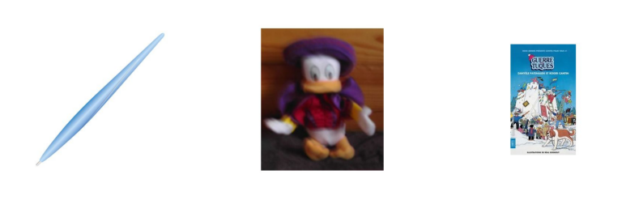
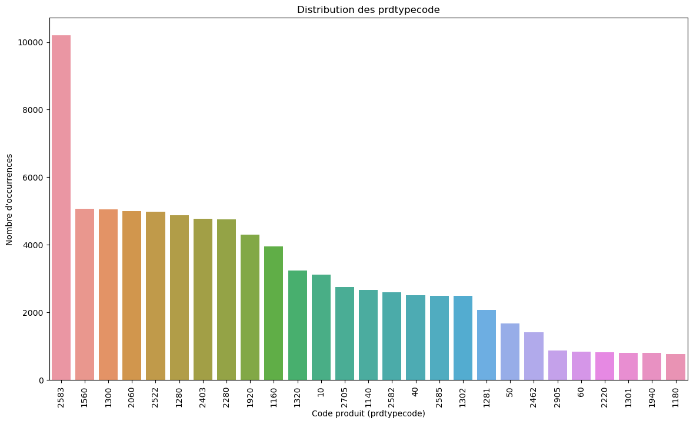
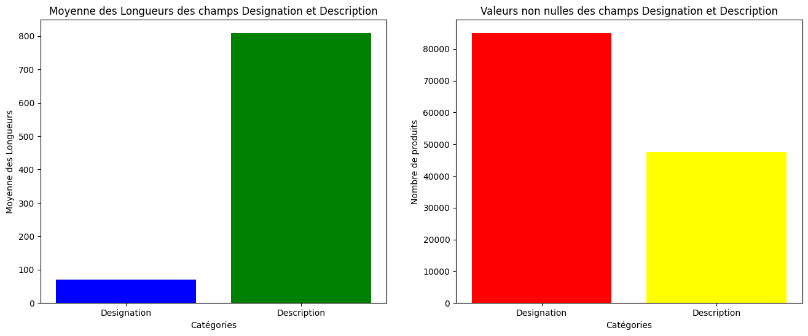
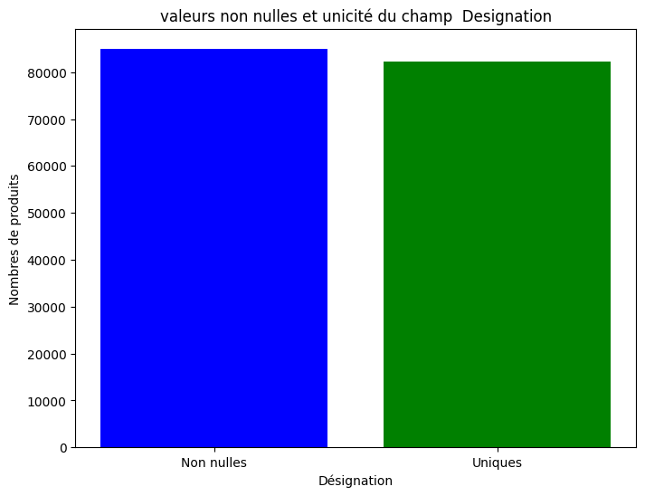
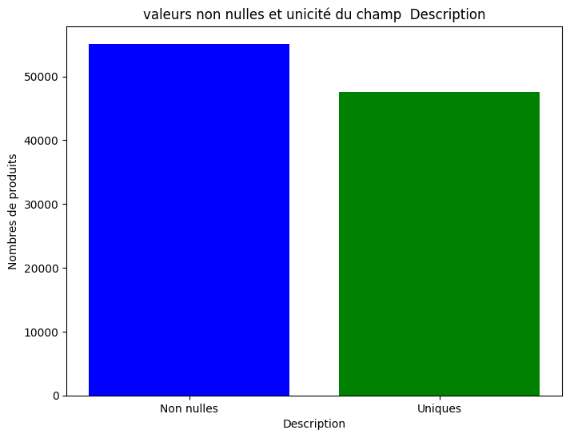

# ***PROJET RAKUTEN***  
# **1) Description du projet**  
**Description du problème**  
L'objectif de ce défi est la classification à grande échelle des données de produits multimodales (texte et image) en type de produit.  
Par exemple, dans le catalogue de Rakuten France, un produit avec une désignation "Grand Stylet Ergonomique Bleu Gamepad Nintendo Wii U - Speedlink Pilot Style" associé à une image (image_938777978_product_201115110.jpg) et
parfois à une description supplémentaire. Ce produit est catégorisé sous le code de produit 50.

<table border="1" class="dataframe">
  <thead>
    <tr style="text-align: right;">
      <th></th>
      <th>Id</th>
      <th>designation</th>
      <th>description</th>
      <th>productid</th>
      <th>imageid</th>
      <th>prdtypecode</th>
    </tr>
  </thead>
  <tbody>
    <tr>
      <th>0</th>
      <td>0</td>
      <td>Olivia: Personalisiertes Notizbuch / 150 Seiten / Punktraster / Ca Din A5 / Rosen-Design</td>
      <td>NaN</td>
      <td>3804725264</td>
      <td>1263597046</td>
      <td>10</td>
    </tr>
    <tr>
      <th>1</th>
      <td>1</td>
      <td>Journal Des Arts (Le) N° 133 Du 28/09/2001 - L'art Et Son Marche Salon D'art Asiatique A Paris - Jacques Barrere - Francois Perrier - La Reforme D...</td>
      <td>NaN</td>
      <td>436067568</td>
      <td>1008141237</td>
      <td>2280</td>
    </tr>
    <tr>
      <th>2</th>
      <td>2</td>
      <td>Grand Stylet Ergonomique Bleu Gamepad Nintendo Wii U - Speedlink Pilot Style</td>
      <td>PILOT STYLE Touch Pen de marque Speedlink est 1 stylet ergonomique pour GamePad Nintendo Wii U.&lt;br&gt; Pour un confort optimal et une précision maxim...</td>
      <td>201115110</td>
      <td>938777978</td>
      <td>50</td>
    </tr>
    <tr>
      <th>3</th>
      <td>3</td>
      <td>Peluche Donald - Europe - Disneyland 2000 (Marionnette À Doigt)</td>
      <td>NaN</td>
      <td>50418756</td>
      <td>457047496</td>
      <td>1280</td>
    </tr>
    <tr>
      <th>4</th>
      <td>4</td>
      <td>La Guerre Des Tuques</td>
      <td>Luc a des id&amp;eacute;es de grandeur. Il veut organiser un jeu de guerre de boules de neige et s'arranger pour en &amp;ecirc;tre le vainqueur incontest&amp;...</td>
      <td>278535884</td>
      <td>1077757786</td>
      <td>2705</td>
    </tr>
  </tbody>
</table>

    IMAGE  2
    Grand Stylet Ergonomique Bleu Gamepad Nintendo Wii U - Speedlink Pilot Style
    image_938777978_product_201115110.jpg
    IMAGE  3
    Peluche Donald - Europe - Disneyland 2000 (Marionnette À Doigt)
    image_457047496_product_50418756.jpg
    IMAGE  4
    La Guerre Des Tuques
    image_1077757786_product_278535884.jpg
    

    

    

Ce notebook fait partie d'un ensemble de sous-projets dont le resultat représente le **projet Rakuten** que j'ai réalisé pour mon diplôme de data Scientist chez Datascientest.com.  
Ce projet consiste en la classification à grande échelle des données de         produits multimodales (texte et image) en type de produits.  
Ce repositery est la partie **Machine Learning** et ne traite que de la partie texte.   
Il utilise néanmoins la bibliothèque **Bibli_DataScience** commune à l'ensemble du projet.  
D'autres dépots viendront, à savoir  :

*   La partie image  traitée par des réseaux convolutifs
*   La partie texte  traitée par des réseaux récurrents
*   Une quatrième partie qui est une syntèse que j'ai présenté par l'outils Streamlit

Il existe d'autres produits avec des titres différents, des images
différentes et éventuellement des descriptions, qui appartiennent au même code
de produit.  
En utilisant ces informations sur les produits, ce
défi propose de modéliser un classificateur pour classer les produits dans leur code de produit correspondant.  
# **2) Introduction**  
le but du projet est de prédire le code de type de chaque produit tel que défini dans le catalogue de Rakuten France.  
La catégorisation des annonces de produits se fait par le biais de la désignation, de la description (quand elle est présente) et des images.  
Les fichiers de données sont distribués ainsi :  
***X_train_update.csv*** : fichier d'entrée d'entraînement  
***Y_train_CVw08PX.csv*** : fichier de sortie d'entraînement  
***X_test_update.csv*** : fichier d'entrée de test  
Un fichier images.zip est également fourni, contenant toutes les images.  
La décompression de ce fichier fournira un dossier nommé "images" avec deux sous-dossiers nommés ***"image_train"*** et ***"image_test"***, contenant respectivement les images d'entraînement et de test.  
Pour notre part, ne participant pas au challenge Rakuten, je n'ai pas pas accès au fichier de sortie de test.  
Le fichier d’entrée de test est donc inutilisable.  
**X_train_update.csv** : fichier d'entrée d'entraînement :  
La première ligne des fichiers d'entrée contient l'en-tête et les colonnes sont séparées par des virgules (",").  
Les colonnes sont les suivantes :  

*   **Un identifiant entier pour le produit**. Cet identifiant est utilisé pour associer le produit à son code de type de produit correspondant.
*   **Désignation** - Le titre du produit, un court texte résumant le produit
*   **Description** - Un texte plus détaillé décrivant le produit. Tous les marchands n'utilisent pas ce champ, il se peut donc que le champ de description contienne la valeur NaN pour de nombreux produits, afin de conserver l'originalité des données.
*   **productid** - Un identifiant unique pour le produit.
*   **imageid** - Un identifiant unique pour l'image associée au produit.
Les champs imageid et productid sont utilisés pour récupérer les images dans le dossier
d'images correspondant. Pour un produit donné, le nom du fichier image est :
image_imageid_product_productid.jpg ex : image_1263597046_product_3804725264.jpg  

**Y_train_CVw08PX.csv** : fichier de sortie d'entraînement :  
La première ligne des fichiers d'entrée contient l'en-tête et les colonnes sont séparées par des virgules (",").  
Les colonnes sont les suivantes :  
*  **Un identifiant entier pour le produit**. Cet identifiant est utilisé pour associer le produit à son
code de type de produit correspondant.
*  **prdtypecode** – Catégorie dans laquelle le produit est classé.

La liaison entre les fichiers se fait par une jointure sur l’identifiant entier présent les deux
fichiers.

# ***exploration du dataset.***  
## Examinons la répartition  des codes produits :
    

    

    il y a une grande disparité dans la répartition des classes !
    

# Proposition de nomenclature des classes ("prdtypecode")

    {10: 'livres',
     40: 'jeux video pour pc et consoles',
     50: ' accesoires jeux video',
     60: 'consoles de jeux video',
     1140: 'produits derives “geeks” et figurines',
     1160: 'cartes collectionables',
     1180: 'figurines collectionables pour jeux de societe',
     1280: 'jouets, peluches, puppets',
     1281: 'jeux de societe/cartes',
     1300: 'Petites voitures (jouets) et maquettes',
     1301: 'accesoires pour petis enfants/bebes et mobilier de jeu (flechettes, billard, babyfoot)',
     1302: "jeux d'exterieur",
     1320: 'sacs pour femmes et accesore petite enfance',
     1560: 'Mobilier et produits decoration/rangement pour la maison',
     1920: 'linge de maison (cousins, rideaux, serviettes, nappes, draps)',
     1940: 'nouriture (cafes,infusions,conserves, epices,etc)',
     2060: 'lampes et accesoires decoration pour maison',
     2220: 'accesoires mascots/pets',
     2280: 'magazines',
     2403: 'livres et bds',
     2462: 'consoles de jeux video et jeux videos',
     2522: 'produits de papeterie et rangement bureau',
     2582: "mobilier d'exterieur et accesoires (parasols,pots,tentes,etc)",
     2583: 'accesoires de piscine',
     2585: 'outillage et accesoires pour jardinage',
     2705: 'bds et livres',
     2905: 'Jeu En téléchargement'}

    

## Examinons les valeurs nulles et les doublons du champ 'designation':

## Examinons les valeurs nulles et les doublons du champ 'description'.
 

    

