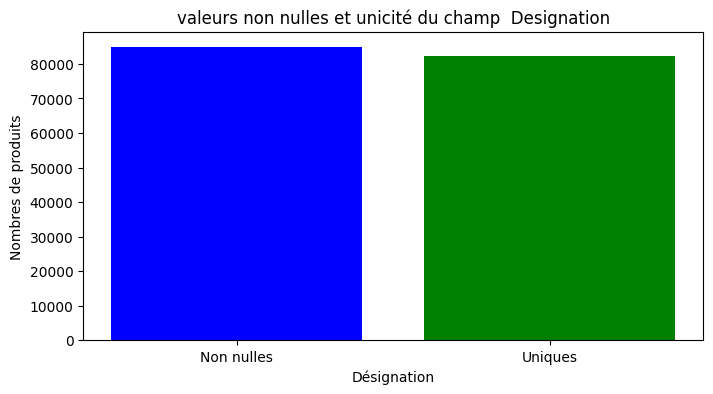
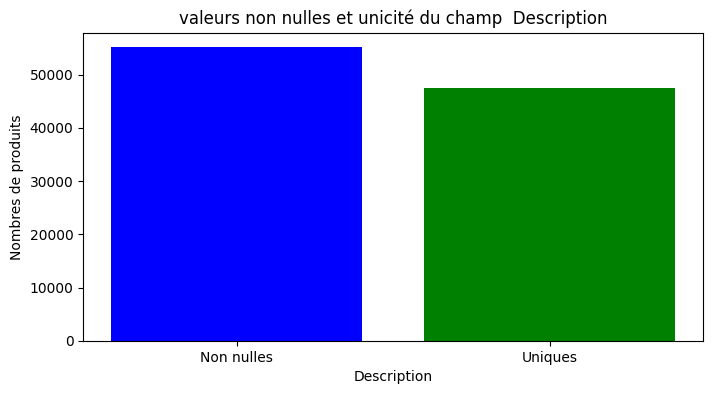
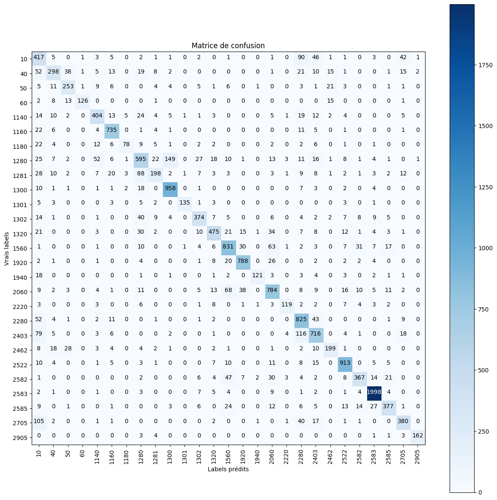
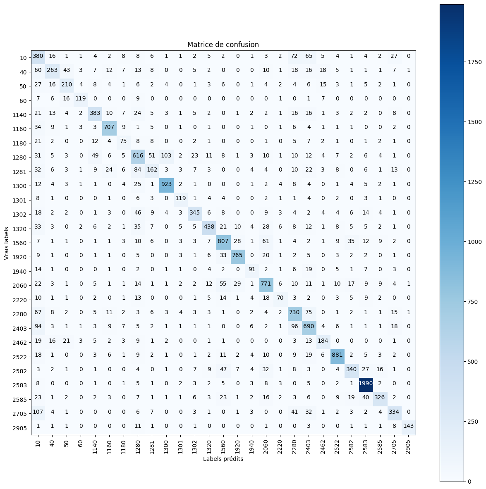
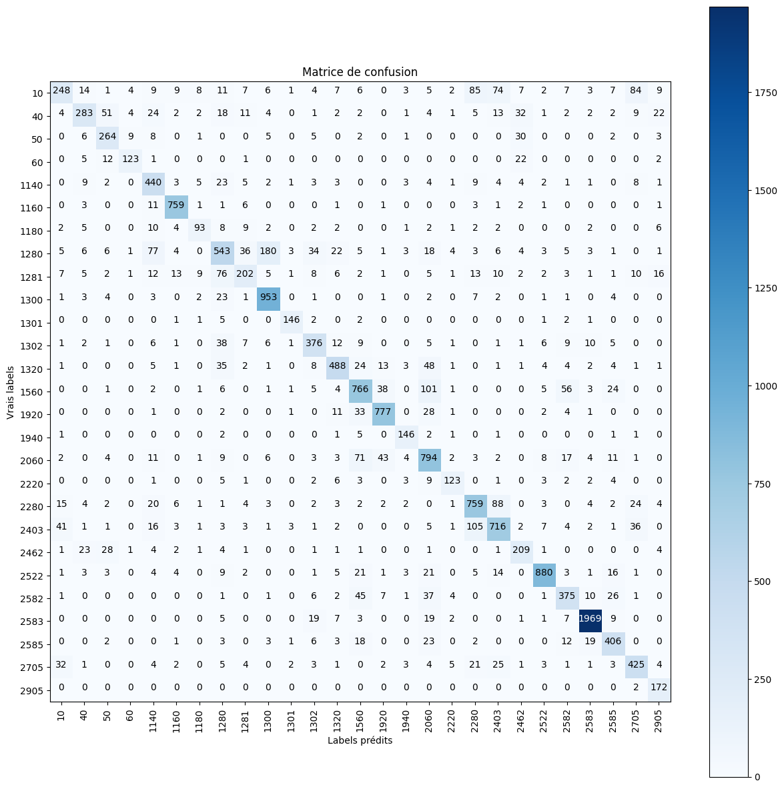
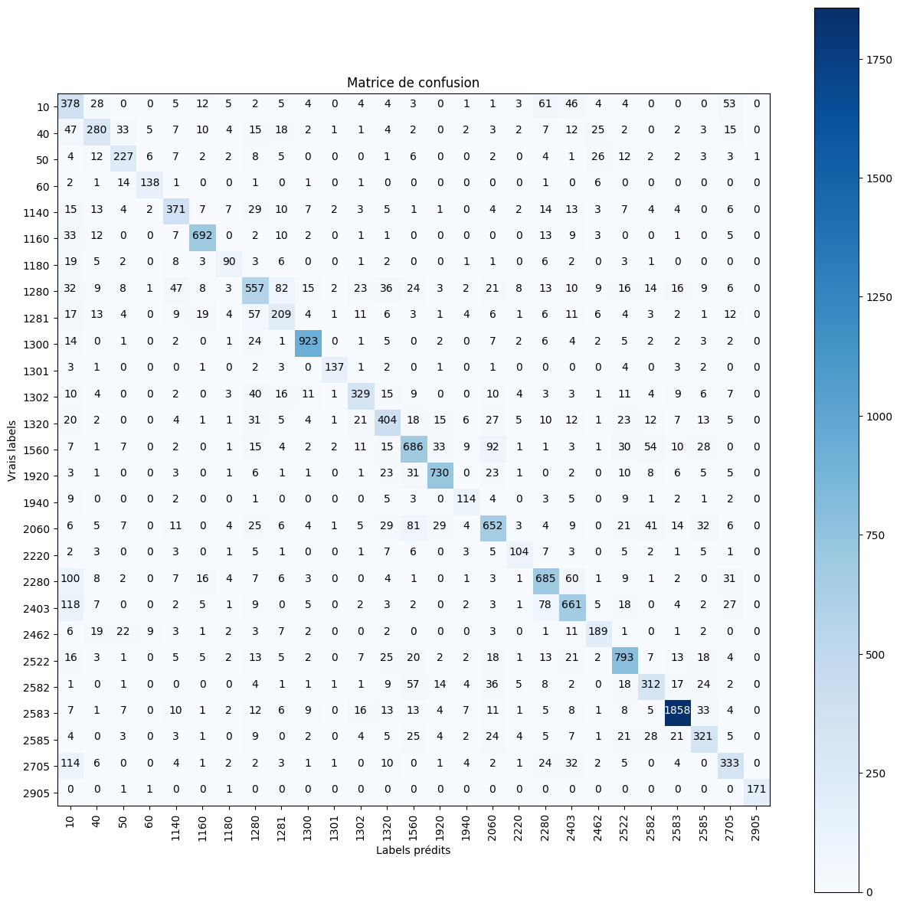

# ***PROJET RAKUTEN***  

## **1) Description du projet**  
**Description du problème**    

1.   Élément de liste
2.   Élément de liste


L'objectif de ce défi est la classification à grande échelle des données de produits multimodales (texte et image) en type de produit.  
Par exemple, dans le catalogue de Rakuten France, un produit avec une désignation "Grand Stylet Ergonomique Bleu Gamepad Nintendo Wii U - Speedlink Pilot Style" associé à une image (image_938777978_product_201115110.jpg) et
parfois à une description supplémentaire. Ce produit est catégorisé sous le code de produit 50.


```python
import numpy as np
import pandas as pd
import seaborn as sns
import matplotlib.pyplot as plt

from sklearn.feature_extraction.text import CountVectorizer
pd.set_option('display.max_colwidth', 150)
```


```python
# lecture des données sources d'entrainement
df_feats=pd.read_csv('/content/Rakuten_Text_Classification_ML/X_train_update.csv')

# lecture des données cibles d'entrainement
df_target=pd.read_csv('/content/Rakuten_Text_Classification_ML/Y_train_CVw08PX.csv')

# création d'un dataframe globale -  jointure
df=df_feats.merge(df_target,on='Unnamed: 0',how='inner')
df.rename(columns={'Unnamed: 0': 'Id'}, inplace=True)
```

<table border="1" class="dataframe">
  <thead>
    <tr style="text-align: right;">
      <th></th>
      <th>Id</th>
      <th>designation</th>
      <th>description</th>
      <th>productid</th>
      <th>imageid</th>
      <th>prdtypecode</th>
    </tr>
  </thead>
  <tbody>
    <tr>
      <th>0</th>
      <td>0</td>
      <td>Olivia: Personalisiertes Notizbuch / 150 Seiten / Punktraster / Ca Din A5 / Rosen-Design</td>
      <td>NaN</td>
      <td>3804725264</td>
      <td>1263597046</td>
      <td>10</td>
    </tr>
    <tr>
      <th>1</th>
      <td>1</td>
      <td>Journal Des Arts (Le) N° 133 Du 28/09/2001 - L'art Et Son Marche Salon D'art Asiatique A Paris - Jacques Barrere - Francois Perrier - La Reforme D...</td>
      <td>NaN</td>
      <td>436067568</td>
      <td>1008141237</td>
      <td>2280</td>
    </tr>
    <tr>
      <th>2</th>
      <td>2</td>
      <td>Grand Stylet Ergonomique Bleu Gamepad Nintendo Wii U - Speedlink Pilot Style</td>
      <td>PILOT STYLE Touch Pen de marque Speedlink est 1 stylet ergonomique pour GamePad Nintendo Wii U.&lt;br&gt; Pour un confort optimal et une précision maxim...</td>
      <td>201115110</td>
      <td>938777978</td>
      <td>50</td>
    </tr>
    <tr>
      <th>3</th>
      <td>3</td>
      <td>Peluche Donald - Europe - Disneyland 2000 (Marionnette À Doigt)</td>
      <td>NaN</td>
      <td>50418756</td>
      <td>457047496</td>
      <td>1280</td>
    </tr>
    <tr>
      <th>4</th>
      <td>4</td>
      <td>La Guerre Des Tuques</td>
      <td>Luc a des id&amp;eacute;es de grandeur. Il veut organiser un jeu de guerre de boules de neige et s'arranger pour en &amp;ecirc;tre le vainqueur incontest&amp;...</td>
      <td>278535884</td>
      <td>1077757786</td>
      <td>2705</td>
    </tr>
  </tbody>
</table>

    
```python
import os
import cv2
import matplotlib.pyplot as plt

folder_path = '/content/Rakuten_Text_Classification_ML/images/image_test'


plt.figure(figsize=(10, 10))

for i in range(2, 5):
    filename = 'image_' + str(df.iloc[i, 4]) + "_product_" + str(df.iloc[i, 3]) + ".jpg"
    designation = df.iloc[i, 1]
    print("IMAGE ",i)
    print(designation)
    print(filename)
    img = cv2.imread(os.path.join(folder_path, filename))
    img = cv2.cvtColor(img, cv2.COLOR_BGR2RGB)  # Convertir de BGR en RGB
    plt.subplot(1, 3, i-1)
    plt.imshow(img)
    #
    plt.axis('off')

plt.show()

```

    IMAGE  2
    Grand Stylet Ergonomique Bleu Gamepad Nintendo Wii U - Speedlink Pilot Style
    image_938777978_product_201115110.jpg
    IMAGE  3
    Peluche Donald - Europe - Disneyland 2000 (Marionnette À Doigt)
    image_457047496_product_50418756.jpg
    IMAGE  4
    La Guerre Des Tuques
    image_1077757786_product_278535884.jpg
    


    

    


Ce notebook fait partie d'un ensemble de sous-projets dont le resultat représente le **projet Rakuten** que j'ai réalisé pour mon diplôme de data Scientist chez Datascientest.com.  
Ce projet consiste en la classification à grande échelle des données de         produits multimodales (texte et image) en type de produits.  
Ce repositery est la partie **Machine Learning** et ne traite que de la partie texte.   
Il utilise néanmoins la bibliothèque **Bibli_DataScience** commune à l'ensemble du projet.  
D'autres dépots viendront, à savoir  :


*   La partie image  traitée par des réseaux convolutifs
*   La partie texte  traitée par des réseaux récurrents
*   Une quatrième partie qui est une syntèse que j'ai présenté par l'outils Streamlit


Il existe d'autres produits avec des titres différents, des images
différentes et éventuellement des descriptions, qui appartiennent au même code
de produit.  
En utilisant ces informations sur les produits, ce
défi propose de modéliser un classificateur pour classer les produits dans leur code de produit correspondant.  

## **2) Introduction**   

**description des fichiers**

le but du projet est de prédire le code de type de chaque produit tel que défini dans le catalogue de Rakuten France.  
La catégorisation des annonces de produits se fait par le biais de la désignation, de la description (quand elle est présente) et des images.  
Les fichiers de données sont distribués ainsi :  
***X_train_update.csv*** : fichier d'entrée d'entraînement  
***Y_train_CVw08PX.csv*** : fichier de sortie d'entraînement  
***X_test_update.csv*** : fichier d'entrée de test  
Un fichier images.zip est également fourni, contenant toutes les images.  
La décompression de ce fichier fournira un dossier nommé "images" avec deux sous-dossiers nommés ***"image_train"*** et ***"image_test"***, contenant respectivement les images d'entraînement et de test.  
Pour notre part, ne participant pas au challenge Rakuten, je n'ai pas pas accès au fichier de sortie de test.  
Le fichier d’entrée de test est donc inutilisable.  
**X_train_update.csv** : fichier d'entrée d'entraînement :  
La première ligne des fichiers d'entrée contient l'en-tête et les colonnes sont séparées par des virgules (",").  
Les colonnes sont les suivantes :  


*   **Un identifiant entier pour le produit**. Cet identifiant est utilisé pour associer le produit à son code de type de produit correspondant.
*   **Désignation** - Le titre du produit, un court texte résumant le produit
*   **Description** - Un texte plus détaillé décrivant le produit. Tous les marchands n'utilisent pas ce champ, il se peut donc que le champ de description contienne la valeur NaN pour de nombreux produits, afin de conserver l'originalité des données.
*   **productid** - Un identifiant unique pour le produit.
*   **imageid** - Un identifiant unique pour l'image associée au produit.
Les champs imageid et productid sont utilisés pour récupérer les images dans le dossier
d'images correspondant. Pour un produit donné, le nom du fichier image est :
image_imageid_product_productid.jpg ex : image_1263597046_product_3804725264.jpg  

**Y_train_CVw08PX.csv** : fichier de sortie d'entraînement :  
La première ligne des fichiers d'entrée contient l'en-tête et les colonnes sont séparées par des virgules (",").  
Les colonnes sont les suivantes :  
*  **Un identifiant entier pour le produit**. Cet identifiant est utilisé pour associer le produit à son
code de type de produit correspondant.
*  **prdtypecode** – Catégorie dans laquelle le produit est classé.

La liaison entre les fichiers se fait par une jointure sur l’identifiant entier présent les deux
fichiers.

## ***3) exploration du dataset.***  
Examinons la répartition  des codes produits :


```python
cat=df_target['prdtypecode'].unique()

plt.figure(figsize=(14, 8))
sns.countplot(data=df_target, x='prdtypecode', order = df_target['prdtypecode'].value_counts().index)
plt.xticks(rotation=90)  # Rotation des labels de l'axe x pour une meilleure lisibilité
plt.title("Distribution des prdtypecode")
plt.xlabel("Code produit (prdtypecode)")
plt.ylabel("Nombre d'occurrences")
plt.show()

print("il y a une grande disparité dans la répartition des classes !")

```


    

    


    il y a une grande disparité dans la répartition des classes !
    

# Proposition de nomenclature des classes ("prdtypecode")


```python
nomenclature=pd.read_csv('NOMENCLATURE.csv',header=0,encoding='utf-8',sep=';',index_col=0)
catdict=nomenclature.to_dict()['definition']
catdict
```


    {10: 'livres',
     40: 'jeux video pour pc et consoles',
     50: ' accesoires jeux video',
     60: 'consoles de jeux video',
     1140: 'produits derives “geeks” et figurines',
     1160: 'cartes collectionables',
     1180: 'figurines collectionables pour jeux de societe',
     1280: 'jouets, peluches, puppets',
     1281: 'jeux de societe/cartes',
     1300: 'Petites voitures (jouets) et maquettes',
     1301: 'accesoires pour petis enfants/bebes et mobilier de jeu (flechettes, billard, babyfoot)',
     1302: "jeux d'exterieur",
     1320: 'sacs pour femmes et accesore petite enfance',
     1560: 'Mobilier et produits decoration/rangement pour la maison',
     1920: 'linge de maison (cousins, rideaux, serviettes, nappes, draps)',
     1940: 'nouriture (cafes,infusions,conserves, epices,etc)',
     2060: 'lampes et accesoires decoration pour maison',
     2220: 'accesoires mascots/pets',
     2280: 'magazines',
     2403: 'livres et bds',
     2462: 'consoles de jeux video et jeux videos',
     2522: 'produits de papeterie et rangement bureau',
     2582: "mobilier d'exterieur et accesoires (parasols,pots,tentes,etc)",
     2583: 'accesoires de piscine',
     2585: 'outillage et accesoires pour jardinage',
     2705: 'bds et livres',
     2905: 'Jeu En téléchargement'}


## Comparons les champs 'designation' et 'descriptions' :


```python
# Calcul de la moyenne des longueurs pour chaque colonne séparément
moyenne_designation = df_feats['designation'].str.len().mean()
moyenne_description = df_feats['description'].str.len().mean()

import matplotlib.pyplot as plt

categories = ['Designation', 'Description']

moyennes = [moyenne_designation, moyenne_description]

plt.figure(figsize=(16, 4))

plt.subplot(1, 2, 1)
plt.bar(categories, moyennes, color=['blue', 'green'])
plt.title('Moyenne des Longueurs des champs Designation et Description')
plt.xlabel('Catégories')
plt.ylabel('Moyenne des Longueurs')
plt.xticks(categories)

nb_designation = len(df_feats[~df_feats['designation'].isna()])
nb_description = len(df_feats['description'].unique())  # Assurez-vous que c'est bien 'description'

Nb = [nb_designation, nb_description]
plt.subplot(1, 2, 2)
plt.bar(categories, Nb, color=['red', 'yellow'])  # Choisir des couleurs différentes
plt.title('Valeurs non nulles des champs Designation et Description')
plt.xlabel('Catégories')
plt.ylabel('Nombre de produits')
plt.xticks(categories)

plt.show()

```


    

    


## Examinons les valeurs nulles et les doublons du champ 'designation':


```python
categories = ['Non nulles', 'Uniques']
nb_designation = len(df_feats[~df_feats['designation'].isna()])
nb_designation_u = len(df_feats['designation'].unique())

Nb = [nb_designation, nb_designation_u]

plt.figure(figsize=(8,4))  # Vous pouvez ajuster la taille selon vos besoins
plt.bar(categories,Nb, color=['blue', 'green'])  # Choisir des couleurs

plt.title('valeurs non nulles et unicité du champ  Designation')
plt.xlabel('Désignation')
plt.ylabel('Nombres de produits')
plt.xticks(categories)

plt.show()

```


    

    


## Examinons les valeurs nulles et les doublons du champ 'description'.


```python
categories = ['Non nulles', 'Uniques']
nb_description = len(df_feats[~df_feats['description'].isna()])
nb_description_u = len(df_feats['description'].unique())

Nb = [nb_description, nb_description_u]

plt.figure(figsize=(8, 4))
plt.bar(categories,Nb, color=['blue', 'green'])

plt.title('valeurs non nulles et unicité du champ  Description')
plt.xlabel('Description')
plt.ylabel('Nombres de produits')
plt.xticks(categories)

plt.show()
```


    

    


## ***4) Récupération du fichier df_langue.csv***


```python
df2=df.copy()
df_langue=pd.read_csv('/content/Rakuten_Text_Classification_ML/df_langue.csv')
df=df2.merge(df_langue.drop(['Unnamed: 0','prdtypecode'], axis=1),on='Id',how='inner')
df['status'] = df['descr_NaN'].apply(lambda x: 'SansDescrip' if x else 'AvecDescrip').astype(str)
```


```python
df.info()
```

    <class 'pandas.core.frame.DataFrame'>
    Int64Index: 84916 entries, 0 to 84915
    Data columns (total 17 columns):
     #   Column          Non-Null Count  Dtype  
    ---  ------          --------------  -----  
     0   Id              84916 non-null  int64  
     1   designation     84916 non-null  object 
     2   description     55116 non-null  object 
     3   productid       84916 non-null  int64  
     4   imageid         84916 non-null  int64  
     5   prdtypecode     84916 non-null  int64  
     6   PAYS_LANGUE     84916 non-null  object 
     7   RATIO_LANGUE    84916 non-null  float64
     8   ORIGINE_LANGUE  84916 non-null  object 
     9   pays_design     84916 non-null  object 
     10  Ratio_design    84916 non-null  float64
     11  pays_descr      55049 non-null  object 
     12  Ratio_descr     55049 non-null  float64
     13  design_long     84916 non-null  int64  
     14  descrip_long    55049 non-null  float64
     15  descr_NaN       84916 non-null  bool   
     16  status          84916 non-null  object 
    dtypes: bool(1), float64(4), int64(5), object(7)
    memory usage: 11.1+ MB
    

**Répartition des langues pour la colonne 'designation'**


```python
fig, axs = plt.subplots(1, 2, figsize=(15,5))
sns.countplot(x=df['pays_design'],ax=axs[0])
pays_principaux=df['pays_design'].value_counts()[:10]
print(pays_principaux.index)
sns.countplot(x=df[df['pays_design'].isin(pays_principaux.index)]['pays_design'],hue=df['status'],ax=axs[1])
plt.subplots_adjust( wspace=0.1,hspace=0.5)
plt.show()
```

    Index(['fr', 'en', 'de', 'nl', 'ca', 'it', 'ro', 'pt', 'es', 'no'], dtype='object')
    


    

    


**Répartition des langues pour la colonne 'description'**


```python
fig, axs = plt.subplots(1, 2, figsize=(15,5))
df_descrip=df.dropna(subset=['description'])
sns.countplot(x=df_descrip['pays_descr'],ax=axs[0])
pays_principaux=df['pays_descr'].value_counts()[:10]
print(pays_principaux.index)
plt.subplots_adjust( wspace=0.1,hspace=0.5)
sns.countplot(x=df[df['pays_descr'].isin(pays_principaux.index)]['pays_descr'],ax=axs[1])
plt.subplots_adjust( wspace=0.1,hspace=0.5)
plt.show()
```

    Index(['fr', 'en', 'de', 'ca', 'it', 'cy', 'pt', 'ro', 'es', 'vi'], dtype='object')
    


    

    


**Répartition des langues par catégorie (XX = le reste du monde)**


```python
import seaborn as sns
import matplotlib.pyplot as plt

# Modifier la taille de la figure ici
g = sns.FacetGrid(data=df, col='prdtypecode', col_wrap=3, sharex=False, sharey=False, height=4, aspect=1.2)
g.map_dataframe(sns.countplot, 'PAYS_LANGUE')
g.set_xticklabels(rotation=90)
g.set_xlabels('PAYS')
g.add_legend()

plt.show()

```


    

    


##***5) Bags of words***


```python
stopwordFR = pd.read_csv("/content/Rakuten_Text_Classification_ML/stopwords_FR_02.csv")
Lcat=df_target.sort_values(by='prdtypecode')['prdtypecode'].unique()


nomenclature=pd.read_csv('/content/Rakuten_Text_Classification_ML/NOMENCLATURE.csv',header=0,encoding='utf-8',sep=';',index_col=0)
catdict=nomenclature.to_dict()['definition']

```


```python
df_top_40=pd.DataFrame()
vect=CountVectorizer(min_df=4, stop_words=stopwordFR['MOT'].tolist())
TailleCat ={}
for c in Lcat:
    df_cat=df[df['prdtypecode']==c]
    vect=vect.fit(df_cat['designation'])
    TailleCat[c]=len(vect.vocabulary_)
    print("Catégorie : ",c,"   Nombre de mots : ",  TailleCat[c])
    bag_of_words=vect.transform(df_cat['designation'])
    word_occurrences = np.sum(bag_of_words, axis=0)
    words = vect.get_feature_names_out()
    word_occurrences_dict = dict(zip(words, word_occurrences.tolist()[0]))
    top_40_words = sorted(word_occurrences_dict.items(), key=lambda x: x[1], reverse=True)[:40]
    dfout=pd.DataFrame(top_40_words,columns=['mot','occurence'])
    #print(dfout['occurence'].head(40))
    dfout['occurence'] = dfout['occurence'][:-1]
    #print(dfout['occurence'].head(40))
    dfout['occurence'] = dfout['occurence']
    dfout['prdtypecode']=c
    for word, occurrences in top_40_words:
        print(f"{word}: {occurrences}")
    df_top_40=pd.concat([df_top_40,dfout])
```

    Catégorie :  10    Nombre de mots :  843
    tome: 154
    edition: 127
    guide: 84
    histoire: 84
    france: 60
    vie: 55
    art: 50
    collection: 48
    book: 47
    journal: 35
    life: 35
    édition: 35
    livre: 34
    volume: 34
    saint: 33
    paris: 32
    cours: 28
    grand: 27
    droit: 26
    world: 26
    monde: 24
    guerre: 23
    history: 23
    pratique: 23
    revue: 23
    français: 21
    jean: 21
    nos: 21
    science: 21
    temps: 21
    ans: 20
    cd: 20
    siècle: 20
    pays: 19
    homme: 18
    oeuvres: 18
    vol: 18
    100: 17
    europe: 17
    lettres: 17
    Catégorie :  40    Nombre de mots :  759
    import: 584
    jeu: 384
    magideal: 282
    pc: 235
    allemand: 226
    edition: 194
    japonais: 166
    xbox: 109
    version: 106
    nintendo: 100
    anglais: 81
    complet: 78
    jap: 77
    jeux: 73
    360: 70
    ensemble: 70
    japon: 64
    câble: 62
    ds: 62
    playstation: 61
    ps4: 61
    game: 58
    collection: 53
    wii: 53
    console: 51
    contrôleur: 50
    ps3: 50
    audio: 49
    one: 47
    super: 47
    world: 47
    sony: 46
    protection: 44
    collector: 42
    us: 42
    pack: 40
    adaptateur: 38
    ii: 38
    manette: 36
    uk: 36
    Catégorie :  50    Nombre de mots :  624
    nintendo: 356
    jeu: 336
    manette: 246
    console: 242
    ps4: 235
    xbox: 177
    playstation: 163
    protection: 154
    switch: 147
    noir: 131
    wii: 115
    silicone: 109
    controller: 107
    usb: 107
    one: 104
    portable: 99
    fil: 97
    sony: 95
    chargeur: 94
    contrôleur: 91
    housse: 85
    support: 85
    commutateur: 81
    ps3: 77
    jeux: 75
    gamepad: 71
    joystick: 70
    mini: 70
    pro: 70
    remplacement: 70
    pc: 67
    360: 66
    câble: 65
    game: 62
    bluetooth: 61
    skylanders: 59
    gaming: 58
    slim: 57
    3ds: 56
    accessoires: 55
    Catégorie :  60    Nombre de mots :  316
    jeu: 1200
    console: 779
    jeux: 580
    portable: 545
    vidéo: 470
    rétro: 418
    mini: 334
    pouces: 292
    lecteur: 277
    poche: 236
    intégré: 233
    tv: 212
    classique: 169
    bits: 168
    écran: 138
    classiques: 127
    enfants: 127
    couleur: 103
    double: 92
    famille: 88
    joueur: 87
    cadeau: 83
    gb: 78
    lcd: 77
    nintendo: 74
    sortie: 74
    av: 72
    hdmi: 70
    joueurs: 68
    consoles: 67
    arcade: 63
    16: 60
    nostalgique: 56
    enfant: 55
    machine: 54
    support: 53
    500: 50
    charge: 50
    fc: 49
    nouveau: 49
    Catégorie :  1140    Nombre de mots :  897
    figurine: 841
    pop: 349
    star: 239
    wars: 218
    funko: 177
    shirt: 153
    pvc: 147
    figure: 131
    marvel: 121
    dragon: 102
    figurines: 95
    collection: 87
    import: 85
    japan: 84
    super: 81
    gundam: 80
    mug: 78
    ball: 77
    porte: 76
    action: 71
    statuette: 69
    série: 69
    ver: 66
    man: 64
    black: 59
    disney: 57
    lot: 57
    comics: 56
    one: 56
    happy: 51
    piece: 51
    batman: 48
    dc: 48
    mini: 48
    toy: 47
    saint: 42
    toys: 42
    magnet: 41
    meal: 40
    series: 40
    Catégorie :  1160    Nombre de mots :  1237
    carte: 1050
    yu: 637
    oh: 626
    gi: 624
    magic: 465
    vf: 457
    mtg: 444
    rare: 376
    commune: 290
    pokemon: 260
    dragon: 251
    pokémon: 251
    fr: 232
    ball: 199
    reverse: 166
    vo: 158
    foil: 143
    neuf: 143
    panini: 142
    pv: 137
    super: 128
    adrenalyn: 123
    holo: 106
    edition: 103
    cartes: 101
    série: 93
    force: 92
    ex: 88
    xy: 84
    édition: 84
    attax: 82
    xl: 79
    card: 78
    star: 75
    43: 74
    108: 70
    95: 68
    2016: 67
    lot: 67
    100: 66
    Catégorie :  1180    Nombre de mots :  250
    warhammer: 121
    heroclix: 75
    figurine: 63
    masque: 61
    prince: 47
    métal: 46
    jeu: 44
    40000: 43
    august: 35
    halloween: 35
    miniatures: 35
    oop: 35
    dragons: 34
    jeux: 34
    pot: 34
    40k: 32
    17ml: 31
    space: 27
    60: 25
    ad: 23
    peinture: 21
    rôles: 21
    dark: 19
    donjons: 19
    acrylique: 18
    costume: 18
    visage: 18
    lot: 17
    noir: 17
    partha: 17
    ral: 17
    age: 16
    dungeons: 16
    games: 16
    guerrier: 16
    led: 16
    modèle: 16
    party: 16
    star: 16
    air: 15
    Catégorie :  1280    Nombre de mots :  1871
    enfants: 869
    jouet: 669
    jouets: 629
    toy: 491
    peluche: 480
    rc: 470
    doudou: 435
    cadeau: 341
    bébé: 338
    puzzle: 331
    voiture: 317
    doll: 242
    bois: 225
    mini: 225
    modèle: 225
    stress: 224
    poupée: 202
    drone: 193
    baby: 187
    pièces: 187
    enfant: 183
    dji: 173
    hélicoptère: 163
    magideal: 160
    bleu: 157
    quadcopter: 157
    jeu: 153
    figurine: 147
    toys: 145
    slime: 144
    blanc: 143
    set: 143
    éducation: 138
    noël: 125
    mignon: 124
    parfumée: 123
    lapin: 122
    18: 114
    plat: 113
    animal: 111
    Catégorie :  1281    Nombre de mots :  676
    jeu: 398
    enfants: 330
    game: 206
    jouets: 201
    toy: 176
    jouet: 168
    cartes: 143
    bois: 113
    cadeau: 111
    slime: 107
    bébé: 105
    stress: 87
    card: 84
    jeux: 83
    puzzle: 79
    board: 77
    parfumée: 68
    peluche: 67
    éducatifs: 67
    edition: 66
    mini: 65
    clay: 64
    noël: 57
    animaux: 55
    boue: 55
    putty: 54
    société: 52
    games: 51
    modèle: 50
    set: 49
    éducatif: 46
    mignon: 45
    bricolage: 43
    voiture: 41
    warhammer: 39
    magic: 36
    shen: 36
    doll: 35
    import: 34
    party: 34
    Catégorie :  1300    Nombre de mots :  1907
    générique: 3741
    rc: 1853
    drone: 1626
    dji: 1191
    quadcopter: 721
    mavic: 623
    fpv: 551
    avion: 549
    voiture: 540
    caméra: 524
    maquette: 487
    wifi: 466
    pro: 399
    batterie: 368
    43: 363
    4g: 334
    hd: 325
    brushless: 277
    mini: 276
    sac: 264
    racing: 231
    osmo: 226
    étanche: 226
    air: 225
    modèle: 222
    pièces: 209
    pliable: 208
    support: 208
    moteur: 202
    pocket: 202
    protection: 199
    traxxas: 199
    rechange: 184
    gimbal: 181
    portable: 178
    camera: 177
    télécommande: 177
    accessoires: 176
    spark: 176
    chargeur: 170
    Catégorie :  1301    Nombre de mots :  275
    chaussettes: 490
    bébé: 408
    auucne: 382
    filles: 248
    enfants: 219
    cartoon: 207
    garçons: 194
    anti: 185
    nouveau: 152
    né: 147
    slip: 126
    coton: 105
    billard: 100
    harrows: 90
    bébés: 84
    fille: 81
    chaussures: 78
    baby: 77
    bas: 76
    fléchettes: 68
    petits: 64
    foot: 59
    enfant: 56
    sol: 56
    animaux: 55
    step: 53
    chaud: 48
    bottes: 47
    dérapant: 46
    noël: 46
    bce: 44
    garçon: 44
    mignon: 44
    chaudes: 43
    petit: 43
    slipper: 43
    mm: 42
    queue: 41
    aramith: 37
    chaussons: 37
    Catégorie :  1302    Nombre de mots :  1104
    stream: 779
    pêche: 447
    lampe: 280
    stress: 259
    ligne: 228
    led: 227
    bracelet: 210
    jouet: 203
    enfants: 168
    leurres: 163
    toy: 148
    parfumée: 138
    poche: 135
    lente: 132
    rising: 128
    sport: 127
    trampoline: 126
    montre: 118
    torche: 118
    jeu: 112
    jouets: 111
    squeeze: 106
    appâts: 102
    appât: 97
    anti: 94
    t6: 94
    plastique: 93
    air: 92
    super: 92
    camping: 91
    bande: 90
    enfant: 89
    silicone: 89
    extérieur: 87
    hausse: 87
    plein: 85
    relief: 85
    mini: 83
    1pc: 77
    eau: 77
    Catégorie :  1320    Nombre de mots :  1161
    bébé: 773
    sac: 574
    bavoir: 295
    bleu: 237
    imprimé: 236
    poussette: 233
    rose: 227
    blanc: 204
    lit: 195
    mode: 167
    siège: 155
    enfant: 152
    auto: 139
    enfants: 132
    bandoulière: 118
    femmes: 116
    humidificateur: 111
    noir: 111
    main: 108
    lot: 101
    langer: 100
    led: 100
    gris: 97
    magideal: 95
    porte: 95
    air: 94
    baby: 94
    couleur: 93
    voyage: 93
    coussin: 90
    housse: 88
    tapis: 84
    mois: 80
    sacs: 80
    jouet: 77
    coton: 76
    veilleuse: 75
    bain: 73
    bois: 71
    diffuseur: 71
    Catégorie :  1560    Nombre de mots :  1875
    cuisine: 609
    matelas: 569
    blanc: 502
    table: 473
    bois: 472
    chaise: 399
    tissu: 390
    rangement: 348
    noir: 330
    salle: 329
    gris: 317
    fournitures: 280
    design: 274
    sac: 263
    pieds: 260
    lit: 248
    sommier: 248
    ferme: 241
    kitchen: 239
    bar: 238
    canapé: 227
    manger: 227
    supplies: 226
    acier: 222
    forme: 220
    lot: 215
    mousse: 207
    bureau: 204
    ensemble: 197
    boîte: 192
    mémoire: 191
    sweetheart93: 190
    couleur: 187
    porte: 186
    meuble: 183
    métal: 182
    tabouret: 177
    cuir: 175
    co: 171
    fauteuil: 168
    Catégorie :  1920    Nombre de mots :  914
    coussin: 3076
    taie: 2204
    oreiller: 1958
    home: 1214
    canapé: 1102
    décor: 968
    couverture: 787
    sofa: 670
    throw: 655
    housse: 652
    décoration: 646
    coton: 632
    case: 621
    cover: 575
    lit: 501
    taille: 477
    noël: 450
    pillow: 439
    lin: 407
    decor: 383
    polyester: 343
    accueil: 312
    maison: 262
    halloween: 255
    rideau: 234
    cas: 228
    imprimer: 228
    taies: 226
    linge: 223
    festival: 222
    s4sassy: 206
    couette: 197
    linen: 188
    imprimé: 185
    carré: 162
    heureux: 158
    voiture: 155
    happy: 146
    décoratif: 143
    set: 140
    Catégorie :  1940    Nombre de mots :  311
    bio: 144
    café: 71
    lot: 62
    chocolat: 54
    capsules: 53
    sachet: 51
    gr: 43
    thé: 43
    16: 42
    100: 32
    huile: 32
    250: 30
    250g: 30
    noir: 29
    vert: 29
    lait: 28
    sucre: 28
    bonbons: 27
    dolce: 27
    gusto: 27
    dosettes: 26
    100g: 24
    gluten: 24
    sachets: 24
    bonbon: 22
    espresso: 21
    haribo: 21
    nescafé: 20
    orange: 20
    tassimo: 20
    20: 19
    bur: 18
    eric: 18
    fruits: 18
    fini: 17
    ml: 17
    rouge: 17
    500: 16
    blanc: 16
    cafe: 16
    Catégorie :  2060    Nombre de mots :  1800
    led: 1043
    noël: 866
    décoration: 788
    décor: 721
    lampe: 717
    bricolage: 529
    peinture: 476
    lumière: 450
    diamant: 373
    3d: 352
    bain: 345
    mur: 332
    broderie: 329
    chambre: 329
    home: 329
    salle: 326
    5d: 318
    magideal: 290
    croix: 288
    point: 286
    art: 285
    sticker: 282
    stickers: 282
    strass: 271
    mural: 270
    tapis: 263
    mariage: 261
    lumières: 260
    accueil: 253
    pasted: 251
    party: 250
    cuisine: 246
    jardin: 246
    bureau: 236
    peintures: 236
    table: 230
    wall: 228
    lujuik: 225
    maison: 215
    decoration: 211
    Catégorie :  2220    Nombre de mots :  383
    chien: 389
    pet: 231
    chat: 194
    vêtements: 139
    collier: 106
    dog: 105
    animaux: 102
    magideal: 98
    chiens: 70
    chiot: 70
    puppy: 64
    réglable: 59
    sweetheart93: 58
    hiver: 57
    gilet: 54
    cat: 53
    aquarium: 51
    chaud: 50
    jouet: 49
    manteau: 46
    robe: 38
    taille: 36
    veste: 35
    bleu: 32
    respirant: 32
    animal: 31
    mode: 31
    noir: 31
    petit: 30
    corde: 29
    coton: 29
    coussin: 29
    jouets: 29
    mat: 27
    compagnie: 26
    forme: 26
    harnais: 26
    laisse: 26
    maison: 26
    mignon: 26
    Catégorie :  2280    Nombre de mots :  2632
    01: 739
    france: 387
    journal: 333
    03: 303
    paris: 283
    04: 270
    06: 270
    09: 270
    02: 269
    05: 266
    07: 261
    revue: 256
    08: 220
    monde: 219
    magazine: 205
    petit: 164
    vie: 149
    jean: 136
    15: 135
    20: 128
    presse: 125
    2p: 121
    28: 118
    16: 114
    guerre: 110
    27: 106
    18: 102
    francaise: 102
    25: 101
    13: 100
    30: 100
    14: 97
    19: 96
    politique: 96
    26: 95
    histoire: 95
    illustre: 92
    23: 88
    série: 88
    21: 87
    Catégorie :  2403    Nombre de mots :  1670
    lot: 1879
    livres: 784
    tomes: 382
    volumes: 313
    tome: 284
    collection: 258
    partitions: 238
    revues: 215
    vol: 166
    livre: 163
    revue: 158
    histoire: 156
    france: 148
    année: 142
    numéros: 140
    39: 136
    piano: 123
    bd: 118
    comics: 111
    editions: 111
    romans: 110
    jean: 103
    interview: 102
    pages: 102
    amp: 101
    série: 100
    34: 98
    complète: 94
    vie: 92
    deux: 91
    edition: 91
    20: 90
    éditions: 89
    édition: 84
    magazine: 82
    poche: 80
    journal: 79
    marvel: 79
    volume: 76
    complet: 75
    Catégorie :  2462    Nombre de mots :  362
    jeux: 560
    lot: 354
    jeu: 349
    xbox: 238
    pc: 214
    playstation: 212
    nintendo: 192
    wii: 191
    console: 163
    ps3: 158
    360: 153
    43: 129
    neuf: 126
    manettes: 119
    voir: 118
    photos: 116
    manette: 98
    collection: 82
    go: 78
    ds: 77
    ps2: 77
    slim: 73
    ps1: 72
    one: 61
    jaquette: 58
    élément: 58
    kinect: 53
    boite: 52
    edition: 48
    pack: 46
    video: 45
    game: 44
    super: 44
    ensemble: 43
    ps4: 43
    fifa: 39
    notice: 37
    remplacement: 35
    box: 34
    mario: 34
    Catégorie :  2522    Nombre de mots :  1674
    notes: 1597
    carnet: 1047
    lot: 992
    journal: 932
    bloc: 849
    cahier: 723
    mm: 698
    classique: 652
    a5: 600
    papier: 408
    noir: 374
    a4: 359
    stylo: 348
    bleu: 323
    cadeau: 278
    feuilles: 267
    rouge: 259
    tissu: 238
    chimie: 233
    support: 226
    carnets: 222
    travail: 218
    vert: 215
    blanc: 213
    format: 212
    100: 199
    clairefontaine: 186
    encre: 178
    lindner: 177
    bille: 169
    crayon: 156
    pen: 156
    porte: 156
    pointe: 151
    50: 138
    exacompta: 138
    calcul: 135
    pochettes: 131
    carte: 129
    25: 126
    Catégorie :  2582    Nombre de mots :  1098
    jardin: 539
    gris: 250
    blanc: 227
    pvc: 198
    tente: 187
    table: 186
    kitchen: 170
    noir: 157
    bois: 140
    extérieur: 140
    m²: 138
    aluminium: 116
    imperméable: 116
    largeur: 108
    résine: 107
    vert: 103
    longueur: 100
    parasol: 100
    marron: 97
    salon: 93
    pot: 92
    pliante: 88
    anthracite: 85
    acier: 84
    metal: 84
    tressée: 83
    steel: 82
    stainless: 81
    home: 80
    hangar: 79
    silicone: 78
    diy: 77
    vidaxl: 74
    lot: 73
    chaise: 72
    mm: 72
    scrapbooking: 72
    cutting: 69
    pcs: 69
    toile: 62
    Catégorie :  2583    Nombre de mots :  2197
    piscine: 4674
    kit: 1932
    bâche: 1499
    spa: 1130
    pompe: 939
    bulles: 883
    intex: 830
    acier: 737
    bois: 712
    ronde: 700
    gonflable: 660
    douche: 588
    gré: 587
    filtration: 586
    filtre: 583
    blanc: 533
    entretien: 526
    sol: 510
    bleu: 488
    ovale: 477
    places: 476
    hiver: 448
    oogarden: 446
    122: 434
    solaire: 415
    sunbay: 399
    eau: 354
    bestway: 350
    cv: 344
    robot: 334
    sable: 319
    mono: 310
    sauna: 310
    m3: 294
    tubulaire: 285
    chlore: 283
    132: 281
    hayward: 275
    tapis: 269
    magideal: 267
    Catégorie :  2585    Nombre de mots :  1199
    aspirateur: 269
    outil: 194
    tools: 181
    mm: 175
    longueur: 170
    largeur: 164
    jardin: 161
    microns: 145
    vert: 137
    tondeuse: 135
    vhbw: 133
    50: 123
    arrosage: 115
    bois: 114
    gris: 113
    kit: 109
    bâche: 105
    sac: 100
    fil: 96
    filtre: 95
    camion: 92
    eau: 92
    sweetheart93: 89
    brosse: 84
    tuyau: 84
    coupe: 81
    outils: 81
    sacs: 80
    pompe: 79
    multi: 77
    640: 76
    acier: 75
    robot: 75
    main: 71
    pot: 69
    nettoyeur: 68
    porte: 67
    set: 66
    gazon: 65
    électrique: 65
    Catégorie :  2705    Nombre de mots :  490
    tome: 204
    vie: 67
    histoire: 58
    petit: 47
    guerre: 38
    monde: 38
    france: 37
    amour: 34
    livre: 32
    temps: 29
    moi: 28
    homme: 26
    art: 25
    français: 25
    guide: 25
    mort: 25
    siècle: 23
    paris: 22
    édition: 22
    chez: 21
    pays: 21
    droit: 20
    femme: 20
    nuit: 20
    secret: 20
    entre: 19
    harlequin: 19
    mots: 19
    volume: 19
    voyage: 19
    lecture: 18
    ans: 17
    enfant: 17
    02: 16
    autres: 16
    aventures: 16
    fille: 16
    contes: 15
    deux: 15
    discours: 15
    Catégorie :  2905    Nombre de mots :  162
    jeu: 866
    téléchargement: 866
    edition: 105
    extension: 101
    dlc: 64
    collector: 47
    pack: 40
    deluxe: 33
    édition: 30
    ii: 19
    mac: 19
    simulator: 18
    war: 18
    iii: 17
    world: 17
    gold: 16
    iv: 16
    mystery: 15
    ultimate: 15
    dark: 14
    bundle: 13
    pass: 13
    season: 13
    farm: 12
    lego: 12
    tales: 12
    wars: 12
    clancy: 11
    collection: 11
    complete: 11
    star: 11
    tom: 11
    borderlands: 10
    digital: 10
    legends: 10
    haunted: 9
    quest: 9
    black: 8
    ghost: 8
    sid: 8
    

**Matrice de semblarité (Pourcentage de mots en commun (parmi les 40 premiers))**


```python
MAT=pd.DataFrame(np.zeros((len(Lcat),len(Lcat))) ,index=Lcat, columns=Lcat)

for c1 in Lcat:
    df1=df_top_40[df_top_40['prdtypecode']==c1]
    res1=[x for x in (df1.mot) ]
    for c2 in Lcat:
        df2=df_top_40[df_top_40['prdtypecode']==c2]
        res2=[x for x in (df2.mot) ]
        res=[x for x in res1 if x  in res2]
        #print(c1,c2,res)
        MAT.loc[c1,c2]=len(res)/40*100
```


```python
plt.figure(figsize=(10,10))
sns.heatmap(MAT)
```


    <Axes: >


    

    


**Nous pouvons déjà distinguer des catégories qui risquent de poser des problémes** :   

**les catégories 40,50 et 2462**
1.   40: 'jeux video pour pc et consoles'
2.   50: ' accesoires jeux video'
3.   2462: 'consoles de jeux video et jeux videos'
**les catégories 1280 et 1281**
1.   1280: 'jouets, peluches, puppets',
2.   1281: 'jeux de societe/cartes',
**les catégories 10, 2280, 2403 et 2705**
1.   10: 'livres'
2.   2280: 'magazines'
3.   2403: 'livres et bds'
4.   2705: 'bds et livres'

##***Nuages de mots***  
***Liste des 40 mots les plus fréquents par categorie***


```python

vect=CountVectorizer(min_df=4, stop_words=stopwordFR['MOT'].tolist())
TailleCat ={}
for c in Lcat:
    df_cat=df[df['prdtypecode']==c]
    vect=vect.fit(df_cat['designation'])
    TailleCat[c]=len(vect.vocabulary_)
    #print("Catégorie : ",c,"   Nombre de mots : ",  TailleCat[c],"  Nombre de produits ",len(df_cat))
    bag_of_words=vect.transform(df_cat['designation'])
    word_occurrences = np.sum(bag_of_words, axis=0)
    words = vect.get_feature_names_out()
    word_occurrences_dict = dict(zip(words, word_occurrences.tolist()[0]))
    top_40_words = sorted(word_occurrences_dict.items(), key=lambda x: x[1], reverse=True)[:40]
    dfout=pd.DataFrame(top_40_words,columns=['mot','occurence'])
    dfout['prdtypecode']=c
    """
    for word, occurrences in top_40_words:
        print(f"{word}: {occurrences}")
    """
    df_top_40=pd.concat([df_top_40,dfout])
```

    Catégorie :  10    Nombre de mots :  843   Nombre de produits  3116
    tome: 154
    edition: 127
    guide: 84
    histoire: 84
    france: 60
    vie: 55
    art: 50
    collection: 48
    book: 47
    journal: 35
    life: 35
    édition: 35
    livre: 34
    volume: 34
    saint: 33
    paris: 32
    cours: 28
    grand: 27
    droit: 26
    world: 26
    monde: 24
    guerre: 23
    history: 23
    pratique: 23
    revue: 23
    français: 21
    jean: 21
    nos: 21
    science: 21
    temps: 21
    ans: 20
    cd: 20
    siècle: 20
    pays: 19
    homme: 18
    oeuvres: 18
    vol: 18
    100: 17
    europe: 17
    lettres: 17
    Catégorie :  40    Nombre de mots :  759   Nombre de produits  2508
    import: 584
    jeu: 384
    magideal: 282
    pc: 235
    allemand: 226
    edition: 194
    japonais: 166
    xbox: 109
    version: 106
    nintendo: 100
    anglais: 81
    complet: 78
    jap: 77
    jeux: 73
    360: 70
    ensemble: 70
    japon: 64
    câble: 62
    ds: 62
    playstation: 61
    ps4: 61
    game: 58
    collection: 53
    wii: 53
    console: 51
    contrôleur: 50
    ps3: 50
    audio: 49
    one: 47
    super: 47
    world: 47
    sony: 46
    protection: 44
    collector: 42
    us: 42
    pack: 40
    adaptateur: 38
    ii: 38
    manette: 36
    uk: 36
    Catégorie :  50    Nombre de mots :  624   Nombre de produits  1681
    nintendo: 356
    jeu: 336
    manette: 246
    console: 242
    ps4: 235
    xbox: 177
    playstation: 163
    protection: 154
    switch: 147
    noir: 131
    wii: 115
    silicone: 109
    controller: 107
    usb: 107
    one: 104
    portable: 99
    fil: 97
    sony: 95
    chargeur: 94
    contrôleur: 91
    housse: 85
    support: 85
    commutateur: 81
    ps3: 77
    jeux: 75
    gamepad: 71
    joystick: 70
    mini: 70
    pro: 70
    remplacement: 70
    pc: 67
    360: 66
    câble: 65
    game: 62
    bluetooth: 61
    skylanders: 59
    gaming: 58
    slim: 57
    3ds: 56
    accessoires: 55
    Catégorie :  60    Nombre de mots :  316   Nombre de produits  832
    jeu: 1200
    console: 779
    jeux: 580
    portable: 545
    vidéo: 470
    rétro: 418
    mini: 334
    pouces: 292
    lecteur: 277
    poche: 236
    intégré: 233
    tv: 212
    classique: 169
    bits: 168
    écran: 138
    classiques: 127
    enfants: 127
    couleur: 103
    double: 92
    famille: 88
    joueur: 87
    cadeau: 83
    gb: 78
    lcd: 77
    nintendo: 74
    sortie: 74
    av: 72
    hdmi: 70
    joueurs: 68
    consoles: 67
    arcade: 63
    16: 60
    nostalgique: 56
    enfant: 55
    machine: 54
    support: 53
    500: 50
    charge: 50
    fc: 49
    nouveau: 49
    Catégorie :  1140    Nombre de mots :  897   Nombre de produits  2671
    figurine: 841
    pop: 349
    star: 239
    wars: 218
    funko: 177
    shirt: 153
    pvc: 147
    figure: 131
    marvel: 121
    dragon: 102
    figurines: 95
    collection: 87
    import: 85
    japan: 84
    super: 81
    gundam: 80
    mug: 78
    ball: 77
    porte: 76
    action: 71
    statuette: 69
    série: 69
    ver: 66
    man: 64
    black: 59
    disney: 57
    lot: 57
    comics: 56
    one: 56
    happy: 51
    piece: 51
    batman: 48
    dc: 48
    mini: 48
    toy: 47
    saint: 42
    toys: 42
    magnet: 41
    meal: 40
    series: 40
    Catégorie :  1160    Nombre de mots :  1237   Nombre de produits  3953
    carte: 1050
    yu: 637
    oh: 626
    gi: 624
    magic: 465
    vf: 457
    mtg: 444
    rare: 376
    commune: 290
    pokemon: 260
    dragon: 251
    pokémon: 251
    fr: 232
    ball: 199
    reverse: 166
    vo: 158
    foil: 143
    neuf: 143
    panini: 142
    pv: 137
    super: 128
    adrenalyn: 123
    holo: 106
    edition: 103
    cartes: 101
    série: 93
    force: 92
    ex: 88
    xy: 84
    édition: 84
    attax: 82
    xl: 79
    card: 78
    star: 75
    43: 74
    108: 70
    95: 68
    2016: 67
    lot: 67
    100: 66
    Catégorie :  1180    Nombre de mots :  250   Nombre de produits  764
    warhammer: 121
    heroclix: 75
    figurine: 63
    masque: 61
    prince: 47
    métal: 46
    jeu: 44
    40000: 43
    august: 35
    halloween: 35
    miniatures: 35
    oop: 35
    dragons: 34
    jeux: 34
    pot: 34
    40k: 32
    17ml: 31
    space: 27
    60: 25
    ad: 23
    peinture: 21
    rôles: 21
    dark: 19
    donjons: 19
    acrylique: 18
    costume: 18
    visage: 18
    lot: 17
    noir: 17
    partha: 17
    ral: 17
    age: 16
    dungeons: 16
    games: 16
    guerrier: 16
    led: 16
    modèle: 16
    party: 16
    star: 16
    air: 15
    Catégorie :  1280    Nombre de mots :  1871   Nombre de produits  4870
    enfants: 869
    jouet: 669
    jouets: 629
    toy: 491
    peluche: 480
    rc: 470
    doudou: 435
    cadeau: 341
    bébé: 338
    puzzle: 331
    voiture: 317
    doll: 242
    bois: 225
    mini: 225
    modèle: 225
    stress: 224
    poupée: 202
    drone: 193
    baby: 187
    pièces: 187
    enfant: 183
    dji: 173
    hélicoptère: 163
    magideal: 160
    bleu: 157
    quadcopter: 157
    jeu: 153
    figurine: 147
    toys: 145
    slime: 144
    blanc: 143
    set: 143
    éducation: 138
    noël: 125
    mignon: 124
    parfumée: 123
    lapin: 122
    18: 114
    plat: 113
    animal: 111
    Catégorie :  1281    Nombre de mots :  676   Nombre de produits  2070
    jeu: 398
    enfants: 330
    game: 206
    jouets: 201
    toy: 176
    jouet: 168
    cartes: 143
    bois: 113
    cadeau: 111
    slime: 107
    bébé: 105
    stress: 87
    card: 84
    jeux: 83
    puzzle: 79
    board: 77
    parfumée: 68
    peluche: 67
    éducatifs: 67
    edition: 66
    mini: 65
    clay: 64
    noël: 57
    animaux: 55
    boue: 55
    putty: 54
    société: 52
    games: 51
    modèle: 50
    set: 49
    éducatif: 46
    mignon: 45
    bricolage: 43
    voiture: 41
    warhammer: 39
    magic: 36
    shen: 36
    doll: 35
    import: 34
    party: 34
    Catégorie :  1300    Nombre de mots :  1907   Nombre de produits  5045
    générique: 3741
    rc: 1853
    drone: 1626
    dji: 1191
    quadcopter: 721
    mavic: 623
    fpv: 551
    avion: 549
    voiture: 540
    caméra: 524
    maquette: 487
    wifi: 466
    pro: 399
    batterie: 368
    43: 363
    4g: 334
    hd: 325
    brushless: 277
    mini: 276
    sac: 264
    racing: 231
    osmo: 226
    étanche: 226
    air: 225
    modèle: 222
    pièces: 209
    pliable: 208
    support: 208
    moteur: 202
    pocket: 202
    protection: 199
    traxxas: 199
    rechange: 184
    gimbal: 181
    portable: 178
    camera: 177
    télécommande: 177
    accessoires: 176
    spark: 176
    chargeur: 170
    Catégorie :  1301    Nombre de mots :  275   Nombre de produits  807
    chaussettes: 490
    bébé: 408
    auucne: 382
    filles: 248
    enfants: 219
    cartoon: 207
    garçons: 194
    anti: 185
    nouveau: 152
    né: 147
    slip: 126
    coton: 105
    billard: 100
    harrows: 90
    bébés: 84
    fille: 81
    chaussures: 78
    baby: 77
    bas: 76
    fléchettes: 68
    petits: 64
    foot: 59
    enfant: 56
    sol: 56
    animaux: 55
    step: 53
    chaud: 48
    bottes: 47
    dérapant: 46
    noël: 46
    bce: 44
    garçon: 44
    mignon: 44
    chaudes: 43
    petit: 43
    slipper: 43
    mm: 42
    queue: 41
    aramith: 37
    chaussons: 37
    Catégorie :  1302    Nombre de mots :  1104   Nombre de produits  2491
    stream: 779
    pêche: 447
    lampe: 280
    stress: 259
    ligne: 228
    led: 227
    bracelet: 210
    jouet: 203
    enfants: 168
    leurres: 163
    toy: 148
    parfumée: 138
    poche: 135
    lente: 132
    rising: 128
    sport: 127
    trampoline: 126
    montre: 118
    torche: 118
    jeu: 112
    jouets: 111
    squeeze: 106
    appâts: 102
    appât: 97
    anti: 94
    t6: 94
    plastique: 93
    air: 92
    super: 92
    camping: 91
    bande: 90
    enfant: 89
    silicone: 89
    extérieur: 87
    hausse: 87
    plein: 85
    relief: 85
    mini: 83
    1pc: 77
    eau: 77
    Catégorie :  1320    Nombre de mots :  1161   Nombre de produits  3241
    bébé: 773
    sac: 574
    bavoir: 295
    bleu: 237
    imprimé: 236
    poussette: 233
    rose: 227
    blanc: 204
    lit: 195
    mode: 167
    siège: 155
    enfant: 152
    auto: 139
    enfants: 132
    bandoulière: 118
    femmes: 116
    humidificateur: 111
    noir: 111
    main: 108
    lot: 101
    langer: 100
    led: 100
    gris: 97
    magideal: 95
    porte: 95
    air: 94
    baby: 94
    couleur: 93
    voyage: 93
    coussin: 90
    housse: 88
    tapis: 84
    mois: 80
    sacs: 80
    jouet: 77
    coton: 76
    veilleuse: 75
    bain: 73
    bois: 71
    diffuseur: 71
    Catégorie :  1560    Nombre de mots :  1875   Nombre de produits  5073
    cuisine: 609
    matelas: 569
    blanc: 502
    table: 473
    bois: 472
    chaise: 399
    tissu: 390
    rangement: 348
    noir: 330
    salle: 329
    gris: 317
    fournitures: 280
    design: 274
    sac: 263
    pieds: 260
    lit: 248
    sommier: 248
    ferme: 241
    kitchen: 239
    bar: 238
    canapé: 227
    manger: 227
    supplies: 226
    acier: 222
    forme: 220
    lot: 215
    mousse: 207
    bureau: 204
    ensemble: 197
    boîte: 192
    mémoire: 191
    sweetheart93: 190
    couleur: 187
    porte: 186
    meuble: 183
    métal: 182
    tabouret: 177
    cuir: 175
    co: 171
    fauteuil: 168
    Catégorie :  1920    Nombre de mots :  914   Nombre de produits  4303
    coussin: 3076
    taie: 2204
    oreiller: 1958
    home: 1214
    canapé: 1102
    décor: 968
    couverture: 787
    sofa: 670
    throw: 655
    housse: 652
    décoration: 646
    coton: 632
    case: 621
    cover: 575
    lit: 501
    taille: 477
    noël: 450
    pillow: 439
    lin: 407
    decor: 383
    polyester: 343
    accueil: 312
    maison: 262
    halloween: 255
    rideau: 234
    cas: 228
    imprimer: 228
    taies: 226
    linge: 223
    festival: 222
    s4sassy: 206
    couette: 197
    linen: 188
    imprimé: 185
    carré: 162
    heureux: 158
    voiture: 155
    happy: 146
    décoratif: 143
    set: 140
    Catégorie :  1940    Nombre de mots :  311   Nombre de produits  803
    bio: 144
    café: 71
    lot: 62
    chocolat: 54
    capsules: 53
    sachet: 51
    gr: 43
    thé: 43
    16: 42
    100: 32
    huile: 32
    250: 30
    250g: 30
    noir: 29
    vert: 29
    lait: 28
    sucre: 28
    bonbons: 27
    dolce: 27
    gusto: 27
    dosettes: 26
    100g: 24
    gluten: 24
    sachets: 24
    bonbon: 22
    espresso: 21
    haribo: 21
    nescafé: 20
    orange: 20
    tassimo: 20
    20: 19
    bur: 18
    eric: 18
    fruits: 18
    fini: 17
    ml: 17
    rouge: 17
    500: 16
    blanc: 16
    cafe: 16
    Catégorie :  2060    Nombre de mots :  1800   Nombre de produits  4993
    led: 1043
    noël: 866
    décoration: 788
    décor: 721
    lampe: 717
    bricolage: 529
    peinture: 476
    lumière: 450
    diamant: 373
    3d: 352
    bain: 345
    mur: 332
    broderie: 329
    chambre: 329
    home: 329
    salle: 326
    5d: 318
    magideal: 290
    croix: 288
    point: 286
    art: 285
    sticker: 282
    stickers: 282
    strass: 271
    mural: 270
    tapis: 263
    mariage: 261
    lumières: 260
    accueil: 253
    pasted: 251
    party: 250
    cuisine: 246
    jardin: 246
    bureau: 236
    peintures: 236
    table: 230
    wall: 228
    lujuik: 225
    maison: 215
    decoration: 211
    Catégorie :  2220    Nombre de mots :  383   Nombre de produits  824
    chien: 389
    pet: 231
    chat: 194
    vêtements: 139
    collier: 106
    dog: 105
    animaux: 102
    magideal: 98
    chiens: 70
    chiot: 70
    puppy: 64
    réglable: 59
    sweetheart93: 58
    hiver: 57
    gilet: 54
    cat: 53
    aquarium: 51
    chaud: 50
    jouet: 49
    manteau: 46
    robe: 38
    taille: 36
    veste: 35
    bleu: 32
    respirant: 32
    animal: 31
    mode: 31
    noir: 31
    petit: 30
    corde: 29
    coton: 29
    coussin: 29
    jouets: 29
    mat: 27
    compagnie: 26
    forme: 26
    harnais: 26
    laisse: 26
    maison: 26
    mignon: 26
    Catégorie :  2280    Nombre de mots :  2632   Nombre de produits  4760
    01: 739
    france: 387
    journal: 333
    03: 303
    paris: 283
    04: 270
    06: 270
    09: 270
    02: 269
    05: 266
    07: 261
    revue: 256
    08: 220
    monde: 219
    magazine: 205
    petit: 164
    vie: 149
    jean: 136
    15: 135
    20: 128
    presse: 125
    2p: 121
    28: 118
    16: 114
    guerre: 110
    27: 106
    18: 102
    francaise: 102
    25: 101
    13: 100
    30: 100
    14: 97
    19: 96
    politique: 96
    26: 95
    histoire: 95
    illustre: 92
    23: 88
    série: 88
    21: 87
    Catégorie :  2403    Nombre de mots :  1670   Nombre de produits  4774
    lot: 1879
    livres: 784
    tomes: 382
    volumes: 313
    tome: 284
    collection: 258
    partitions: 238
    revues: 215
    vol: 166
    livre: 163
    revue: 158
    histoire: 156
    france: 148
    année: 142
    numéros: 140
    39: 136
    piano: 123
    bd: 118
    comics: 111
    editions: 111
    romans: 110
    jean: 103
    interview: 102
    pages: 102
    amp: 101
    série: 100
    34: 98
    complète: 94
    vie: 92
    deux: 91
    edition: 91
    20: 90
    éditions: 89
    édition: 84
    magazine: 82
    poche: 80
    journal: 79
    marvel: 79
    volume: 76
    complet: 75
    Catégorie :  2462    Nombre de mots :  362   Nombre de produits  1421
    jeux: 560
    lot: 354
    jeu: 349
    xbox: 238
    pc: 214
    playstation: 212
    nintendo: 192
    wii: 191
    console: 163
    ps3: 158
    360: 153
    43: 129
    neuf: 126
    manettes: 119
    voir: 118
    photos: 116
    manette: 98
    collection: 82
    go: 78
    ds: 77
    ps2: 77
    slim: 73
    ps1: 72
    one: 61
    jaquette: 58
    élément: 58
    kinect: 53
    boite: 52
    edition: 48
    pack: 46
    video: 45
    game: 44
    super: 44
    ensemble: 43
    ps4: 43
    fifa: 39
    notice: 37
    remplacement: 35
    box: 34
    mario: 34
    Catégorie :  2522    Nombre de mots :  1674   Nombre de produits  4989
    notes: 1597
    carnet: 1047
    lot: 992
    journal: 932
    bloc: 849
    cahier: 723
    mm: 698
    classique: 652
    a5: 600
    papier: 408
    noir: 374
    a4: 359
    stylo: 348
    bleu: 323
    cadeau: 278
    feuilles: 267
    rouge: 259
    tissu: 238
    chimie: 233
    support: 226
    carnets: 222
    travail: 218
    vert: 215
    blanc: 213
    format: 212
    100: 199
    clairefontaine: 186
    encre: 178
    lindner: 177
    bille: 169
    crayon: 156
    pen: 156
    porte: 156
    pointe: 151
    50: 138
    exacompta: 138
    calcul: 135
    pochettes: 131
    carte: 129
    25: 126
    Catégorie :  2582    Nombre de mots :  1098   Nombre de produits  2589
    jardin: 539
    gris: 250
    blanc: 227
    pvc: 198
    tente: 187
    table: 186
    kitchen: 170
    noir: 157
    bois: 140
    extérieur: 140
    m²: 138
    aluminium: 116
    imperméable: 116
    largeur: 108
    résine: 107
    vert: 103
    longueur: 100
    parasol: 100
    marron: 97
    salon: 93
    pot: 92
    pliante: 88
    anthracite: 85
    acier: 84
    metal: 84
    tressée: 83
    steel: 82
    stainless: 81
    home: 80
    hangar: 79
    silicone: 78
    diy: 77
    vidaxl: 74
    lot: 73
    chaise: 72
    mm: 72
    scrapbooking: 72
    cutting: 69
    pcs: 69
    toile: 62
    Catégorie :  2583    Nombre de mots :  2197   Nombre de produits  10209
    piscine: 4674
    kit: 1932
    bâche: 1499
    spa: 1130
    pompe: 939
    bulles: 883
    intex: 830
    acier: 737
    bois: 712
    ronde: 700
    gonflable: 660
    douche: 588
    gré: 587
    filtration: 586
    filtre: 583
    blanc: 533
    entretien: 526
    sol: 510
    bleu: 488
    ovale: 477
    places: 476
    hiver: 448
    oogarden: 446
    122: 434
    solaire: 415
    sunbay: 399
    eau: 354
    bestway: 350
    cv: 344
    robot: 334
    sable: 319
    mono: 310
    sauna: 310
    m3: 294
    tubulaire: 285
    chlore: 283
    132: 281
    hayward: 275
    tapis: 269
    magideal: 267
    Catégorie :  2585    Nombre de mots :  1199   Nombre de produits  2496
    aspirateur: 269
    outil: 194
    tools: 181
    mm: 175
    longueur: 170
    largeur: 164
    jardin: 161
    microns: 145
    vert: 137
    tondeuse: 135
    vhbw: 133
    50: 123
    arrosage: 115
    bois: 114
    gris: 113
    kit: 109
    bâche: 105
    sac: 100
    fil: 96
    filtre: 95
    camion: 92
    eau: 92
    sweetheart93: 89
    brosse: 84
    tuyau: 84
    coupe: 81
    outils: 81
    sacs: 80
    pompe: 79
    multi: 77
    640: 76
    acier: 75
    robot: 75
    main: 71
    pot: 69
    nettoyeur: 68
    porte: 67
    set: 66
    gazon: 65
    électrique: 65
    Catégorie :  2705    Nombre de mots :  490   Nombre de produits  2761
    tome: 204
    vie: 67
    histoire: 58
    petit: 47
    guerre: 38
    monde: 38
    france: 37
    amour: 34
    livre: 32
    temps: 29
    moi: 28
    homme: 26
    art: 25
    français: 25
    guide: 25
    mort: 25
    siècle: 23
    paris: 22
    édition: 22
    chez: 21
    pays: 21
    droit: 20
    femme: 20
    nuit: 20
    secret: 20
    entre: 19
    harlequin: 19
    mots: 19
    volume: 19
    voyage: 19
    lecture: 18
    ans: 17
    enfant: 17
    02: 16
    autres: 16
    aventures: 16
    fille: 16
    contes: 15
    deux: 15
    discours: 15
    Catégorie :  2905    Nombre de mots :  162   Nombre de produits  872
    jeu: 866
    téléchargement: 866
    edition: 105
    extension: 101
    dlc: 64
    collector: 47
    pack: 40
    deluxe: 33
    édition: 30
    ii: 19
    mac: 19
    simulator: 18
    war: 18
    iii: 17
    world: 17
    gold: 16
    iv: 16
    mystery: 15
    ultimate: 15
    dark: 14
    bundle: 13
    pass: 13
    season: 13
    farm: 12
    lego: 12
    tales: 12
    wars: 12
    clancy: 11
    collection: 11
    complete: 11
    star: 11
    tom: 11
    borderlands: 10
    digital: 10
    legends: 10
    haunted: 9
    quest: 9
    black: 8
    ghost: 8
    sid: 8
    


```python
from wordcloud import WordCloud
import matplotlib.pyplot as plt
%matplotlib inline

# Définir le calque du nuage des mots
wc = WordCloud(background_color="black", max_words=100, stopwords=stopwordFR['MOT'].tolist(), max_font_size=50, random_state=42)
```


```python
df_top_40.info()
```

    <class 'pandas.core.frame.DataFrame'>
    Int64Index: 2160 entries, 0 to 39
    Data columns (total 3 columns):
     #   Column       Non-Null Count  Dtype  
    ---  ------       --------------  -----  
     0   mot          2160 non-null   object 
     1   occurence    2133 non-null   float64
     2   prdtypecode  2160 non-null   int64  
    dtypes: float64(1), int64(1), object(1)
    memory usage: 67.5+ KB
    


```python
fig, axs = plt.subplots(9, 3, figsize=(15,23))
for c,ax in zip(Lcat,axs.flat):
    #print(c)
    df_cat=df_top_40[df_top_40['prdtypecode']==c]
    # Définir la variable text
    text = ""
    for mot in df_cat['mot'] :
        text += mot + " "
    #print(c,"Catégorie ",catdict[c] )
    wc.generate(text)           # "Calcul" du wordcloud
    ax.imshow(wc) # Affichage
    ax.set_title( catdict[c][:30])
plt.subplots_adjust( wspace=0.1,hspace=0.5)
plt.show()

```


    

    


##***6) Machine Leaning***


```python
import nltk
nltk.download('punkt')
nltk.download('stopwords')
```

    [nltk_data] Downloading package punkt to /root/nltk_data...
    [nltk_data]   Package punkt is already up-to-date!
    [nltk_data] Downloading package stopwords to /root/nltk_data...
    [nltk_data]   Unzipping corpora/stopwords.zip.
    


    True


Ce notebook teste plusieurs modèles de Machine Learning

explication de la bibliothèque **ML_Datascience**  :   

J'ai construit tout le code sur un modèle objet.  
Chaque modèle fait partie d'une classe et hérite d'une classe générale **DS_ML**

*   SVC -> classe **ML_SVC**
*   LogisticRegression -> classe **ML_LogisticRegression**
*   RandomForestClassifier -> classe **ML_RandomForest**
*   GradientBoostingClassifier -> classe **ML_GradientBoosting**
*   XGBClassifier -> classe **ML_XGBClassifier**
*   MultinomialNB -> classe **ML_MultinomialNB**
*   DecisionTreeClassifier -> classe **ML_DecisionTreeClassifier**


Pour tous les modèles on utilise le même préprocessing

*préprocessing utilisé :*
 1. concaténation des champs "désignation" et "description"
 2. avec une expression régulière :  `r = re.compile(r"[a-zA-Z0-9âéè°]{2,}")`
	 on ne garde	que certains caractères et les mots d'au moins 2 caractères
 3.  on découpe chaque phrase en une liste de mots : word_tokenize
 4.  on met tous les mots de la phrase en minuscule
 5.  on retire les stopswords par langue en utilisant module nltk.corpus


    def clean_sentence(self,sentence,langue):
            if langue == 'en':
                SW = stopwords.words('english')
            elif langue == 'fr':
                SW = stopwords.words('french')
            elif langue == 'de':
                SW = stopwords.words('german')
            elif langue == 'ca':
                SW = stopwords.words('french')
            elif langue == 'nl':
                SW = stopwords.words('dutch')
            elif langue == 'it':
                SW = stopwords.words('italian')
            elif langue == 'es':
                SW = stopwords.words('spanish')
            else:
                SW = stopwords.words('french')
             # Pour chaque mot de la phrase (dans l'ordre inverse)
            for i, word in reversed(list(enumerate(sentence))):
                    # Si le mot est un stopword
                    if word in SW :
                        # On l'enlève de l'artikle
                        sentence.pop(i)
            return sentence   

 6. on retire les stopswords issus d'une liste que j'ai personnalisée

> Au final on envoie au modèle une liste de mots caractéristiques issus
> des champs désignations et descriptions


```python
import Bibli_DataScience_3_1 as ds
import ML_DataScience as ml
import imp
imp.reload(ds)
imp.reload(ml)
```

    section :  ['DOSSIER', 'FICHIER']
    section :  ['DOSSIER', 'FICHIER']
    


    <module 'ML_DataScience' from '/content/Rakuten_Text_Classification_ML/ML_DataScience.py'>


### ***Modèle SVC***

la classe **ML_SVC** utilise un pipeline :

text_clf = Pipeline([
                 ('tfidf', TfidfVectorizer(lowercase=True,max_df=0.8, min_df=2)),
                ('clf', SVC(C=10,class_weight=None,kernel='rbf',probability=True)),
                 ])


```python
svc = ml.ML_SVC("Mon_Modele_SVC")
df_feat = svc.get_df_feats()
df = svc.get_DF()

```

    [nltk_data] Downloading package punkt to /root/nltk_data...
    [nltk_data]   Package punkt is already up-to-date!
    

    preprocessing ...
    


```python
df[['Id','designation','description','productid','imageid','PAYS_LANGUE','RATIO_LANGUE','phrases','prdtypecode']].head()
```


  <div id="df-b836608b-0ab9-4cd4-8bcf-09b8310f957b" class="colab-df-container">
    <div>
<style scoped>
    .dataframe tbody tr th:only-of-type {
        vertical-align: middle;
    }

    .dataframe tbody tr th {
        vertical-align: top;
    }

    .dataframe thead th {
        text-align: right;
    }
</style>
<table border="1" class="dataframe">
  <thead>
    <tr style="text-align: right;">
      <th></th>
      <th>Id</th>
      <th>designation</th>
      <th>description</th>
      <th>productid</th>
      <th>imageid</th>
      <th>PAYS_LANGUE</th>
      <th>RATIO_LANGUE</th>
      <th>phrases</th>
      <th>prdtypecode</th>
    </tr>
  </thead>
  <tbody>
    <tr>
      <th>0</th>
      <td>0</td>
      <td>Olivia: Personalisiertes Notizbuch / 150 Seiten / Punktraster / Ca Din A5 / Rosen-Design</td>
      <td>NaN</td>
      <td>3804725264</td>
      <td>1263597046</td>
      <td>de</td>
      <td>0.99</td>
      <td>[olivia, personalisiertes, notizbuch, 150, seiten, punktraster, ca, din, a5, rosen, design]</td>
      <td>10</td>
    </tr>
    <tr>
      <th>1</th>
      <td>1</td>
      <td>Journal Des Arts (Le) N° 133 Du 28/09/2001 - L'art Et Son Marche Salon D'art Asiatique A Paris - Jacques Barrere - Francois Perrier - La Reforme D...</td>
      <td>NaN</td>
      <td>436067568</td>
      <td>1008141237</td>
      <td>fr</td>
      <td>0.99</td>
      <td>[journal, arts, n°, 133, 28, 09, 2001, art, marche, salon, art, asiatique, paris, jacques, barrere, francois, perrier, reforme, ventes, encheres, ...</td>
      <td>2280</td>
    </tr>
    <tr>
      <th>2</th>
      <td>2</td>
      <td>Grand Stylet Ergonomique Bleu Gamepad Nintendo Wii U - Speedlink Pilot Style</td>
      <td>PILOT STYLE Touch Pen de marque Speedlink est 1 stylet ergonomique pour GamePad Nintendo Wii U.&lt;br&gt; Pour un confort optimal et une précision maxim...</td>
      <td>201115110</td>
      <td>938777978</td>
      <td>fr</td>
      <td>0.99</td>
      <td>[grand, stylet, ergonomique, bleu, gamepad, nintendo, wii, speedlink, pilot, style, pilot, style, touch, pen, marque, speedlink, stylet, ergonomiq...</td>
      <td>50</td>
    </tr>
    <tr>
      <th>3</th>
      <td>3</td>
      <td>Peluche Donald - Europe - Disneyland 2000 (Marionnette À Doigt)</td>
      <td>NaN</td>
      <td>50418756</td>
      <td>457047496</td>
      <td>de</td>
      <td>0.71</td>
      <td>[peluche, donald, europe, disneyland, 2000, marionnette, doigt]</td>
      <td>1280</td>
    </tr>
    <tr>
      <th>4</th>
      <td>4</td>
      <td>La Guerre Des Tuques</td>
      <td>Luc a des id&amp;eacute;es de grandeur. Il veut organiser un jeu de guerre de boules de neige et s'arranger pour en &amp;ecirc;tre le vainqueur incontest&amp;...</td>
      <td>278535884</td>
      <td>1077757786</td>
      <td>ca</td>
      <td>0.99</td>
      <td>[guerre, tuques, luc, id, grandeur, veut, organiser, jeu, guerre, boules, neige, arranger, vainqueur, incontest, sophie, chambarde, plans]</td>
      <td>2705</td>
    </tr>
  </tbody>
</table>
</div>
    <div class="colab-df-buttons">

  <div class="colab-df-container">
    <button class="colab-df-convert" onclick="convertToInteractive('df-b836608b-0ab9-4cd4-8bcf-09b8310f957b')"
            title="Convert this dataframe to an interactive table."
            style="display:none;">

  <svg xmlns="http://www.w3.org/2000/svg" height="24px" viewBox="0 -960 960 960">
    <path d="M120-120v-720h720v720H120Zm60-500h600v-160H180v160Zm220 220h160v-160H400v160Zm0 220h160v-160H400v160ZM180-400h160v-160H180v160Zm440 0h160v-160H620v160ZM180-180h160v-160H180v160Zm440 0h160v-160H620v160Z"/>
  </svg>
    </button>

  <style>
    .colab-df-container {
      display:flex;
      gap: 12px;
    }

    .colab-df-convert {
      background-color: #E8F0FE;
      border: none;
      border-radius: 50%;
      cursor: pointer;
      display: none;
      fill: #1967D2;
      height: 32px;
      padding: 0 0 0 0;
      width: 32px;
    }

    .colab-df-convert:hover {
      background-color: #E2EBFA;
      box-shadow: 0px 1px 2px rgba(60, 64, 67, 0.3), 0px 1px 3px 1px rgba(60, 64, 67, 0.15);
      fill: #174EA6;
    }

    .colab-df-buttons div {
      margin-bottom: 4px;
    }

    [theme=dark] .colab-df-convert {
      background-color: #3B4455;
      fill: #D2E3FC;
    }

    [theme=dark] .colab-df-convert:hover {
      background-color: #434B5C;
      box-shadow: 0px 1px 3px 1px rgba(0, 0, 0, 0.15);
      filter: drop-shadow(0px 1px 2px rgba(0, 0, 0, 0.3));
      fill: #FFFFFF;
    }
  </style>

    <script>
      const buttonEl =
        document.querySelector('#df-b836608b-0ab9-4cd4-8bcf-09b8310f957b button.colab-df-convert');
      buttonEl.style.display =
        google.colab.kernel.accessAllowed ? 'block' : 'none';

      async function convertToInteractive(key) {
        const element = document.querySelector('#df-b836608b-0ab9-4cd4-8bcf-09b8310f957b');
        const dataTable =
          await google.colab.kernel.invokeFunction('convertToInteractive',
                                                    [key], {});
        if (!dataTable) return;

        const docLinkHtml = 'Like what you see? Visit the ' +
          '<a target="_blank" href=https://colab.research.google.com/notebooks/data_table.ipynb>data table notebook</a>'
          + ' to learn more about interactive tables.';
        element.innerHTML = '';
        dataTable['output_type'] = 'display_data';
        await google.colab.output.renderOutput(dataTable, element);
        const docLink = document.createElement('div');
        docLink.innerHTML = docLinkHtml;
        element.appendChild(docLink);
      }
    </script>
  </div>


<div id="df-f9322916-6187-4e95-bf83-0935f5909e95">
  <button class="colab-df-quickchart" onclick="quickchart('df-f9322916-6187-4e95-bf83-0935f5909e95')"
            title="Suggest charts"
            style="display:none;">

<svg xmlns="http://www.w3.org/2000/svg" height="24px"viewBox="0 0 24 24"
     width="24px">
    <g>
        <path d="M19 3H5c-1.1 0-2 .9-2 2v14c0 1.1.9 2 2 2h14c1.1 0 2-.9 2-2V5c0-1.1-.9-2-2-2zM9 17H7v-7h2v7zm4 0h-2V7h2v10zm4 0h-2v-4h2v4z"/>
    </g>
</svg>
  </button>

<style>
  .colab-df-quickchart {
      --bg-color: #E8F0FE;
      --fill-color: #1967D2;
      --hover-bg-color: #E2EBFA;
      --hover-fill-color: #174EA6;
      --disabled-fill-color: #AAA;
      --disabled-bg-color: #DDD;
  }

  [theme=dark] .colab-df-quickchart {
      --bg-color: #3B4455;
      --fill-color: #D2E3FC;
      --hover-bg-color: #434B5C;
      --hover-fill-color: #FFFFFF;
      --disabled-bg-color: #3B4455;
      --disabled-fill-color: #666;
  }

  .colab-df-quickchart {
    background-color: var(--bg-color);
    border: none;
    border-radius: 50%;
    cursor: pointer;
    display: none;
    fill: var(--fill-color);
    height: 32px;
    padding: 0;
    width: 32px;
  }

  .colab-df-quickchart:hover {
    background-color: var(--hover-bg-color);
    box-shadow: 0 1px 2px rgba(60, 64, 67, 0.3), 0 1px 3px 1px rgba(60, 64, 67, 0.15);
    fill: var(--button-hover-fill-color);
  }

  .colab-df-quickchart-complete:disabled,
  .colab-df-quickchart-complete:disabled:hover {
    background-color: var(--disabled-bg-color);
    fill: var(--disabled-fill-color);
    box-shadow: none;
  }

  .colab-df-spinner {
    border: 2px solid var(--fill-color);
    border-color: transparent;
    border-bottom-color: var(--fill-color);
    animation:
      spin 1s steps(1) infinite;
  }

  @keyframes spin {
    0% {
      border-color: transparent;
      border-bottom-color: var(--fill-color);
      border-left-color: var(--fill-color);
    }
    20% {
      border-color: transparent;
      border-left-color: var(--fill-color);
      border-top-color: var(--fill-color);
    }
    30% {
      border-color: transparent;
      border-left-color: var(--fill-color);
      border-top-color: var(--fill-color);
      border-right-color: var(--fill-color);
    }
    40% {
      border-color: transparent;
      border-right-color: var(--fill-color);
      border-top-color: var(--fill-color);
    }
    60% {
      border-color: transparent;
      border-right-color: var(--fill-color);
    }
    80% {
      border-color: transparent;
      border-right-color: var(--fill-color);
      border-bottom-color: var(--fill-color);
    }
    90% {
      border-color: transparent;
      border-bottom-color: var(--fill-color);
    }
  }
</style>

  <script>
    async function quickchart(key) {
      const quickchartButtonEl =
        document.querySelector('#' + key + ' button');
      quickchartButtonEl.disabled = true;  // To prevent multiple clicks.
      quickchartButtonEl.classList.add('colab-df-spinner');
      try {
        const charts = await google.colab.kernel.invokeFunction(
            'suggestCharts', [key], {});
      } catch (error) {
        console.error('Error during call to suggestCharts:', error);
      }
      quickchartButtonEl.classList.remove('colab-df-spinner');
      quickchartButtonEl.classList.add('colab-df-quickchart-complete');
    }
    (() => {
      let quickchartButtonEl =
        document.querySelector('#df-f9322916-6187-4e95-bf83-0935f5909e95 button');
      quickchartButtonEl.style.display =
        google.colab.kernel.accessAllowed ? 'block' : 'none';
    })();
  </script>
</div>
    </div>
  </div>


```python
svc_mod=svc.load_modele()
X_test = ds.load_ndarray("X_test")
y_test = ds.load_ndarray("y_test")
```

    load_modele
    Mon_Modele_SVC_dump
    L'heure au début de l'entraînement était :  2024-01-28 16:29:19.194476
    25449    fille enfants crochet tricoté lace boot manchettes toppers jambière chaussettes gn auucne fille enfants crochet bonneterie lace boot manchettes to...
    66854                                                                                                  star wars obi wan kenobi jedi pit droid blister episode
    67970    tifon1 100 espa pompe piscine tension monophasé 230 puissance cv type pompe pompe piscine enterrée compatible traitement sel oui diamètre aspirati...
    57392                           combat ° 2945 22 1953 farce versailles continuera longtemps allez laniel fabiani moscou accepte pourparlers secrets washington
    26805                                                                                                           angèle laeken rare fans presse belge clippings
    Name: phrases, dtype: object
    y_prob
    f1
    L'heure à la fin de l'entraînement était :  2024-01-28 16:29:19.319728
    La durée de l'entraînement était :  0:00:00.040893
    


```python
svc.fit_modele(savefics=True,Train="Save")
```

L'heure au début de l'entraînement était :  2024-01-27 08:37:22.371312  
L'heure à la fin de l'entraînement était :  2024-01-27 11:59:04.704117  
F1 Score:  0.8294178505558132  
Accuracy:  0.8256594441827603  
La durée de l'entraînement était :  3:21:42.332805  


```python
y_orig = svc.get_y_orig()
y_pred = svc.get_y_pred()
_,_ = ds.get_classification_report(y_orig, y_pred)
```

    Précision de la prédiction: 82.56594441827603 %
    Evaluation détaillée de la Classification par RDF :
     
                   precision    recall  f1-score   support
    
              10       0.41      0.72      0.52       623
              40       0.76      0.68      0.72       502
              50       0.79      0.82      0.80       336
              60       0.99      0.81      0.89       166
            1140       0.81      0.79      0.80       534
            1160       0.94      0.93      0.93       791
            1180       0.93      0.58      0.71       153
            1280       0.70      0.73      0.71       974
            1281       0.67      0.55      0.61       414
            1300       0.94      0.94      0.94      1009
            1301       0.97      0.86      0.91       161
            1302       0.89      0.78      0.83       498
            1320       0.86      0.79      0.82       648
            1560       0.82      0.83      0.82      1015
            1920       0.92      0.90      0.91       861
            1940       0.99      0.81      0.89       161
            2060       0.81      0.81      0.81       999
            2220       0.90      0.78      0.83       165
            2280       0.74      0.85      0.79       952
            2403       0.78      0.75      0.77       955
            2462       0.83      0.75      0.79       284
            2522       0.94      0.91      0.93       998
            2582       0.84      0.73      0.78       518
            2583       0.98      0.98      0.98      2042
            2585       0.82      0.79      0.81       499
            2705       0.80      0.68      0.74       552
            2905       0.99      0.95      0.97       174
    
        accuracy                           0.83     16984
       macro avg       0.84      0.80      0.82     16984
    weighted avg       0.84      0.83      0.83     16984
    
    


```python
ds.show_confusion_matrix(y_orig, y_pred)
```


    

    


>tableau récapitulatif:  
**pour chaque classe réelle**, les **5 premières classes prédites** et leurs probabilités


```python
df_cross = svc.get_df_cross()
Lcat=svc.get_cat()
catdict = svc.get_catdict()
ds.Afficher_repartition(df_cross,Lcat,catdict)
```

    10    ------    livres
      : 10,  : 71.91 % , livres
      : 2280,  : 11.24 % , magazines
      : 2403,  : 6.26 % , livres et bds
      : 2705,  : 5.94 % , bds et livres
      : 40,  : 1.28 % , jeux video pour pc et consoles
    40    ------    jeux video pour pc et consoles
      : 40,  : 68.33 % , jeux video pour pc et consoles
      : 10,  : 8.57 % , livres
      : 50,  : 5.38 % ,  accesoires jeux video
      : 1280,  : 3.19 % , jouets, peluches, poupees
      : 2462,  : 2.59 % , consoles de jeux video et jeux videos
    50    ------     accesoires jeux video
      : 50,  : 81.85 % ,  accesoires jeux video
      : 2462,  : 4.17 % , consoles de jeux video et jeux videos
      : 40,  : 4.17 % , jeux video pour pc et consoles
      : 10,  : 2.98 % , livres
      : 1140,  : 1.49 % , produits derives “geeks” et figurines
    60    ------    consoles de jeux video
      : 60,  : 80.72 % , consoles de jeux video
      : 2462,  : 7.23 % , consoles de jeux video et jeux videos
      : 50,  : 6.63 % ,  accesoires jeux video
      : 40,  : 3.61 % , jeux video pour pc et consoles
      : 10,  : 1.2 % , livres
    1140    ------    produits derives “geeks” et figurines
      : 1140,  : 78.84 % , produits derives “geeks” et figurines
      : 1280,  : 5.06 % , jouets, peluches, poupees
      : 10,  : 3.93 % , livres
      : 2403,  : 2.25 % , livres et bds
      : 40,  : 2.06 % , jeux video pour pc et consoles
    1160    ------    cartes collectionables
      : 1160,  : 93.05 % , cartes collectionables
      : 10,  : 2.78 % , livres
      : 2280,  : 1.14 % , magazines
      : 40,  : 0.88 % , jeux video pour pc et consoles
      : 2403,  : 0.63 % , livres et bds
    1180    ------    figurines collectionables pour jeux de societe
      : 1180,  : 58.17 % , figurines collectionables pour jeux de societe
      : 10,  : 14.38 % , livres
      : 1280,  : 7.84 % , jouets, peluches, poupees
      : 1140,  : 5.23 % , produits derives “geeks” et figurines
      : 1281,  : 3.92 % , jeux de societe/cartes
    1280    ------    jouets, peluches, poupees
      : 1280,  : 72.9 % , jouets, peluches, poupees
      : 1281,  : 6.78 % , jeux de societe/cartes
      : 1300,  : 4.83 % , Petites voitures (jouets) et maquettes
      : 1140,  : 4.31 % , produits derives “geeks” et figurines
      : 10,  : 2.87 % , livres
    1281    ------    jeux de societe/cartes
      : 1281,  : 55.31 % , jeux de societe/cartes
      : 1280,  : 18.84 % , jouets, peluches, poupees
      : 10,  : 8.21 % , livres
      : 40,  : 3.38 % , jeux video pour pc et consoles
      : 2705,  : 2.9 % , bds et livres
    1300    ------    Petites voitures (jouets) et maquettes
      : 1300,  : 94.05 % , Petites voitures (jouets) et maquettes
      : 1280,  : 3.07 % , jouets, peluches, poupees
      : 10,  : 1.29 % , livres
      : 2280,  : 0.59 % , magazines
      : 1160,  : 0.2 % , cartes collectionables
    1301    ------    accesoires pour petis enfants/bebes et mobilier de jeu (flechettes, billard, babyfoot)
      : 1301,  : 86.34 % , accesoires pour petis enfants/bebes et mobilier de jeu (flechettes, billard, babyfoot)
      : 1280,  : 4.35 % , jouets, peluches, poupees
      : 10,  : 3.11 % , livres
      : 40,  : 1.24 % , jeux video pour pc et consoles
      : 1320,  : 1.24 % , sacs pour femmes et accesore petite enfance
    1302    ------    jeux d'exterieur
      : 1302,  : 78.11 % , jeux d'exterieur
      : 1280,  : 8.03 % , jouets, peluches, poupees
      : 10,  : 3.41 % , livres
      : 1281,  : 1.81 % , jeux de societe/cartes
      : 2583,  : 1.2 % , accesoires de piscine
    1320    ------    sacs pour femmes et accesore petite enfance
      : 1320,  : 78.7 % , sacs pour femmes et accesore petite enfance
      : 1280,  : 4.94 % , jouets, peluches, poupees
      : 10,  : 4.17 % , livres
      : 2060,  : 3.55 % , lampes et accesoires decoration pour maison
      : 1920,  : 1.7 % , linge de maison (cousins, rideaux, serviettes, nappes, draps)
    1560    ------    Mobilier et produits decoration/rangement pour la maison
      : 1560,  : 83.15 % , Mobilier et produits decoration/rangement pour la maison
      : 2060,  : 5.52 % , lampes et accesoires decoration pour maison
      : 2582,  : 3.15 % , mobilier d'exterieur et accesoires (parasols,pots,tentes,etc)
      : 1920,  : 2.46 % , linge de maison (cousins, rideaux, serviettes, nappes, draps)
      : 2585,  : 1.87 % , outillage et accesoires pour jardinage
    1920    ------    linge de maison (cousins, rideaux, serviettes, nappes, draps)
      : 1920,  : 90.13 % , linge de maison (cousins, rideaux, serviettes, nappes, draps)
      : 1560,  : 3.72 % , Mobilier et produits decoration/rangement pour la maison
      : 2060,  : 3.14 % , lampes et accesoires decoration pour maison
      : 1320,  : 0.93 % , sacs pour femmes et accesore petite enfance
      : 1280,  : 0.58 % , jouets, peluches, poupees
    1940    ------    nouriture (cafes,infusions,conserves, epices,etc)
      : 1940,  : 81.37 % , nouriture (cafes,infusions,conserves, epices,etc)
      : 10,  : 13.04 % , livres
      : 2403,  : 1.24 % , livres et bds
      : 2280,  : 1.24 % , magazines
      : 2705,  : 0.62 % , bds et livres
    2060    ------    lampes et accesoires decoration pour maison
      : 2060,  : 81.38 % , lampes et accesoires decoration pour maison
      : 1560,  : 6.91 % , Mobilier et produits decoration/rangement pour la maison
      : 1920,  : 2.1 % , linge de maison (cousins, rideaux, serviettes, nappes, draps)
      : 10,  : 1.6 % , livres
      : 1280,  : 1.5 % , jouets, peluches, poupees
    2220    ------    accesoires mascots/pets
      : 2220,  : 77.58 % , accesoires mascots/pets
      : 10,  : 4.24 % , livres
      : 1320,  : 3.64 % , sacs pour femmes et accesore petite enfance
      : 1280,  : 3.03 % , jouets, peluches, poupees
      : 2060,  : 2.42 % , lampes et accesoires decoration pour maison
    2280    ------    magazines
      : 2280,  : 84.87 % , magazines
      : 10,  : 8.3 % , livres
      : 2403,  : 4.52 % , livres et bds
      : 2705,  : 0.74 % , bds et livres
      : 1160,  : 0.63 % , cartes collectionables
    2403    ------    livres et bds
      : 2403,  : 74.66 % , livres et bds
      : 2280,  : 10.99 % , magazines
      : 10,  : 10.79 % , livres
      : 2705,  : 1.78 % , bds et livres
      : 1160,  : 0.31 % , cartes collectionables
    2462    ------    consoles de jeux video et jeux videos
      : 2462,  : 75.0 % , consoles de jeux video et jeux videos
      : 40,  : 8.45 % , jeux video pour pc et consoles
      : 50,  : 6.34 % ,  accesoires jeux video
      : 10,  : 3.17 % , livres
      : 2403,  : 1.76 % , livres et bds
    2522    ------    produits de papeterie et rangement bureau
      : 2522,  : 91.48 % , produits de papeterie et rangement bureau
      : 10,  : 1.6 % , livres
      : 2403,  : 1.3 % , livres et bds
      : 2060,  : 1.0 % , lampes et accesoires decoration pour maison
      : 1560,  : 0.9 % , Mobilier et produits decoration/rangement pour la maison
    2582    ------    mobilier d'exterieur et accesoires (parasols,pots,tentes,etc)
      : 2582,  : 73.17 % , mobilier d'exterieur et accesoires (parasols,pots,tentes,etc)
      : 1560,  : 6.95 % , Mobilier et produits decoration/rangement pour la maison
      : 2060,  : 5.98 % , lampes et accesoires decoration pour maison
      : 2585,  : 4.83 % , outillage et accesoires pour jardinage
      : 1920,  : 1.74 % , linge de maison (cousins, rideaux, serviettes, nappes, draps)
    2583    ------    accesoires de piscine
      : 2583,  : 97.7 % , accesoires de piscine
      : 2585,  : 0.39 % , outillage et accesoires pour jardinage
      : 10,  : 0.34 % , livres
      : 1302,  : 0.34 % , jeux d'exterieur
      : 1320,  : 0.29 % , sacs pour femmes et accesore petite enfance
    2585    ------    outillage et accesoires pour jardinage
      : 2585,  : 79.16 % , outillage et accesoires pour jardinage
      : 1560,  : 4.21 % , Mobilier et produits decoration/rangement pour la maison
      : 10,  : 3.61 % , livres
      : 2582,  : 3.41 % , mobilier d'exterieur et accesoires (parasols,pots,tentes,etc)
      : 2583,  : 3.01 % , accesoires de piscine
    2705    ------    bds et livres
      : 2705,  : 68.48 % , bds et livres
      : 10,  : 21.74 % , livres
      : 2280,  : 4.71 % , magazines
      : 2403,  : 3.44 % , livres et bds
      : 40,  : 0.54 % , jeux video pour pc et consoles
    2905    ------    Jeu En téléchargement
      : 2905,  : 94.83 % , Jeu En téléchargement
      : 1281,  : 1.72 % , jeux de societe/cartes
      : 1280,  : 1.15 % , jouets, peluches, poupees
      : 40,  : 1.15 % , jeux video pour pc et consoles
      : 2585,  : 0.57 % , outillage et accesoires pour jardinage
    

    /content/Rakuten_Text_Classification_ML/Bibli_DataScience_3_1.py:170: FutureWarning: iteritems is deprecated and will be removed in a future version. Use .items instead.
      for index, value in s.iteritems():
    

### ***LogisticRegression***

la classe **ML_LogisticRegression** utilise un pipeline :


```
text_lr = Pipeline([
            ('tfidf', TfidfVectorizer(lowercase=True,max_df=0.8, min_df=2)),
            ('clf', LogisticRegression(C=1,fit_intercept=True,solver='liblinear',penalty='l2',max_iter= 200)),
            ])
```


```python
lr = ml.ML_LogisticRegression("LogisticRegression")
```

    [nltk_data] Downloading package punkt to /root/nltk_data...
    [nltk_data]   Package punkt is already up-to-date!
    

    preprocessing ...
    


```python
lr.fit_modele(savefics=True,Train="Save")
```

    L'heure au début de l'entraînement était :  2024-01-28 16:45:17.804395
    L'heure à la fin de l'entraînement était :  2024-01-28 16:46:27.795792
    F1 Score:  0.8018564958168756
    Accuracy:  0.8022845030617052
    


```python
y_orig = lr.get_y_orig()
y_pred = lr.get_y_pred()
_,_ = ds.get_classification_report(y_orig, y_pred)
```

    Précision de la prédiction: 80.22845030617052 %
    Evaluation détaillée de la Classification par RDF :
     
                   precision    recall  f1-score   support
    
              10       0.45      0.67      0.53       623
              40       0.74      0.59      0.66       502
              50       0.74      0.75      0.74       336
              60       0.98      0.76      0.85       166
            1140       0.78      0.76      0.77       534
            1160       0.88      0.93      0.90       791
            1180       0.88      0.51      0.64       153
            1280       0.68      0.61      0.64       974
            1281       0.74      0.48      0.58       414
            1300       0.84      0.95      0.89      1009
            1301       0.98      0.84      0.90       161
            1302       0.81      0.75      0.78       498
            1320       0.83      0.73      0.78       648
            1560       0.79      0.82      0.80      1015
            1920       0.90      0.92      0.91       861
            1940       0.95      0.75      0.84       161
            2060       0.78      0.78      0.78       999
            2220       0.89      0.72      0.80       165
            2280       0.69      0.87      0.77       952
            2403       0.76      0.75      0.75       955
            2462       0.77      0.70      0.74       284
            2522       0.89      0.91      0.90       998
            2582       0.82      0.71      0.76       518
            2583       0.95      0.98      0.97      2042
            2585       0.83      0.76      0.79       499
            2705       0.77      0.69      0.73       552
            2905       0.98      0.93      0.95       174
    
        accuracy                           0.80     16984
       macro avg       0.82      0.76      0.78     16984
    weighted avg       0.81      0.80      0.80     16984
    
    


```python
ds.show_confusion_matrix(y_orig, y_pred)
```


    

    


>tableau récapitulatif:  
**pour chaque classe réelle**, les **5 premières classes prédites** et leurs probabilités


```python
df_cross = lr.get_df_cross()
ds.Afficher_repartition(df_cross,Lcat,catdict)
```

    10    ------    livres
      : 10,  : 66.93 % , livres
      : 2280,  : 14.45 % , magazines
      : 2403,  : 7.38 % , livres et bds
      : 2705,  : 6.74 % , bds et livres
      : 40,  : 0.8 % , jeux video pour pc et consoles
    40    ------    jeux video pour pc et consoles
      : 40,  : 59.36 % , jeux video pour pc et consoles
      : 10,  : 10.36 % , livres
      : 50,  : 7.57 % ,  accesoires jeux video
      : 2280,  : 4.18 % , magazines
      : 1280,  : 3.78 % , jouets, peluches, poupees
    50    ------     accesoires jeux video
      : 50,  : 75.3 % ,  accesoires jeux video
      : 2462,  : 6.25 % , consoles de jeux video et jeux videos
      : 40,  : 3.27 % , jeux video pour pc et consoles
      : 1140,  : 2.68 % , produits derives “geeks” et figurines
      : 1560,  : 1.79 % , Mobilier et produits decoration/rangement pour la maison
    60    ------    consoles de jeux video
      : 60,  : 75.9 % , consoles de jeux video
      : 2462,  : 9.04 % , consoles de jeux video et jeux videos
      : 50,  : 7.83 % ,  accesoires jeux video
      : 40,  : 4.82 % , jeux video pour pc et consoles
      : 10,  : 1.2 % , livres
    1140    ------    produits derives “geeks” et figurines
      : 1140,  : 75.66 % , produits derives “geeks” et figurines
      : 1280,  : 4.49 % , jouets, peluches, poupees
      : 2280,  : 3.56 % , magazines
      : 10,  : 2.62 % , livres
      : 1160,  : 2.43 % , cartes collectionables
    1160    ------    cartes collectionables
      : 1160,  : 92.92 % , cartes collectionables
      : 10,  : 2.78 % , livres
      : 2280,  : 1.39 % , magazines
      : 40,  : 0.76 % , jeux video pour pc et consoles
      : 2403,  : 0.63 % , livres et bds
    1180    ------    figurines collectionables pour jeux de societe
      : 1180,  : 50.98 % , figurines collectionables pour jeux de societe
      : 10,  : 14.38 % , livres
      : 1140,  : 7.84 % , produits derives “geeks” et figurines
      : 1280,  : 5.88 % , jouets, peluches, poupees
      : 1160,  : 3.92 % , cartes collectionables
    1280    ------    jouets, peluches, poupees
      : 1280,  : 61.09 % , jouets, peluches, poupees
      : 1300,  : 15.3 % , Petites voitures (jouets) et maquettes
      : 1140,  : 5.34 % , produits derives “geeks” et figurines
      : 1302,  : 2.77 % , jeux d'exterieur
      : 10,  : 2.57 % , livres
    1281    ------    jeux de societe/cartes
      : 1281,  : 47.83 % , jeux de societe/cartes
      : 1280,  : 21.26 % , jouets, peluches, poupees
      : 10,  : 6.76 % , livres
      : 1160,  : 4.83 % , cartes collectionables
      : 2705,  : 2.9 % , bds et livres
    1300    ------    Petites voitures (jouets) et maquettes
      : 1300,  : 94.95 % , Petites voitures (jouets) et maquettes
      : 1280,  : 1.78 % , jouets, peluches, poupees
      : 10,  : 0.99 % , livres
      : 2280,  : 0.69 % , magazines
      : 2583,  : 0.4 % , accesoires de piscine
    1301    ------    accesoires pour petis enfants/bebes et mobilier de jeu (flechettes, billard, babyfoot)
      : 1301,  : 83.85 % , accesoires pour petis enfants/bebes et mobilier de jeu (flechettes, billard, babyfoot)
      : 10,  : 3.11 % , livres
      : 1280,  : 3.11 % , jouets, peluches, poupees
      : 40,  : 1.86 % , jeux video pour pc et consoles
      : 1320,  : 1.86 % , sacs pour femmes et accesore petite enfance
    1302    ------    jeux d'exterieur
      : 1302,  : 75.1 % , jeux d'exterieur
      : 1280,  : 8.03 % , jouets, peluches, poupees
      : 10,  : 2.81 % , livres
      : 2583,  : 1.81 % , accesoires de piscine
      : 1281,  : 1.81 % , jeux de societe/cartes
    1320    ------    sacs pour femmes et accesore petite enfance
      : 1320,  : 73.3 % , sacs pour femmes et accesore petite enfance
      : 2060,  : 5.25 % , lampes et accesoires decoration pour maison
      : 1280,  : 4.63 % , jouets, peluches, poupees
      : 10,  : 3.24 % , livres
      : 1560,  : 3.24 % , Mobilier et produits decoration/rangement pour la maison
    1560    ------    Mobilier et produits decoration/rangement pour la maison
      : 1560,  : 81.87 % , Mobilier et produits decoration/rangement pour la maison
      : 2060,  : 6.21 % , lampes et accesoires decoration pour maison
      : 2582,  : 3.05 % , mobilier d'exterieur et accesoires (parasols,pots,tentes,etc)
      : 1920,  : 2.96 % , linge de maison (cousins, rideaux, serviettes, nappes, draps)
      : 2585,  : 1.67 % , outillage et accesoires pour jardinage
    1920    ------    linge de maison (cousins, rideaux, serviettes, nappes, draps)
      : 1920,  : 91.52 % , linge de maison (cousins, rideaux, serviettes, nappes, draps)
      : 2060,  : 3.02 % , lampes et accesoires decoration pour maison
      : 1560,  : 2.32 % , Mobilier et produits decoration/rangement pour la maison
      : 1320,  : 0.93 % , sacs pour femmes et accesore petite enfance
      : 2583,  : 0.46 % , accesoires de piscine
    1940    ------    nouriture (cafes,infusions,conserves, epices,etc)
      : 1940,  : 75.16 % , nouriture (cafes,infusions,conserves, epices,etc)
      : 10,  : 11.18 % , livres
      : 2403,  : 2.48 % , livres et bds
      : 2522,  : 1.86 % , produits de papeterie et rangement bureau
      : 2280,  : 1.86 % , magazines
    2060    ------    lampes et accesoires decoration pour maison
      : 2060,  : 78.48 % , lampes et accesoires decoration pour maison
      : 1560,  : 6.81 % , Mobilier et produits decoration/rangement pour la maison
      : 1920,  : 3.8 % , linge de maison (cousins, rideaux, serviettes, nappes, draps)
      : 2522,  : 1.6 % , produits de papeterie et rangement bureau
      : 1320,  : 1.3 % , sacs pour femmes et accesore petite enfance
    2220    ------    accesoires mascots/pets
      : 2220,  : 72.12 % , accesoires mascots/pets
      : 1320,  : 4.85 % , sacs pour femmes et accesore petite enfance
      : 2522,  : 4.24 % , produits de papeterie et rangement bureau
      : 1280,  : 3.64 % , jouets, peluches, poupees
      : 2582,  : 2.42 % , mobilier d'exterieur et accesoires (parasols,pots,tentes,etc)
    2280    ------    magazines
      : 2280,  : 86.66 % , magazines
      : 10,  : 5.46 % , livres
      : 2403,  : 4.52 % , livres et bds
      : 1160,  : 1.16 % , cartes collectionables
      : 2705,  : 0.95 % , bds et livres
    2403    ------    livres et bds
      : 2403,  : 74.97 % , livres et bds
      : 2280,  : 12.15 % , magazines
      : 10,  : 8.27 % , livres
      : 2705,  : 1.88 % , bds et livres
      : 1160,  : 0.63 % , cartes collectionables
    2462    ------    consoles de jeux video et jeux videos
      : 2462,  : 70.07 % , consoles de jeux video et jeux videos
      : 50,  : 9.86 % ,  accesoires jeux video
      : 40,  : 6.34 % , jeux video pour pc et consoles
      : 2403,  : 3.52 % , livres et bds
      : 10,  : 2.82 % , livres
    2522    ------    produits de papeterie et rangement bureau
      : 2522,  : 91.48 % , produits de papeterie et rangement bureau
      : 2403,  : 1.5 % , livres et bds
      : 2060,  : 1.1 % , lampes et accesoires decoration pour maison
      : 10,  : 1.0 % , livres
      : 1560,  : 1.0 % , Mobilier et produits decoration/rangement pour la maison
    2582    ------    mobilier d'exterieur et accesoires (parasols,pots,tentes,etc)
      : 2582,  : 70.85 % , mobilier d'exterieur et accesoires (parasols,pots,tentes,etc)
      : 1560,  : 9.07 % , Mobilier et produits decoration/rangement pour la maison
      : 2060,  : 5.79 % , lampes et accesoires decoration pour maison
      : 2585,  : 4.05 % , outillage et accesoires pour jardinage
      : 2583,  : 2.7 % , accesoires de piscine
    2583    ------    accesoires de piscine
      : 2583,  : 97.85 % , accesoires de piscine
      : 2060,  : 0.44 % , lampes et accesoires decoration pour maison
      : 1302,  : 0.34 % , jeux d'exterieur
      : 1320,  : 0.24 % , sacs pour femmes et accesore petite enfance
      : 1560,  : 0.2 % , Mobilier et produits decoration/rangement pour la maison
    2585    ------    outillage et accesoires pour jardinage
      : 2585,  : 75.55 % , outillage et accesoires pour jardinage
      : 2583,  : 5.41 % , accesoires de piscine
      : 1560,  : 4.81 % , Mobilier et produits decoration/rangement pour la maison
      : 2582,  : 2.81 % , mobilier d'exterieur et accesoires (parasols,pots,tentes,etc)
      : 2522,  : 2.61 % , produits de papeterie et rangement bureau
    2705    ------    bds et livres
      : 2705,  : 68.84 % , bds et livres
      : 10,  : 19.02 % , livres
      : 2280,  : 7.25 % , magazines
      : 2403,  : 3.08 % , livres et bds
      : 1320,  : 0.36 % , sacs pour femmes et accesore petite enfance
    2905    ------    Jeu En téléchargement
      : 2905,  : 93.1 % , Jeu En téléchargement
      : 1281,  : 2.3 % , jeux de societe/cartes
      : 2705,  : 1.72 % , bds et livres
      : 1280,  : 1.72 % , jouets, peluches, poupees
      : 2585,  : 0.57 % , outillage et accesoires pour jardinage
    

    /content/Rakuten_Text_Classification_ML/Bibli_DataScience_3_1.py:170: FutureWarning: iteritems is deprecated and will be removed in a future version. Use .items instead.
      for index, value in s.iteritems():
    

### ***RandomForestClassifier***

la classe **ML_RandomForest** utilise un pipeline :

```
text_forest = Pipeline([  
            ('tfidf', TfidfVectorizer(lowercase=True,max_df=0.8, min_df=2)),  
            ('clf', RandomForestClassifier(n_jobs=-1,random_state=321)),  
            ])
```


```python
forest = ml.ML_RandomForest("RandomForestClassifier")
```

    [nltk_data] Downloading package punkt to /root/nltk_data...
    [nltk_data]   Package punkt is already up-to-date!
    

    preprocessing ...
    


```python
forest.fit_modele(savefics=True,Train="Save")
```

    L'heure au début de l'entraînement était :  2024-01-28 19:24:38.880681
    L'heure à la fin de l'entraînement était :  2024-01-28 19:33:16.875676
    F1 Score:  0.7932958883861291
    Accuracy:  0.7926283560998587
    


```python
y_orig = forest.get_y_orig()
y_pred = forest.get_y_pred()
_,_ = ds.get_classification_report(y_orig, y_pred)
```

    Précision de la prédiction: 79.26283560998587 %
    Evaluation détaillée de la Classification par RDF :
     
                   precision    recall  f1-score   support
    
              10       0.40      0.70      0.51       623
              40       0.78      0.61      0.68       502
              50       0.83      0.75      0.79       336
              60       0.99      0.81      0.89       166
            1140       0.77      0.78      0.78       534
            1160       0.89      0.92      0.90       791
            1180       0.88      0.54      0.67       153
            1280       0.68      0.61      0.64       974
            1281       0.68      0.51      0.59       414
            1300       0.84      0.93      0.88      1009
            1301       0.99      0.84      0.91       161
            1302       0.90      0.70      0.79       498
            1320       0.85      0.72      0.78       648
            1560       0.76      0.80      0.78      1015
            1920       0.89      0.90      0.90       861
            1940       0.95      0.76      0.84       161
            2060       0.74      0.79      0.77       999
            2220       0.94      0.53      0.68       165
            2280       0.76      0.80      0.78       952
            2403       0.75      0.75      0.75       955
            2462       0.71      0.81      0.76       284
            2522       0.87      0.89      0.88       998
            2582       0.81      0.66      0.73       518
            2583       0.91      0.98      0.94      2042
            2585       0.86      0.64      0.73       499
            2705       0.77      0.66      0.71       552
            2905       1.00      1.00      1.00       174
    
        accuracy                           0.79     16984
       macro avg       0.82      0.76      0.78     16984
    weighted avg       0.80      0.79      0.79     16984
    
    


```python
ds.show_confusion_matrix(y_orig, y_pred)
```


    

    


```python
df_cross = forest.get_df_cross()
ds.Afficher_repartition(df_cross,Lcat,catdict)
```

    10    ------    livres
      : 10,  : 70.14 % , livres
      : 2280,  : 9.47 % , magazines
      : 2403,  : 7.87 % , livres et bds
      : 2705,  : 5.14 % , bds et livres
      : 40,  : 2.89 % , jeux video pour pc et consoles
    40    ------    jeux video pour pc et consoles
      : 40,  : 60.96 % , jeux video pour pc et consoles
      : 10,  : 10.56 % , livres
      : 2462,  : 5.98 % , consoles de jeux video et jeux videos
      : 50,  : 4.38 % ,  accesoires jeux video
      : 2705,  : 2.79 % , bds et livres
    50    ------     accesoires jeux video
      : 50,  : 75.3 % ,  accesoires jeux video
      : 2462,  : 8.33 % , consoles de jeux video et jeux videos
      : 40,  : 2.38 % , jeux video pour pc et consoles
      : 1300,  : 2.08 % , Petites voitures (jouets) et maquettes
      : 10,  : 1.79 % , livres
    60    ------    consoles de jeux video
      : 60,  : 80.72 % , consoles de jeux video
      : 2462,  : 11.45 % , consoles de jeux video et jeux videos
      : 50,  : 4.82 % ,  accesoires jeux video
      : 40,  : 1.81 % , jeux video pour pc et consoles
      : 10,  : 0.6 % , livres
    1140    ------    produits derives “geeks” et figurines
      : 1140,  : 78.09 % , produits derives “geeks” et figurines
      : 10,  : 3.75 % , livres
      : 1280,  : 3.18 % , jouets, peluches, poupees
      : 2280,  : 2.62 % , magazines
      : 2403,  : 2.62 % , livres et bds
    1160    ------    cartes collectionables
      : 1160,  : 92.41 % , cartes collectionables
      : 10,  : 3.16 % , livres
      : 2280,  : 1.52 % , magazines
      : 40,  : 1.14 % , jeux video pour pc et consoles
      : 2403,  : 0.63 % , livres et bds
    1180    ------    figurines collectionables pour jeux de societe
      : 1180,  : 54.25 % , figurines collectionables pour jeux de societe
      : 10,  : 15.69 % , livres
      : 1140,  : 7.19 % , produits derives “geeks” et figurines
      : 1281,  : 5.23 % , jeux de societe/cartes
      : 1280,  : 4.58 % , jouets, peluches, poupees
    1280    ------    jouets, peluches, poupees
      : 1280,  : 61.19 % , jouets, peluches, poupees
      : 1300,  : 13.24 % , Petites voitures (jouets) et maquettes
      : 1140,  : 5.65 % , produits derives “geeks” et figurines
      : 1281,  : 4.41 % , jeux de societe/cartes
      : 10,  : 3.7 % , livres
    1281    ------    jeux de societe/cartes
      : 1281,  : 51.45 % , jeux de societe/cartes
      : 1280,  : 19.57 % , jouets, peluches, poupees
      : 10,  : 6.04 % , livres
      : 1160,  : 5.07 % , cartes collectionables
      : 2705,  : 2.66 % , bds et livres
    1300    ------    Petites voitures (jouets) et maquettes
      : 1300,  : 92.96 % , Petites voitures (jouets) et maquettes
      : 1280,  : 3.07 % , jouets, peluches, poupees
      : 10,  : 1.78 % , livres
      : 2583,  : 0.4 % , accesoires de piscine
      : 2280,  : 0.3 % , magazines
    1301    ------    accesoires pour petis enfants/bebes et mobilier de jeu (flechettes, billard, babyfoot)
      : 1301,  : 83.85 % , accesoires pour petis enfants/bebes et mobilier de jeu (flechettes, billard, babyfoot)
      : 1280,  : 3.11 % , jouets, peluches, poupees
      : 2583,  : 2.48 % , accesoires de piscine
      : 2522,  : 2.48 % , produits de papeterie et rangement bureau
      : 1320,  : 2.48 % , sacs pour femmes et accesore petite enfance
    1302    ------    jeux d'exterieur
      : 1302,  : 70.28 % , jeux d'exterieur
      : 1280,  : 7.63 % , jouets, peluches, poupees
      : 2583,  : 3.82 % , accesoires de piscine
      : 10,  : 2.41 % , livres
      : 1281,  : 2.41 % , jeux de societe/cartes
    1320    ------    sacs pour femmes et accesore petite enfance
      : 1320,  : 72.38 % , sacs pour femmes et accesore petite enfance
      : 1280,  : 5.09 % , jouets, peluches, poupees
      : 2060,  : 4.78 % , lampes et accesoires decoration pour maison
      : 10,  : 4.17 % , livres
      : 1560,  : 2.62 % , Mobilier et produits decoration/rangement pour la maison
    1560    ------    Mobilier et produits decoration/rangement pour la maison
      : 1560,  : 80.49 % , Mobilier et produits decoration/rangement pour la maison
      : 2060,  : 7.98 % , lampes et accesoires decoration pour maison
      : 2582,  : 3.05 % , mobilier d'exterieur et accesoires (parasols,pots,tentes,etc)
      : 1920,  : 2.86 % , linge de maison (cousins, rideaux, serviettes, nappes, draps)
      : 2522,  : 0.99 % , produits de papeterie et rangement bureau
    1920    ------    linge de maison (cousins, rideaux, serviettes, nappes, draps)
      : 1920,  : 90.24 % , linge de maison (cousins, rideaux, serviettes, nappes, draps)
      : 1560,  : 3.48 % , Mobilier et produits decoration/rangement pour la maison
      : 2060,  : 2.79 % , lampes et accesoires decoration pour maison
      : 2583,  : 0.58 % , accesoires de piscine
      : 2522,  : 0.58 % , produits de papeterie et rangement bureau
    1940    ------    nouriture (cafes,infusions,conserves, epices,etc)
      : 1940,  : 75.78 % , nouriture (cafes,infusions,conserves, epices,etc)
      : 10,  : 6.83 % , livres
      : 2583,  : 3.73 % , accesoires de piscine
      : 2522,  : 2.48 % , produits de papeterie et rangement bureau
      : 2403,  : 2.48 % , livres et bds
    2060    ------    lampes et accesoires decoration pour maison
      : 2060,  : 79.48 % , lampes et accesoires decoration pour maison
      : 1560,  : 7.51 % , Mobilier et produits decoration/rangement pour la maison
      : 1920,  : 3.0 % , linge de maison (cousins, rideaux, serviettes, nappes, draps)
      : 2582,  : 1.7 % , mobilier d'exterieur et accesoires (parasols,pots,tentes,etc)
      : 2583,  : 1.3 % , accesoires de piscine
    2220    ------    accesoires mascots/pets
      : 2220,  : 53.33 % , accesoires mascots/pets
      : 1280,  : 8.48 % , jouets, peluches, poupees
      : 2060,  : 7.88 % , lampes et accesoires decoration pour maison
      : 2522,  : 6.67 % , produits de papeterie et rangement bureau
      : 2583,  : 4.85 % , accesoires de piscine
    2280    ------    magazines
      : 2280,  : 80.46 % , magazines
      : 10,  : 9.87 % , livres
      : 2403,  : 5.25 % , livres et bds
      : 2705,  : 1.16 % , bds et livres
      : 1160,  : 1.05 % , cartes collectionables
    2403    ------    livres et bds
      : 2403,  : 74.97 % , livres et bds
      : 10,  : 11.83 % , livres
      : 2280,  : 8.17 % , magazines
      : 2705,  : 1.57 % , bds et livres
      : 1160,  : 0.94 % , cartes collectionables
    2462    ------    consoles de jeux video et jeux videos
      : 2462,  : 81.34 % , consoles de jeux video et jeux videos
      : 40,  : 4.93 % , jeux video pour pc et consoles
      : 50,  : 2.82 % ,  accesoires jeux video
      : 10,  : 2.46 % , livres
      : 2403,  : 2.11 % , livres et bds
    2522    ------    produits de papeterie et rangement bureau
      : 2522,  : 88.88 % , produits de papeterie et rangement bureau
      : 2403,  : 1.7 % , livres et bds
      : 10,  : 1.6 % , livres
      : 1560,  : 1.4 % , Mobilier et produits decoration/rangement pour la maison
      : 2060,  : 1.3 % , lampes et accesoires decoration pour maison
    2582    ------    mobilier d'exterieur et accesoires (parasols,pots,tentes,etc)
      : 2582,  : 66.02 % , mobilier d'exterieur et accesoires (parasols,pots,tentes,etc)
      : 1560,  : 11.58 % , Mobilier et produits decoration/rangement pour la maison
      : 2583,  : 5.6 % , accesoires de piscine
      : 2060,  : 5.41 % , lampes et accesoires decoration pour maison
      : 2585,  : 3.09 % , outillage et accesoires pour jardinage
    2583    ------    accesoires de piscine
      : 2583,  : 98.09 % , accesoires de piscine
      : 10,  : 0.29 % , livres
      : 2060,  : 0.29 % , lampes et accesoires decoration pour maison
      : 1280,  : 0.2 % , jouets, peluches, poupees
      : 1320,  : 0.15 % , sacs pour femmes et accesore petite enfance
    2585    ------    outillage et accesoires pour jardinage
      : 2585,  : 63.93 % , outillage et accesoires pour jardinage
      : 2583,  : 13.03 % , accesoires de piscine
      : 1560,  : 6.01 % , Mobilier et produits decoration/rangement pour la maison
      : 2060,  : 5.81 % , lampes et accesoires decoration pour maison
      : 2522,  : 3.01 % , produits de papeterie et rangement bureau
    2705    ------    bds et livres
      : 2705,  : 65.94 % , bds et livres
      : 10,  : 23.37 % , livres
      : 2403,  : 3.99 % , livres et bds
      : 2280,  : 3.8 % , magazines
      : 1320,  : 0.54 % , sacs pour femmes et accesore petite enfance
    2905    ------    Jeu En téléchargement
      : 2905,  : 100.0 % , Jeu En téléchargement
      : 1920,  : 0.0 % , linge de maison (cousins, rideaux, serviettes, nappes, draps)
      : 2705,  : 0.0 % , bds et livres
      : 2585,  : 0.0 % , outillage et accesoires pour jardinage
      : 2583,  : 0.0 % , accesoires de piscine
    

    /content/Rakuten_Text_Classification_ML/Bibli_DataScience_3_1.py:170: FutureWarning: iteritems is deprecated and will be removed in a future version. Use .items instead.
      for index, value in s.iteritems():
    

### ***GradientBoosting***
la classe la classe **ML_GradientBoosting** utilise un pipeline :


```
text_gboost = Pipeline([
            ('tfidf', TfidfVectorizer(lowercase=True,max_df=0.8, min_df=2)),  
            ('clf', GradientBoostingClassifier(criterion= 'squared_error',
              learning_rate= 0.1, loss= 'log_loss', max_depth = 18,max_features = 'sqrt')),  
            ])
```


```python
gboost  = ml.ML_GradientBoosting("GradientBoosting")
```

    [nltk_data] Downloading package punkt to /root/nltk_data...
    [nltk_data]   Package punkt is already up-to-date!
    

    preprocessing ...
    


```python
gboost.fit_modele(savefics=True,Train="Save")
```

    L'heure au début de l'entraînement était :  2024-01-28 19:43:00.769945
    L'heure à la fin de l'entraînement était :  2024-01-28 19:53:13.431463
    F1 Score:  0.7584126603103837
    Accuracy:  0.7573009891662741
    


```python
y_orig = gboost.get_y_orig()
y_pred = gboost.get_y_pred()
_,_ = ds.get_classification_report(y_orig, y_pred)
```

    Précision de la prédiction: 75.73009891662741 %
    Evaluation détaillée de la Classification par RDF :
     
                   precision    recall  f1-score   support
    
              10       0.35      0.61      0.44       623
              40       0.68      0.52      0.59       502
              50       0.66      0.62      0.64       336
              60       0.85      0.72      0.78       166
            1140       0.75      0.72      0.73       534
            1160       0.87      0.89      0.88       791
            1180       0.53      0.49      0.51       153
            1280       0.63      0.63      0.63       974
            1281       0.55      0.39      0.46       414
            1300       0.88      0.91      0.90      1009
            1301       0.77      0.74      0.76       161
            1302       0.80      0.69      0.74       498
            1320       0.82      0.68      0.74       648
            1560       0.77      0.80      0.78      1015
            1920       0.90      0.89      0.90       861
            1940       0.66      0.57      0.61       161
            2060       0.76      0.77      0.76       999
            2220       0.63      0.42      0.51       165
            2280       0.68      0.77      0.72       952
            2403       0.65      0.72      0.69       955
            2462       0.71      0.65      0.68       284
            2522       0.90      0.88      0.89       998
            2582       0.75      0.66      0.70       518
            2583       0.92      0.97      0.95      2042
            2585       0.83      0.65      0.73       499
            2705       0.74      0.61      0.66       552
            2905       0.98      0.82      0.89       174
    
        accuracy                           0.76     16984
       macro avg       0.74      0.70      0.71     16984
    weighted avg       0.77      0.76      0.76     16984
    
    


```python
ds.show_confusion_matrix(y_orig, y_pred)
```


    

    


```python
df_cross = gboost.get_df_cross()
ds.Afficher_repartition(df_cross,Lcat,catdict)
```

    10    ------    livres
      : 10,  : 61.0 % , livres
      : 2280,  : 11.56 % , magazines
      : 2403,  : 10.43 % , livres et bds
      : 2705,  : 4.33 % , bds et livres
      : 40,  : 2.57 % , jeux video pour pc et consoles
    40    ------    jeux video pour pc et consoles
      : 40,  : 52.39 % , jeux video pour pc et consoles
      : 10,  : 11.95 % , livres
      : 50,  : 8.57 % ,  accesoires jeux video
      : 2462,  : 3.59 % , consoles de jeux video et jeux videos
      : 2280,  : 3.59 % , magazines
    50    ------     accesoires jeux video
      : 50,  : 62.5 % ,  accesoires jeux video
      : 10,  : 8.04 % , livres
      : 40,  : 4.76 % , jeux video pour pc et consoles
      : 2462,  : 4.46 % , consoles de jeux video et jeux videos
      : 1140,  : 2.38 % , produits derives “geeks” et figurines
    60    ------    consoles de jeux video
      : 60,  : 71.69 % , consoles de jeux video
      : 50,  : 9.64 % ,  accesoires jeux video
      : 1280,  : 5.42 % , jouets, peluches, poupees
      : 10,  : 4.22 % , livres
      : 2462,  : 4.22 % , consoles de jeux video et jeux videos
    1140    ------    produits derives “geeks” et figurines
      : 1140,  : 71.72 % , produits derives “geeks” et figurines
      : 1280,  : 4.49 % , jouets, peluches, poupees
      : 10,  : 3.93 % , livres
      : 2403,  : 3.0 % , livres et bds
      : 2280,  : 3.0 % , magazines
    1160    ------    cartes collectionables
      : 1160,  : 89.38 % , cartes collectionables
      : 10,  : 4.3 % , livres
      : 40,  : 1.14 % , jeux video pour pc et consoles
      : 1180,  : 1.14 % , figurines collectionables pour jeux de societe
      : 2280,  : 0.76 % , magazines
    1180    ------    figurines collectionables pour jeux de societe
      : 1180,  : 49.02 % , figurines collectionables pour jeux de societe
      : 10,  : 13.73 % , livres
      : 1140,  : 7.84 % , produits derives “geeks” et figurines
      : 1281,  : 5.23 % , jeux de societe/cartes
      : 1280,  : 5.23 % , jouets, peluches, poupees
    1280    ------    jouets, peluches, poupees
      : 1280,  : 63.24 % , jouets, peluches, poupees
      : 1300,  : 10.57 % , Petites voitures (jouets) et maquettes
      : 1281,  : 5.24 % , jeux de societe/cartes
      : 1140,  : 5.03 % , produits derives “geeks” et figurines
      : 10,  : 3.18 % , livres
    1281    ------    jeux de societe/cartes
      : 1281,  : 39.13 % , jeux de societe/cartes
      : 1280,  : 20.29 % , jouets, peluches, poupees
      : 10,  : 7.73 % , livres
      : 1160,  : 5.8 % , cartes collectionables
      : 2403,  : 5.31 % , livres et bds
    1300    ------    Petites voitures (jouets) et maquettes
      : 1300,  : 91.48 % , Petites voitures (jouets) et maquettes
      : 1280,  : 2.48 % , jouets, peluches, poupees
      : 10,  : 1.19 % , livres
      : 2280,  : 0.79 % , magazines
      : 2583,  : 0.5 % , accesoires de piscine
    1301    ------    accesoires pour petis enfants/bebes et mobilier de jeu (flechettes, billard, babyfoot)
      : 1301,  : 73.91 % , accesoires pour petis enfants/bebes et mobilier de jeu (flechettes, billard, babyfoot)
      : 10,  : 4.97 % , livres
      : 1280,  : 3.73 % , jouets, peluches, poupees
      : 2403,  : 2.48 % , livres et bds
      : 1320,  : 2.48 % , sacs pour femmes et accesore petite enfance
    1302    ------    jeux d'exterieur
      : 1302,  : 69.28 % , jeux d'exterieur
      : 1280,  : 9.24 % , jouets, peluches, poupees
      : 10,  : 3.61 % , livres
      : 2583,  : 2.81 % , accesoires de piscine
      : 2060,  : 1.81 % , lampes et accesoires decoration pour maison
    1320    ------    sacs pour femmes et accesore petite enfance
      : 1320,  : 67.59 % , sacs pour femmes et accesore petite enfance
      : 1280,  : 5.4 % , jouets, peluches, poupees
      : 10,  : 5.09 % , livres
      : 2060,  : 4.32 % , lampes et accesoires decoration pour maison
      : 1560,  : 3.24 % , Mobilier et produits decoration/rangement pour la maison
    1560    ------    Mobilier et produits decoration/rangement pour la maison
      : 1560,  : 79.51 % , Mobilier et produits decoration/rangement pour la maison
      : 2060,  : 6.01 % , lampes et accesoires decoration pour maison
      : 2582,  : 3.45 % , mobilier d'exterieur et accesoires (parasols,pots,tentes,etc)
      : 1920,  : 2.76 % , linge de maison (cousins, rideaux, serviettes, nappes, draps)
      : 2583,  : 1.18 % , accesoires de piscine
    1920    ------    linge de maison (cousins, rideaux, serviettes, nappes, draps)
      : 1920,  : 88.85 % , linge de maison (cousins, rideaux, serviettes, nappes, draps)
      : 1560,  : 3.83 % , Mobilier et produits decoration/rangement pour la maison
      : 2060,  : 2.32 % , lampes et accesoires decoration pour maison
      : 10,  : 1.05 % , livres
      : 1320,  : 0.7 % , sacs pour femmes et accesore petite enfance
    1940    ------    nouriture (cafes,infusions,conserves, epices,etc)
      : 1940,  : 56.52 % , nouriture (cafes,infusions,conserves, epices,etc)
      : 2403,  : 11.8 % , livres et bds
      : 10,  : 8.7 % , livres
      : 2583,  : 4.35 % , accesoires de piscine
      : 2280,  : 3.73 % , magazines
    2060    ------    lampes et accesoires decoration pour maison
      : 2060,  : 77.18 % , lampes et accesoires decoration pour maison
      : 1560,  : 5.51 % , Mobilier et produits decoration/rangement pour la maison
      : 1920,  : 2.9 % , linge de maison (cousins, rideaux, serviettes, nappes, draps)
      : 10,  : 2.2 % , livres
      : 2582,  : 1.7 % , mobilier d'exterieur et accesoires (parasols,pots,tentes,etc)
    2220    ------    accesoires mascots/pets
      : 2220,  : 42.42 % , accesoires mascots/pets
      : 2060,  : 10.91 % , lampes et accesoires decoration pour maison
      : 1560,  : 8.48 % , Mobilier et produits decoration/rangement pour la maison
      : 1280,  : 7.88 % , jouets, peluches, poupees
      : 10,  : 6.06 % , livres
    2280    ------    magazines
      : 2280,  : 76.68 % , magazines
      : 2403,  : 7.88 % , livres et bds
      : 10,  : 7.04 % , livres
      : 2705,  : 1.58 % , bds et livres
      : 1160,  : 1.16 % , cartes collectionables
    2403    ------    livres et bds
      : 2403,  : 72.25 % , livres et bds
      : 2280,  : 10.05 % , magazines
      : 10,  : 9.84 % , livres
      : 2705,  : 1.88 % , bds et livres
      : 1160,  : 0.94 % , cartes collectionables
    2462    ------    consoles de jeux video et jeux videos
      : 2462,  : 64.79 % , consoles de jeux video et jeux videos
      : 50,  : 7.39 % ,  accesoires jeux video
      : 10,  : 6.69 % , livres
      : 40,  : 5.63 % , jeux video pour pc et consoles
      : 2403,  : 4.58 % , livres et bds
    2522    ------    produits de papeterie et rangement bureau
      : 2522,  : 88.28 % , produits de papeterie et rangement bureau
      : 2403,  : 1.9 % , livres et bds
      : 10,  : 1.8 % , livres
      : 1560,  : 1.1 % , Mobilier et produits decoration/rangement pour la maison
      : 2060,  : 1.0 % , lampes et accesoires decoration pour maison
    2582    ------    mobilier d'exterieur et accesoires (parasols,pots,tentes,etc)
      : 2582,  : 65.64 % , mobilier d'exterieur et accesoires (parasols,pots,tentes,etc)
      : 1560,  : 9.07 % , Mobilier et produits decoration/rangement pour la maison
      : 2060,  : 6.18 % , lampes et accesoires decoration pour maison
      : 2583,  : 5.21 % , accesoires de piscine
      : 2585,  : 3.09 % , outillage et accesoires pour jardinage
    2583    ------    accesoires de piscine
      : 2583,  : 97.45 % , accesoires de piscine
      : 10,  : 0.39 % , livres
      : 2060,  : 0.39 % , lampes et accesoires decoration pour maison
      : 1280,  : 0.24 % , jouets, peluches, poupees
      : 2403,  : 0.24 % , livres et bds
    2585    ------    outillage et accesoires pour jardinage
      : 2585,  : 65.33 % , outillage et accesoires pour jardinage
      : 2583,  : 8.02 % , accesoires de piscine
      : 10,  : 4.61 % , livres
      : 1560,  : 4.61 % , Mobilier et produits decoration/rangement pour la maison
      : 2582,  : 3.81 % , mobilier d'exterieur et accesoires (parasols,pots,tentes,etc)
    2705    ------    bds et livres
      : 2705,  : 60.51 % , bds et livres
      : 10,  : 19.38 % , livres
      : 2280,  : 7.43 % , magazines
      : 2403,  : 5.8 % , livres et bds
      : 1281,  : 1.27 % , jeux de societe/cartes
    2905    ------    Jeu En téléchargement
      : 2905,  : 82.18 % , Jeu En téléchargement
      : 1280,  : 6.32 % , jouets, peluches, poupees
      : 2705,  : 4.6 % , bds et livres
      : 2403,  : 1.72 % , livres et bds
      : 1302,  : 0.57 % , jeux d'exterieur
    

    /content/Rakuten_Text_Classification_ML/Bibli_DataScience_3_1.py:170: FutureWarning: iteritems is deprecated and will be removed in a future version. Use .items instead.
      for index, value in s.iteritems():
    

### ***XGBClassifier***
la classe la classe **ML_XGBClassifier** utilise un pipeline :


```
text_xgboost = Pipeline([
            ('tfidf', TfidfVectorizer(lowercase=True,max_df=0.8, min_df=2)),
            ('clf', xgb.XGBClassifier(learning_rate=0.1,n_estimators=500,max_depth=10)),
            ])
```


```python
xgboost= ml.ML_XGBClassifier("XGBClassifier")
```


```python
xgboost.fit_modele(savefics=True,Train="Load")
```


```python
y_orig = xgboost.get_y_orig()
y_pred = xgboost.get_y_pred()
_,_ = ds.get_classification_report(y_orig, y_pred)
```


```python
ds.show_confusion_matrix(y_orig, y_pred)
```


```python
df_cross =xgboost.get_df_cross()
ds.Afficher_repartition(df_cross,Lcat,catdict)
```

### ***MultinomialNB***
la classe la classe **ML_MultinomialNB** utilise un pipeline :

```
text_NB = Pipeline([
            ('tfidf', TfidfVectorizer(lowercase=True,max_df=0.8, min_df=2)),
            ('clf', MultinomialNB(alpha = 0.1, fit_prior = False)),
            ])
```


```python
NB = ml.ML_MultinomialNB("MultinomialNB")
```

    [nltk_data] Downloading package punkt to /root/nltk_data...
    [nltk_data]   Package punkt is already up-to-date!
    

    preprocessing ...
    


```python
NB.fit_modele(savefics=True,Train="Load")
```

    L'heure au début de l'entraînement était :  2024-01-28 20:04:15.479809
    L'heure à la fin de l'entraînement était :  2024-01-28 20:04:21.349130
    F1 Score:  0.7869377756174585
    Accuracy:  0.7910386245878473
    


```python
y_orig = NB.get_y_orig()
y_pred = NB.get_y_pred()
_,_ = ds.get_classification_report(y_orig, y_pred)
```

    Précision de la prédiction: 79.10386245878473 %
    Evaluation détaillée de la Classification par RDF :
     
                   precision    recall  f1-score   support
    
              10       0.68      0.40      0.50       623
              40       0.76      0.56      0.65       502
              50       0.69      0.79      0.73       336
              60       0.86      0.74      0.80       166
            1140       0.66      0.82      0.73       534
            1160       0.93      0.96      0.95       791
            1180       0.73      0.61      0.66       153
            1280       0.65      0.56      0.60       974
            1281       0.67      0.49      0.56       414
            1300       0.81      0.94      0.87      1009
            1301       0.91      0.91      0.91       161
            1302       0.76      0.76      0.76       498
            1320       0.82      0.75      0.79       648
            1560       0.75      0.75      0.75      1015
            1920       0.88      0.90      0.89       861
            1940       0.82      0.91      0.86       161
            2060       0.70      0.79      0.74       999
            2220       0.80      0.75      0.77       165
            2280       0.74      0.80      0.77       952
            2403       0.74      0.75      0.75       955
            2462       0.66      0.74      0.69       284
            2522       0.94      0.88      0.91       998
            2582       0.73      0.72      0.73       518
            2583       0.96      0.96      0.96      2042
            2585       0.77      0.81      0.79       499
            2705       0.70      0.77      0.74       552
            2905       0.70      0.99      0.82       174
    
        accuracy                           0.79     16984
       macro avg       0.77      0.77      0.77     16984
    weighted avg       0.79      0.79      0.79     16984
    
    


```python
ds.show_confusion_matrix(y_orig, y_pred)
```


    

    


```python
df_cross =NB.get_df_cross()
ds.Afficher_repartition(df_cross,Lcat,catdict)
```

    10    ------    livres
      : 10,  : 39.81 % , livres
      : 2280,  : 13.64 % , magazines
      : 2705,  : 13.48 % , bds et livres
      : 2403,  : 11.88 % , livres et bds
      : 40,  : 2.25 % , jeux video pour pc et consoles
    40    ------    jeux video pour pc et consoles
      : 40,  : 56.37 % , jeux video pour pc et consoles
      : 50,  : 10.16 % ,  accesoires jeux video
      : 2462,  : 6.37 % , consoles de jeux video et jeux videos
      : 1140,  : 4.78 % , produits derives “geeks” et figurines
      : 2905,  : 4.38 % , Jeu En téléchargement
    50    ------     accesoires jeux video
      : 50,  : 78.57 % ,  accesoires jeux video
      : 2462,  : 8.93 % , consoles de jeux video et jeux videos
      : 60,  : 2.68 % , consoles de jeux video
      : 1140,  : 2.38 % , produits derives “geeks” et figurines
      : 40,  : 1.79 % , jeux video pour pc et consoles
    60    ------    consoles de jeux video
      : 60,  : 74.1 % , consoles de jeux video
      : 2462,  : 13.25 % , consoles de jeux video et jeux videos
      : 50,  : 7.23 % ,  accesoires jeux video
      : 40,  : 3.01 % , jeux video pour pc et consoles
      : 2905,  : 1.2 % , Jeu En téléchargement
    1140    ------    produits derives “geeks” et figurines
      : 1140,  : 82.4 % , produits derives “geeks” et figurines
      : 1280,  : 4.31 % , jouets, peluches, poupees
      : 40,  : 1.69 % , jeux video pour pc et consoles
      : 2280,  : 1.69 % , magazines
      : 2705,  : 1.5 % , bds et livres
    1160    ------    cartes collectionables
      : 1160,  : 95.95 % , cartes collectionables
      : 1140,  : 1.39 % , produits derives “geeks” et figurines
      : 1281,  : 0.76 % , jeux de societe/cartes
      : 40,  : 0.38 % , jeux video pour pc et consoles
      : 2280,  : 0.38 % , magazines
    1180    ------    figurines collectionables pour jeux de societe
      : 1180,  : 60.78 % , figurines collectionables pour jeux de societe
      : 1140,  : 6.54 % , produits derives “geeks” et figurines
      : 1281,  : 5.88 % , jeux de societe/cartes
      : 1280,  : 5.23 % , jouets, peluches, poupees
      : 2905,  : 3.92 % , Jeu En téléchargement
    1280    ------    jouets, peluches, poupees
      : 1280,  : 55.75 % , jouets, peluches, poupees
      : 1300,  : 18.48 % , Petites voitures (jouets) et maquettes
      : 1140,  : 7.91 % , produits derives “geeks” et figurines
      : 1281,  : 3.7 % , jeux de societe/cartes
      : 1302,  : 3.49 % , jeux d'exterieur
    1281    ------    jeux de societe/cartes
      : 1281,  : 48.79 % , jeux de societe/cartes
      : 1280,  : 18.36 % , jouets, peluches, poupees
      : 2905,  : 3.86 % , Jeu En téléchargement
      : 1160,  : 3.14 % , cartes collectionables
      : 2280,  : 3.14 % , magazines
    1300    ------    Petites voitures (jouets) et maquettes
      : 1300,  : 94.45 % , Petites voitures (jouets) et maquettes
      : 1280,  : 2.28 % , jouets, peluches, poupees
      : 2280,  : 0.69 % , magazines
      : 2585,  : 0.4 % , outillage et accesoires pour jardinage
      : 50,  : 0.4 % ,  accesoires jeux video
    1301    ------    accesoires pour petis enfants/bebes et mobilier de jeu (flechettes, billard, babyfoot)
      : 1301,  : 90.68 % , accesoires pour petis enfants/bebes et mobilier de jeu (flechettes, billard, babyfoot)
      : 1280,  : 3.11 % , jouets, peluches, poupees
      : 1560,  : 1.24 % , Mobilier et produits decoration/rangement pour la maison
      : 2582,  : 1.24 % , mobilier d'exterieur et accesoires (parasols,pots,tentes,etc)
      : 1302,  : 1.24 % , jeux d'exterieur
    1302    ------    jeux d'exterieur
      : 1302,  : 75.5 % , jeux d'exterieur
      : 1280,  : 7.63 % , jouets, peluches, poupees
      : 1320,  : 2.41 % , sacs pour femmes et accesore petite enfance
      : 2583,  : 2.01 % , accesoires de piscine
      : 1560,  : 1.81 % , Mobilier et produits decoration/rangement pour la maison
    1320    ------    sacs pour femmes et accesore petite enfance
      : 1320,  : 75.31 % , sacs pour femmes et accesore petite enfance
      : 2060,  : 7.41 % , lampes et accesoires decoration pour maison
      : 1280,  : 5.4 % , jouets, peluches, poupees
      : 1560,  : 3.7 % , Mobilier et produits decoration/rangement pour la maison
      : 1920,  : 2.01 % , linge de maison (cousins, rideaux, serviettes, nappes, draps)
    1560    ------    Mobilier et produits decoration/rangement pour la maison
      : 1560,  : 75.47 % , Mobilier et produits decoration/rangement pour la maison
      : 2060,  : 9.95 % , lampes et accesoires decoration pour maison
      : 2582,  : 5.52 % , mobilier d'exterieur et accesoires (parasols,pots,tentes,etc)
      : 1920,  : 3.74 % , linge de maison (cousins, rideaux, serviettes, nappes, draps)
      : 2585,  : 2.36 % , outillage et accesoires pour jardinage
    1920    ------    linge de maison (cousins, rideaux, serviettes, nappes, draps)
      : 1920,  : 90.24 % , linge de maison (cousins, rideaux, serviettes, nappes, draps)
      : 1560,  : 3.83 % , Mobilier et produits decoration/rangement pour la maison
      : 2060,  : 3.25 % , lampes et accesoires decoration pour maison
      : 1320,  : 1.28 % , sacs pour femmes et accesore petite enfance
      : 2582,  : 0.46 % , mobilier d'exterieur et accesoires (parasols,pots,tentes,etc)
    1940    ------    nouriture (cafes,infusions,conserves, epices,etc)
      : 1940,  : 90.68 % , nouriture (cafes,infusions,conserves, epices,etc)
      : 1560,  : 3.11 % , Mobilier et produits decoration/rangement pour la maison
      : 2060,  : 1.24 % , lampes et accesoires decoration pour maison
      : 1280,  : 1.24 % , jouets, peluches, poupees
      : 1320,  : 0.62 % , sacs pour femmes et accesore petite enfance
    2060    ------    lampes et accesoires decoration pour maison
      : 2060,  : 79.48 % , lampes et accesoires decoration pour maison
      : 1560,  : 7.11 % , Mobilier et produits decoration/rangement pour la maison
      : 1920,  : 4.3 % , linge de maison (cousins, rideaux, serviettes, nappes, draps)
      : 2582,  : 1.7 % , mobilier d'exterieur et accesoires (parasols,pots,tentes,etc)
      : 2585,  : 1.1 % , outillage et accesoires pour jardinage
    2220    ------    accesoires mascots/pets
      : 2220,  : 74.55 % , accesoires mascots/pets
      : 2060,  : 5.45 % , lampes et accesoires decoration pour maison
      : 1320,  : 3.64 % , sacs pour femmes et accesore petite enfance
      : 1280,  : 3.03 % , jouets, peluches, poupees
      : 2585,  : 2.42 % , outillage et accesoires pour jardinage
    2280    ------    magazines
      : 2280,  : 79.73 % , magazines
      : 2403,  : 9.24 % , livres et bds
      : 2705,  : 2.52 % , bds et livres
      : 1140,  : 2.1 % , produits derives “geeks” et figurines
      : 10,  : 1.58 % , livres
    2403    ------    livres et bds
      : 2403,  : 74.97 % , livres et bds
      : 2280,  : 10.99 % , magazines
      : 10,  : 4.29 % , livres
      : 2705,  : 3.77 % , bds et livres
      : 1140,  : 1.68 % , produits derives “geeks” et figurines
    2462    ------    consoles de jeux video et jeux videos
      : 2462,  : 73.59 % , consoles de jeux video et jeux videos
      : 50,  : 9.86 % ,  accesoires jeux video
      : 40,  : 8.1 % , jeux video pour pc et consoles
      : 2905,  : 1.41 % , Jeu En téléchargement
      : 1140,  : 1.41 % , produits derives “geeks” et figurines
    2522    ------    produits de papeterie et rangement bureau
      : 2522,  : 88.18 % , produits de papeterie et rangement bureau
      : 1560,  : 2.1 % , Mobilier et produits decoration/rangement pour la maison
      : 2060,  : 2.1 % , lampes et accesoires decoration pour maison
      : 2585,  : 1.6 % , outillage et accesoires pour jardinage
      : 2403,  : 1.4 % , livres et bds
    2582    ------    mobilier d'exterieur et accesoires (parasols,pots,tentes,etc)
      : 2582,  : 72.39 % , mobilier d'exterieur et accesoires (parasols,pots,tentes,etc)
      : 1560,  : 8.69 % , Mobilier et produits decoration/rangement pour la maison
      : 2060,  : 7.14 % , lampes et accesoires decoration pour maison
      : 2585,  : 5.02 % , outillage et accesoires pour jardinage
      : 2583,  : 1.93 % , accesoires de piscine
    2583    ------    accesoires de piscine
      : 2583,  : 96.43 % , accesoires de piscine
      : 1302,  : 0.93 % , jeux d'exterieur
      : 2060,  : 0.93 % , lampes et accesoires decoration pour maison
      : 2585,  : 0.44 % , outillage et accesoires pour jardinage
      : 2582,  : 0.34 % , mobilier d'exterieur et accesoires (parasols,pots,tentes,etc)
    2585    ------    outillage et accesoires pour jardinage
      : 2585,  : 81.36 % , outillage et accesoires pour jardinage
      : 2060,  : 4.61 % , lampes et accesoires decoration pour maison
      : 2583,  : 3.81 % , accesoires de piscine
      : 1560,  : 3.61 % , Mobilier et produits decoration/rangement pour la maison
      : 2582,  : 2.4 % , mobilier d'exterieur et accesoires (parasols,pots,tentes,etc)
    2705    ------    bds et livres
      : 2705,  : 76.99 % , bds et livres
      : 10,  : 5.8 % , livres
      : 2403,  : 4.53 % , livres et bds
      : 2280,  : 3.8 % , magazines
      : 2220,  : 0.91 % , accesoires mascots/pets
    2905    ------    Jeu En téléchargement
      : 2905,  : 98.85 % , Jeu En téléchargement
      : 2705,  : 1.15 % , bds et livres
      : 1920,  : 0.0 % , linge de maison (cousins, rideaux, serviettes, nappes, draps)
      : 2585,  : 0.0 % , outillage et accesoires pour jardinage
      : 2583,  : 0.0 % , accesoires de piscine
    

    /content/Rakuten_Text_Classification_ML/Bibli_DataScience_3_1.py:170: FutureWarning: iteritems is deprecated and will be removed in a future version. Use .items instead.
      for index, value in s.iteritems():
    

### ***DecisionTreeClassifier***
la classe la classe **ML_DecisionTreeClassifier** utilise un pipeline :

```
text_DTCL = Pipeline([
            ('tfidf', TfidfVectorizer(lowercase=True,max_df=0.8, min_df=2)),
            ('clf', DecisionTreeClassifier(class_weight='balanced')),
            ])
```


```python
DTCL = ml.ML_DecisionTreeClassifier("DecisionTreeClassifier")
```

    [nltk_data] Downloading package punkt to /root/nltk_data...
    [nltk_data]   Package punkt is already up-to-date!
    

    preprocessing ...
    


```python
DTCL.fit_modele(savefics=True,Train="Load")
```

    L'heure au début de l'entraînement était :  2024-01-28 20:10:59.124348
    L'heure à la fin de l'entraînement était :  2024-01-28 20:12:54.420571
    F1 Score:  0.728998983854548
    Accuracy:  0.7268016957136129
    


```python
y_orig = DTCL.get_y_orig()
y_pred = DTCL.get_y_pred()
_,_ = ds.get_classification_report(y_orig, y_pred)
```

    Précision de la prédiction: 72.68016957136129 %
    Evaluation détaillée de la Classification par RDF :
     
                   precision    recall  f1-score   support
    
              10       0.38      0.61      0.47       623
              40       0.65      0.56      0.60       502
              50       0.66      0.68      0.67       336
              60       0.85      0.83      0.84       166
            1140       0.71      0.69      0.70       534
            1160       0.88      0.87      0.88       791
            1180       0.64      0.59      0.61       153
            1280       0.63      0.57      0.60       974
            1281       0.51      0.50      0.51       414
            1300       0.92      0.91      0.92      1009
            1301       0.91      0.85      0.88       161
            1302       0.74      0.66      0.70       498
            1320       0.64      0.62      0.63       648
            1560       0.69      0.68      0.68      1015
            1920       0.87      0.85      0.86       861
            1940       0.68      0.71      0.69       161
            2060       0.68      0.65      0.67       999
            2220       0.69      0.63      0.66       165
            2280       0.70      0.72      0.71       952
            2403       0.70      0.69      0.70       955
            2462       0.66      0.67      0.66       284
            2522       0.76      0.79      0.78       998
            2582       0.62      0.60      0.61       518
            2583       0.93      0.91      0.92      2042
            2585       0.63      0.64      0.64       499
            2705       0.62      0.60      0.61       552
            2905       0.99      0.98      0.99       174
    
        accuracy                           0.73     16984
       macro avg       0.72      0.71      0.71     16984
    weighted avg       0.73      0.73      0.73     16984
    
    


```python
ds.show_confusion_matrix(y_orig, y_pred)
```


    

    


```python
df_cross =DTCL.get_df_cross()
ds.Afficher_repartition(df_cross,Lcat,catdict)
```

    10    ------    livres
      : 10,  : 60.67 % , livres
      : 2280,  : 9.79 % , magazines
      : 2705,  : 8.51 % , bds et livres
      : 2403,  : 7.38 % , livres et bds
      : 40,  : 4.49 % , jeux video pour pc et consoles
    40    ------    jeux video pour pc et consoles
      : 40,  : 55.78 % , jeux video pour pc et consoles
      : 10,  : 9.36 % , livres
      : 50,  : 6.57 % ,  accesoires jeux video
      : 2462,  : 4.98 % , consoles de jeux video et jeux videos
      : 1281,  : 3.59 % , jeux de societe/cartes
    50    ------     accesoires jeux video
      : 50,  : 67.56 % ,  accesoires jeux video
      : 2462,  : 7.74 % , consoles de jeux video et jeux videos
      : 40,  : 3.57 % , jeux video pour pc et consoles
      : 2522,  : 3.57 % , produits de papeterie et rangement bureau
      : 1280,  : 2.38 % , jouets, peluches, poupees
    60    ------    consoles de jeux video
      : 60,  : 83.13 % , consoles de jeux video
      : 50,  : 8.43 % ,  accesoires jeux video
      : 2462,  : 3.61 % , consoles de jeux video et jeux videos
      : 10,  : 1.2 % , livres
      : 1300,  : 0.6 % , Petites voitures (jouets) et maquettes
    1140    ------    produits derives “geeks” et figurines
      : 1140,  : 69.48 % , produits derives “geeks” et figurines
      : 1280,  : 5.43 % , jouets, peluches, poupees
      : 10,  : 2.81 % , livres
      : 2280,  : 2.62 % , magazines
      : 2403,  : 2.43 % , livres et bds
    1160    ------    cartes collectionables
      : 1160,  : 87.48 % , cartes collectionables
      : 10,  : 4.17 % , livres
      : 2280,  : 1.64 % , magazines
      : 40,  : 1.52 % , jeux video pour pc et consoles
      : 1281,  : 1.26 % , jeux de societe/cartes
    1180    ------    figurines collectionables pour jeux de societe
      : 1180,  : 58.82 % , figurines collectionables pour jeux de societe
      : 10,  : 12.42 % , livres
      : 1140,  : 5.23 % , produits derives “geeks” et figurines
      : 2280,  : 3.92 % , magazines
      : 1281,  : 3.92 % , jeux de societe/cartes
    1280    ------    jouets, peluches, poupees
      : 1280,  : 57.19 % , jouets, peluches, poupees
      : 1281,  : 8.42 % , jeux de societe/cartes
      : 1140,  : 4.83 % , produits derives “geeks” et figurines
      : 1320,  : 3.7 % , sacs pour femmes et accesore petite enfance
      : 10,  : 3.29 % , livres
    1281    ------    jeux de societe/cartes
      : 1281,  : 50.48 % , jeux de societe/cartes
      : 1280,  : 13.77 % , jouets, peluches, poupees
      : 1160,  : 4.59 % , cartes collectionables
      : 10,  : 4.11 % , livres
      : 40,  : 3.14 % , jeux video pour pc et consoles
    1300    ------    Petites voitures (jouets) et maquettes
      : 1300,  : 91.48 % , Petites voitures (jouets) et maquettes
      : 1280,  : 2.38 % , jouets, peluches, poupees
      : 10,  : 1.39 % , livres
      : 2060,  : 0.69 % , lampes et accesoires decoration pour maison
      : 2280,  : 0.59 % , magazines
    1301    ------    accesoires pour petis enfants/bebes et mobilier de jeu (flechettes, billard, babyfoot)
      : 1301,  : 85.09 % , accesoires pour petis enfants/bebes et mobilier de jeu (flechettes, billard, babyfoot)
      : 2522,  : 2.48 % , produits de papeterie et rangement bureau
      : 2583,  : 1.86 % , accesoires de piscine
      : 1281,  : 1.86 % , jeux de societe/cartes
      : 10,  : 1.86 % , livres
    1302    ------    jeux d'exterieur
      : 1302,  : 66.06 % , jeux d'exterieur
      : 1280,  : 8.03 % , jouets, peluches, poupees
      : 1281,  : 3.21 % , jeux de societe/cartes
      : 1320,  : 3.01 % , sacs pour femmes et accesore petite enfance
      : 1300,  : 2.21 % , Petites voitures (jouets) et maquettes
    1320    ------    sacs pour femmes et accesore petite enfance
      : 1320,  : 62.35 % , sacs pour femmes et accesore petite enfance
      : 1280,  : 4.78 % , jouets, peluches, poupees
      : 2060,  : 4.17 % , lampes et accesoires decoration pour maison
      : 2522,  : 3.55 % , produits de papeterie et rangement bureau
      : 1302,  : 3.24 % , jeux d'exterieur
    1560    ------    Mobilier et produits decoration/rangement pour la maison
      : 1560,  : 67.59 % , Mobilier et produits decoration/rangement pour la maison
      : 2060,  : 9.06 % , lampes et accesoires decoration pour maison
      : 2582,  : 5.32 % , mobilier d'exterieur et accesoires (parasols,pots,tentes,etc)
      : 1920,  : 3.25 % , linge de maison (cousins, rideaux, serviettes, nappes, draps)
      : 2522,  : 2.96 % , produits de papeterie et rangement bureau
    1920    ------    linge de maison (cousins, rideaux, serviettes, nappes, draps)
      : 1920,  : 84.79 % , linge de maison (cousins, rideaux, serviettes, nappes, draps)
      : 1560,  : 3.6 % , Mobilier et produits decoration/rangement pour la maison
      : 1320,  : 2.67 % , sacs pour femmes et accesore petite enfance
      : 2060,  : 2.67 % , lampes et accesoires decoration pour maison
      : 2522,  : 1.16 % , produits de papeterie et rangement bureau
    1940    ------    nouriture (cafes,infusions,conserves, epices,etc)
      : 1940,  : 70.81 % , nouriture (cafes,infusions,conserves, epices,etc)
      : 10,  : 5.59 % , livres
      : 2522,  : 5.59 % , produits de papeterie et rangement bureau
      : 1320,  : 3.11 % , sacs pour femmes et accesore petite enfance
      : 2403,  : 3.11 % , livres et bds
    2060    ------    lampes et accesoires decoration pour maison
      : 2060,  : 65.27 % , lampes et accesoires decoration pour maison
      : 1560,  : 8.11 % , Mobilier et produits decoration/rangement pour la maison
      : 2582,  : 4.1 % , mobilier d'exterieur et accesoires (parasols,pots,tentes,etc)
      : 2585,  : 3.2 % , outillage et accesoires pour jardinage
      : 1920,  : 2.9 % , linge de maison (cousins, rideaux, serviettes, nappes, draps)
    2220    ------    accesoires mascots/pets
      : 2220,  : 63.03 % , accesoires mascots/pets
      : 2280,  : 4.24 % , magazines
      : 1320,  : 4.24 % , sacs pour femmes et accesore petite enfance
      : 1560,  : 3.64 % , Mobilier et produits decoration/rangement pour la maison
      : 2585,  : 3.03 % , outillage et accesoires pour jardinage
    2280    ------    magazines
      : 2280,  : 71.95 % , magazines
      : 10,  : 10.5 % , livres
      : 2403,  : 6.3 % , livres et bds
      : 2705,  : 3.26 % , bds et livres
      : 1160,  : 1.68 % , cartes collectionables
    2403    ------    livres et bds
      : 2403,  : 69.21 % , livres et bds
      : 10,  : 12.36 % , livres
      : 2280,  : 8.17 % , magazines
      : 2705,  : 2.83 % , bds et livres
      : 2522,  : 1.88 % , produits de papeterie et rangement bureau
    2462    ------    consoles de jeux video et jeux videos
      : 2462,  : 66.55 % , consoles de jeux video et jeux videos
      : 50,  : 7.75 % ,  accesoires jeux video
      : 40,  : 6.69 % , jeux video pour pc et consoles
      : 2403,  : 3.87 % , livres et bds
      : 60,  : 3.17 % , consoles de jeux video
    2522    ------    produits de papeterie et rangement bureau
      : 2522,  : 79.46 % , produits de papeterie et rangement bureau
      : 1320,  : 2.51 % , sacs pour femmes et accesore petite enfance
      : 2403,  : 2.1 % , livres et bds
      : 1560,  : 2.0 % , Mobilier et produits decoration/rangement pour la maison
      : 2585,  : 1.8 % , outillage et accesoires pour jardinage
    2582    ------    mobilier d'exterieur et accesoires (parasols,pots,tentes,etc)
      : 2582,  : 60.23 % , mobilier d'exterieur et accesoires (parasols,pots,tentes,etc)
      : 1560,  : 11.0 % , Mobilier et produits decoration/rangement pour la maison
      : 2060,  : 6.95 % , lampes et accesoires decoration pour maison
      : 2585,  : 4.63 % , outillage et accesoires pour jardinage
      : 2522,  : 3.47 % , produits de papeterie et rangement bureau
    2583    ------    accesoires de piscine
      : 2583,  : 90.99 % , accesoires de piscine
      : 2585,  : 1.62 % , outillage et accesoires pour jardinage
      : 1302,  : 0.78 % , jeux d'exterieur
      : 1560,  : 0.64 % , Mobilier et produits decoration/rangement pour la maison
      : 1320,  : 0.64 % , sacs pour femmes et accesore petite enfance
    2585    ------    outillage et accesoires pour jardinage
      : 2585,  : 64.33 % , outillage et accesoires pour jardinage
      : 2582,  : 5.61 % , mobilier d'exterieur et accesoires (parasols,pots,tentes,etc)
      : 1560,  : 5.01 % , Mobilier et produits decoration/rangement pour la maison
      : 2060,  : 4.81 % , lampes et accesoires decoration pour maison
      : 2583,  : 4.21 % , accesoires de piscine
    2705    ------    bds et livres
      : 2705,  : 60.33 % , bds et livres
      : 10,  : 20.65 % , livres
      : 2403,  : 5.8 % , livres et bds
      : 2280,  : 4.35 % , magazines
      : 1320,  : 1.81 % , sacs pour femmes et accesore petite enfance
    2905    ------    Jeu En téléchargement
      : 2905,  : 98.28 % , Jeu En téléchargement
      : 50,  : 0.57 % ,  accesoires jeux video
      : 60,  : 0.57 % , consoles de jeux video
      : 1180,  : 0.57 % , figurines collectionables pour jeux de societe
      : 1940,  : 0.0 % , nouriture (cafes,infusions,conserves, epices,etc)
    

    /content/Rakuten_Text_Classification_ML/Bibli_DataScience_3_1.py:170: FutureWarning: iteritems is deprecated and will be removed in a future version. Use .items instead.
      for index, value in s.iteritems():
    


```python

```


```python

```


```python

```


```python

```


```python

```


```python

```


```python

```


```python

```
